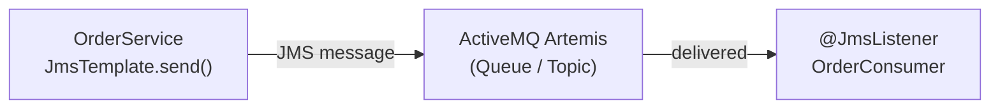

# JMS & Spring JMS

[← Back to README](../README.md)

---

**Java Message Service (JMS)** is the standard Java API for asynchronous messaging. **Spring JMS** wraps the raw JMS API with `JmsTemplate` for sending and `@JmsListener` for receiving, eliminating boilerplate connection/session management. **Apache ActiveMQ Artemis** is the most common JMS broker in the Spring ecosystem.



---

## Dependency

```xml
<dependency>
    <groupId>org.springframework.boot</groupId>
    <artifactId>spring-boot-starter-activemq</artifactId>
</dependency>
<!-- Artemis (recommended) -->
<dependency>
    <groupId>org.springframework.boot</groupId>
    <artifactId>spring-boot-starter-artemis</artifactId>
</dependency>
```

```yaml
spring:
  artemis:
    mode: native              # 'embedded' for tests, 'native' for production
    host: localhost
    port: 61616
    user: admin
    password: admin
```

---

## Sending Messages — JmsTemplate

```java
@Service
@RequiredArgsConstructor
public class OrderMessageProducer {

    private final JmsTemplate jmsTemplate;

    // Send a string message
    public void sendOrderPlaced(String orderId) {
        jmsTemplate.convertAndSend("order.placed", orderId);
    }

    // Send a POJO (serialised via MessageConverter)
    public void sendOrder(Order order) {
        jmsTemplate.convertAndSend("order.queue", order);
    }

    // Send with message properties
    public void sendWithPriority(Order order, int priority) {
        jmsTemplate.send("order.queue", session -> {
            Message msg = session.createObjectMessage(order);
            msg.setIntProperty("JMSPriority", priority);
            msg.setStringProperty("customerId", order.getCustomerId());
            return msg;
        });
    }

    // Request-reply (synchronous RPC over JMS)
    public OrderConfirmation placeOrderSync(Order order) {
        return (OrderConfirmation) jmsTemplate.convertSendAndReceive(
            "order.request", order);
    }
}
```

---

## Message Converter — JSON

```java
@Configuration
public class JmsConfig {

    @Bean
    public MessageConverter jacksonJmsMessageConverter(ObjectMapper objectMapper) {
        MappingJackson2MessageConverter converter = new MappingJackson2MessageConverter();
        converter.setTargetType(MessageType.TEXT);
        converter.setTypeIdPropertyName("_type");   // discriminator header
        converter.setObjectMapper(objectMapper);
        return converter;
    }

    @Bean
    public JmsListenerContainerFactory<?> orderFactory(ConnectionFactory connectionFactory,
                                                        MessageConverter converter) {
        DefaultJmsListenerContainerFactory factory = new DefaultJmsListenerContainerFactory();
        factory.setConnectionFactory(connectionFactory);
        factory.setMessageConverter(converter);
        factory.setConcurrency("3-10");   // 3 to 10 concurrent listener threads
        factory.setErrorHandler(t -> log.error("JMS listener error", t));
        return factory;
    }
}
```

---

## Receiving Messages — @JmsListener

```java
@Component
@RequiredArgsConstructor
@Slf4j
public class OrderConsumer {

    private final OrderService orderService;

    // Listen to a queue
    @JmsListener(destination = "order.queue", containerFactory = "orderFactory")
    public void onOrder(Order order) {
        log.info("Received order {}", order.getId());
        orderService.process(order);
    }

    // Access raw Message for headers/properties
    @JmsListener(destination = "order.placed")
    public void onOrderPlaced(Message message) throws JMSException {
        String orderId = message.getStringProperty("orderId");
        int priority   = message.getIntProperty("priority");
        log.info("Order {} placed with priority {}", orderId, priority);
    }

    // Access message payload and headers separately
    @JmsListener(destination = "order.payment")
    public void onPayment(
            @Payload PaymentEvent payment,
            @Header("JMSMessageID") String messageId,
            @Header("JMSTimestamp") long timestamp) {
        log.info("Payment {} for order {}", messageId, payment.orderId());
        paymentService.process(payment);
    }
}
```

---

## Topics vs Queues

```java
@Configuration
public class TopicConfig {

    // Enable pub/sub (topics)
    @Bean
    public JmsListenerContainerFactory<?> topicFactory(ConnectionFactory cf,
                                                        MessageConverter converter) {
        DefaultJmsListenerContainerFactory factory = new DefaultJmsListenerContainerFactory();
        factory.setConnectionFactory(cf);
        factory.setMessageConverter(converter);
        factory.setPubSubDomain(true);          // topic mode
        factory.setSubscriptionDurable(true);   // survive broker restart
        factory.setClientId("order-service");
        return factory;
    }

    // Topic JmsTemplate
    @Bean("topicJmsTemplate")
    public JmsTemplate topicJmsTemplate(ConnectionFactory cf, MessageConverter converter) {
        JmsTemplate template = new JmsTemplate(cf);
        template.setPubSubDomain(true);
        template.setMessageConverter(converter);
        return template;
    }
}

@Component
public class OrderEventBroadcaster {

    @Autowired
    @Qualifier("topicJmsTemplate")
    private JmsTemplate topicJmsTemplate;

    public void broadcast(OrderEvent event) {
        topicJmsTemplate.convertAndSend("order.events", event);
    }
}

// Durable subscriber — receives messages even when offline
@JmsListener(destination = "order.events",
             containerFactory = "topicFactory",
             subscription = "order-service-sub")
public void onEvent(OrderEvent event) { /* ... */ }
```

---

## Dead Letter Queue

```java
@Configuration
public class JmsConfig {

    @Bean
    public JmsListenerContainerFactory<?> reliableFactory(ConnectionFactory cf,
                                                           MessageConverter converter) {
        DefaultJmsListenerContainerFactory factory = new DefaultJmsListenerContainerFactory();
        factory.setConnectionFactory(cf);
        factory.setMessageConverter(converter);
        factory.setErrorHandler(t -> log.error("Processing error — message will be redelivered", t));
        // ActiveMQ redelivers up to 6 times by default, then routes to DLQ
        return factory;
    }
}

// Listen to the DLQ for monitoring / manual replay
@JmsListener(destination = "DLQ.order.queue")
public void onDeadLetter(Message message) throws JMSException {
    String originalId = message.getStringProperty("_AMQ_ORIG_MESSAGE_ID");
    log.error("Dead letter received, original ID: {}", originalId);
    deadLetterService.store(message);
}
```

---

## Transactions

```java
@Configuration
public class JmsTransactionConfig {

    @Bean
    public JmsListenerContainerFactory<?> transactedFactory(ConnectionFactory cf,
                                                             PlatformTransactionManager tm) {
        DefaultJmsListenerContainerFactory factory = new DefaultJmsListenerContainerFactory();
        factory.setConnectionFactory(cf);
        factory.setTransactionManager(tm);   // JMS message ACKed only if DB tx commits
        factory.setSessionTransacted(true);
        return factory;
    }
}

@JmsListener(destination = "order.queue", containerFactory = "transactedFactory")
@Transactional
public void processOrder(Order order) {
    orderRepository.save(order);
    // If DB save fails → transaction rolls back → JMS message is redelivered
}
```

---

## Testing JMS

```java
@SpringBootTest
@EmbeddedActiveMQ   // or use ActiveMQ Artemis embedded mode
class OrderConsumerTest {

    @Autowired private JmsTemplate jmsTemplate;

    @Test
    void consumer_processesOrderFromQueue() throws Exception {
        Order order = new Order("cust-1", BigDecimal.TEN);
        jmsTemplate.convertAndSend("order.queue", order);

        // Allow async delivery
        await().atMost(Duration.ofSeconds(5))
            .untilAsserted(() ->
                verify(orderService).process(any(Order.class)));
    }
}
```

---

## JMS Summary

| Concept | Detail |
|---------|--------|
| Queue | Point-to-point; one consumer processes each message |
| Topic | Publish-subscribe; all subscribers receive each message |
| `JmsTemplate.convertAndSend` | Serialize and send a POJO; uses registered `MessageConverter` |
| `@JmsListener` | Declare a method as a message listener; `destination` sets the queue/topic |
| `MappingJackson2MessageConverter` | Converts POJO ↔ JSON text message; `_type` header for polymorphism |
| `DefaultJmsListenerContainerFactory` | Configure concurrency, error handling, transactions per listener group |
| `concurrency = "3-10"` | Min 3, max 10 concurrent listener threads |
| Durable subscription | `subscriptionDurable = true` + `clientId` — receive topic messages while offline |
| Dead letter queue | Failed messages after max redeliveries go to `DLQ.<original-destination>` |
| `SessionTransacted` + `TransactionManager` | JMS ACK tied to DB transaction — message redelivered if DB fails |

---

[← Back to README](../README.md)
