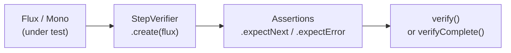

# Reactive Testing — StepVerifier & WebTestClient

[← Back to README](../README.md)

---

Testing reactive pipelines requires tools that understand subscriptions, backpressure, and timing. **StepVerifier** from `reactor-test` verifies `Mono`/`Flux` emissions step by step. **WebTestClient** tests reactive HTTP endpoints end-to-end. **Virtual time** lets you fast-forward delays without actually waiting.



---

## Dependency

```xml
<dependency>
    <groupId>io.projectreactor</groupId>
    <artifactId>reactor-test</artifactId>
    <scope>test</scope>
</dependency>
<!-- WebTestClient comes with spring-boot-starter-test when WebFlux is on the classpath -->
```

---

## StepVerifier Basics

```java
@Test
void mono_emitsValue() {
    Mono<String> mono = Mono.just("hello");

    StepVerifier.create(mono)
        .expectNext("hello")
        .verifyComplete();
}

@Test
void flux_emitsMultipleValues() {
    Flux<Integer> flux = Flux.just(1, 2, 3);

    StepVerifier.create(flux)
        .expectNext(1)
        .expectNext(2)
        .expectNext(3)
        .verifyComplete();
}

@Test
void flux_emitsError() {
    Flux<String> flux = Flux.error(new RuntimeException("boom"));

    StepVerifier.create(flux)
        .expectErrorMessage("boom")
        .verify();
}
```

---

## Asserting on Values

```java
@Test
void flux_filterAndTransform() {
    Flux<Order> orders = orderService.findByStatus("PENDING");

    StepVerifier.create(orders)
        .expectNextMatches(o -> "PENDING".equals(o.getStatus()))
        .expectNextMatches(o -> o.getTotal().compareTo(BigDecimal.ZERO) > 0)
        .thenConsumeWhile(o -> "PENDING".equals(o.getStatus()))
        .verifyComplete();
}

@Test
void flux_recordAndAssert() {
    Flux<Integer> flux = Flux.range(1, 5);

    StepVerifier.create(flux)
        .recordWith(ArrayList::new)
        .thenConsumeWhile(i -> i <= 5)
        .consumeRecordedWith(list -> {
            assertThat(list).hasSize(5);
            assertThat(list).containsExactly(1, 2, 3, 4, 5);
        })
        .verifyComplete();
}
```

---

## Virtual Time — Testing Delays

```java
@Test
void retryWithDelay_retriesThreeTimes() {
    AtomicInteger attempts = new AtomicInteger();

    Mono<String> mono = Mono.<String>error(new RuntimeException("fail"))
        .retryWhen(Retry.backoff(3, Duration.ofSeconds(1)));

    StepVerifier.withVirtualTime(() -> mono)
        .expectSubscription()
        .thenAwait(Duration.ofSeconds(10))   // fast-forward virtual clock
        .expectError(RuntimeException.class)
        .verify();
}

@Test
void scheduledFlux_emitsOnInterval() {
    StepVerifier.withVirtualTime(() ->
            Flux.interval(Duration.ofSeconds(1)).take(3))
        .expectSubscription()
        .thenAwait(Duration.ofSeconds(1)).expectNext(0L)
        .thenAwait(Duration.ofSeconds(1)).expectNext(1L)
        .thenAwait(Duration.ofSeconds(1)).expectNext(2L)
        .verifyComplete();
}
```

---

## TestPublisher — Control Emissions Manually

```java
@Test
void service_handlesLateData() {
    TestPublisher<Order> publisher = TestPublisher.create();

    // Inject the publisher as a Flux into the service
    Flux<Order> result = orderService.processStream(publisher.flux());

    StepVerifier.create(result)
        .then(() -> publisher.next(new Order("o1", BigDecimal.TEN)))
        .expectNextMatches(o -> "o1".equals(o.getId()))
        .then(() -> publisher.next(new Order("o2", BigDecimal.ONE)))
        .expectNextMatches(o -> "o2".equals(o.getId()))
        .then(publisher::complete)
        .verifyComplete();
}

@Test
void service_handlesUpstreamError() {
    TestPublisher<Order> publisher = TestPublisher.create();

    StepVerifier.create(orderService.processStream(publisher.flux()))
        .then(() -> publisher.error(new RuntimeException("upstream failed")))
        .expectErrorMessage("upstream failed")
        .verify();
}
```

---

## WebTestClient — HTTP Integration Testing

### Slice Test (No Running Server)

```java
@WebFluxTest(OrderController.class)
class OrderControllerTest {

    @Autowired WebTestClient client;
    @MockBean  OrderService  orderService;

    @Test
    void getOrder_returnsOrder() {
        Order order = new Order("o1", "PENDING", BigDecimal.TEN);
        when(orderService.findById("o1")).thenReturn(Mono.just(order));

        client.get().uri("/orders/o1")
            .accept(MediaType.APPLICATION_JSON)
            .exchange()
            .expectStatus().isOk()
            .expectBody(Order.class)
            .value(o -> assertThat(o.getId()).isEqualTo("o1"));
    }

    @Test
    void getOrders_returnsFlux() {
        when(orderService.findAll()).thenReturn(Flux.just(
            new Order("o1", "PENDING", BigDecimal.TEN),
            new Order("o2", "SHIPPED", BigDecimal.ONE)));

        client.get().uri("/orders")
            .exchange()
            .expectStatus().isOk()
            .expectBodyList(Order.class)
            .hasSize(2);
    }

    @Test
    void placeOrder_returns201() {
        Order placed = new Order("o3", "PENDING", BigDecimal.TEN);
        when(orderService.place(any())).thenReturn(Mono.just(placed));

        client.post().uri("/orders")
            .contentType(MediaType.APPLICATION_JSON)
            .bodyValue(new PlaceOrderRequest("cust-1", BigDecimal.TEN))
            .exchange()
            .expectStatus().isCreated()
            .expectHeader().exists("Location");
    }
}
```

### Full Integration Test

```java
@SpringBootTest(webEnvironment = SpringBootTest.WebEnvironment.RANDOM_PORT)
class OrderIntegrationTest {

    @Autowired WebTestClient client;

    @Test
    void fullOrderFlow() {
        // Place
        client.post().uri("/orders")
            .bodyValue(new PlaceOrderRequest("cust-1", BigDecimal.TEN))
            .exchange()
            .expectStatus().isCreated()
            .expectBody()
            .jsonPath("$.status").isEqualTo("PENDING")
            .jsonPath("$.id").exists();
    }
}
```

---

## SSE Streaming Test

```java
@Test
void orderStream_receivesEvents() {
    when(orderService.streamUpdates("o1")).thenReturn(
        Flux.just("PENDING", "PROCESSING", "SHIPPED")
            .map(s -> new OrderStatusUpdate("o1", s)));

    client.get().uri("/orders/o1/stream")
        .accept(MediaType.TEXT_EVENT_STREAM)
        .exchange()
        .expectStatus().isOk()
        .returnResult(OrderStatusUpdate.class)
        .getResponseBody()
        .as(StepVerifier::create)
        .expectNextMatches(u -> "PENDING".equals(u.status()))
        .expectNextMatches(u -> "PROCESSING".equals(u.status()))
        .expectNextMatches(u -> "SHIPPED".equals(u.status()))
        .verifyComplete();
}
```

---

## Reactive Testing Summary

| Concept | Detail |
|---------|--------|
| `StepVerifier.create(flux)` | Entry point for asserting `Mono`/`Flux` emissions |
| `.expectNext(value)` | Assert the next emitted item equals value |
| `.expectNextMatches(predicate)` | Assert the next item passes a predicate |
| `.verifyComplete()` | Assert the stream completes after all expected items |
| `.expectErrorMessage(msg)` | Assert the stream terminates with a specific error message |
| `StepVerifier.withVirtualTime(() -> flux)` | Enable virtual-time testing; use `.thenAwait(Duration)` |
| `TestPublisher.create()` | Manually control item emission; `next()`, `error()`, `complete()` |
| `@WebFluxTest` | Slice test for reactive controllers; wires `WebTestClient` automatically |
| `WebTestClient.bindToServer()` | Create client pointing at a running server |
| `.returnResult(Class).getResponseBody()` | Get a `Flux<T>` from a streaming response for `StepVerifier` |
| `.recordWith` + `.consumeRecordedWith` | Collect all emissions into a list, then assert on the list |

---

[← Back to README](../README.md)
