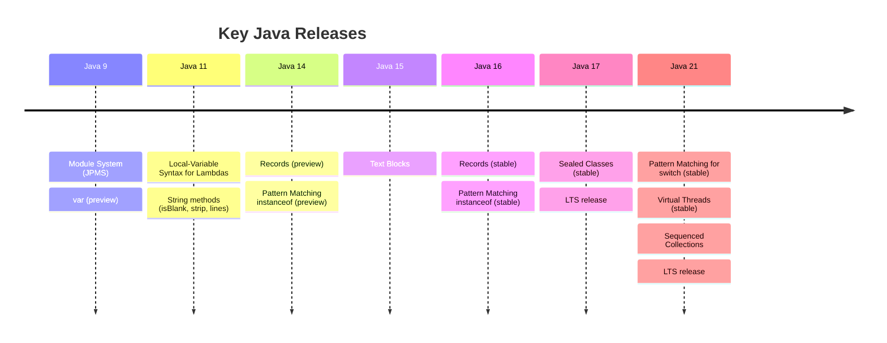

# Modern Java Features

[← Back to README](../README.md)

---

Java has evolved significantly since Java 8. This section covers the most impactful language features added in Java 9–21.



---

## Text Blocks (Java 15+)

A multi-line string literal that preserves formatting and avoids escape sequences.

```java
// before — hard to read
String json = "{\n" +
              "  \"name\": \"Alice\",\n" +
              "  \"age\": 30\n" +
              "}";

// text block — readable
String json = """
        {
          "name": "Alice",
          "age": 30
        }
        """;

String html = """
        <html>
            <body>
                <p>Hello, World!</p>
            </body>
        </html>
        """;

String query = """
        SELECT id, name, email
        FROM   users
        WHERE  active = true
        ORDER  BY name
        """;
```

The closing `"""` determines indentation stripping — content is aligned to its column. Trailing newline is included unless the closing `"""` is on the last content line.

```java
// string methods work normally
String upper = """
        hello
        world
        """.toUpperCase();

// formatted() — inline interpolation
String msg = """
        Hello, %s!
        Your score is %d.
        """.formatted("Alice", 95);
```

---

## Records (Java 16+)

A **record** is a concise, immutable data carrier. The compiler auto-generates constructor, getters, `equals()`, `hashCode()`, and `toString()`.

```java
public record Point(int x, int y) {}

Point p = new Point(3, 4);
System.out.println(p.x());        // 3  — accessor (not getX)
System.out.println(p.y());        // 4
System.out.println(p);            // Point[x=3, y=4]

Point p2 = new Point(3, 4);
System.out.println(p.equals(p2)); // true — structural equality
```

### Records with Validation

Use a **compact constructor** to add validation — no need to repeat field assignments.

```java
public record Range(int min, int max) {
    Range {  // compact constructor — fields are assigned after this block
        if (min > max) throw new IllegalArgumentException(
            "min (%d) must be <= max (%d)".formatted(min, max));
    }
}

Range r = new Range(1, 10);   // ok
Range bad = new Range(10, 1); // throws IllegalArgumentException
```

### Records with Custom Methods

```java
public record Money(double amount, String currency) {

    // custom instance method
    public Money add(Money other) {
        if (!this.currency.equals(other.currency))
            throw new IllegalArgumentException("Currency mismatch");
        return new Money(this.amount + other.amount, this.currency);
    }

    // static factory
    public static Money of(double amount, String currency) {
        return new Money(amount, currency);
    }

    // override toString
    @Override
    public String toString() {
        return "%.2f %s".formatted(amount, currency);
    }
}

Money price    = Money.of(9.99, "USD");
Money shipping = Money.of(2.50, "USD");
System.out.println(price.add(shipping));  // 12.49 USD
```

### Records and Interfaces

Records can implement interfaces but cannot extend classes (they already extend `java.lang.Record`).

```java
public interface Describable {
    String describe();
}

public record Person(String name, int age) implements Describable {
    @Override
    public String describe() {
        return "%s, age %d".formatted(name, age);
    }
}

System.out.println(new Person("Alice", 30).describe());  // Alice, age 30
```

---

## Sealed Classes (Java 17+)

A **sealed class** (or interface) restricts which other classes can extend or implement it — making class hierarchies closed and exhaustive.

```java
public sealed interface Shape
    permits Circle, Rectangle, Triangle {}

public record Circle(double radius)            implements Shape {}
public record Rectangle(double width, double height) implements Shape {}
public record Triangle(double base, double height)   implements Shape {}
```

Permitted subclasses must be `final`, `sealed`, or `non-sealed`:

```java
public sealed class Vehicle permits Car, Truck, Motorcycle {}

public final class Car        extends Vehicle {}  // no further subclassing
public final class Truck      extends Vehicle {}
public non-sealed class Motorcycle extends Vehicle {}  // open for extension
```

Sealed classes pair naturally with pattern matching — the compiler can verify all cases are covered.

---

## Pattern Matching

### Pattern Matching for `instanceof` (Java 16+)

Eliminates the redundant cast after an `instanceof` check.

```java
// before
Object obj = "Hello";
if (obj instanceof String) {
    String s = (String) obj;  // redundant cast
    System.out.println(s.length());
}

// after — binding variable declared inline
if (obj instanceof String s) {
    System.out.println(s.length());  // s is already a String
}

// works with negation
if (!(obj instanceof String s)) {
    throw new IllegalArgumentException("Expected String");
}
System.out.println(s.toUpperCase());  // s in scope here too
```

### Pattern Matching for `switch` (Java 21+)

Combines `switch` with type patterns, guards, and sealed class exhaustiveness.

```java
// type patterns
static double area(Shape shape) {
    return switch (shape) {
        case Circle    c -> Math.PI * c.radius() * c.radius();
        case Rectangle r -> r.width() * r.height();
        case Triangle  t -> 0.5 * t.base() * t.height();
    };  // no default needed — sealed hierarchy is exhaustive
}

// guards with when
static String classify(Object obj) {
    return switch (obj) {
        case Integer i when i < 0    -> "negative integer";
        case Integer i when i == 0   -> "zero";
        case Integer i               -> "positive integer";
        case String  s when s.isBlank() -> "blank string";
        case String  s               -> "string: " + s;
        case null                    -> "null";
        default                      -> "other: " + obj.getClass().getSimpleName();
    };
}

System.out.println(classify(-5));     // negative integer
System.out.println(classify(""));     // blank string
System.out.println(classify("Java")); // string: Java
System.out.println(classify(null));   // null
```

### Deconstruction Patterns (Java 21+)

Pull fields out of a record directly in the pattern.

```java
record Point(int x, int y) {}
record Line(Point start, Point end) {}

Object obj = new Line(new Point(0, 0), new Point(3, 4));

if (obj instanceof Line(Point(int x1, int y1), Point(int x2, int y2))) {
    System.out.println("From (%d,%d) to (%d,%d)".formatted(x1, y1, x2, y2));
}
```

---

## Virtual Threads (Java 21+)

Virtual threads are lightweight threads managed by the JVM rather than the OS — you can run millions of them without running out of memory. They are drop-in replacements for platform threads and are ideal for I/O-bound workloads.

```java
// create a virtual thread directly
Thread vt = Thread.ofVirtual().start(() -> System.out.println("Virtual!"));

// named virtual thread
Thread.ofVirtual().name("worker").start(() -> doWork());

// executor backed by virtual threads
try (var executor = java.util.concurrent.Executors.newVirtualThreadPerTaskExecutor()) {
    for (int i = 0; i < 100_000; i++) {
        int taskId = i;
        executor.submit(() -> System.out.println("Task " + taskId));
    }
}  // auto-closes and waits for all tasks
```

### Platform vs Virtual Threads

| | Platform thread | Virtual thread |
|---|---|---|
| Managed by | OS | JVM |
| Stack size | ~1 MB | Small, grows dynamically |
| Max concurrent | Thousands | Millions |
| Blocking I/O | Blocks OS thread | Suspends, frees carrier thread |
| Use for | CPU-bound tasks | I/O-bound tasks (HTTP, DB, files) |

---

## Sequenced Collections (Java 21+)

New interfaces that add a defined encounter order with access to first and last elements.

```java
// SequencedCollection — List, Deque
var list = new java.util.ArrayList<>(java.util.List.of("a", "b", "c"));
list.getFirst();   // "a"
list.getLast();    // "c"
list.addFirst("z");
list.addLast("z");
list.removeFirst();
list.removeLast();
list.reversed();   // reversed view

// SequencedMap — LinkedHashMap, TreeMap
var map = new java.util.LinkedHashMap<String, Integer>();
map.put("one", 1); map.put("two", 2); map.put("three", 3);
map.firstEntry();   // one=1
map.lastEntry();    // three=3
map.reversed();     // reversed view of the map
```

---

## Useful String Methods (Java 11+)

```java
// isBlank — true if empty or only whitespace (unlike isEmpty)
"   ".isBlank();   // true
"   ".isEmpty();   // false

// strip — Unicode-aware trim (prefer over trim())
"  hello  ".strip();       // "hello"
"  hello  ".stripLeading(); // "hello  "
"  hello  ".stripTrailing(); // "  hello"

// lines — split into a stream of lines
"one\ntwo\nthree".lines().forEach(System.out::println);

// repeat
"ab".repeat(3);   // "ababab"

// indent (Java 12+)
"hello".indent(4);  // "    hello\n"

// formatted (Java 15+) — instance version of String.format
"Hello, %s!".formatted("Alice");  // "Hello, Alice!"
```

---

## Switch Expressions (Java 14+)

Already covered in [Control Flow](04-control-flow.md), but worth noting they also support `yield` for multi-line branches:

```java
int day = 3;

String name = switch (day) {
    case 1, 7 -> "Weekend";
    default -> {
        String result = "Weekday #" + day;
        yield result;         // yield returns from a block
    }
};
```

---

## Modern Java Summary

| Feature | Since | What it replaces / improves |
|---------|-------|-----------------------------|
| Text blocks | Java 15 | Multi-line string concatenation with `\n` |
| Records | Java 16 | Boilerplate data classes with fields, getters, equals, hashCode |
| Pattern matching `instanceof` | Java 16 | `instanceof` + explicit cast |
| Sealed classes | Java 17 | Unconstrained inheritance hierarchies |
| Pattern matching `switch` | Java 21 | `if-else instanceof` chains |
| Deconstruction patterns | Java 21 | Manual record field extraction |
| Virtual threads | Java 21 | Platform threads for I/O-bound workloads |
| Sequenced Collections | Java 21 | `get(0)` / `get(size-1)` hacks |

---

[← Back to README](../README.md)
