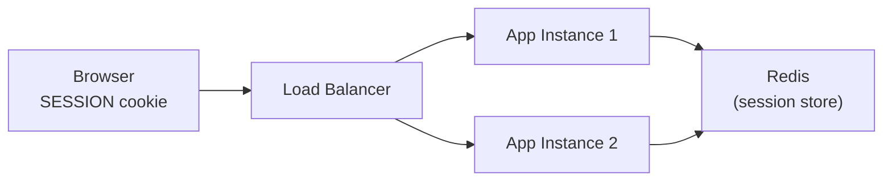

# Spring Session

[← Back to README](../README.md)

---

**Spring Session** replaces the servlet container's in-memory `HttpSession` with a distributed store (Redis, JDBC, Hazelcast). Multiple application instances share the same session data, enabling stateful behaviour across a horizontally scaled cluster without sticky sessions.



---

## Dependency

```xml
<!-- Redis-backed sessions (most common) -->
<dependency>
    <groupId>org.springframework.session</groupId>
    <artifactId>spring-session-data-redis</artifactId>
</dependency>
<dependency>
    <groupId>org.springframework.boot</groupId>
    <artifactId>spring-boot-starter-data-redis</artifactId>
</dependency>

<!-- JDBC-backed sessions (PostgreSQL, MySQL, etc.) -->
<dependency>
    <groupId>org.springframework.session</groupId>
    <artifactId>spring-session-jdbc</artifactId>
</dependency>
```

---

## Redis Session Configuration

```yaml
spring:
  session:
    store-type: redis
    timeout: 30m            # session expiry
    redis:
      namespace: session    # Redis key prefix: session:sessions:<id>
      flush-mode: on-save   # on-save (default) or immediate
  data:
    redis:
      host: localhost
      port: 6379
```

```java
@Configuration
@EnableRedisHttpSession(maxInactiveIntervalInSeconds = 1800)
public class SessionConfig {

    // Optionally customize the session serializer
    @Bean
    public RedisSerializer<Object> springSessionDefaultRedisSerializer() {
        return new GenericJackson2JsonRedisSerializer();
    }
}
```

---

## JDBC Session Configuration

```yaml
spring:
  session:
    store-type: jdbc
    jdbc:
      initialize-schema: always   # create SPRING_SESSION tables automatically
      table-name: SPRING_SESSION
      cleanup-cron: "0 * * * * *" # clean up expired sessions every minute
```

Spring Session creates two tables: `SPRING_SESSION` and `SPRING_SESSION_ATTRIBUTES`.

---

## Using Sessions in Controllers

```java
@RestController
@RequiredArgsConstructor
public class CartController {

    @PostMapping("/cart/items")
    public ResponseEntity<Void> addItem(
            HttpSession session,
            @RequestBody CartItem item) {

        @SuppressWarnings("unchecked")
        List<CartItem> cart = (List<CartItem>) session.getAttribute("cart");
        if (cart == null) cart = new ArrayList<>();

        cart.add(item);
        session.setAttribute("cart", cart);
        return ResponseEntity.ok().build();
    }

    @GetMapping("/cart")
    public List<CartItem> getCart(HttpSession session) {
        @SuppressWarnings("unchecked")
        List<CartItem> cart = (List<CartItem>) session.getAttribute("cart");
        return cart != null ? cart : List.of();
    }

    @DeleteMapping("/cart")
    public ResponseEntity<Void> clearCart(HttpSession session) {
        session.invalidate();
        return ResponseEntity.noContent().build();
    }
}
```

---

## SessionRepository — Programmatic Access

```java
@Service
@RequiredArgsConstructor
public class SessionAdminService {

    private final FindByIndexNameSessionRepository<? extends Session> sessionRepository;

    // Find all sessions for a specific user
    public Map<String, ? extends Session> getSessionsForUser(String username) {
        return sessionRepository.findByPrincipalName(username);
    }

    // Invalidate all sessions for a user (force logout)
    public void invalidateAllSessions(String username) {
        sessionRepository.findByPrincipalName(username)
            .keySet()
            .forEach(sessionRepository::deleteById);
    }

    // Get a specific session
    public Optional<? extends Session> getSession(String sessionId) {
        return Optional.ofNullable(sessionRepository.findById(sessionId));
    }
}
```

---

## Spring Security Integration

Spring Session integrates transparently with Spring Security — the security context is stored in the distributed session:

```java
@Configuration
@EnableWebSecurity
public class SecurityConfig {

    @Bean
    public SecurityFilterChain filterChain(HttpSecurity http) throws Exception {
        return http
            .authorizeHttpRequests(auth -> auth
                .requestMatchers("/public/**").permitAll()
                .anyRequest().authenticated())
            .formLogin(form -> form
                .loginPage("/login")
                .defaultSuccessUrl("/dashboard"))
            .logout(logout -> logout
                .logoutUrl("/logout")
                .invalidateHttpSession(true)
                .deleteCookies("SESSION"))   // Spring Session uses "SESSION" cookie name
            .build();
    }
}
```

---

## Session Events

```java
@Component
@Slf4j
public class SessionEventListener {

    @EventListener
    public void onSessionCreated(SessionCreatedEvent event) {
        log.info("Session created: {}", event.getSessionId());
    }

    @EventListener
    public void onSessionExpired(SessionExpiredEvent event) {
        log.info("Session expired: {}", event.getSessionId());
        // Clean up user resources, notify analytics, etc.
    }

    @EventListener
    public void onSessionDeleted(SessionDeletedEvent event) {
        log.info("Session deleted (logout): {}", event.getSessionId());
    }
}
```

---

## Custom Session Cookie

```java
@Configuration
public class SessionCookieConfig {

    @Bean
    public CookieSerializer cookieSerializer() {
        DefaultCookieSerializer serializer = new DefaultCookieSerializer();
        serializer.setCookieName("MYSESSION");
        serializer.setCookiePath("/");
        serializer.setDomainName("example.com");
        serializer.setUseHttpOnlyCookie(true);
        serializer.setUseSecureCookie(true);         // HTTPS only
        serializer.setSameSite("Strict");
        serializer.setCookieMaxAge(1800);             // 30 min
        return serializer;
    }
}
```

---

## WebSocket with Spring Session

Spring Session can also manage WebSocket sessions using the same Redis store:

```java
@Configuration
@EnableWebSocketMessageBroker
public class WebSocketSessionConfig extends AbstractSessionWebSocketMessageBrokerConfigurer {

    @Override
    protected void configureStompEndpoints(StompEndpointRegistry registry) {
        registry.addEndpoint("/ws").withSockJS();
    }

    @Override
    public void configureMessageBroker(MessageBrokerRegistry registry) {
        registry.enableSimpleBroker("/topic");
        registry.setApplicationDestinationPrefixes("/app");
    }
}
```

---

## Spring Session Summary

| Concept | Detail |
|---------|--------|
| `@EnableRedisHttpSession` | Switch `HttpSession` backing store to Redis |
| `spring.session.timeout` | Session expiry duration; `0` means use the servlet container default |
| `flush-mode: on-save` | Write session to Redis on `setAttribute`; `immediate` writes after every request |
| `FindByIndexNameSessionRepository` | Find sessions by username (principal name) for admin operations |
| `SESSION` cookie | Default cookie name in Spring Session (vs `JSESSIONID` in standard servlet) |
| `CookieSerializer` | Customize session cookie name, path, domain, SameSite, and security flags |
| `SessionCreatedEvent` etc. | Lifecycle events; use `@EventListener` to react to session changes |
| JDBC session | Stores session in `SPRING_SESSION` + `SPRING_SESSION_ATTRIBUTES` tables |
| Security integration | Security context (`Authentication`) is transparently stored in distributed session |
| `session.invalidate()` | Destroy the session and remove it from the backing store |

---

[← Back to README](../README.md)
