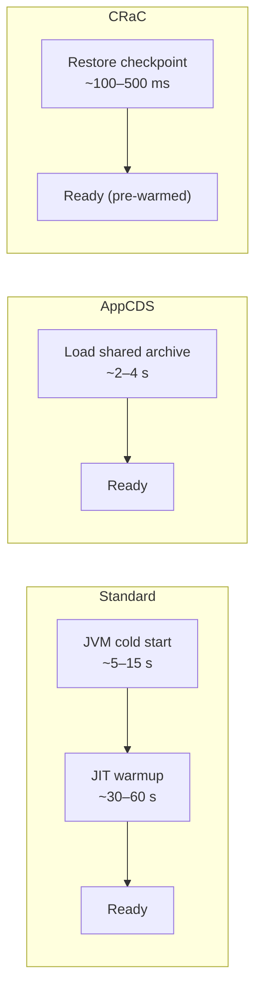

# JVM Startup Optimization — AppCDS & CRaC

[← Back to README](../README.md)

---

Cold JVM startup is slow: the classloader reads thousands of classes, the JIT recompiles hot methods from scratch, and Spring scans the entire classpath. **AppCDS** (Application Class Data Sharing) caches parsed class metadata. **CRaC** (Coordinated Restore at Checkpoint) snapshots a fully warmed-up JVM and restores it in milliseconds. Spring Boot 3.2+ supports both.



---

## Application Class Data Sharing (AppCDS)

AppCDS serialises parsed class metadata into a shared archive file. On subsequent starts the JVM maps the archive into memory — no parsing, no verification overhead.

### Step 1 — Generate the Class List

```bash
java -XX:DumpLoadedClassList=app.classlist \
     -cp myapp.jar \
     org.springframework.boot.loader.launch.JarLauncher
# Run the app briefly, exercise key paths, then Ctrl+C
```

### Step 2 — Create the Shared Archive

```bash
java -Xshare:dump \
     -XX:SharedClassListFile=app.classlist \
     -XX:SharedArchiveFile=app.jsa \
     -cp myapp.jar \
     org.springframework.boot.loader.launch.JarLauncher
```

### Step 3 — Run with Archive

```bash
java -Xshare:on \
     -XX:SharedArchiveFile=app.jsa \
     -jar myapp.jar
```

### Spring Boot Maven Plugin (automated)

```xml
<!-- pom.xml -->
<plugin>
    <groupId>org.springframework.boot</groupId>
    <artifactId>spring-boot-maven-plugin</artifactId>
    <configuration>
        <jvmArguments>-Xshare:off</jvmArguments>
        <image>
            <name>myapp:${project.version}</name>
        </image>
    </configuration>
    <executions>
        <execution>
            <id>process-aot</id>
            <goals>
                <goal>process-aot</goal>
            </goals>
        </execution>
    </executions>
</plugin>
```

```bash
# Spring Boot 3.3+ single-step training run
java -Dspring.context.exit=on-refresh \
     -XX:ArchiveClassesAtExit=app.jsa \
     -jar myapp.jar
```

---

## AOT Processing — Spring Boot 3.x

AOT (Ahead-of-Time) processing moves Spring's annotation scanning, bean wiring computation, and proxy generation from startup to build time:

```bash
# Maven — run AOT processing
mvn spring-boot:process-aot

# The generated sources land in:
# target/spring-aot/main/sources/   (Java source)
# target/spring-aot/main/resources/ (reflection-config.json etc.)
```

```java
// Provide runtime hints for AOT (when reflection or resources are needed)
@Component
public class OrderRuntimeHints implements RuntimeHintsRegistrar {

    @Override
    public void registerHints(RuntimeHints hints, ClassLoader classLoader) {
        hints.reflection()
            .registerType(Order.class, MemberCategory.INVOKE_DECLARED_CONSTRUCTORS,
                                       MemberCategory.DECLARED_FIELDS);
        hints.resources().registerPattern("templates/email/*.html");
    }
}
```

---

## CRaC — Checkpoint/Restore

CRaC snapshots a fully-running JVM — with a warmed-up JIT, populated caches, and open connections. Restoring the checkpoint takes ~100–500 ms regardless of application complexity.

### Prerequisites

```bash
# Use an OpenJDK build with CRaC support (Azul Zulu, BellSoft Liberica)
java -version
# openjdk 21.0.x ... CRaC
```

### Spring Boot 3.2+ — One-Step Checkpoint

```bash
# 1. Start the app and trigger a checkpoint
java -XX:CRaCCheckpointTo=/opt/crac-data -jar myapp.jar

# In another terminal, or via actuator:
curl -X POST http://localhost:8080/actuator/checkpoint

# 2. Restore from checkpoint (fast!)
java -XX:CRaCRestoreFrom=/opt/crac-data
```

### Handling Open Resources at Checkpoint

```java
@Component
public class CracResourceHandler implements CracResource {

    private DataSource dataSource;

    @Override
    public void beforeCheckpoint(Context<? extends Resource> context) throws Exception {
        // Close connections before snapshot — they can't be serialised
        ((HikariDataSource) dataSource).close();
        log.info("Connections closed for checkpoint");
    }

    @Override
    public void afterRestore(Context<? extends Resource> context) throws Exception {
        // Re-open connections after restore
        ((HikariDataSource) dataSource).getConnection();
        log.info("Connections restored");
    }
}
```

Spring Boot auto-handles most built-in resources (Tomcat, HikariCP, Caffeine) via `LifecycleBean` adapters.

---

## Docker — Bake CRaC Checkpoint into Image

```dockerfile
# Build stage — create the checkpoint
FROM bellsoft/liberica-openjre-debian:21-crac AS checkpoint

WORKDIR /app
COPY target/myapp.jar .

RUN java -XX:CRaCCheckpointTo=/app/checkpoint \
         -Dspring.profiles.active=checkpoint \
         -jar myapp.jar &

# Wait for checkpoint to complete
RUN sleep 10 && kill -SIGUSR2 $(cat /tmp/crac.pid) && wait

# Runtime image — restore from checkpoint
FROM bellsoft/liberica-openjre-debian:21-crac

WORKDIR /app
COPY --from=checkpoint /app/checkpoint /app/checkpoint

ENTRYPOINT ["java", "-XX:CRaCRestoreFrom=/app/checkpoint"]
```

---

## Measuring Startup Time

```bash
# Add to your app to log startup time
@SpringBootApplication
public class Application {
    public static void main(String[] args) {
        long start = System.currentTimeMillis();
        SpringApplication.run(Application.class, args);
        System.out.printf("Started in %d ms%n", System.currentTimeMillis() - start);
    }
}

# Or use the built-in Spring Boot metric
management:
  endpoints:
    web:
      exposure:
        include: startup
```

---

## Startup Optimization Comparison

| Technique | Startup improvement | Warmup | Complexity | JDK requirement |
|-----------|--------------------:|--------|------------|-----------------|
| Baseline | — | Slow | — | Any |
| AppCDS | 20–40% faster | Slow | Low | JDK 10+ |
| AOT + AppCDS | 30–60% faster | Slow | Medium | JDK 17+ / Spring 3 |
| GraalVM Native | 10–50× faster | Instant | High | GraalVM |
| CRaC | 50–100× faster | Instant (pre-warmed) | Medium | CRaC-enabled JDK |

---

## JVM Startup Summary

| Concept | Detail |
|---------|--------|
| AppCDS | Cache parsed class metadata in `.jsa` archive; `Xshare:on` to use |
| `-XX:ArchiveClassesAtExit` | Create CDS archive automatically on application exit |
| Spring AOT | Move annotation scanning and proxy generation to build time |
| `RuntimeHintsRegistrar` | Provide reflection/resource hints for AOT-processed code |
| CRaC | Snapshot a running JVM; restore in ~100–500 ms with warm JIT |
| `-XX:CRaCCheckpointTo` | Directory to write checkpoint data |
| `-XX:CRaCRestoreFrom` | Restore a previously saved checkpoint |
| `CracResource` | Hook for releasing and re-acquiring resources around checkpoint |
| `/actuator/checkpoint` | Spring Boot 3.2+ endpoint to trigger CRaC checkpoint |
| GraalVM Native | Alternative: compile to native binary; no JVM overhead at all |

---

[← Back to README](../README.md)
