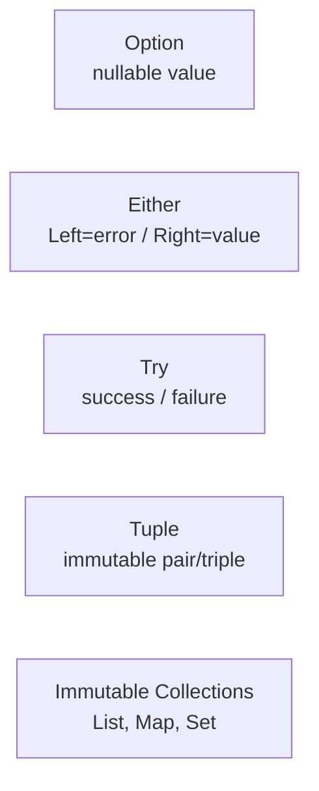

# Vavr — Functional Java

[← Back to README](../README.md)

---

**Vavr** (formerly Javaslang) brings functional programming constructs to Java: `Option`, `Either`, `Try`, `Tuple`, immutable collections, and pattern matching. It makes error handling explicit, eliminates null checks, and composes operations without side effects.



---

## Dependency

```xml
<dependency>
    <groupId>io.vavr</groupId>
    <artifactId>vavr</artifactId>
    <version>0.10.4</version>
</dependency>
```

---

## Option — Nullable Without NullPointerException

```java
// Wraps a potentially null value
Option<String> present = Option.of("hello");
Option<String> empty   = Option.none();
Option<String> fromNull = Option.of(null);   // same as none()

// Transform only if present
Option<Integer> length = present.map(String::length);   // Some(5)
Option<Integer> none   = empty.map(String::length);     // None

// Fallback
String value = empty.getOrElse("default");
String computed = empty.getOrElse(() -> expensiveDefault());

// Throw if absent
String required = present.getOrElseThrow(() -> new IllegalStateException("Required"));

// Filter
Option<String> long_ = present.filter(s -> s.length() > 3);   // Some("hello")

// Chain operations
String result = Option.of(getOrderId())
    .flatMap(id -> Option.of(orderRepository.findById(id)))
    .map(Order::getStatus)
    .getOrElse("UNKNOWN");

// Convert to Java Optional
Optional<String> opt = present.toJavaOptional();
```

---

## Try — Exception as a Value

`Try` represents a computation that may succeed (`Success`) or fail with an exception (`Failure`):

```java
// Wrap a risky operation
Try<Order> result = Try.of(() -> orderRepository.findById(id))
    .map(order -> {
        order.confirm();
        return order;
    });

// Handle success and failure
result.onSuccess(order -> log.info("Found: {}", order.getId()))
      .onFailure(ex  -> log.error("Not found", ex));

// Recover from specific exceptions
Try<Order> recovered = result
    .recover(OrderNotFoundException.class, ex -> Order.placeholder(id))
    .recover(DatabaseException.class,      ex -> { throw new ServiceUnavailableException(); });

// Get value or throw
Order order = result.getOrElseThrow(ex -> new ServiceException("Order lookup failed", ex));

// Convert to Option
Option<Order> option = result.toOption();

// Convert to Either
Either<Throwable, Order> either = result.toEither();

// Execute a runnable that may throw
Try.run(() -> auditService.log(id))
   .onFailure(ex -> log.warn("Audit failed, continuing", ex));
```

---

## Either — Explicit Error Channel

`Either<L, R>` has a `Left` (by convention the error) and `Right` (the success value):

```java
public Either<String, Order> placeOrder(PlaceOrderCommand cmd) {
    if (cmd.customerId() == null) {
        return Either.left("Customer ID is required");
    }
    if (cmd.total().signum() <= 0) {
        return Either.left("Total must be positive");
    }
    Order order = Order.create(cmd);
    return Either.right(order);
}

// Use the result
Either<String, Order> result = placeOrder(cmd);

if (result.isRight()) {
    Order order = result.get();
    // ...
}

// Map only the right side
Either<String, String> orderId = result.map(Order::getId);

// Map both sides
String message = result.fold(
    error -> "Failed: " + error,
    order -> "Placed order: " + order.getId());

// Chain operations — stops at first Left
Either<String, Order> chained = placeOrder(cmd)
    .flatMap(order -> inventoryService.reserve(order)
        .map(ignored -> order));
```

---

## Validated — Accumulate Multiple Errors

Unlike `Either` which short-circuits on the first error, `Validated` collects all errors:

```java
import io.vavr.control.Validation;

public Validation<Seq<String>, Order> validateOrder(PlaceOrderCommand cmd) {
    Validation<String, String> customerId = cmd.customerId() != null
        ? Validation.valid(cmd.customerId())
        : Validation.invalid("Customer ID is required");

    Validation<String, BigDecimal> total = cmd.total().signum() > 0
        ? Validation.valid(cmd.total())
        : Validation.invalid("Total must be positive");

    Validation<String, String> productId = cmd.productId() != null
        ? Validation.valid(cmd.productId())
        : Validation.invalid("Product ID is required");

    return Validation.combine(customerId, total, productId)
        .ap((cId, tot, pId) -> Order.create(cId, tot, pId));
}

// Usage — get all errors at once
Validation<Seq<String>, Order> result = validateOrder(cmd);

result.fold(
    errors -> errors.forEach(System.err::println),  // prints ALL errors
    order  -> orderRepository.save(order));
```

---

## Tuple — Immutable Pairs and Triples

```java
// Create tuples
Tuple2<String, Integer> pair   = Tuple.of("order-1", 42);
Tuple3<String, String, BigDecimal> triple = Tuple.of("o1", "PENDING", BigDecimal.TEN);

// Access
String first  = pair._1;
int    second = pair._2;

// Map elements
Tuple2<String, String> mapped = pair.map2(Object::toString);

// Unpack
pair.apply((id, qty) -> processOrder(id, qty));

// Return multiple values from a method
public Tuple2<Order, Invoice> placeAndInvoice(PlaceOrderCommand cmd) {
    Order order   = orderService.place(cmd);
    Invoice invoice = invoiceService.create(order);
    return Tuple.of(order, invoice);
}

Tuple2<Order, Invoice> result = placeAndInvoice(cmd);
log.info("Order: {}, Invoice: {}", result._1.getId(), result._2.getNumber());
```

---

## Immutable Collections

```java
// Vavr List (immutable, persistent)
io.vavr.collection.List<String> list = io.vavr.collection.List.of("a", "b", "c");
io.vavr.collection.List<String> added = list.prepend("z");   // new list; original unchanged

// Map
io.vavr.collection.Map<String, Integer> map =
    io.vavr.collection.HashMap.of("a", 1, "b", 2);

io.vavr.collection.Map<String, Integer> updated = map.put("c", 3);   // new map

// Stream-like operations
io.vavr.collection.List<String> result = list
    .filter(s -> s.length() > 0)
    .map(String::toUpperCase)
    .sortBy(Function.identity());

// Convert to/from Java
java.util.List<String> javaList = list.toJavaList();
io.vavr.collection.List<String> vavrList =
    io.vavr.collection.List.ofAll(javaList);
```

---

## Pattern Matching with Match

```java
import static io.vavr.API.*;
import static io.vavr.Predicates.*;

String description = Match(order.getStatus()).of(
    Case($("PENDING"),    "Order is awaiting confirmation"),
    Case($("PROCESSING"), "Order is being prepared"),
    Case($("SHIPPED"),    "Order is on its way"),
    Case($(),             "Unknown status: " + order.getStatus()));

// Match on type
String result = Match(exception).of(
    Case($(instanceOf(ValidationException.class)), e -> "Invalid input: " + e.getMessage()),
    Case($(instanceOf(DatabaseException.class)),   e -> "DB error: " + e.getMessage()),
    Case($(), e -> "Unexpected: " + e.getMessage()));
```

---

## Vavr Summary

| Concept | Detail |
|---------|--------|
| `Option<T>` | Replaces `null` and `Optional`; `some(value)` or `none()` |
| `Try<T>` | Wraps a throwing computation; `Success(value)` or `Failure(exception)` |
| `Either<L, R>` | Two-track result; `Left` for error, `Right` for success; short-circuits |
| `Validation<E, T>` | Like `Either` but accumulates errors; use `combine(...).ap(...)` |
| `Tuple2` / `Tuple3` | Immutable typed pairs/triples; access via `._1`, `._2` |
| Vavr `List`, `Map`, `Set` | Persistent immutable collections; operations return new instances |
| `.map` / `.flatMap` | Transform the value inside a container without extracting it |
| `.getOrElse` | Extract value with a fallback |
| `.fold(leftFn, rightFn)` | Collapse `Either` into a single value by handling both sides |
| `Match(...).of(Case(...))` | Exhaustive functional pattern matching with predicates |

---

[← Back to README](../README.md)
