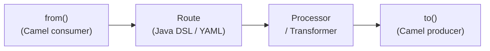

# Apache Camel

[← Back to README](../README.md)

---

**Apache Camel** is an enterprise integration framework implementing the patterns from Hohpe & Woolf's *Enterprise Integration Patterns*. It connects 300+ technologies — files, HTTP, Kafka, databases, FTP, AWS, and more — through a unified routing DSL. Camel complements Spring Integration with a broader component library and its own opinionated DSL.



---

## Dependency

```xml
<dependency>
    <groupId>org.apache.camel.springboot</groupId>
    <artifactId>camel-spring-boot-starter</artifactId>
    <version>4.6.0</version>
</dependency>
<!-- Add component starters as needed -->
<dependency>
    <groupId>org.apache.camel.springboot</groupId>
    <artifactId>camel-kafka-starter</artifactId>
    <version>4.6.0</version>
</dependency>
<dependency>
    <groupId>org.apache.camel.springboot</groupId>
    <artifactId>camel-http-starter</artifactId>
    <version>4.6.0</version>
</dependency>
```

---

## Basic Route — Java DSL

```java
@Component
public class OrderImportRoute extends RouteBuilder {

    @Override
    public void configure() {
        // Poll a directory for CSV files every 5 seconds
        from("file:/var/orders/incoming?include=.*\\.csv&move=.done&delay=5000")
            .routeId("csv-order-import")
            .log("Processing file: ${header.CamelFileName}")
            .unmarshal().csv()                          // parse CSV rows
            .split(body())                              // one message per row
            .streaming()
            .process(this::mapToOrder)
            .filter(simple("${body.total} > 0"))
            .to("bean:orderService?method=save")
            .log("Saved order ${body.id}");
    }

    private void mapToOrder(Exchange exchange) {
        List<String> row = exchange.getMessage().getBody(List.class);
        Order order = new Order(row.get(0), row.get(1), new BigDecimal(row.get(2)));
        exchange.getMessage().setBody(order);
    }
}
```

---

## Message Exchange — Exchange and Message

```java
@Component
public class OrderEnrichmentRoute extends RouteBuilder {

    @Override
    public void configure() {
        from("direct:enrich-order")
            // Access headers
            .setHeader("source", constant("web"))
            .setHeader("CamelHttpMethod", constant("POST"))

            // Transform body
            .transform().body(Order.class, order -> {
                order.setStatus("PENDING");
                order.setCreatedAt(Instant.now());
                return order;
            })

            // Add a custom processor
            .process(exchange -> {
                Message msg = exchange.getMessage();
                Order order = msg.getBody(Order.class);
                msg.setHeader("orderId", order.getId());
                msg.setHeader("priority", order.getTotal().compareTo(new BigDecimal("1000")) > 0
                    ? "HIGH" : "NORMAL");
            })

            .to("direct:save-order");
    }
}
```

---

## Content-Based Router

```java
@Component
public class OrderRoutingRoute extends RouteBuilder {

    @Override
    public void configure() {
        from("direct:route-order")
            .choice()
                .when(simple("${body.vip} == true"))
                    .to("direct:vip-order")
                .when(simple("${body.total} > 1000"))
                    .to("direct:high-value-order")
                .otherwise()
                    .to("direct:standard-order")
            .end();
    }
}
```

---

## Splitter and Aggregator

```java
@Component
public class BatchOrderRoute extends RouteBuilder {

    @Override
    public void configure() {
        // Split one message containing a list into individual messages
        from("direct:batch-orders")
            .split(body())
            .parallelProcessing()
            .to("direct:process-order")
            .end();

        // Aggregate individual order results back into a summary
        from("direct:order-results")
            .aggregate(header("batchId"), new GroupedBodyAggregationStrategy())
            .completionSize(10)
            .completionTimeout(5000)
            .process(exchange -> {
                List<?> results = exchange.getMessage().getBody(List.class);
                log.info("Batch complete: {} orders processed", results.size());
            })
            .to("direct:batch-complete");
    }
}
```

---

## Kafka Integration

```java
@Component
public class KafkaOrderRoute extends RouteBuilder {

    @Override
    public void configure() {
        // Consume from Kafka, process, produce to another topic
        from("kafka:orders?brokers=localhost:9092&groupId=camel-consumer")
            .routeId("kafka-order-route")
            .unmarshal().json(Order.class)
            .filter(simple("${body.status} == 'PENDING'"))
            .process(exchange -> {
                Order order = exchange.getMessage().getBody(Order.class);
                order.setStatus("PROCESSING");
                exchange.getMessage().setBody(order);
            })
            .marshal().json()
            .to("kafka:orders-processing?brokers=localhost:9092");
    }
}
```

---

## HTTP Component

```java
@Component
public class HttpIntegrationRoute extends RouteBuilder {

    @Override
    public void configure() {
        // Poll an external REST API every minute
        from("timer:order-poll?period=60000")
            .routeId("poll-external-orders")
            .setHeader(Exchange.HTTP_METHOD, constant("GET"))
            .to("http://external-system/api/orders?pending=true")
            .unmarshal().json(Order[].class)
            .split(body())
            .to("direct:process-order");

        // Call external REST API with the message body
        from("direct:notify-external")
            .marshal().json()
            .setHeader("Content-Type", constant("application/json"))
            .to("http://notification-service/api/notify");
    }
}
```

---

## Error Handling

```java
@Component
public class ResilientOrderRoute extends RouteBuilder {

    @Override
    public void configure() {
        // Global dead letter channel
        errorHandler(deadLetterChannel("direct:dead-letter")
            .maximumRedeliveries(3)
            .redeliveryDelay(1000)
            .backOffMultiplier(2)
            .useExponentialBackOff()
            .logRetryAttempted(true));

        // Per-route error handling
        from("direct:process-order")
            .onException(ValidationException.class)
                .handled(true)
                .log(LoggingLevel.WARN, "Validation failed: ${exception.message}")
                .to("direct:invalid-orders")
            .end()
            .onException(DatabaseException.class)
                .handled(true)
                .maximumRedeliveries(5)
                .to("direct:retry-queue")
            .end()
            .process(this::processOrder);

        from("direct:dead-letter")
            .log(LoggingLevel.ERROR, "Dead letter: ${exception.message}")
            .to("bean:deadLetterService?method=store");
    }
}
```

---

## Testing Camel Routes

```java
@SpringBootTest
@CamelSpringBootTest
class OrderImportRouteTest {

    @Autowired CamelContext context;
    @Autowired ProducerTemplate template;
    @EndpointInject("mock:direct:save-order")
    MockEndpoint mockSave;

    @Test
    void route_processesValidOrder() throws Exception {
        mockSave.expectedMessageCount(1);
        mockSave.expectedBodyReceived().body(Order.class)
            .validatesTo(order -> order.getStatus().equals("PENDING"));

        template.sendBody("direct:enrich-order",
            new Order("cust-1", "prod-1", BigDecimal.TEN));

        mockSave.assertIsSatisfied();
    }
}
```

---

## YAML DSL (Camel 3.14+)

```yaml
# src/main/resources/camel/order-routes.yaml
- route:
    id: csv-import
    from:
      uri: "file:/var/orders/incoming"
      parameters:
        include: ".*\\.csv"
        delay: 5000
    steps:
      - unmarshal:
          csv: {}
      - split:
          simple: "${body}"
      - to:
          uri: "bean:orderService"
          parameters:
            method: save
      - log:
          message: "Saved order ${body.id}"
```

---

## Apache Camel Summary

| Concept | Detail |
|---------|--------|
| `RouteBuilder` | Extend to define routes using the Java DSL; annotate with `@Component` |
| `from(uri)` | Camel consumer — defines the input endpoint and component |
| `to(uri)` | Camel producer — sends the message to an endpoint |
| `Exchange` | Container for the message + headers + properties + exception |
| `.choice().when().otherwise()` | Content-based router — equivalent to EIP CBR pattern |
| `.split(body())` | Split a collection message into individual messages |
| `.aggregate(correlationExpr, strategy)` | Collect related messages into one; release by size or timeout |
| `errorHandler(deadLetterChannel)` | Route failed messages to a DLQ after retry exhaustion |
| `ProducerTemplate` | Send messages to a route programmatically in tests |
| `MockEndpoint` | Assert expected message counts and bodies in tests |
| 300+ components | `file:`, `http:`, `kafka:`, `jms:`, `aws-s3:`, `ftp:`, `sql:`, and more |

---

[← Back to README](../README.md)
