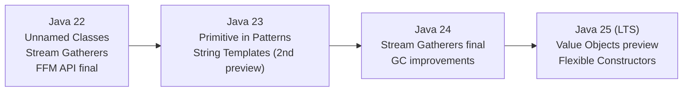

# Java 22–25 New Language Features

[← Back to README](../README.md)

---

Java releases since 22 have delivered Sequenced Collections, unnamed classes and instance main, String Templates (JEP 459), unnamed patterns, the Gatherers API, and preview value objects (Project Valhalla). This doc covers the features that reached final or second-preview status in the JDK 22–25 timeframe.



---

## Sequenced Collections (Java 21 — final)

New interfaces that give every ordered collection consistent first/last access:

```java
// SequencedCollection — List, Deque, LinkedHashSet
SequencedCollection<String> list = new ArrayList<>(List.of("a", "b", "c"));

String first = list.getFirst();   // "a"
String last  = list.getLast();    // "c"

list.addFirst("z");   // ["z", "a", "b", "c"]
list.addLast("d");    // ["z", "a", "b", "c", "d"]
list.removeFirst();   // "z"

SequencedCollection<String> reversed = list.reversed();   // view, not a copy

// SequencedMap — LinkedHashMap, TreeMap
SequencedMap<String, Integer> map = new LinkedHashMap<>();
map.put("a", 1);
map.put("b", 2);

Map.Entry<String, Integer> firstEntry = map.firstEntry();   // ("a", 1)
Map.Entry<String, Integer> lastEntry  = map.lastEntry();    // ("b", 2)
map.putFirst("z", 0);    // inserts at the front

SequencedMap<String, Integer> reversedMap = map.reversed();
```

---

## Unnamed Classes and Instance Main (JEP 463 — Java 21 preview, Java 22 second preview)

Run simple programs without a class declaration:

```java
// HelloWorld.java — no class, no public static void main(String[])
void main() {
    System.out.println("Hello, World!");
}
```

```java
// Slightly more complex — still no class wrapper needed
import java.util.List;

List<String> items = List.of("apple", "banana", "cherry");

void main() {
    items.stream()
         .filter(s -> s.startsWith("a"))
         .forEach(System.out::println);
}
```

Useful for scripting, teaching, and quick experiments — the JVM infers a top-level class.

---

## String Templates (JEP 459 — preview, Java 21–23)

Type-safe string interpolation via template processors:

```java
// STR processor — simple string interpolation
String name  = "World";
String hello = STR."Hello, \{name}!";   // "Hello, World!"

// Multi-line
String orderId = "ORD-42";
String status  = "SHIPPED";
String msg = STR."""
    Order:  \{orderId}
    Status: \{status}
    Time:   \{Instant.now()}
    """;

// Expressions inside \{}
int qty   = 5;
double price = 9.99;
String line = STR."Total: \{qty * price}";   // "Total: 49.95"

// FMT processor — formatted like String.format
String formatted = FMT."Price: %,.2f\{price}";   // "Price: 9.99"

// RAW processor — returns a StringTemplate object (for sanitisation)
StringTemplate template = RAW."SELECT * FROM orders WHERE id = \{orderId}";
String safe = SqlTemplate.process(template);   // custom processor can escape
```

> String Templates are a preview feature; enable with `--enable-preview`.

---

## Unnamed Patterns and Variables (JEP 456 — Java 22 final)

Use `_` to ignore pattern components you don't need:

```java
// Unnamed variable — suppress "unused" warnings
try {
    int result = Integer.parseInt(input);
} catch (NumberFormatException _) {   // ignore the exception object
    System.out.println("Invalid number");
}

// Unnamed pattern — ignore parts of a record deconstruction
record Point(int x, int y, int z) {}

if (shape instanceof Point(int x, _, _)) {
    System.out.println("x = " + x);   // only care about x
}

// In switch
switch (event) {
    case OrderPlaced(var id, _) -> process(id);    // ignore other fields
    case OrderCancelled(_, var reason) -> log(reason);
}

// In enhanced for loop
for (var _ : expensiveButIgnoredCollection) {
    counter++;
}
```

---

## Stream Gatherers (JEP 485 — Java 24 final)

`Gatherer` is a new intermediate Stream operation — like `Collector` but for mid-pipeline use. Enables stateful transformations that `map` / `filter` / `flatMap` can't express:

```java
import java.util.stream.Gatherers;

// Sliding window of size 3
List<List<Integer>> windows = Stream.of(1, 2, 3, 4, 5)
    .gather(Gatherers.windowSliding(3))
    .toList();
// [[1,2,3], [2,3,4], [3,4,5]]

// Fixed-size windows (non-overlapping)
List<List<Integer>> chunks = Stream.of(1, 2, 3, 4, 5, 6)
    .gather(Gatherers.windowFixed(2))
    .toList();
// [[1,2], [3,4], [5,6]]

// Scan — running accumulation (like reduce but emits each step)
List<Integer> runningSum = Stream.of(1, 2, 3, 4, 5)
    .gather(Gatherers.scan(() -> 0, Integer::sum))
    .toList();
// [1, 3, 6, 10, 15]

// Custom gatherer — emit only when value changes
Gatherer<Integer, ?, Integer> deduplicate = Gatherer.ofSequential(
    () -> new int[]{Integer.MIN_VALUE},
    (state, element, downstream) -> {
        if (state[0] != element) {
            state[0] = element;
            downstream.push(element);
        }
        return true;
    });

List<Integer> deduped = Stream.of(1, 1, 2, 2, 3, 1)
    .gather(deduplicate)
    .toList();
// [1, 2, 3, 1]
```

---

## Foreign Function & Memory API (JEP 454 — Java 22 final)

Access native code and off-heap memory safely without JNI:

```java
// Call a C stdlib function — strlen
try (Arena arena = Arena.ofConfined()) {
    // Allocate a native C string
    MemorySegment cString = arena.allocateFrom("Hello, native!");

    // Find strlen in the standard C library
    SymbolLookup stdlib   = SymbolLookup.libraryLookup("libc.so.6", arena);
    MethodHandle strlen   = Linker.nativeLinker()
        .downcallHandle(
            stdlib.find("strlen").orElseThrow(),
            FunctionDescriptor.of(ValueLayout.JAVA_LONG, ValueLayout.ADDRESS));

    long len = (long) strlen.invoke(cString);
    System.out.println("Length: " + len);   // 14
}
```

---

## Flexible Constructor Bodies (JEP 492 — Java 25 preview)

Statements before `super()` or `this()` calls (as long as they don't reference `this`):

```java
public class Order extends BaseEntity {

    private final UUID id;
    private final String customerId;

    public Order(String customerId) {
        // Previously illegal — now allowed before super()
        if (customerId == null) throw new IllegalArgumentException("customerId required");
        UUID generated = UUID.randomUUID();

        super();   // super() no longer needs to be first

        this.id = generated;
        this.customerId = customerId;
    }
}
```

---

## Value Objects — Project Valhalla (preview, Java 25+)

Value objects are identity-free, immutable objects — the JVM may inline them on the stack or in arrays, eliminating heap allocation overhead:

```java
// value class — no identity, no synchronisation, flat in memory
value class Money {
    private final long cents;
    private final String currency;

    public Money(long cents, String currency) {
        this.cents = cents;
        this.currency = currency;
    }

    public Money add(Money other) {
        if (!this.currency.equals(other.currency)) throw new IllegalArgumentException();
        return new Money(this.cents + other.cents, this.currency);
    }
}

// The JVM can store Money inline in arrays — no pointer indirection
Money[] prices = new Money[1_000_000];
```

---

## Java 22–25 Feature Summary

| Feature | JDK | Status | Detail |
|---------|-----|--------|--------|
| Sequenced Collections | 21 | Final | `getFirst()`, `getLast()`, `reversed()` on `List`, `Deque`, `LinkedHashMap` |
| Unnamed Patterns (`_`) | 22 | Final | Ignore parts of patterns, loop variables, and caught exceptions |
| String Templates | 21–23 | Preview | `STR."Hello \{name}"` — type-safe interpolation via processors |
| Unnamed Classes / Instance Main | 22 | Preview | Top-level methods without a class wrapper |
| Foreign Function & Memory API | 22 | Final | Replace JNI — call native code and manage off-heap memory safely |
| Stream Gatherers | 24 | Final | New `gather(Gatherer)` for stateful mid-pipeline transformations |
| Flexible Constructor Bodies | 25 | Preview | Statements before `super()` / `this()` that don't reference `this` |
| Value Objects (Valhalla) | 25+ | Preview | Identity-free classes; JVM inlines them on the stack/in arrays |
| `--enable-preview` flag | All | — | Required to use any preview feature at compile and runtime |

---

[← Back to README](../README.md)
