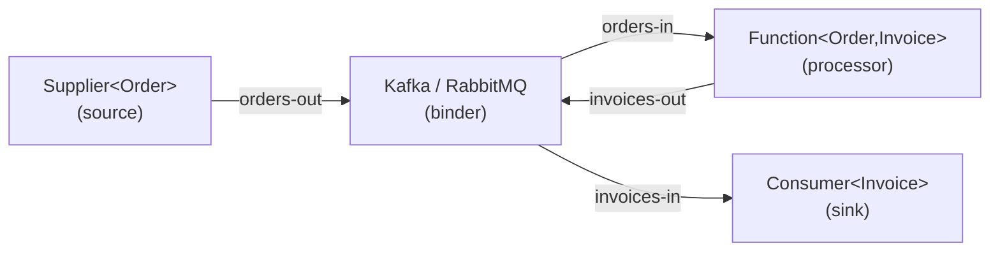

# Spring Cloud Stream

[← Back to README](../README.md)

---

**Spring Cloud Stream** is a framework for building event-driven microservices. It abstracts the messaging broker behind a binder interface — swap Kafka for RabbitMQ by changing a dependency, not your code. Business logic is expressed as plain `Function`, `Consumer`, and `Supplier` beans; the framework wires them to message channels automatically.



---

## Dependencies

```xml
<!-- Kafka binder -->
<dependency>
    <groupId>org.springframework.cloud</groupId>
    <artifactId>spring-cloud-stream-binder-kafka</artifactId>
</dependency>

<!-- RabbitMQ binder (alternative) -->
<dependency>
    <groupId>org.springframework.cloud</groupId>
    <artifactId>spring-cloud-stream-binder-rabbit</artifactId>
</dependency>
```

---

## Function Beans — Source, Processor, Sink

```java
@Configuration
public class OrderStreamFunctions {

    // Supplier — produces messages on a schedule or trigger
    @Bean
    public Supplier<Order> pendingOrders() {
        return () -> orderRepository.findNextPending();
    }

    // Function — consume and produce (processor)
    @Bean
    public Function<Order, Invoice> generateInvoice() {
        return order -> invoiceService.create(order);
    }

    // Consumer — sink, no output
    @Bean
    public Consumer<Invoice> persistInvoice() {
        return invoice -> invoiceRepository.save(invoice);
    }
}
```

---

## Binding Configuration

```yaml
spring:
  cloud:
    stream:
      function:
        definition: pendingOrders;generateInvoice;persistInvoice

      bindings:
        # Supplier output → Kafka topic
        pendingOrders-out-0:
          destination: orders
          producer:
            partition-key-expression: headers['orderId']
            partition-count: 3

        # Function input
        generateInvoice-in-0:
          destination: orders
          group: invoice-service         # consumer group
          consumer:
            max-attempts: 3
            back-off-initial-interval: 1000
            back-off-multiplier: 2.0

        # Function output
        generateInvoice-out-0:
          destination: invoices

        # Consumer input
        persistInvoice-in-0:
          destination: invoices
          group: persist-invoice-service

      kafka:
        binder:
          brokers: localhost:9092
        bindings:
          generateInvoice-in-0:
            consumer:
              enable-dlq: true           # dead letter queue on failure
              dlq-name: invoices.dlq
              start-offset: latest
```

---

## Reactive Functions

Use `Flux` / `Mono` for reactive pipelines:

```java
@Bean
public Function<Flux<Order>, Flux<Invoice>> reactiveInvoiceGenerator() {
    return orders -> orders
        .filter(o -> "CONFIRMED".equals(o.getStatus()))
        .flatMap(order -> invoiceService.createAsync(order))
        .doOnNext(inv -> log.info("Generated invoice {}", inv.getId()));
}

@Bean
public Function<Flux<Order>, Flux<Order>> enrichOrder() {
    return orders -> orders
        .flatMap(order ->
            customerService.findById(order.getCustomerId())
                .map(customer -> order.withCustomerName(customer.getName())));
}
```

---

## Sending Messages Programmatically — StreamBridge

```java
@Service
@RequiredArgsConstructor
public class OrderService {

    private final StreamBridge streamBridge;

    public Order place(PlaceOrderCommand cmd) {
        Order order = Order.create(cmd);
        orderRepository.save(order);

        // Send to a binding without a Supplier bean
        streamBridge.send("orders-out-0", order);
        return order;
    }

    // Send with custom headers
    public void sendWithHeaders(Order order) {
        MessageBuilder<Order> msg = MessageBuilder.withPayload(order)
            .setHeader("orderId", order.getId())
            .setHeader("source", "web");
        streamBridge.send("orders-out-0", msg.build());
    }
}
```

---

## Error Handling and DLQ

```java
@Bean
public Consumer<ErrorMessage> handleDlq() {
    return errorMessage -> {
        Message<?> failed = (Message<?>) errorMessage.getPayload().getFailedMessage();
        Throwable cause   = errorMessage.getPayload().getCause();
        log.error("DLQ: failed to process {}", failed.getPayload(), cause);
        deadLetterService.store(failed.getPayload(), cause.getMessage());
    };
}
```

```yaml
spring:
  cloud:
    stream:
      bindings:
        generateInvoice-in-0:
          consumer:
            max-attempts: 3
      kafka:
        bindings:
          generateInvoice-in-0:
            consumer:
              enable-dlq: true
              dlq-name: invoices.dlq
              dlq-producer-properties:
                configuration:
                  key.serializer: org.apache.kafka.common.serialization.StringSerializer
```

---

## Partitioning

```yaml
spring:
  cloud:
    stream:
      bindings:
        generateInvoice-out-0:
          destination: invoices
          producer:
            partition-count: 4
            partition-key-expression: payload.customerId
        persistInvoice-in-0:
          destination: invoices
          consumer:
            partitioned: true
            instance-count: 4
            instance-index: 0   # set per instance
```

---

## Content Negotiation and Serialization

```yaml
spring:
  cloud:
    stream:
      bindings:
        generateInvoice-in-0:
          content-type: application/json
        generateInvoice-out-0:
          content-type: application/json
```

Custom message converter for Avro:

```java
@Bean
public MessageConverter avroMessageConverter() {
    return new AvroSchemaMessageConverter(
        MimeType.valueOf("application/avro"));
}
```

---

## Testing

```java
@SpringBootTest
@Import(TestChannelBinderConfiguration.class)   // in-memory test binder
class InvoiceGeneratorTest {

    @Autowired InputDestination  input;
    @Autowired OutputDestination output;

    @Test
    void generateInvoice_fromOrder() {
        Order order = new Order("cust-1", BigDecimal.TEN);

        input.send(MessageBuilder.withPayload(order).build(), "orders");

        Message<byte[]> result = output.receive(1000, "invoices");
        assertThat(result).isNotNull();

        Invoice invoice = objectMapper.readValue(result.getPayload(), Invoice.class);
        assertThat(invoice.getOrderId()).isEqualTo(order.getId());
    }
}
```

---

## Spring Cloud Stream Summary

| Concept | Detail |
|---------|--------|
| `Supplier<T>` | Source — produces messages; triggered by a poller or `StreamBridge` |
| `Function<I,O>` | Processor — consumes and produces; stateless transformation |
| `Consumer<T>` | Sink — consumes messages; no output |
| `spring.cloud.stream.function.definition` | Semicolon-separated list of function bean names to activate |
| Binding name pattern | `{functionName}-in-{index}` / `{functionName}-out-{index}` |
| `group` | Consumer group name; ensures each message is processed by one instance |
| `StreamBridge` | Send messages programmatically to any binding from non-function code |
| `enable-dlq: true` | Route failed messages to `{topic}.dlq` after `max-attempts` |
| `partition-key-expression` | SpEL expression to determine partition; `payload.customerId` |
| `TestChannelBinderConfiguration` | In-memory binder for unit tests; `InputDestination` / `OutputDestination` |

---

[← Back to README](../README.md)
