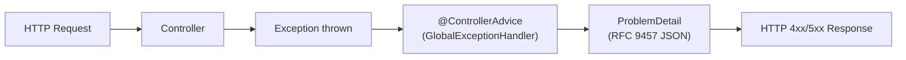

# Spring MVC Exception Handling & Problem Details

[← Back to README](../README.md)

---

Consistent, structured error responses are a mark of a well-designed API. Spring 6 / Spring Boot 3 standardises on **RFC 9457 Problem Details** (`application/problem+json`) via `ProblemDetail`. `@ExceptionHandler` and `@ControllerAdvice` intercept exceptions globally; `ResponseEntityExceptionHandler` handles all built-in Spring MVC exceptions out of the box.



---

## ProblemDetail — RFC 9457 Structure

```json
{
  "type":     "https://api.example.com/errors/order-not-found",
  "title":    "Order Not Found",
  "status":   404,
  "detail":   "Order abc-123 was not found",
  "instance": "/orders/abc-123",
  "orderId":  "abc-123",
  "timestamp": "2024-01-15T10:30:00Z"
}
```

---

## Enable Problem Details in Spring Boot 3

```yaml
spring:
  mvc:
    problemdetails:
      enabled: true   # Spring Boot auto-configures RFC 9457 for built-in exceptions
```

---

## @ControllerAdvice — Global Exception Handler

```java
@RestControllerAdvice
@Slf4j
public class GlobalExceptionHandler extends ResponseEntityExceptionHandler {

    // Domain exception → 404
    @ExceptionHandler(OrderNotFoundException.class)
    public ProblemDetail handleOrderNotFound(OrderNotFoundException ex,
                                              HttpServletRequest request) {
        ProblemDetail pd = ProblemDetail.forStatusAndDetail(HttpStatus.NOT_FOUND, ex.getMessage());
        pd.setType(URI.create("https://api.example.com/errors/order-not-found"));
        pd.setTitle("Order Not Found");
        pd.setInstance(URI.create(request.getRequestURI()));
        pd.setProperty("orderId", ex.getOrderId());
        pd.setProperty("timestamp", Instant.now());
        return pd;
    }

    // Validation exception → 422
    @ExceptionHandler(ValidationException.class)
    public ProblemDetail handleValidation(ValidationException ex) {
        ProblemDetail pd = ProblemDetail.forStatusAndDetail(
            HttpStatus.UNPROCESSABLE_ENTITY, "Validation failed");
        pd.setTitle("Validation Error");
        pd.setProperty("violations", ex.getViolations());
        return pd;
    }

    // Business rule violation → 409
    @ExceptionHandler(BusinessRuleException.class)
    public ProblemDetail handleBusinessRule(BusinessRuleException ex) {
        ProblemDetail pd = ProblemDetail.forStatusAndDetail(
            HttpStatus.CONFLICT, ex.getMessage());
        pd.setType(URI.create("https://api.example.com/errors/" + ex.getErrorCode()));
        pd.setTitle(ex.getTitle());
        return pd;
    }

    // Generic fallback → 500
    @ExceptionHandler(Exception.class)
    public ProblemDetail handleGeneric(Exception ex, HttpServletRequest request) {
        log.error("Unhandled exception at {}", request.getRequestURI(), ex);
        ProblemDetail pd = ProblemDetail.forStatus(HttpStatus.INTERNAL_SERVER_ERROR);
        pd.setTitle("Internal Server Error");
        pd.setDetail("An unexpected error occurred. Please try again later.");
        return pd;
    }

    // Override built-in Spring MVC handler (e.g., MethodArgumentNotValidException)
    @Override
    protected ResponseEntity<Object> handleMethodArgumentNotValid(
            MethodArgumentNotValidException ex,
            HttpHeaders headers,
            HttpStatusCode status,
            WebRequest request) {

        ProblemDetail pd = ProblemDetail.forStatusAndDetail(
            HttpStatus.BAD_REQUEST, "Request validation failed");
        pd.setTitle("Bad Request");

        List<Map<String, String>> violations = ex.getBindingResult()
            .getFieldErrors().stream()
            .map(fe -> Map.of(
                "field",   fe.getField(),
                "message", Objects.requireNonNullElse(fe.getDefaultMessage(), "invalid")))
            .toList();
        pd.setProperty("violations", violations);

        return ResponseEntity.badRequest().body(pd);
    }
}
```

---

## Custom Domain Exceptions

```java
public class OrderNotFoundException extends RuntimeException {

    private final String orderId;

    public OrderNotFoundException(String orderId) {
        super("Order " + orderId + " was not found");
        this.orderId = orderId;
    }

    public String getOrderId() { return orderId; }
}

public class BusinessRuleException extends RuntimeException {

    private final String errorCode;
    private final String title;

    public BusinessRuleException(String errorCode, String title, String detail) {
        super(detail);
        this.errorCode = errorCode;
        this.title = title;
    }

    public String getErrorCode() { return errorCode; }
    public String getTitle()     { return title; }
}

public class ValidationException extends RuntimeException {

    private final List<Violation> violations;

    public record Violation(String field, String message) {}

    public ValidationException(List<Violation> violations) {
        super("Validation failed");
        this.violations = violations;
    }

    public List<Violation> getViolations() { return violations; }
}
```

---

## ErrorResponse Interface (Spring 6)

Implement `ErrorResponse` on exceptions for automatic handling by `ResponseEntityExceptionHandler`:

```java
public class OrderNotFoundException extends RuntimeException implements ErrorResponse {

    private final String orderId;
    private final ProblemDetail problemDetail;

    public OrderNotFoundException(String orderId) {
        super("Order " + orderId + " not found");
        this.orderId = orderId;
        this.problemDetail = ProblemDetail.forStatusAndDetail(
            HttpStatus.NOT_FOUND, getMessage());
        this.problemDetail.setTitle("Order Not Found");
        this.problemDetail.setProperty("orderId", orderId);
    }

    @Override
    public ProblemDetail getBody() { return problemDetail; }

    @Override
    public HttpStatusCode getStatusCode() { return HttpStatus.NOT_FOUND; }
}
```

---

## WebFlux — Reactive Exception Handling

```java
@RestControllerAdvice
public class ReactiveGlobalExceptionHandler {

    @ExceptionHandler(OrderNotFoundException.class)
    public ResponseEntity<ProblemDetail> handleNotFound(OrderNotFoundException ex,
                                                         ServerHttpRequest request) {
        ProblemDetail pd = ProblemDetail.forStatusAndDetail(HttpStatus.NOT_FOUND, ex.getMessage());
        pd.setInstance(request.getURI());
        return ResponseEntity.status(HttpStatus.NOT_FOUND).body(pd);
    }

    // WebFlux alternative — WebExceptionHandler bean
    @Bean
    @Order(-2)   // before DefaultErrorWebExceptionHandler
    public WebExceptionHandler globalWebExceptionHandler() {
        return (exchange, ex) -> {
            if (ex instanceof OrderNotFoundException notFound) {
                exchange.getResponse().setStatusCode(HttpStatus.NOT_FOUND);
                // write response body
            }
            return Mono.error(ex);   // pass through for unhandled exceptions
        };
    }
}
```

---

## Testing Exception Handlers

```java
@WebMvcTest(OrderController.class)
class OrderControllerExceptionTest {

    @Autowired MockMvc mockMvc;
    @MockBean  OrderService orderService;

    @Test
    void getOrder_returnsRfc9457WhenNotFound() throws Exception {
        when(orderService.findById("bad-id"))
            .thenThrow(new OrderNotFoundException("bad-id"));

        mockMvc.perform(get("/orders/bad-id"))
            .andExpect(status().isNotFound())
            .andExpect(content().contentType("application/problem+json"))
            .andExpect(jsonPath("$.title").value("Order Not Found"))
            .andExpect(jsonPath("$.status").value(404))
            .andExpect(jsonPath("$.orderId").value("bad-id"));
    }

    @Test
    void placeOrder_returns422OnValidationFailure() throws Exception {
        mockMvc.perform(post("/orders")
                .contentType(MediaType.APPLICATION_JSON)
                .content("{}"))   // missing required fields
            .andExpect(status().isBadRequest())
            .andExpect(jsonPath("$.violations").isArray());
    }
}
```

---

## Exception Handling Summary

| Concept | Detail |
|---------|--------|
| `@RestControllerAdvice` | Global exception handler — applies to all `@RestController` beans |
| `@ExceptionHandler(Ex.class)` | Maps a specific exception type to a handler method |
| `ProblemDetail` | Spring 6 RFC 9457 response body: `type`, `title`, `status`, `detail`, `instance` |
| `ProblemDetail.setProperty(k, v)` | Add custom extension fields to the problem detail |
| `spring.mvc.problemdetails.enabled` | Auto-configure RFC 9457 for all built-in Spring MVC exceptions |
| `ResponseEntityExceptionHandler` | Extend to override built-in handling for `MethodArgumentNotValidException` etc. |
| `ErrorResponse` interface | Implement on exception classes for automatic problem detail extraction |
| `HttpStatus.UNPROCESSABLE_ENTITY` | 422 — request is well-formed but fails business validation |
| `HttpStatus.CONFLICT` | 409 — business rule violation (duplicate, wrong state) |
| `application/problem+json` | Content type for RFC 9457 responses; set by Spring automatically |

---

[← Back to README](../README.md)
