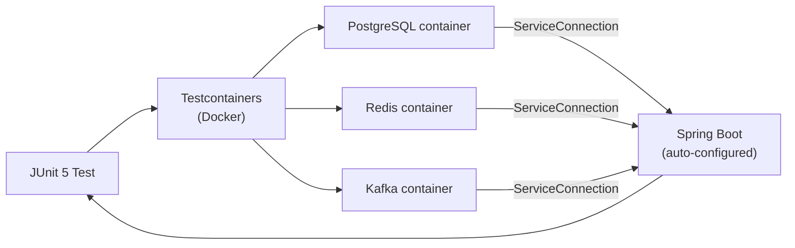

# Testcontainers Deep Dive

[← Back to README](../README.md)

---

**Testcontainers** starts real Docker containers in JUnit tests. Spring Boot 3.1+ adds `@ServiceConnection` for zero-config wiring — the test discovers the container's dynamic host/port and configures `DataSource`, `RedisTemplate`, `KafkaTemplate`, etc. automatically. Reusable containers and `withReuse(true)` eliminate startup overhead across test runs.



---

## Dependencies

```xml
<dependency>
    <groupId>org.springframework.boot</groupId>
    <artifactId>spring-boot-testcontainers</artifactId>
    <scope>test</scope>
</dependency>
<dependency>
    <groupId>org.testcontainers</groupId>
    <artifactId>junit-jupiter</artifactId>
    <scope>test</scope>
</dependency>
<dependency>
    <groupId>org.testcontainers</groupId>
    <artifactId>postgresql</artifactId>
    <scope>test</scope>
</dependency>
<dependency>
    <groupId>org.testcontainers</groupId>
    <artifactId>kafka</artifactId>
    <scope>test</scope>
</dependency>
```

---

## @ServiceConnection — Zero-Config Wiring (Spring Boot 3.1+)

```java
@SpringBootTest
@Testcontainers
class OrderServiceIntegrationTest {

    // @ServiceConnection reads the container's URL and configures DataSource automatically
    @Container
    @ServiceConnection
    static PostgreSQLContainer<?> postgres =
        new PostgreSQLContainer<>("postgres:16-alpine");

    @Container
    @ServiceConnection
    static RedisContainer redis =
        new RedisContainer(DockerImageName.parse("redis:7-alpine"));

    @Container
    @ServiceConnection
    static KafkaContainer kafka =
        new KafkaContainer(DockerImageName.parse("confluentinc/cp-kafka:7.6.0"));

    @Autowired OrderService orderService;
    @Autowired OrderRepository orderRepository;

    @Test
    void placeOrder_persistsToDatabase() {
        Order order = orderService.place(new PlaceOrderCommand("cust-1", BigDecimal.TEN));
        assertThat(orderRepository.findById(order.getId())).isPresent();
    }
}
```

---

## Reusable Containers — Across Test Runs

```java
// Singleton container shared across the entire test suite (not restarted between classes)
@Testcontainers
class AbstractIntegrationTest {

    @Container
    static final PostgreSQLContainer<?> POSTGRES =
        new PostgreSQLContainer<>("postgres:16-alpine")
            .withReuse(true);   // container survives JVM restart (needs ~/.testcontainers.properties)

    static {
        POSTGRES.start();
    }
}

// ~/.testcontainers.properties
// testcontainers.reuse.enable=true
```

---

## Test Configuration Class — Shared Setup

```java
// Centralize all containers in one @TestConfiguration
@TestConfiguration(proxyBeanMethods = false)
public class TestContainersConfig {

    @Bean
    @ServiceConnection
    PostgreSQLContainer<?> postgresContainer() {
        return new PostgreSQLContainer<>("postgres:16-alpine")
            .withInitScript("test-data.sql");
    }

    @Bean
    @ServiceConnection
    RedisContainer redisContainer() {
        return new RedisContainer("redis:7-alpine");
    }

    @Bean
    @ServiceConnection
    KafkaContainer kafkaContainer() {
        return new KafkaContainer(
            DockerImageName.parse("confluentinc/cp-kafka:7.6.0"));
    }
}

// Reference in tests
@SpringBootTest
@Import(TestContainersConfig.class)
class OrderServiceTest { ... }
```

---

## WireMock Integration

```xml
<dependency>
    <groupId>org.wiremock.integrations.testcontainers</groupId>
    <artifactId>wiremock-testcontainers-module</artifactId>
    <version>1.0-alpha-13</version>
    <scope>test</scope>
</dependency>
```

```java
@SpringBootTest
@Testcontainers
class ExternalApiClientTest {

    @Container
    static WireMockContainer wireMock =
        new WireMockContainer("wiremock/wiremock:3.3.1")
            .withMappingFromResource("payment-stub.json");

    @DynamicPropertySource
    static void configureWireMock(DynamicPropertyRegistry registry) {
        registry.add("payment.service.url", wireMock::getBaseUrl);
    }

    @Autowired PaymentClient paymentClient;

    @Test
    void chargeCard_callsExternalApi() {
        PaymentResult result = paymentClient.charge("tok_visa", BigDecimal.TEN);
        assertThat(result.getStatus()).isEqualTo("succeeded");
    }
}
```

```json
// src/test/resources/__files/payment-stub.json
{
  "mappings": [{
    "request":  { "method": "POST", "url": "/v1/charges" },
    "response": { "status": 200, "body": "{\"status\":\"succeeded\"}" }
  }]
}
```

---

## LocalStack — AWS Services

```xml
<dependency>
    <groupId>org.testcontainers</groupId>
    <artifactId>localstack</artifactId>
    <scope>test</scope>
</dependency>
```

```java
@SpringBootTest
@Testcontainers
class S3ServiceTest {

    @Container
    static LocalStackContainer localStack =
        new LocalStackContainer(DockerImageName.parse("localstack/localstack:3"))
            .withServices(S3);

    @DynamicPropertySource
    static void configureLocalStack(DynamicPropertyRegistry registry) {
        registry.add("aws.endpoint-override",
            () -> localStack.getEndpointOverride(S3).toString());
        registry.add("aws.region",    localStack::getRegion);
        registry.add("aws.accessKey", localStack::getAccessKey);
        registry.add("aws.secretKey", localStack::getSecretKey);
    }

    @BeforeAll
    static void createBucket() {
        localStack.execInContainer("awslocal", "s3", "mb", "s3://my-bucket");
    }

    @Autowired S3FileService fileService;

    @Test
    void upload_storesFileInS3() throws Exception {
        fileService.upload("test.txt", "hello".getBytes());
        assertThat(fileService.exists("test.txt")).isTrue();
    }
}
```

---

## @DynamicPropertySource — Manual Wiring

Use when `@ServiceConnection` isn't available for a custom container:

```java
@SpringBootTest
@Testcontainers
class ElasticsearchTest {

    @Container
    static ElasticsearchContainer elasticsearch =
        new ElasticsearchContainer("docker.elastic.co/elasticsearch/elasticsearch:8.12.0");

    @DynamicPropertySource
    static void elasticsearchProperties(DynamicPropertyRegistry registry) {
        registry.add("spring.elasticsearch.uris", elasticsearch::getHttpHostAddress);
        registry.add("spring.elasticsearch.username", () -> "elastic");
        registry.add("spring.elasticsearch.password",
            () -> elasticsearch.getEnvMap().get("ELASTIC_PASSWORD"));
    }

    @Autowired ElasticsearchOperations operations;

    @Test
    void indexAndSearch() {
        operations.save(new Product("1", "widget", 9.99));
        // ... assert search results
    }
}
```

---

## Test Application — Run App with Testcontainers

Spring Boot 3.1+ supports a `TestApplication` entry point that starts the real app with test containers:

```java
// src/test/java/com/example/TestApplication.java
@SpringBootApplication
public class TestApplication {
    public static void main(String[] args) {
        SpringApplication.from(Application::main)
            .with(TestContainersConfig.class)
            .run(args);
    }
}
```

```bash
# Run the app locally with real containers (no need for local Postgres/Redis/Kafka)
mvn spring-boot:test-run
```

---

## Testcontainers Summary

| Concept | Detail |
|---------|--------|
| `@Container` | JUnit 5 extension — starts container before tests, stops after |
| `static` container field | Shared across all tests in the class (started once) |
| `@ServiceConnection` | Spring Boot 3.1+ — auto-configures `DataSource`/`RedisTemplate`/etc. from container |
| `withReuse(true)` | Keep the container alive between JVM runs; requires `testcontainers.reuse.enable=true` |
| `@DynamicPropertySource` | Register dynamic properties (URL, port) into the Spring `Environment` |
| `TestContainersConfig` | `@TestConfiguration` with container `@Bean`s — import into multiple test classes |
| `WireMockContainer` | Stub HTTP dependencies; load stubs from JSON mapping files |
| `LocalStackContainer` | Emulate AWS services (S3, SQS, DynamoDB) without real AWS credentials |
| `TestApplication` | Run the full app with test containers for local development |
| `withInitScript("sql")` | Execute SQL on container startup to set up test data |

---

[← Back to README](../README.md)
