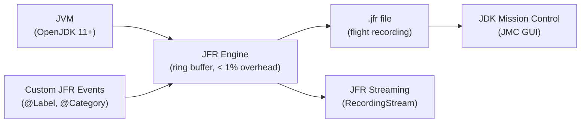

# Java Flight Recorder (JFR) Deep Dive

[← Back to README](../README.md)

---

**Java Flight Recorder** (JFR) is a low-overhead profiling and diagnostics engine built into the JDK. It records JVM internals (GC, JIT, threads, I/O, locks) and custom application events into a binary `.jfr` file. **JFR Streaming** (Java 14+) processes events in real time without writing to disk. **JDK Mission Control** (JMC) provides a GUI for analysing recordings.



---

## Starting a Recording

### Command Line

```bash
# Start recording from the beginning
java -XX:StartFlightRecording=duration=60s,filename=/tmp/recording.jfr,settings=profile \
     -jar myapp.jar

# Named recording — start/dump/stop via jcmd
java -XX:StartFlightRecording=name=myrecording,settings=default \
     -jar myapp.jar

# Dump the active recording
jcmd <pid> JFR.dump name=myrecording filename=/tmp/dump.jfr

# Start a recording on a running JVM
jcmd <pid> JFR.start duration=120s filename=/tmp/live.jfr settings=profile

# Stop a named recording
jcmd <pid> JFR.stop name=myrecording

# Check active recordings
jcmd <pid> JFR.check
```

### Programmatic (Java API)

```java
import jdk.jfr.Recording;
import jdk.jfr.consumer.RecordingFile;

public class JfrUtils {

    public static Path recordFor(Duration duration) throws Exception {
        Path output = Files.createTempFile("recording-", ".jfr");

        try (Recording recording = new Recording()) {
            recording.enable("jdk.GCHeapSummary").withPeriod(Duration.ofSeconds(1));
            recording.enable("jdk.CPULoad").withPeriod(Duration.ofSeconds(1));
            recording.enable("jdk.ThreadSleep").withThreshold(Duration.ofMillis(20));
            recording.setDestination(output);
            recording.start();

            Thread.sleep(duration.toMillis());

            recording.stop();
        }

        return output;
    }
}
```

---

## Recording Settings

```xml
<!-- custom-settings.jfc (JFR Configuration File) -->
<configuration version="2.0" label="Custom" description="Application-tuned settings">
    <event name="jdk.GCHeapSummary">
        <setting name="enabled">true</setting>
        <setting name="period">1 s</setting>
    </event>
    <event name="jdk.ThreadAllocationStatistics">
        <setting name="enabled">true</setting>
        <setting name="period">10 s</setting>
    </event>
    <event name="jdk.SocketRead">
        <setting name="enabled">true</setting>
        <setting name="threshold">20 ms</setting>
    </event>
    <event name="jdk.FileRead">
        <setting name="enabled">true</setting>
        <setting name="threshold">10 ms</setting>
    </event>
</configuration>
```

```bash
java -XX:StartFlightRecording=settings=custom-settings.jfc,filename=app.jfr -jar myapp.jar
```

---

## Custom JFR Events

```java
import jdk.jfr.*;

@Label("Order Placed")
@Description("Fired when an order is successfully placed")
@Category({"Application", "Orders"})
@StackTrace(false)   // skip stack trace to reduce overhead
public class OrderPlacedEvent extends Event {

    @Label("Order ID")
    public String orderId;

    @Label("Customer ID")
    public String customerId;

    @Label("Total Amount")
    @DataAmount(DataAmount.BYTES)
    public double total;

    @Label("Line Count")
    public int lineCount;
}

// In service code — zero overhead if JFR is not recording
@Service
public class OrderService {

    public Order place(PlaceOrderCommand cmd) {
        OrderPlacedEvent event = new OrderPlacedEvent();
        event.begin();

        try {
            Order order = Order.create(cmd);
            orderRepository.save(order);

            event.orderId    = order.getId().toString();
            event.customerId = cmd.customerId();
            event.total      = order.getTotal().doubleValue();
            event.lineCount  = order.getLines().size();

            return order;
        } finally {
            event.commit();   // only records if JFR is active and event is enabled
        }
    }
}
```

---

## JFR Streaming — Real-Time Event Processing

```java
import jdk.jfr.consumer.RecordingStream;

@Component
@Slf4j
public class JfrStreamMonitor implements ApplicationRunner {

    private final MeterRegistry meterRegistry;

    @Override
    public void run(ApplicationArguments args) {
        Thread.ofVirtual().start(() -> {
            try (RecordingStream rs = new RecordingStream()) {
                rs.enable("jdk.GCPhasePause").withThreshold(Duration.ofMillis(50));
                rs.enable("jdk.ThreadSleep").withThreshold(Duration.ofMillis(100));
                rs.enable("com.example.OrderPlacedEvent");

                rs.onEvent("jdk.GCPhasePause", event -> {
                    double pauseMs = event.getDuration("duration").toMillis();
                    meterRegistry.gauge("jvm.gc.pause.ms", pauseMs);
                    if (pauseMs > 200) {
                        log.warn("Long GC pause: {} ms", pauseMs);
                    }
                });

                rs.onEvent("com.example.OrderPlacedEvent", event -> {
                    log.info("JFR: order {} placed, total={}", 
                        event.getString("orderId"),
                        event.getDouble("total"));
                });

                rs.start();   // blocks; process events indefinitely
            } catch (Exception e) {
                log.error("JFR stream error", e);
            }
        });
    }
}
```

---

## Analysing Recordings — JFR API

```java
import jdk.jfr.consumer.RecordingFile;
import jdk.jfr.consumer.RecordedEvent;

public class RecordingAnalyser {

    public static void analyseGcPauses(Path recordingPath) throws IOException {
        try (RecordingFile file = new RecordingFile(recordingPath)) {
            while (file.hasMoreEvents()) {
                RecordedEvent event = file.readEvent();

                if ("jdk.GCPhasePause".equals(event.getEventType().getName())) {
                    Duration pause = event.getDuration("duration");
                    Instant time   = event.getStartTime();
                    log.info("GC pause at {}: {} ms", time, pause.toMillis());
                }
            }
        }
    }

    public static Map<String, Long> topAllocatingThreads(Path recordingPath) throws IOException {
        Map<String, Long> allocs = new HashMap<>();
        try (RecordingFile file = new RecordingFile(recordingPath)) {
            while (file.hasMoreEvents()) {
                RecordedEvent e = file.readEvent();
                if ("jdk.ThreadAllocationStatistics".equals(e.getEventType().getName())) {
                    String thread = e.getThread("thread").getJavaName();
                    long bytes    = e.getLong("allocated");
                    allocs.merge(thread, bytes, Long::sum);
                }
            }
        }
        return allocs;
    }
}
```

---

## JDK Mission Control — Key Views

| View | What to look for |
|------|-----------------|
| **Automated Analysis** | JMC flags anomalies automatically (GC pressure, hot methods, lock contention) |
| **Memory** | Heap usage over time; identify leaks via object count growth |
| **GC** | Pause durations, GC cause, promotion rate |
| **Threads** | Thread states over time; deadlocks show as blocked threads |
| **Method Profiling** | Hot methods by CPU sample count |
| **I/O** | Slow socket reads/writes above threshold |
| **Allocations** | Top classes by allocation pressure |
| **Lock Instances** | Contended monitors and wait times |

---

## Continuous JFR in Production

```bash
# Continuous recording with 1 GB disk rolling buffer
java -XX:StartFlightRecording=\
     name=continuous,\
     settings=default,\
     maxsize=1g,\
     maxage=24h,\
     disk=true \
     -jar myapp.jar

# Dump the last 5 minutes on demand when an incident occurs
jcmd <pid> JFR.dump name=continuous filename=/tmp/incident.jfr maxage=5m
```

---

## JFR Summary

| Concept | Detail |
|---------|--------|
| `jdk.jfr.Recording` | Start/stop recordings programmatically |
| `jcmd JFR.start` | Start a recording on a running JVM without restart |
| `settings=profile` | Richer data (stack traces) — 2–5% overhead |
| `settings=default` | Lower overhead (~1%) — suitable for continuous production recording |
| Custom `Event` class | Annotate with `@Label`, `@Category`; `begin()` / `commit()` is zero-cost when inactive |
| `RecordingStream` | Real-time event consumption; hook with `onEvent(type, handler)` |
| `RecordingFile` | Read and analyse a `.jfr` file after the fact |
| JDK Mission Control | GUI for `.jfr` files; download from jdk.java.net |
| Continuous recording | `disk=true` with `maxsize`/`maxage`; dump on demand during incidents |
| `@StackTrace(false)` | Skip capturing stack traces for high-frequency custom events |

---

[← Back to README](../README.md)
