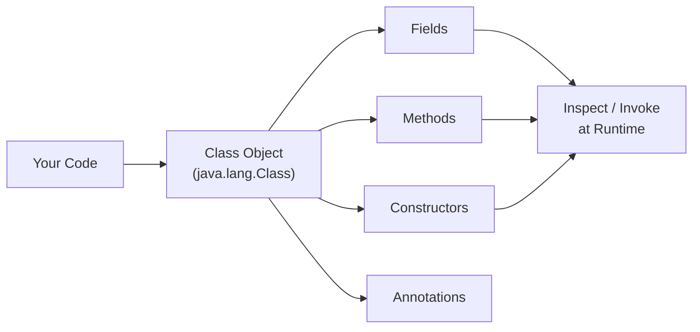

# Reflection and Annotations

[← Back to README](../README.md)

---

## Reflection

Reflection allows a program to **inspect and manipulate its own structure at runtime** — examining classes, fields, methods, and constructors without knowing them at compile time. It is the foundation of many frameworks (Spring, Hibernate, JUnit).



---

### Getting a Class Object

Every type in Java has a corresponding `Class<T>` object.

```java
// 1. from the type itself
Class<String> c1 = String.class;

// 2. from an instance
String s = "hello";
Class<?> c2 = s.getClass();

// 3. by name (throws ClassNotFoundException)
Class<?> c3 = Class.forName("java.lang.String");

System.out.println(c1.getName());        // java.lang.String
System.out.println(c1.getSimpleName());  // String
System.out.println(c1.getPackageName()); // java.lang
System.out.println(c1.isInterface());    // false
System.out.println(c1.getSuperclass());  // class java.lang.Object
```

---

### Inspecting Fields

```java
import java.lang.reflect.*;

public class Person {
    public  String name;
    private int    age;
    protected String email;
}

Class<?> clazz = Person.class;

// getFields() — only public fields (including inherited)
for (Field f : clazz.getFields()) {
    System.out.println(f.getName() + " : " + f.getType().getSimpleName());
}

// getDeclaredFields() — all fields declared in this class (any visibility)
for (Field f : clazz.getDeclaredFields()) {
    System.out.printf("%s %s %s%n",
        Modifier.toString(f.getModifiers()),
        f.getType().getSimpleName(),
        f.getName());
}

// read and write a field value
Person person = new Person();
person.name = "Alice";

Field nameField = clazz.getDeclaredField("name");
System.out.println(nameField.get(person));  // Alice

Field ageField = clazz.getDeclaredField("age");
ageField.setAccessible(true);               // bypass private access
ageField.set(person, 30);
System.out.println(ageField.get(person));   // 30
```

---

### Inspecting and Invoking Methods

```java
Class<?> clazz = String.class;

// list all public methods
for (Method m : clazz.getMethods()) {
    System.out.println(m.getName());
}

// get a specific method by name and parameter types
Method toUpperCase = clazz.getMethod("toUpperCase");
Method substring   = clazz.getMethod("substring", int.class, int.class);

// invoke
String result = (String) toUpperCase.invoke("hello");
System.out.println(result);  // HELLO

String sub = (String) substring.invoke("Hello, World!", 7, 12);
System.out.println(sub);     // World

// invoke a private method
class Counter {
    private int count = 0;
    private void increment() { count++; }
    public  int  getCount()  { return count; }
}

Counter counter = new Counter();
Method inc = Counter.class.getDeclaredMethod("increment");
inc.setAccessible(true);
inc.invoke(counter);
inc.invoke(counter);
System.out.println(counter.getCount());  // 2
```

---

### Inspecting and Invoking Constructors

```java
import java.lang.reflect.Constructor;

Class<?> clazz = java.util.ArrayList.class;

// list constructors
for (Constructor<?> c : clazz.getConstructors()) {
    System.out.println(c);
}

// create an instance via reflection
Constructor<?> noArg     = clazz.getConstructor();
Constructor<?> withCap   = clazz.getConstructor(int.class);

java.util.ArrayList<?> list1 = (java.util.ArrayList<?>) noArg.newInstance();
java.util.ArrayList<?> list2 = (java.util.ArrayList<?>) withCap.newInstance(50);
```

---

### Generic Type Information

Due to **type erasure**, generic type parameters are removed at runtime. However, declared types on fields and method signatures are preserved and accessible via reflection.

```java
import java.lang.reflect.*;

class Box {
    public java.util.List<String> items;
}

Field field = Box.class.getDeclaredField("items");
Type genericType = field.getGenericType();

if (genericType instanceof ParameterizedType pt) {
    System.out.println(pt.getRawType());           // interface java.util.List
    System.out.println(pt.getActualTypeArguments()[0]); // class java.lang.String
}
```

---

### When to Use Reflection

| Good uses | Avoid when |
|-----------|------------|
| Frameworks (DI, ORM, serialization) | Performance-critical code (reflection is slow) |
| Testing private members | A public API can serve the need |
| Plugin systems and dynamic loading | It bypasses compile-time type safety |
| Generic serialization / inspection tools | Simpler alternatives exist |

---

## Annotations

Annotations are **metadata attached to code elements** — classes, methods, fields, parameters, or packages. They don't change program behaviour directly but are read by compilers, tools, and frameworks at compile time or runtime.

### Built-in Annotations

```java
// @Override — compiler checks you're actually overriding a parent method
@Override
public String toString() { return "..."; }

// @Deprecated — marks an element as outdated
@Deprecated(since = "2.0", forRemoval = true)
public void oldMethod() {}

// @SuppressWarnings — silences specific compiler warnings
@SuppressWarnings("unchecked")
java.util.List list = new java.util.ArrayList();

// @FunctionalInterface — compiler enforces exactly one abstract method
@FunctionalInterface
public interface Transformer<T> {
    T transform(T input);
}

// @SafeVarargs — suppresses heap pollution warnings on varargs
@SafeVarargs
public static <T> java.util.List<T> listOf(T... elements) {
    return java.util.Arrays.asList(elements);
}
```

---

### Custom Annotations

Define annotations with `@interface`.

```java
import java.lang.annotation.*;

@Retention(RetentionPolicy.RUNTIME)   // annotation available at runtime
@Target(ElementType.METHOD)           // only valid on methods
public @interface Timed {
    String description() default "";
}
```

#### `@Retention` values

| Policy | Available at |
|--------|-------------|
| `SOURCE` | Compile time only (discarded in .class) |
| `CLASS` | In .class file, not at runtime (default) |
| `RUNTIME` | In .class and accessible via reflection |

#### `@Target` values

| ElementType | Can annotate |
|-------------|-------------|
| `TYPE` | Class, interface, enum, record |
| `FIELD` | Field declaration |
| `METHOD` | Method declaration |
| `PARAMETER` | Method parameter |
| `CONSTRUCTOR` | Constructor |
| `LOCAL_VARIABLE` | Local variable |
| `ANNOTATION_TYPE` | Another annotation |
| `PACKAGE` | Package declaration |

---

### Annotation Elements

```java
@Retention(RetentionPolicy.RUNTIME)
@Target({ElementType.TYPE, ElementType.METHOD})
public @interface Route {
    String path();                         // required element
    String method() default "GET";         // optional with default
    boolean authenticated() default false;
    String[] roles() default {};           // array element
}

// usage
@Route(path = "/users", method = "GET", authenticated = true, roles = {"ADMIN"})
public class UserController { }

@Route(path = "/health")   // method defaults to "GET"
public void healthCheck() { }
```

---

### Reading Annotations at Runtime

```java
import java.lang.reflect.*;

@Route(path = "/users", authenticated = true, roles = {"ADMIN", "USER"})
class UserController {}

Class<?> clazz = UserController.class;

if (clazz.isAnnotationPresent(Route.class)) {
    Route route = clazz.getAnnotation(Route.class);
    System.out.println(route.path());           // /users
    System.out.println(route.method());         // GET
    System.out.println(route.authenticated());  // true
    System.out.println(java.util.Arrays.toString(route.roles())); // [ADMIN, USER]
}

// read annotation on a method
for (Method method : clazz.getDeclaredMethods()) {
    if (method.isAnnotationPresent(Timed.class)) {
        Timed timed = method.getAnnotation(Timed.class);
        System.out.println("Timing: " + method.getName() + " — " + timed.description());
    }
}
```

---

### Practical Example — Simple Dependency Injector

```java
import java.lang.annotation.*;
import java.lang.reflect.*;

@Retention(RetentionPolicy.RUNTIME)
@Target(ElementType.FIELD)
@interface Inject {}

class EmailService {
    public void send(String msg) { System.out.println("Email: " + msg); }
}

class OrderService {
    @Inject
    private EmailService emailService;

    public void placeOrder(String item) {
        System.out.println("Order placed: " + item);
        emailService.send("Confirmation for " + item);
    }
}

// minimal injector
class Injector {
    public static <T> T create(Class<T> clazz) throws Exception {
        T instance = clazz.getDeclaredConstructor().newInstance();
        for (Field field : clazz.getDeclaredFields()) {
            if (field.isAnnotationPresent(Inject.class)) {
                field.setAccessible(true);
                Object dep = field.getType().getDeclaredConstructor().newInstance();
                field.set(instance, dep);
            }
        }
        return instance;
    }
}

OrderService service = Injector.create(OrderService.class);
service.placeOrder("Laptop");
// Order placed: Laptop
// Email: Confirmation for Laptop
```

---

### Repeatable Annotations (Java 8+)

```java
@Retention(RetentionPolicy.RUNTIME)
@Target(ElementType.METHOD)
@Repeatable(Roles.class)
public @interface Role {
    String value();
}

@Retention(RetentionPolicy.RUNTIME)
@Target(ElementType.METHOD)
public @interface Roles {
    Role[] value();
}

// use multiple times on the same element
@Role("ADMIN")
@Role("USER")
public void manageUsers() {}

// read all instances
Method m = MyClass.class.getMethod("manageUsers");
Role[] roles = m.getAnnotationsByType(Role.class);
for (Role r : roles) System.out.println(r.value());
```

---

## Reflection and Annotations Summary

| Concept | Key class / annotation | Use |
|---------|------------------------|-----|
| Get class metadata | `Class<T>`, `Class.forName()` | Inspect type at runtime |
| List fields | `getDeclaredFields()` | Serialization, DI frameworks |
| Read/write fields | `Field.get()`, `Field.set()` | ORM, testing private state |
| Invoke methods | `Method.invoke()` | Plugin systems, proxies |
| Create instances | `Constructor.newInstance()` | Factories, DI containers |
| Bypass visibility | `setAccessible(true)` | Testing, frameworks (use sparingly) |
| Mark as deprecated | `@Deprecated` | Signal old API |
| Mark as functional | `@FunctionalInterface` | Enforce single abstract method |
| Custom metadata | `@interface` | Framework hooks, validation |
| Runtime annotation | `@Retention(RUNTIME)` | Read annotations via reflection |
| Repeatable annotation | `@Repeatable` | Apply the same annotation multiple times |

---

[← Back to README](../README.md)
