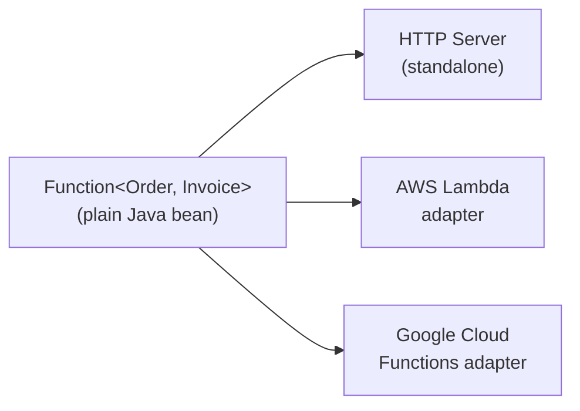

# Spring Cloud Function & Serverless

[← Back to README](../README.md)

---

**Spring Cloud Function** lets you write business logic as plain `Function`, `Consumer`, and `Supplier` beans, then deploy them anywhere: AWS Lambda, Google Cloud Functions, Azure Functions, or a standalone HTTP server. The same code runs in every environment — only the adapter changes.



---

## Dependency

```xml
<!-- Core -->
<dependency>
    <groupId>org.springframework.cloud</groupId>
    <artifactId>spring-cloud-function-context</artifactId>
</dependency>

<!-- Web adapter — expose functions over HTTP -->
<dependency>
    <groupId>org.springframework.cloud</groupId>
    <artifactId>spring-cloud-function-web</artifactId>
</dependency>

<!-- AWS Lambda adapter -->
<dependency>
    <groupId>org.springframework.cloud</groupId>
    <artifactId>spring-cloud-function-adapter-aws</artifactId>
</dependency>
```

---

## Writing Functions

```java
@Configuration
public class OrderFunctions {

    // Function — receives input, returns output
    @Bean
    public Function<Order, Invoice> generateInvoice() {
        return order -> {
            Invoice invoice = Invoice.from(order);
            invoiceRepository.save(invoice);
            return invoice;
        };
    }

    // Consumer — receives input, no return (side effect)
    @Bean
    public Consumer<Order> auditOrder() {
        return order -> auditService.log("ORDER_RECEIVED", order.getId());
    }

    // Supplier — produces output with no input (e.g., poller)
    @Bean
    public Supplier<List<Order>> pendingOrders() {
        return () -> orderRepository.findByStatus("PENDING");
    }

    // Composition — functions chain with andThen
    @Bean
    public Function<Order, Notification> orderToNotification(
            Function<Order, Invoice> generateInvoice,
            Function<Invoice, Notification> invoiceToNotification) {
        return generateInvoice.andThen(invoiceToNotification);
    }
}
```

---

## HTTP Invocation (Standalone)

Spring Cloud Function Web exposes each function at `POST /{functionName}`:

```bash
# POST to the function name
curl -X POST http://localhost:8080/generateInvoice \
     -H "Content-Type: application/json" \
     -d '{"id":"o1","customerId":"c1","total":99.99}'

# GET a Supplier function
curl http://localhost:8080/pendingOrders
```

```yaml
spring:
  cloud:
    function:
      definition: generateInvoice   # expose only this function
```

---

## AWS Lambda Adapter

```java
// Handler class — referenced in Lambda config as the handler
public class GenerateInvoiceHandler
        extends SpringBootRequestHandler<Order, Invoice> {

    // SpringBootRequestHandler wires the Spring context and routes
    // API Gateway events to the 'generateInvoice' function bean
}
```

```xml
<!-- pom.xml — shade plugin bundles everything into a fat JAR -->
<plugin>
    <groupId>org.apache.maven.plugins</groupId>
    <artifactId>maven-shade-plugin</artifactId>
    <executions>
        <execution>
            <goals><goal>shade</goal></goals>
            <configuration>
                <shadedArtifactAttached>true</shadedArtifactAttached>
                <shadedClassifierName>aws</shadedClassifierName>
                <transformers>
                    <transformer implementation="org.apache.maven.plugins.shade.resource.AppendingTransformer">
                        <resource>META-INF/spring.handlers</resource>
                    </transformer>
                    <transformer implementation="org.springframework.boot.maven.PropertiesMergingResourceTransformer">
                        <resource>META-INF/spring.factories</resource>
                    </transformer>
                </transformers>
            </configuration>
        </execution>
    </executions>
</plugin>
```

```yaml
# application.yml
spring:
  cloud:
    function:
      definition: generateInvoice
```

---

## Reactive Functions

```java
@Bean
public Function<Flux<Order>, Flux<Invoice>> reactiveInvoiceGenerator() {
    return orders -> orders
        .filter(o -> o.getTotal().compareTo(BigDecimal.ZERO) > 0)
        .flatMap(order -> invoiceService.createAsync(order));
}

@Bean
public Function<Mono<Order>, Mono<Invoice>> monoInvoiceGenerator() {
    return orderMono -> orderMono
        .flatMap(order -> invoiceService.createAsync(order));
}
```

---

## Function Routing

Route a single Lambda/HTTP endpoint to different functions based on headers or content:

```yaml
spring:
  cloud:
    function:
      definition: generateInvoice|auditOrder   # pipe = route via header
      routing-expression: headers['function']  # use header to choose function
```

```bash
curl -X POST http://localhost:8080/routingFunction \
     -H "spring.cloud.function.definition: auditOrder" \
     -H "Content-Type: application/json" \
     -d '{"id":"o1"}'
```

---

## GraalVM Native Image for Lambda

Minimize cold start with native compilation:

```xml
<plugin>
    <groupId>org.graalvm.buildtools</groupId>
    <artifactId>native-maven-plugin</artifactId>
    <configuration>
        <mainClass>com.example.Application</mainClass>
        <buildArgs>
            <buildArg>-H:+AddAllCharsets</buildArg>
        </buildArgs>
    </configuration>
</plugin>
```

```bash
# Build native binary
mvn -Pnative native:compile

# Package for Lambda (custom runtime)
zip function.zip bootstrap
aws lambda update-function-code --function-name my-fn --zip-file fileb://function.zip
```

Lambda custom runtime bootstrap:

```bash
#!/bin/sh
# bootstrap file
./application -Dspring.profiles.active=lambda
```

---

## Cold Start Strategies

| Strategy | Cold start | Notes |
|----------|-----------|-------|
| Standard JVM | 5–15 s | Slow; acceptable for background tasks |
| AppCDS | 2–5 s | Pre-parsed class archive |
| Spring AOT + AppCDS | 1–3 s | Moves bean computation to build time |
| GraalVM Native | 100–500 ms | Best cold start; AOT hints required |
| SnapStart (AWS) | ~1 s | Snapshots JVM after init; restore on invocation |
| CRaC | ~200 ms | Checkpoint/restore warm JVM |

---

## Testing Functions Locally

```java
@SpringBootTest
class GenerateInvoiceFunctionTest {

    @Autowired
    @Qualifier("generateInvoice")
    Function<Order, Invoice> generateInvoice;

    @Test
    void function_generatesInvoice() {
        Order order = new Order("o1", "cust-1", BigDecimal.TEN);
        Invoice invoice = generateInvoice.apply(order);
        assertThat(invoice.getOrderId()).isEqualTo("o1");
    }
}
```

---

## Spring Cloud Function Summary

| Concept | Detail |
|---------|--------|
| `Function<I,O>` | Stateless transform; auto-exposed at `POST /{beanName}` |
| `Consumer<I>` | Side-effect sink; no return value |
| `Supplier<O>` | Produces output without input; polled or called via GET |
| `spring.cloud.function.definition` | Activate specific functions; required when multiple beans exist |
| `SpringBootRequestHandler` | AWS Lambda entry point; bridges Lambda event to `Function` |
| `andThen` composition | Chain `Function` beans into a pipeline without extra code |
| Routing expression | Route to different functions via header/body condition |
| GraalVM native | Best cold start for Lambda; requires AOT hints for reflection |
| AWS SnapStart | Lambda-managed JVM checkpoint; enable on Java 11/17/21 runtimes |
| `Flux` / `Mono` support | Reactive functions work with Spring Cloud Function Web and messaging adapters |

---

[← Back to README](../README.md)
