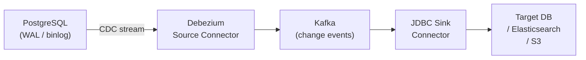

# Kafka Connect & Debezium CDC

[← Back to README](../README.md)

---

**Kafka Connect** is a framework for streaming data between Kafka and external systems using configurable connectors — no code required for standard integrations. **Debezium** is a set of Kafka Connect **source connectors** that tail database transaction logs and emit every row-level change as a Kafka event, enabling **Change Data Capture (CDC)** without polling.



---

## Kafka Connect Architecture

```
┌─────────────────────────────────────┐
│  Kafka Connect Cluster              │
│  ┌──────────────┐  ┌─────────────┐  │
│  │ Source       │  │ Sink        │  │
│  │ Connector    │  │ Connector   │  │
│  │ (Debezium)   │  │ (JDBC/ES)   │  │
│  └──────┬───────┘  └──────┬──────┘  │
└─────────│─────────────────│─────────┘
          │ produce          │ consume
          ▼                  ▼
       Kafka Topics
```

---

## Deploy Kafka Connect (Docker Compose)

```yaml
# docker-compose.yml
services:
  kafka:
    image: confluentinc/cp-kafka:7.6.0
    environment:
      KAFKA_KRAFT_MODE: "true"
      KAFKA_PROCESS_ROLES: broker,controller
      KAFKA_NODE_ID: 1
      KAFKA_LISTENERS: PLAINTEXT://0.0.0.0:9092,CONTROLLER://0.0.0.0:9093
      CLUSTER_ID: MkU3OEVBNTcwNTJENDM2Qk

  connect:
    image: debezium/connect:2.7
    depends_on: [kafka]
    ports: ["8083:8083"]
    environment:
      BOOTSTRAP_SERVERS: kafka:9092
      GROUP_ID: connect-cluster
      CONFIG_STORAGE_TOPIC: connect-configs
      OFFSET_STORAGE_TOPIC: connect-offsets
      STATUS_STORAGE_TOPIC: connect-status

  postgres:
    image: postgres:16
    environment:
      POSTGRES_DB: orders
      POSTGRES_USER: debezium
      POSTGRES_PASSWORD: debezium
    command: >
      postgres -c wal_level=logical
               -c max_replication_slots=4
               -c max_wal_senders=4
```

---

## Debezium PostgreSQL Source Connector

```bash
# Register connector via Kafka Connect REST API
curl -X POST http://localhost:8083/connectors \
  -H "Content-Type: application/json" \
  -d '{
    "name": "orders-connector",
    "config": {
      "connector.class": "io.debezium.connector.postgresql.PostgresConnector",
      "database.hostname": "postgres",
      "database.port": "5432",
      "database.user": "debezium",
      "database.password": "debezium",
      "database.dbname": "orders",
      "database.server.name": "orders-db",
      "plugin.name": "pgoutput",
      "slot.name": "debezium_slot",
      "publication.name": "dbz_publication",
      "table.include.list": "public.orders,public.order_lines",
      "topic.prefix": "orders-db",
      "snapshot.mode": "initial",
      "transforms": "unwrap",
      "transforms.unwrap.type": "io.debezium.transforms.ExtractNewRecordState",
      "transforms.unwrap.drop.tombstones": "false",
      "transforms.unwrap.add.fields": "op,ts_ms,source.ts_ms"
    }
  }'
```

---

## Debezium Change Event Format

```json
{
  "before": null,
  "after": {
    "id": "abc-123",
    "customer_id": "cust-1",
    "status": "PENDING",
    "total": 99.99,
    "created_at": 1705314600000
  },
  "op": "c",
  "ts_ms": 1705314600123,
  "source": {
    "connector": "postgresql",
    "db": "orders",
    "table": "orders",
    "lsn": 12345678
  }
}
```

Operations: `c` = create, `u` = update, `d` = delete, `r` = read (snapshot).

After applying `ExtractNewRecordState` transform, only the `after` payload is emitted.

---

## Consuming CDC Events in Spring

```java
@Component
@Slf4j
public class OrderCdcConsumer {

    @KafkaListener(topics = "orders-db.public.orders", groupId = "cdc-consumer")
    public void onOrderChange(
            @Payload OrderCdcEvent event,
            @Header(KafkaHeaders.RECEIVED_TOPIC) String topic,
            Acknowledgment ack) {

        switch (event.getOp()) {
            case "c" -> handleCreate(event.getAfter());
            case "u" -> handleUpdate(event.getBefore(), event.getAfter());
            case "d" -> handleDelete(event.getBefore());
        }

        ack.acknowledge();
    }

    private void handleCreate(OrderSnapshot snapshot) {
        searchIndexService.index(snapshot);
        cacheService.evict(snapshot.getId());
    }

    private void handleUpdate(OrderSnapshot before, OrderSnapshot after) {
        if (!before.getStatus().equals(after.getStatus())) {
            notificationService.notifyStatusChange(after.getId(), after.getStatus());
        }
        searchIndexService.update(after);
    }

    private void handleDelete(OrderSnapshot snapshot) {
        searchIndexService.delete(snapshot.getId());
    }
}

public record OrderCdcEvent(
    @JsonProperty("op")     String op,
    @JsonProperty("before") OrderSnapshot before,
    @JsonProperty("after")  OrderSnapshot after,
    @JsonProperty("ts_ms")  long timestampMs) {}
```

---

## JDBC Sink Connector — Replicate to Another Database

```bash
curl -X POST http://localhost:8083/connectors \
  -H "Content-Type: application/json" \
  -d '{
    "name": "orders-jdbc-sink",
    "config": {
      "connector.class": "io.confluent.connect.jdbc.JdbcSinkConnector",
      "connection.url": "jdbc:postgresql://reporting-db:5432/reporting",
      "connection.user": "writer",
      "connection.password": "secret",
      "topics": "orders-db.public.orders",
      "auto.create": "true",
      "auto.evolve": "true",
      "insert.mode": "upsert",
      "pk.mode": "record_key",
      "pk.fields": "id"
    }
  }'
```

---

## Single Message Transforms (SMT)

```json
{
  "transforms": "route,addPrefix",
  "transforms.route.type": "org.apache.kafka.connect.transforms.ReplaceField$Value",
  "transforms.route.exclude": "source,transaction",

  "transforms.addPrefix.type": "org.apache.kafka.connect.transforms.ReplaceField$Value",
  "transforms.addPrefix.renames": "customer_id:customerId,created_at:createdAt"
}
```

Common SMTs:

| SMT | Purpose |
|-----|---------|
| `ExtractNewRecordState` | Debezium unwrap — emit only `after` payload |
| `ReplaceField` | Include/exclude/rename fields |
| `TimestampConverter` | Convert epoch ms ↔ ISO 8601 strings |
| `MaskField` | Mask sensitive fields (PII) |
| `RegexRouter` | Rename the topic using a regex pattern |

---

## Managing Connectors

```bash
# List all connectors
curl http://localhost:8083/connectors

# Get connector status
curl http://localhost:8083/connectors/orders-connector/status

# Pause / Resume
curl -X PUT http://localhost:8083/connectors/orders-connector/pause
curl -X PUT http://localhost:8083/connectors/orders-connector/resume

# Restart a failed task
curl -X POST http://localhost:8083/connectors/orders-connector/tasks/0/restart

# Delete a connector
curl -X DELETE http://localhost:8083/connectors/orders-connector
```

---

## Kafka Connect Summary

| Concept | Detail |
|---------|--------|
| Source connector | Reads from an external system, produces to Kafka |
| Sink connector | Reads from Kafka, writes to an external system |
| Debezium | CDC source connector; tails database WAL/binlog — no polling |
| `wal_level=logical` | Required PostgreSQL config for Debezium logical replication |
| `op` field | Change type: `c` create, `u` update, `d` delete, `r` read (snapshot) |
| `ExtractNewRecordState` | SMT that unwraps the Debezium envelope to just the `after` payload |
| `snapshot.mode: initial` | Snapshot existing rows on first connect, then stream live changes |
| JDBC Sink | Replicate Kafka topics to a target database; supports upsert mode |
| SMT (Single Message Transform) | Pipeline step applied to each message — rename, mask, route |
| Kafka Connect REST API | `POST /connectors` to register; `GET /connectors/{name}/status` to monitor |

---

[← Back to README](../README.md)
