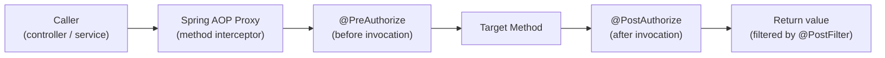

# Spring Security Method Security

[← Back to README](../README.md)

---

Method security applies access control at the service layer — beyond URL-level rules. `@PreAuthorize` evaluates a SpEL expression before the method runs; `@PostAuthorize` checks after, with access to the return value. `@PreFilter` / `@PostFilter` trim collections. Spring Security 6 uses the `@EnableMethodSecurity` annotation and replaces the legacy `@EnableGlobalMethodSecurity`.



---

## Enable Method Security

```java
@Configuration
@EnableMethodSecurity(
    prePostEnabled = true,   // @PreAuthorize, @PostAuthorize (default: true in Spring Security 6)
    securedEnabled = true,   // @Secured
    jsr250Enabled = true)    // @RolesAllowed
public class MethodSecurityConfig { }
```

---

## @PreAuthorize — Common Patterns

```java
@Service
@RequiredArgsConstructor
public class OrderService {

    // Require a role
    @PreAuthorize("hasRole('ADMIN')")
    public List<Order> findAll() {
        return orderRepository.findAll();
    }

    // Require any of several roles
    @PreAuthorize("hasAnyRole('ADMIN', 'MANAGER')")
    public void cancel(UUID orderId) {
        orderRepository.deleteById(orderId);
    }

    // Check permission (uses PermissionEvaluator)
    @PreAuthorize("hasPermission(#orderId, 'Order', 'READ')")
    public Order findById(UUID orderId) {
        return orderRepository.findById(orderId).orElseThrow();
    }

    // Access method argument in SpEL
    @PreAuthorize("#customerId == authentication.name or hasRole('ADMIN')")
    public List<Order> findByCustomer(String customerId) {
        return orderRepository.findByCustomerId(customerId);
    }

    // Complex expression
    @PreAuthorize("isAuthenticated() and " +
                  "(hasRole('ADMIN') or " +
                  " (#order.customerId == authentication.name))")
    public Order update(Order order) {
        return orderRepository.save(order);
    }
}
```

---

## @PostAuthorize — Check the Return Value

```java
@Service
public class OrderService {

    // Only return the order if the caller owns it or is admin
    @PostAuthorize("returnObject.customerId == authentication.name " +
                   "or hasRole('ADMIN')")
    public Order findById(UUID orderId) {
        return orderRepository.findById(orderId).orElseThrow();
    }

    // Return null instead of throwing if access denied
    @PostAuthorize("returnObject == null or " +
                   "returnObject.ownerId == authentication.name")
    public Report generateReport(UUID reportId) {
        return reportRepository.findById(reportId).orElse(null);
    }
}
```

---

## @PreFilter / @PostFilter — Filter Collections

```java
@Service
public class OrderService {

    // Filter the INPUT collection — only keep items the caller can write
    @PreFilter("filterObject.customerId == authentication.name or hasRole('ADMIN')")
    public List<Order> batchUpdate(List<Order> orders) {
        return orderRepository.saveAll(orders);
    }

    // Filter the OUTPUT collection — only return orders the caller owns
    @PostFilter("filterObject.customerId == authentication.name or hasRole('ADMIN')")
    public List<Order> findAll() {
        return orderRepository.findAll();
    }
}
```

---

## Custom PermissionEvaluator

```java
@Component
public class OrderPermissionEvaluator implements PermissionEvaluator {

    private final OrderRepository orderRepository;

    @Override
    public boolean hasPermission(Authentication auth, Object targetDomainObject,
                                  Object permission) {
        if (targetDomainObject instanceof Order order) {
            return switch (permission.toString()) {
                case "READ"   -> order.getCustomerId().equals(auth.getName())
                                 || hasRole(auth, "ADMIN");
                case "WRITE"  -> order.getCustomerId().equals(auth.getName())
                                 || hasRole(auth, "ADMIN");
                case "DELETE" -> hasRole(auth, "ADMIN");
                default -> false;
            };
        }
        return false;
    }

    @Override
    public boolean hasPermission(Authentication auth, Serializable targetId,
                                  String targetType, Object permission) {
        if ("Order".equals(targetType)) {
            Order order = orderRepository.findById((UUID) targetId).orElse(null);
            if (order == null) return false;
            return hasPermission(auth, order, permission);
        }
        return false;
    }

    private boolean hasRole(Authentication auth, String role) {
        return auth.getAuthorities().stream()
            .anyMatch(a -> a.getAuthority().equals("ROLE_" + role));
    }
}

@Configuration
public class MethodSecurityConfig {

    @Bean
    public MethodSecurityExpressionHandler expressionHandler(
            OrderPermissionEvaluator permissionEvaluator) {
        DefaultMethodSecurityExpressionHandler handler =
            new DefaultMethodSecurityExpressionHandler();
        handler.setPermissionEvaluator(permissionEvaluator);
        return handler;
    }
}
```

---

## Custom Security Annotations

```java
// Define a meta-annotation
@Target(ElementType.METHOD)
@Retention(RetentionPolicy.RUNTIME)
@PreAuthorize("hasRole('ADMIN')")
public @interface AdminOnly { }

@Target(ElementType.METHOD)
@Retention(RetentionPolicy.RUNTIME)
@PreAuthorize("#customerId == authentication.name or hasRole('ADMIN')")
public @interface OwnerOrAdmin { }

// Usage — cleaner than inline SpEL
@Service
public class OrderService {

    @AdminOnly
    public void purgeAll() {
        orderRepository.deleteAll();
    }

    @OwnerOrAdmin
    public List<Order> findByCustomer(String customerId) {
        return orderRepository.findByCustomerId(customerId);
    }
}
```

---

## Reactive Method Security

```java
@Configuration
@EnableReactiveMethodSecurity
public class ReactiveMethodSecurityConfig { }

@Service
public class ReactiveOrderService {

    @PreAuthorize("hasRole('ADMIN')")
    public Flux<Order> findAll() {
        return orderRepository.findAll();
    }

    @PreAuthorize("#customerId == authentication.name or hasRole('ADMIN')")
    public Flux<Order> findByCustomer(String customerId) {
        return orderRepository.findByCustomerId(customerId);
    }

    @PostAuthorize("returnObject.map(o -> " +
                   "o.customerId == authentication.name or hasRole('ADMIN')).defaultIfEmpty(true)")
    public Mono<Order> findById(UUID orderId) {
        return orderRepository.findById(orderId);
    }
}
```

---

## Testing Method Security

```java
@SpringBootTest
class OrderServiceSecurityTest {

    @Autowired OrderService orderService;

    @Test
    @WithMockUser(roles = "ADMIN")
    void admin_canFindAll() {
        assertThat(orderService.findAll()).isNotNull();
    }

    @Test
    @WithMockUser(username = "cust-1", roles = "USER")
    void user_canFindOwnOrders() {
        List<Order> orders = orderService.findByCustomer("cust-1");
        assertThat(orders).allMatch(o -> "cust-1".equals(o.getCustomerId()));
    }

    @Test
    @WithMockUser(username = "cust-1", roles = "USER")
    void user_cannotFindAllOrders() {
        assertThatThrownBy(() -> orderService.findAll())
            .isInstanceOf(AccessDeniedException.class);
    }

    @Test
    @WithAnonymousUser
    void anonymous_cannotAccessAnyOrder() {
        assertThatThrownBy(() -> orderService.findAll())
            .isInstanceOf(AuthenticationCredentialsNotFoundException.class);
    }
}
```

---

## Method Security Summary

| Concept | Detail |
|---------|--------|
| `@EnableMethodSecurity` | Activates `@PreAuthorize`, `@PostAuthorize`, `@PreFilter`, `@PostFilter` |
| `@PreAuthorize(expr)` | Evaluate SpEL before the method; throws `AccessDeniedException` on failure |
| `@PostAuthorize(expr)` | Evaluate SpEL after the method; `returnObject` refers to the return value |
| `@PreFilter` | Filter the input collection; `filterObject` is each element |
| `@PostFilter` | Filter the output collection; `filterObject` is each element |
| `hasRole('X')` | Check `ROLE_X` authority; Spring prepends `ROLE_` automatically |
| `authentication.name` | The principal's username in SpEL |
| `hasPermission(id, type, perm)` | Delegate to `PermissionEvaluator` for domain object ACL |
| `PermissionEvaluator` | Custom bean for fine-grained object-level access control |
| `@WithMockUser` | Test helper to set a mock `Authentication` in the security context |
| `@EnableReactiveMethodSecurity` | Same features for WebFlux / reactive services |

---

[← Back to README](../README.md)
