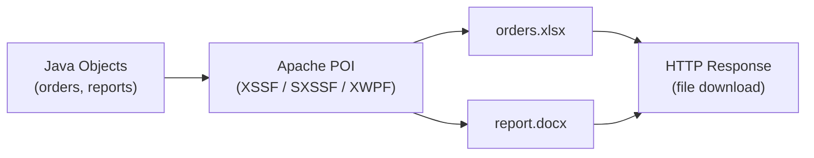

# Apache POI — Excel & Document Generation

[← Back to README](../README.md)

---

**Apache POI** is the standard Java library for reading and writing Microsoft Office formats. `XSSF` handles `.xlsx` (Excel 2007+) in memory; `SXSSF` streams large workbooks to disk to avoid `OutOfMemoryError`. `XWPF` handles `.docx` Word documents.



---

## Dependency

```xml
<!-- Excel (.xlsx) and Word (.docx) -->
<dependency>
    <groupId>org.apache.poi</groupId>
    <artifactId>poi-ooxml</artifactId>
    <version>5.2.5</version>
</dependency>
```

---

## Create an Excel Workbook (XSSF)

```java
@Service
public class OrderExcelExporter {

    public byte[] export(List<Order> orders) throws IOException {
        try (XSSFWorkbook workbook = new XSSFWorkbook();
             ByteArrayOutputStream out = new ByteArrayOutputStream()) {

            XSSFSheet sheet = workbook.createSheet("Orders");

            // Styles
            CellStyle headerStyle = createHeaderStyle(workbook);
            CellStyle currencyStyle = createCurrencyStyle(workbook);
            CellStyle dateStyle = createDateStyle(workbook);

            // Header row
            Row header = sheet.createRow(0);
            String[] columns = {"Order ID", "Customer", "Status", "Total", "Created At"};
            for (int i = 0; i < columns.length; i++) {
                Cell cell = header.createCell(i);
                cell.setCellValue(columns[i]);
                cell.setCellStyle(headerStyle);
            }

            // Data rows
            int rowNum = 1;
            for (Order order : orders) {
                Row row = sheet.createRow(rowNum++);
                row.createCell(0).setCellValue(order.getId().toString());
                row.createCell(1).setCellValue(order.getCustomerId());
                row.createCell(2).setCellValue(order.getStatus());

                Cell totalCell = row.createCell(3);
                totalCell.setCellValue(order.getTotal().doubleValue());
                totalCell.setCellStyle(currencyStyle);

                Cell dateCell = row.createCell(4);
                dateCell.setCellValue(Date.from(order.getCreatedAt()));
                dateCell.setCellStyle(dateStyle);
            }

            // Auto-size columns
            for (int i = 0; i < columns.length; i++) {
                sheet.autoSizeColumn(i);
            }

            // Summary row
            Row summary = sheet.createRow(rowNum + 1);
            summary.createCell(0).setCellValue("Total orders:");
            summary.createCell(1).setCellValue(orders.size());

            // Formula — sum of totals
            Cell sumCell = summary.createCell(3);
            sumCell.setCellFormula("SUM(D2:D" + (rowNum) + ")");
            sumCell.setCellStyle(currencyStyle);

            workbook.write(out);
            return out.toByteArray();
        }
    }

    private CellStyle createHeaderStyle(XSSFWorkbook wb) {
        CellStyle style = wb.createCellStyle();
        XSSFFont font = wb.createFont();
        font.setBold(true);
        font.setColor(IndexedColors.WHITE.getIndex());
        style.setFont(font);
        style.setFillForegroundColor(new XSSFColor(new byte[]{0x1f, 0x49, 0x7d}, null));
        style.setFillPattern(FillPatternType.SOLID_FOREGROUND);
        style.setBorderBottom(BorderStyle.THIN);
        return style;
    }

    private CellStyle createCurrencyStyle(XSSFWorkbook wb) {
        CellStyle style = wb.createCellStyle();
        DataFormat fmt = wb.createDataFormat();
        style.setDataFormat(fmt.getFormat("$#,##0.00"));
        return style;
    }

    private CellStyle createDateStyle(XSSFWorkbook wb) {
        CellStyle style = wb.createCellStyle();
        DataFormat fmt = wb.createDataFormat();
        style.setDataFormat(fmt.getFormat("yyyy-mm-dd hh:mm"));
        return style;
    }
}
```

---

## Streaming Large Workbooks (SXSSF)

For workbooks with > 10,000 rows, `SXSSFWorkbook` flushes completed rows to disk:

```java
public byte[] exportLarge(Stream<Order> orders) throws IOException {
    // Keep only 100 rows in memory at a time
    try (SXSSFWorkbook workbook = new SXSSFWorkbook(100);
         ByteArrayOutputStream out = new ByteArrayOutputStream()) {

        workbook.setCompressTempFiles(true);   // compress temp files on disk
        SXSSFSheet sheet = workbook.createSheet("Orders");
        sheet.trackAllColumnsForAutoSizing();

        // Header
        Row header = sheet.createRow(0);
        header.createCell(0).setCellValue("Order ID");
        header.createCell(1).setCellValue("Total");

        final int[] rowNum = {1};
        orders.forEach(order -> {
            Row row = sheet.createRow(rowNum[0]++);
            row.createCell(0).setCellValue(order.getId().toString());
            row.createCell(1).setCellValue(order.getTotal().doubleValue());
        });

        workbook.write(out);
        workbook.dispose();   // delete temp files
        return out.toByteArray();
    }
}
```

---

## Reading an Uploaded Excel File

```java
@PostMapping("/orders/import")
public ResponseEntity<ImportResult> importOrders(
        @RequestParam MultipartFile file) throws IOException {

    List<Order> orders = new ArrayList<>();
    List<String> errors = new ArrayList<>();

    try (XSSFWorkbook workbook = new XSSFWorkbook(file.getInputStream())) {
        XSSFSheet sheet = workbook.getSheetAt(0);
        DataFormatter formatter = new DataFormatter();

        for (int i = 1; i <= sheet.getLastRowNum(); i++) {   // skip header
            Row row = sheet.getRow(i);
            if (row == null) continue;

            try {
                Order order = new Order();
                order.setCustomerId(formatter.formatCellValue(row.getCell(0)));
                order.setTotal(new BigDecimal(formatter.formatCellValue(row.getCell(1))));
                order.setStatus(formatter.formatCellValue(row.getCell(2)));
                orders.add(order);
            } catch (Exception e) {
                errors.add("Row " + (i + 1) + ": " + e.getMessage());
            }
        }
    }

    orderRepository.saveAll(orders);
    return ResponseEntity.ok(new ImportResult(orders.size(), errors));
}
```

---

## HTTP Download Controller

```java
@RestController
@RequiredArgsConstructor
public class ExportController {

    private final OrderExcelExporter excelExporter;

    @GetMapping("/orders/export")
    public ResponseEntity<byte[]> exportOrders(
            @RequestParam(defaultValue = "PENDING") String status) throws IOException {

        List<Order> orders = orderRepository.findByStatus(status);
        byte[] content = excelExporter.export(orders);

        String filename = "orders-" + LocalDate.now() + ".xlsx";
        return ResponseEntity.ok()
            .header(HttpHeaders.CONTENT_DISPOSITION,
                "attachment; filename=\"" + filename + "\"")
            .contentType(MediaType.parseMediaType(
                "application/vnd.openxmlformats-officedocument.spreadsheetml.sheet"))
            .contentLength(content.length)
            .body(content);
    }
}
```

---

## Word Document Generation (XWPF)

```java
public byte[] generateInvoiceWord(Invoice invoice) throws IOException {
    try (XWPFDocument doc = new XWPFDocument();
         ByteArrayOutputStream out = new ByteArrayOutputStream()) {

        // Title
        XWPFParagraph title = doc.createParagraph();
        title.setAlignment(ParagraphAlignment.CENTER);
        XWPFRun titleRun = title.createRun();
        titleRun.setText("INVOICE #" + invoice.getNumber());
        titleRun.setBold(true);
        titleRun.setFontSize(18);

        // Details
        XWPFParagraph details = doc.createParagraph();
        XWPFRun detailsRun = details.createRun();
        detailsRun.setText("Customer: " + invoice.getCustomerName());
        detailsRun.addBreak();
        detailsRun.setText("Date: " + invoice.getDate());

        // Table of line items
        XWPFTable table = doc.createTable(invoice.getLines().size() + 1, 4);
        table.getRow(0).getCell(0).setText("Product");
        table.getRow(0).getCell(1).setText("Qty");
        table.getRow(0).getCell(2).setText("Unit Price");
        table.getRow(0).getCell(3).setText("Total");

        int row = 1;
        for (InvoiceLine line : invoice.getLines()) {
            table.getRow(row).getCell(0).setText(line.getProductName());
            table.getRow(row).getCell(1).setText(String.valueOf(line.getQuantity()));
            table.getRow(row).getCell(2).setText(line.getUnitPrice().toPlainString());
            table.getRow(row).getCell(3).setText(line.getTotal().toPlainString());
            row++;
        }

        doc.write(out);
        return out.toByteArray();
    }
}
```

---

## Apache POI Summary

| Concept | Detail |
|---------|--------|
| `XSSFWorkbook` | In-memory `.xlsx` workbook; fine for < 10,000 rows |
| `SXSSFWorkbook(rowAccessWindow)` | Streaming workbook; flushes old rows to disk — handles millions of rows |
| `workbook.dispose()` | Delete `SXSSF` temp files after writing |
| `CellStyle` | Fonts, colours, borders, number formats — create once, apply to many cells |
| `DataFormat.getFormat("$#,##0.00")` | Built-in Excel number/currency/date format patterns |
| `DataFormatter` | Reads any cell type as a formatted string — safe for reading uploads |
| `sheet.autoSizeColumn(i)` | Resize column to fit content; `trackAllColumnsForAutoSizing()` needed in SXSSF |
| `cell.setCellFormula("SUM(D2:D10)")` | Embed Excel formulas in cells |
| `XWPFDocument` | In-memory `.docx` Word document |
| `Content-Disposition: attachment` | HTTP header to trigger browser file download |

---

[← Back to README](../README.md)
