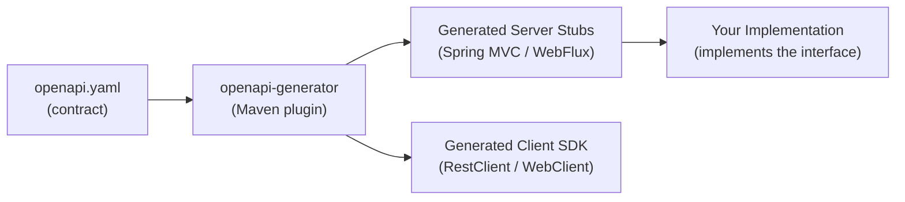

# OpenAPI Code Generation

[← Back to README](../README.md)

---

**Contract-first REST** development starts with an OpenAPI 3 spec, then generates server stubs and client SDKs automatically. This guarantees the spec and code stay in sync, eliminates handwritten boilerplate, and lets consumers generate clients in any language. The `openapi-generator-maven-plugin` integrates generation into the build cycle.



---

## OpenAPI 3 Specification

```yaml
# src/main/resources/openapi/orders-api.yaml
openapi: "3.0.3"
info:
  title: Orders API
  version: "1.0.0"

paths:
  /orders:
    get:
      operationId: listOrders
      summary: List all orders
      parameters:
        - name: status
          in: query
          schema:
            type: string
            enum: [PENDING, PROCESSING, SHIPPED, DELIVERED]
        - name: page
          in: query
          schema: { type: integer, default: 0 }
        - name: size
          in: query
          schema: { type: integer, default: 20 }
      responses:
        "200":
          description: Paginated list of orders
          content:
            application/json:
              schema:
                $ref: '#/components/schemas/OrderPage'

    post:
      operationId: placeOrder
      summary: Place a new order
      requestBody:
        required: true
        content:
          application/json:
            schema:
              $ref: '#/components/schemas/PlaceOrderRequest'
      responses:
        "201":
          description: Order created
          content:
            application/json:
              schema:
                $ref: '#/components/schemas/Order'
        "400":
          $ref: '#/components/responses/BadRequest'

  /orders/{orderId}:
    get:
      operationId: getOrder
      parameters:
        - name: orderId
          in: path
          required: true
          schema:
            type: string
            format: uuid
      responses:
        "200":
          content:
            application/json:
              schema:
                $ref: '#/components/schemas/Order'
        "404":
          $ref: '#/components/responses/NotFound'

components:
  schemas:
    Order:
      type: object
      required: [id, customerId, status, total]
      properties:
        id:          { type: string, format: uuid }
        customerId:  { type: string }
        status:      { type: string, enum: [PENDING, PROCESSING, SHIPPED, DELIVERED] }
        total:       { type: number, format: double }
        createdAt:   { type: string, format: date-time }

    PlaceOrderRequest:
      type: object
      required: [customerId, productId, quantity]
      properties:
        customerId:  { type: string }
        productId:   { type: string }
        quantity:    { type: integer, minimum: 1 }

    OrderPage:
      type: object
      properties:
        content:       { type: array, items: { $ref: '#/components/schemas/Order' } }
        totalElements: { type: integer }
        totalPages:    { type: integer }

  responses:
    BadRequest:
      description: Validation error
      content:
        application/problem+json:
          schema:
            $ref: '#/components/schemas/ProblemDetail'
    NotFound:
      description: Resource not found
      content:
        application/problem+json:
          schema:
            $ref: '#/components/schemas/ProblemDetail'

    ProblemDetail:
      type: object
      properties:
        title:  { type: string }
        status: { type: integer }
        detail: { type: string }
```

---

## Server Stub Generation (Spring MVC)

```xml
<!-- pom.xml -->
<plugin>
    <groupId>org.openapitools</groupId>
    <artifactId>openapi-generator-maven-plugin</artifactId>
    <version>7.4.0</version>
    <executions>
        <execution>
            <goals><goal>generate</goal></goals>
            <configuration>
                <inputSpec>${project.basedir}/src/main/resources/openapi/orders-api.yaml</inputSpec>
                <generatorName>spring</generatorName>
                <apiPackage>com.example.api</apiPackage>
                <modelPackage>com.example.api.model</modelPackage>
                <configOptions>
                    <interfaceOnly>true</interfaceOnly>        <!-- generate interface, not controller -->
                    <useSpringBoot3>true</useSpringBoot3>
                    <useTags>true</useTags>
                    <delegatePattern>false</delegatePattern>
                    <openApiNullable>false</openApiNullable>
                    <dateLibrary>java8</dateLibrary>
                    <useBeanValidation>true</useBeanValidation>
                    <performBeanValidation>true</performBeanValidation>
                </configOptions>
                <output>${project.build.directory}/generated-sources/openapi</output>
            </configuration>
        </execution>
    </executions>
</plugin>
```

---

## Implement the Generated Interface

```java
// Generated interface (do NOT edit — regenerated on every build)
// target/generated-sources/openapi/.../OrdersApi.java

// Your implementation
@RestController
@RequiredArgsConstructor
public class OrderController implements OrdersApi {

    private final OrderService orderService;
    private final OrderMapper orderMapper;

    @Override
    public ResponseEntity<Order> placeOrder(PlaceOrderRequest request) {
        com.example.domain.Order domain = orderService.place(
            new PlaceOrderCommand(
                request.getCustomerId(),
                request.getProductId(),
                request.getQuantity()));

        return ResponseEntity
            .created(URI.create("/orders/" + domain.getId()))
            .body(orderMapper.toApiModel(domain));
    }

    @Override
    public ResponseEntity<Order> getOrder(UUID orderId) {
        return orderService.findById(orderId)
            .map(orderMapper::toApiModel)
            .map(ResponseEntity::ok)
            .orElseThrow(() -> new OrderNotFoundException(orderId.toString()));
    }

    @Override
    public ResponseEntity<OrderPage> listOrders(String status, Integer page, Integer size) {
        Page<com.example.domain.Order> result =
            orderService.findAll(status, PageRequest.of(page, size));
        return ResponseEntity.ok(orderMapper.toApiPage(result));
    }
}
```

---

## Client SDK Generation (Java RestClient)

```xml
<execution>
    <id>generate-client</id>
    <goals><goal>generate</goal></goals>
    <configuration>
        <inputSpec>https://partner-api.example.com/openapi.yaml</inputSpec>
        <generatorName>java</generatorName>
        <library>restclient</library>   <!-- or 'webclient' for reactive -->
        <apiPackage>com.example.client.api</apiPackage>
        <modelPackage>com.example.client.model</modelPackage>
        <configOptions>
            <useJakartaEe>true</useJakartaEe>
            <dateLibrary>java8</dateLibrary>
            <openApiNullable>false</openApiNullable>
        </configOptions>
    </configuration>
</execution>
```

```java
// Use the generated client
@Configuration
public class PartnerClientConfig {

    @Bean
    public ApiClient apiClient() {
        ApiClient client = new ApiClient();
        client.setBasePath("https://partner-api.example.com");
        client.addDefaultHeader("Authorization", "Bearer " + apiKey);
        return client;
    }

    @Bean
    public InventoryApi inventoryApi(ApiClient client) {
        return new InventoryApi(client);
    }
}

@Service
@RequiredArgsConstructor
public class InventoryService {

    private final InventoryApi inventoryApi;

    public StockLevel checkStock(String productId) {
        return inventoryApi.getStock(productId);
    }
}
```

---

## Keep Generated Code Out of Version Control

```gitignore
# .gitignore
target/generated-sources/openapi/
```

Generated files are recreated on every `mvn generate-sources` — committing them causes merge conflicts.

---

## Validate the Spec in CI

```yaml
# .github/workflows/ci.yml
- name: Validate OpenAPI spec
  uses: char0n/swagger-editor-validate@v1
  with:
    definition-file: src/main/resources/openapi/orders-api.yaml

- name: Generate and compile
  run: mvn generate-sources compile
```

---

## OpenAPI Code Generation Summary

| Concept | Detail |
|---------|--------|
| Contract-first | Write the spec first; code generated from it — spec and code can't diverge |
| `interfaceOnly: true` | Generate interface + models, not a concrete controller |
| `generatorName: spring` | Generates Spring MVC `@RestController` interface |
| `generatorName: java` + `library: restclient` | Generates a `RestClient`-backed Java client |
| `generatorName: java` + `library: webclient` | Generates a reactive `WebClient`-backed Java client |
| `useBeanValidation: true` | Add `@NotNull`, `@Min`, etc. to model fields from schema constraints |
| `output` | Where generated sources land; point Maven source root here |
| `$ref: '#/components/schemas/...'` | Reuse schema definitions across multiple paths |
| `.gitignore` generated sources | Regenerated on build — never commit; add `target/generated-sources` to `.gitignore` |
| CI validation | Lint the spec with `swagger-editor-validate`; fail build on spec errors |

---

[← Back to README](../README.md)
