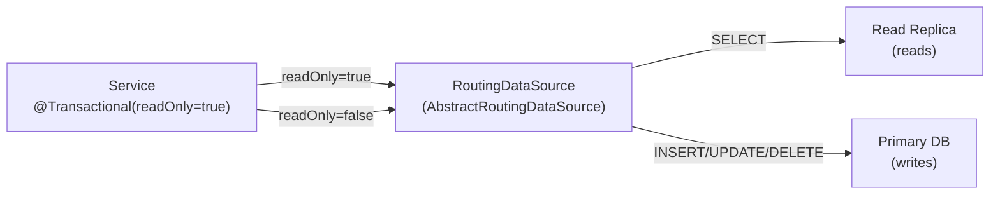

# Read Replicas & Multi-DataSource

[← Back to README](../README.md)

---

Routing read queries to a **read replica** reduces load on the primary and scales read throughput. Spring's `AbstractRoutingDataSource` selects the `DataSource` at runtime based on a thread-local key. Combined with `@Transactional(readOnly = true)` and `LazyConnectionDataSourceProxy`, reads go to the replica and writes go to the primary — transparently.



---

## DataSource Routing

```java
public class ReplicationRoutingDataSource extends AbstractRoutingDataSource {

    @Override
    protected Object determineCurrentLookupKey() {
        boolean readOnly = TransactionSynchronizationManager.isCurrentTransactionReadOnly();
        return readOnly ? "replica" : "primary";
    }
}
```

---

## Configuration

```java
@Configuration
public class DataSourceConfig {

    @Bean
    @ConfigurationProperties("spring.datasource.primary")
    public DataSourceProperties primaryProperties() {
        return new DataSourceProperties();
    }

    @Bean
    @ConfigurationProperties("spring.datasource.replica")
    public DataSourceProperties replicaProperties() {
        return new DataSourceProperties();
    }

    @Bean
    public DataSource primaryDataSource() {
        return primaryProperties().initializeDataSourceBuilder()
            .type(HikariDataSource.class)
            .build();
    }

    @Bean
    public DataSource replicaDataSource() {
        return replicaProperties().initializeDataSourceBuilder()
            .type(HikariDataSource.class)
            .build();
    }

    @Bean
    public DataSource routingDataSource(
            @Qualifier("primaryDataSource") DataSource primary,
            @Qualifier("replicaDataSource") DataSource replica) {

        ReplicationRoutingDataSource routing = new ReplicationRoutingDataSource();
        routing.setTargetDataSources(Map.of(
            "primary", primary,
            "replica", replica));
        routing.setDefaultTargetDataSource(primary);
        routing.afterPropertiesSet();
        return routing;
    }

    // LazyConnectionDataSourceProxy defers connection acquisition until the first SQL
    // statement — this allows routing AFTER @Transactional sets the readOnly flag
    @Bean
    @Primary
    public DataSource dataSource(@Qualifier("routingDataSource") DataSource routing) {
        return new LazyConnectionDataSourceProxy(routing);
    }
}
```

```yaml
spring:
  datasource:
    primary:
      url: jdbc:postgresql://primary-db:5432/orders
      username: app
      password: ${DB_PRIMARY_PASSWORD}
      hikari:
        maximum-pool-size: 20
        pool-name: primary-pool
    replica:
      url: jdbc:postgresql://replica-db:5432/orders
      username: app_readonly
      password: ${DB_REPLICA_PASSWORD}
      hikari:
        maximum-pool-size: 30   # replicas handle more reads
        pool-name: replica-pool
        read-only: true
```

---

## Service Layer — Transparent Routing

```java
@Service
@RequiredArgsConstructor
public class OrderService {

    private final OrderRepository orderRepository;

    // readOnly = true → replica
    @Transactional(readOnly = true)
    public Optional<Order> findById(UUID id) {
        return orderRepository.findById(id);
    }

    @Transactional(readOnly = true)
    public Page<Order> findAll(Pageable pageable) {
        return orderRepository.findAll(pageable);
    }

    // readOnly = false (default) → primary
    @Transactional
    public Order place(PlaceOrderCommand cmd) {
        return orderRepository.save(Order.create(cmd));
    }

    @Transactional
    public Order updateStatus(UUID id, String status) {
        Order order = orderRepository.findById(id).orElseThrow();
        order.setStatus(status);
        return orderRepository.save(order);
    }
}
```

---

## Multiple Independent DataSources

For multi-tenancy or heterogeneous databases (orders on PostgreSQL, legacy data on MySQL):

```java
@Configuration
@EnableJpaRepositories(
    basePackages = "com.example.orders.repository",
    entityManagerFactoryRef = "ordersEntityManagerFactory",
    transactionManagerRef = "ordersTransactionManager")
public class OrdersDataSourceConfig {

    @Bean
    @ConfigurationProperties("spring.datasource.orders")
    public DataSourceProperties ordersDataSourceProperties() {
        return new DataSourceProperties();
    }

    @Bean
    public DataSource ordersDataSource() {
        return ordersDataSourceProperties()
            .initializeDataSourceBuilder().build();
    }

    @Bean
    public LocalContainerEntityManagerFactoryBean ordersEntityManagerFactory(
            @Qualifier("ordersDataSource") DataSource ds,
            JpaVendorAdapter jpaVendorAdapter) {

        LocalContainerEntityManagerFactoryBean em =
            new LocalContainerEntityManagerFactoryBean();
        em.setDataSource(ds);
        em.setPackagesToScan("com.example.orders.domain");
        em.setJpaVendorAdapter(jpaVendorAdapter);
        return em;
    }

    @Bean
    public PlatformTransactionManager ordersTransactionManager(
            @Qualifier("ordersEntityManagerFactory")
            EntityManagerFactory emf) {
        return new JpaTransactionManager(emf);
    }
}

@Configuration
@EnableJpaRepositories(
    basePackages = "com.example.inventory.repository",
    entityManagerFactoryRef = "inventoryEntityManagerFactory",
    transactionManagerRef = "inventoryTransactionManager")
public class InventoryDataSourceConfig {
    // Mirror of OrdersDataSourceConfig but for inventory DB
}
```

---

## Observing Replica Lag

```java
@Component
@RequiredArgsConstructor
@Slf4j
public class ReplicaLagMonitor {

    private final DataSource primaryDataSource;
    private final DataSource replicaDataSource;
    private final MeterRegistry meterRegistry;

    @Scheduled(fixedRate = 30_000)
    public void checkReplicaLag() {
        try {
            long primaryLsn = queryLsn(primaryDataSource,
                "SELECT pg_current_wal_lsn() - '0/0'::pg_lsn");
            long replicaLsn = queryLsn(replicaDataSource,
                "SELECT pg_last_wal_replay_lsn() - '0/0'::pg_lsn");

            long lagBytes = primaryLsn - replicaLsn;
            meterRegistry.gauge("db.replica.lag.bytes", lagBytes);

            if (lagBytes > 50_000_000L) {  // 50 MB lag
                log.warn("Replica lag is high: {} bytes", lagBytes);
            }
        } catch (Exception e) {
            log.error("Failed to check replica lag", e);
        }
    }

    private long queryLsn(DataSource ds, String sql) throws Exception {
        try (Connection conn = ds.getConnection();
             PreparedStatement stmt = conn.prepareStatement(sql);
             ResultSet rs = stmt.executeQuery()) {
            return rs.next() ? rs.getLong(1) : 0;
        }
    }
}
```

---

## Fallback — Direct to Primary on Replica Failure

```java
public class ReplicationRoutingDataSource extends AbstractRoutingDataSource {

    private final DataSource primary;
    private final AtomicBoolean replicaHealthy = new AtomicBoolean(true);

    @Override
    protected Object determineCurrentLookupKey() {
        boolean readOnly = TransactionSynchronizationManager.isCurrentTransactionReadOnly();
        if (readOnly && replicaHealthy.get()) {
            return "replica";
        }
        return "primary";   // fall back to primary if replica is down
    }

    @Scheduled(fixedRate = 10_000)
    public void healthCheckReplica() {
        try (Connection conn = getResolvedDataSources().get("replica")
                .getConnection()) {
            replicaHealthy.set(conn.isValid(2));
        } catch (Exception e) {
            log.warn("Replica health check failed — routing all reads to primary");
            replicaHealthy.set(false);
        }
    }
}
```

---

## Multi-DataSource Summary

| Concept | Detail |
|---------|--------|
| `AbstractRoutingDataSource` | Selects a `DataSource` per request using `determineCurrentLookupKey()` |
| `LazyConnectionDataSourceProxy` | Defers connection acquisition so the transaction's `readOnly` flag is known at routing time |
| `TransactionSynchronizationManager.isCurrentTransactionReadOnly()` | `true` inside `@Transactional(readOnly = true)` |
| `@Transactional(readOnly = true)` | Signal that all queries are reads — route to replica |
| `hikari.read-only: true` | Tell HikariCP to mark connections as read-only at the JDBC level |
| `@EnableJpaRepositories(entityManagerFactoryRef)` | Bind a repository package to a specific `EntityManagerFactory` and `DataSource` |
| Replica lag monitoring | Query `pg_current_wal_lsn()` vs `pg_last_wal_replay_lsn()` and expose as a gauge |
| Health-check fallback | Poll replica connectivity; route reads to primary on failure |
| `@Primary DataSource` | Mark the routing proxy as the default so Spring Boot auto-config picks it up |
| `@ConfigurationProperties("spring.datasource.primary")` | Bind separate YAML blocks to separate `DataSourceProperties` beans |

---

[← Back to README](../README.md)
