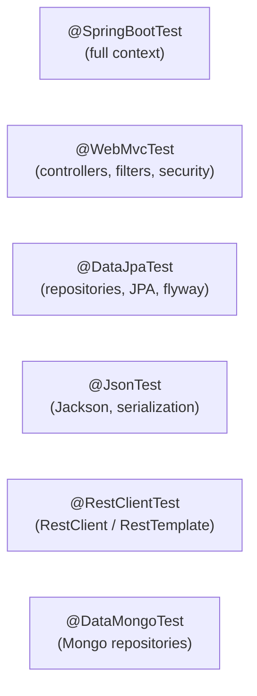

# Spring Boot Testing Slices

[← Back to README](../README.md)

---

Test slices load only the part of the Spring context relevant to what you're testing. `@WebMvcTest` wires controllers and filters; `@DataJpaTest` wires JPA repositories and an in-memory DB; `@JsonTest` wires Jackson. Each slice starts in milliseconds compared to a full `@SpringBootTest` context.



---

## @WebMvcTest — Controller Layer

```java
@WebMvcTest(OrderController.class)   // only loads OrderController + MVC infrastructure
class OrderControllerTest {

    @Autowired MockMvc mockMvc;
    @Autowired ObjectMapper objectMapper;

    // Mock all service-layer beans not loaded by the slice
    @MockBean OrderService orderService;
    @MockBean OrderMapper  orderMapper;

    @Test
    void getOrder_returns200() throws Exception {
        Order order = new Order(UUID.randomUUID(), "cust-1", "PENDING", BigDecimal.TEN);
        when(orderService.findById(any())).thenReturn(Optional.of(order));

        mockMvc.perform(get("/orders/{id}", order.getId())
                .accept(MediaType.APPLICATION_JSON))
            .andExpect(status().isOk())
            .andExpect(jsonPath("$.status").value("PENDING"))
            .andExpect(jsonPath("$.total").value(10.0));
    }

    @Test
    void placeOrder_returns422OnValidationFailure() throws Exception {
        mockMvc.perform(post("/orders")
                .contentType(MediaType.APPLICATION_JSON)
                .content("{}"))
            .andExpect(status().isBadRequest())
            .andExpect(jsonPath("$.violations").isArray());
    }

    @Test
    void getOrder_returns404WhenNotFound() throws Exception {
        when(orderService.findById(any())).thenReturn(Optional.empty());

        mockMvc.perform(get("/orders/{id}", UUID.randomUUID()))
            .andExpect(status().isNotFound())
            .andExpect(content().contentType("application/problem+json"));
    }
}
```

### With Spring Security

```java
@WebMvcTest(OrderController.class)
@Import(SecurityConfig.class)   // import security config explicitly
class SecuredOrderControllerTest {

    @Autowired MockMvc mockMvc;
    @MockBean  OrderService orderService;
    @MockBean  JwtDecoder jwtDecoder;   // mock any security dependencies

    @Test
    @WithMockUser(roles = "USER")
    void authenticated_canGetOrder() throws Exception {
        mockMvc.perform(get("/orders/{id}", UUID.randomUUID()))
            .andExpect(status().isNotFound());   // 404, not 403
    }

    @Test
    void unauthenticated_gets401() throws Exception {
        mockMvc.perform(get("/orders/{id}", UUID.randomUUID()))
            .andExpect(status().isUnauthorized());
    }
}
```

---

## @DataJpaTest — Repository Layer

```java
@DataJpaTest   // loads JPA repositories, entity scanning, H2 or Testcontainers
@AutoConfigureTestDatabase(replace = AutoConfigureTestDatabase.Replace.NONE)  // use real DB
@Testcontainers
class OrderRepositoryTest {

    @Container
    @ServiceConnection
    static PostgreSQLContainer<?> postgres = new PostgreSQLContainer<>("postgres:16-alpine");

    @Autowired TestEntityManager em;
    @Autowired OrderRepository  orderRepository;

    @Test
    void findByCustomerId_returnsOrders() {
        Order order = new Order(null, "cust-1", "PENDING", BigDecimal.TEN, Instant.now());
        em.persistAndFlush(order);
        em.clear();   // evict from 1st-level cache

        List<Order> found = orderRepository.findByCustomerId("cust-1");

        assertThat(found).hasSize(1);
        assertThat(found.get(0).getCustomerId()).isEqualTo("cust-1");
    }

    @Test
    void findByStatus_withPaging_returnsSortedPage() {
        IntStream.range(0, 5).forEach(i ->
            em.persistAndFlush(new Order(null, "cust-" + i, "PENDING",
                BigDecimal.valueOf(i * 10.0), Instant.now())));
        em.clear();

        Page<Order> page = orderRepository.findByStatus(
            "PENDING", PageRequest.of(0, 3, Sort.by("total").descending()));

        assertThat(page.getTotalElements()).isEqualTo(5);
        assertThat(page.getContent()).hasSize(3);
        assertThat(page.getContent().get(0).getTotal())
            .isGreaterThan(page.getContent().get(1).getTotal());
    }

    @Test
    void save_assignsId() {
        Order saved = orderRepository.save(
            new Order(null, "cust-1", "PENDING", BigDecimal.ONE, Instant.now()));
        assertThat(saved.getId()).isNotNull();
    }
}
```

---

## @JsonTest — Serialization

```java
@JsonTest   // loads Jackson ObjectMapper with auto-configured modules
class OrderJsonTest {

    @Autowired JacksonTester<Order> orderTester;
    @Autowired JacksonTester<List<Order>> orderListTester;

    @Test
    void serialize_order() throws IOException {
        Order order = new Order(
            UUID.fromString("abc-123"), "cust-1", "PENDING",
            new BigDecimal("99.99"), Instant.parse("2024-01-15T10:00:00Z"));

        JsonContent<Order> json = orderTester.write(order);

        assertThat(json).extractingJsonPathStringValue("$.id").isEqualTo("abc-123");
        assertThat(json).extractingJsonPathStringValue("$.status").isEqualTo("PENDING");
        assertThat(json).extractingJsonPathNumberValue("$.total").isEqualTo(99.99);
        assertThat(json).hasJsonPathStringValue("$.createdAt");
        // Verify null fields are excluded
        assertThat(json).doesNotHaveJsonPath("$.internalNotes");
    }

    @Test
    void deserialize_order() throws IOException {
        String json = """
            {
              "customerId": "cust-1",
              "status": "PENDING",
              "total": 99.99
            }
            """;

        Order order = orderTester.parseObject(json);

        assertThat(order.getCustomerId()).isEqualTo("cust-1");
        assertThat(order.getTotal()).isEqualByComparingTo("99.99");
    }
}
```

---

## @RestClientTest — HTTP Clients

```java
@RestClientTest(InventoryClient.class)   // loads the client bean + mock server
class InventoryClientTest {

    @Autowired InventoryClient inventoryClient;
    @Autowired MockRestServiceServer server;   // auto-configured mock

    @Test
    void checkStock_returnsStockLevel() {
        server.expect(requestTo("/inventory/products/p1/stock"))
            .andExpect(method(HttpMethod.GET))
            .andRespond(withSuccess(
                """
                {"productId":"p1","available":42}
                """, MediaType.APPLICATION_JSON));

        StockLevel stock = inventoryClient.checkStock("p1");

        assertThat(stock.available()).isEqualTo(42);
        server.verify();
    }

    @Test
    void checkStock_throwsOnServerError() {
        server.expect(requestTo("/inventory/products/bad/stock"))
            .andRespond(withServerError());

        assertThatThrownBy(() -> inventoryClient.checkStock("bad"))
            .isInstanceOf(RestClientException.class);
    }
}
```

---

## @DataMongoTest — MongoDB Repositories

```java
@DataMongoTest
@Testcontainers
class ProductRepositoryTest {

    @Container
    @ServiceConnection
    static MongoDBContainer mongo = new MongoDBContainer("mongo:7");

    @Autowired ProductRepository productRepository;

    @BeforeEach
    void setUp() {
        productRepository.deleteAll();
    }

    @Test
    void findByCategory_returnsMatchingProducts() {
        productRepository.saveAll(List.of(
            new Product(null, "Widget A", "electronics", 29.99),
            new Product(null, "Widget B", "electronics", 49.99),
            new Product(null, "Book C",   "books",       9.99)));

        List<Product> electronics = productRepository.findByCategory("electronics");

        assertThat(electronics).hasSize(2)
            .allMatch(p -> "electronics".equals(p.getCategory()));
    }
}
```

---

## Slice Overview

| Annotation | What's loaded | What to `@MockBean` |
|------------|--------------|---------------------|
| `@WebMvcTest` | Controllers, `@ControllerAdvice`, filters, `WebMvcConfigurer` | Services, repositories |
| `@DataJpaTest` | JPA repositories, `EntityManager`, Flyway/Liquibase | Nothing JPA-related |
| `@JsonTest` | `ObjectMapper`, `JacksonTester`, JSON modules | Nothing |
| `@RestClientTest` | `RestClient`/`RestTemplate` beans, `MockRestServiceServer` | Downstream dependencies |
| `@DataMongoTest` | Mongo repositories, `MongoTemplate` | Services |
| `@DataRedisTest` | Redis repositories, `RedisTemplate` | Services |
| `@WebFluxTest` | WebFlux controllers, `WebTestClient` | Services, repositories |
| `@SpringBootTest` | Full application context | Only external systems |

---

## Shared Test Configuration

```java
// Reuse across multiple slice tests
@TestConfiguration
public class TestSecurityConfig {

    @Bean
    public SecurityFilterChain testSecurityFilterChain(HttpSecurity http) throws Exception {
        return http.authorizeHttpRequests(a -> a.anyRequest().permitAll()).build();
    }
}

@WebMvcTest(OrderController.class)
@Import(TestSecurityConfig.class)
class OrderControllerNoSecurityTest { ... }
```

---

## Testing Slices Summary

| Concept | Detail |
|---------|--------|
| `@WebMvcTest(Ctrl.class)` | Only loads the named controller + MVC infra; fast |
| `@MockBean` | Creates a Mockito mock and registers it in the slice context |
| `MockMvc` | Perform HTTP requests against the controller without a running server |
| `@DataJpaTest` | Loads JPA layer only; wraps each test in a rollback transaction by default |
| `TestEntityManager` | JPA helper for setting up test data without going through the repository |
| `Replace.NONE` | Use the real configured DB (with Testcontainers) instead of H2 |
| `@JsonTest` | Only loads Jackson; use `JacksonTester<T>` for fluent JSON assertions |
| `@RestClientTest` | Loads the target client bean + `MockRestServiceServer` for stubbing |
| `@DataMongoTest` | Loads MongoDB repositories; combines well with `MongoDBContainer` |
| `@WebFluxTest` | Same as `@WebMvcTest` but for reactive controllers; wires `WebTestClient` |

---

[← Back to README](../README.md)
