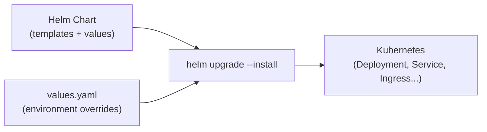

# Helm Charts

[← Back to README](../README.md)

---

**Helm** is the package manager for Kubernetes. A **chart** bundles all the Kubernetes manifests for an application into a single versioned artifact. **Values** parameterise the chart; `helm upgrade --install` makes deployments idempotent. Helm is the standard way to ship Java microservices to Kubernetes in production.



---

## Chart Structure

```
order-service/
├── Chart.yaml              # chart metadata
├── values.yaml             # default values
├── values-prod.yaml        # production overrides
├── templates/
│   ├── _helpers.tpl        # named templates (macros)
│   ├── deployment.yaml
│   ├── service.yaml
│   ├── ingress.yaml
│   ├── configmap.yaml
│   ├── secret.yaml
│   ├── hpa.yaml
│   └── NOTES.txt           # printed after install
└── charts/                 # sub-charts (dependencies)
```

---

## Chart.yaml

```yaml
apiVersion: v2
name: order-service
description: Order microservice Helm chart
type: application
version: 1.3.0           # chart version — bump on chart changes
appVersion: "2.4.1"      # application version (Docker image tag)
dependencies:
  - name: postgresql
    version: "14.3.3"
    repository: https://charts.bitnami.com/bitnami
    condition: postgresql.enabled
```

---

## values.yaml

```yaml
replicaCount: 2

image:
  repository: ghcr.io/example/order-service
  tag: ""          # defaults to Chart.appVersion
  pullPolicy: IfNotPresent

service:
  type: ClusterIP
  port: 8080

ingress:
  enabled: true
  className: nginx
  host: orders.example.com
  tls: true
  tlsSecret: orders-tls

resources:
  requests:
    cpu: 250m
    memory: 512Mi
  limits:
    cpu: 1000m
    memory: 1Gi

autoscaling:
  enabled: true
  minReplicas: 2
  maxReplicas: 10
  targetCPUUtilizationPercentage: 70

env:
  SPRING_PROFILES_ACTIVE: prod
  DB_HOST: postgres-primary

secrets:
  dbPassword: ""        # injected at deploy time — never committed

postgresql:
  enabled: false        # use external postgres in production

livenessProbe:
  httpGet:
    path: /actuator/health/liveness
    port: 8080
  initialDelaySeconds: 30
  periodSeconds: 10

readinessProbe:
  httpGet:
    path: /actuator/health/readiness
    port: 8080
  initialDelaySeconds: 20
  periodSeconds: 5
```

---

## templates/deployment.yaml

```yaml
apiVersion: apps/v1
kind: Deployment
metadata:
  name: {{ include "order-service.fullname" . }}
  labels:
    {{- include "order-service.labels" . | nindent 4 }}
spec:
  {{- if not .Values.autoscaling.enabled }}
  replicas: {{ .Values.replicaCount }}
  {{- end }}
  selector:
    matchLabels:
      {{- include "order-service.selectorLabels" . | nindent 6 }}
  template:
    metadata:
      labels:
        {{- include "order-service.selectorLabels" . | nindent 8 }}
      annotations:
        checksum/config: {{ include (print $.Template.BasePath "/configmap.yaml") . | sha256sum }}
    spec:
      containers:
        - name: {{ .Chart.Name }}
          image: "{{ .Values.image.repository }}:{{ .Values.image.tag | default .Chart.AppVersion }}"
          imagePullPolicy: {{ .Values.image.pullPolicy }}
          ports:
            - containerPort: {{ .Values.service.port }}
          env:
            {{- range $key, $value := .Values.env }}
            - name: {{ $key }}
              value: {{ $value | quote }}
            {{- end }}
            - name: DB_PASSWORD
              valueFrom:
                secretKeyRef:
                  name: {{ include "order-service.fullname" . }}-secrets
                  key: dbPassword
          livenessProbe:
            {{- toYaml .Values.livenessProbe | nindent 12 }}
          readinessProbe:
            {{- toYaml .Values.readinessProbe | nindent 12 }}
          resources:
            {{- toYaml .Values.resources | nindent 12 }}
```

---

## templates/_helpers.tpl

```
{{/*
Expand the name of the chart.
*/}}
{{- define "order-service.name" -}}
{{- default .Chart.Name .Values.nameOverride | trunc 63 | trimSuffix "-" }}
{{- end }}

{{/*
Full name with release prefix.
*/}}
{{- define "order-service.fullname" -}}
{{- printf "%s-%s" .Release.Name (include "order-service.name" .) | trunc 63 | trimSuffix "-" }}
{{- end }}

{{/*
Common labels.
*/}}
{{- define "order-service.labels" -}}
helm.sh/chart: {{ .Chart.Name }}-{{ .Chart.Version }}
{{ include "order-service.selectorLabels" . }}
app.kubernetes.io/version: {{ .Chart.AppVersion | quote }}
app.kubernetes.io/managed-by: {{ .Release.Service }}
{{- end }}

{{/*
Selector labels.
*/}}
{{- define "order-service.selectorLabels" -}}
app.kubernetes.io/name: {{ include "order-service.name" . }}
app.kubernetes.io/instance: {{ .Release.Name }}
{{- end }}
```

---

## templates/hpa.yaml

```yaml
{{- if .Values.autoscaling.enabled }}
apiVersion: autoscaling/v2
kind: HorizontalPodAutoscaler
metadata:
  name: {{ include "order-service.fullname" . }}
spec:
  scaleTargetRef:
    apiVersion: apps/v1
    kind: Deployment
    name: {{ include "order-service.fullname" . }}
  minReplicas: {{ .Values.autoscaling.minReplicas }}
  maxReplicas: {{ .Values.autoscaling.maxReplicas }}
  metrics:
    - type: Resource
      resource:
        name: cpu
        target:
          type: Utilization
          averageUtilization: {{ .Values.autoscaling.targetCPUUtilizationPercentage }}
{{- end }}
```

---

## Helm CLI Commands

```bash
# Add a chart repository
helm repo add bitnami https://charts.bitnami.com/bitnami
helm repo update

# Install or upgrade (idempotent)
helm upgrade --install order-service ./order-service \
  --namespace production \
  --create-namespace \
  --values values-prod.yaml \
  --set image.tag=2.4.1 \
  --set secrets.dbPassword="$(vault read -field=password secret/db)" \
  --wait \
  --timeout 5m

# Preview what would be deployed
helm template order-service ./order-service --values values-prod.yaml

# Diff against current release (requires helm-diff plugin)
helm diff upgrade order-service ./order-service --values values-prod.yaml

# List releases
helm list -n production

# Rollback to previous release
helm rollback order-service 1 -n production

# Uninstall
helm uninstall order-service -n production

# Lint the chart
helm lint ./order-service --values values-prod.yaml

# Package the chart
helm package ./order-service --version 1.3.0

# Push to OCI registry
helm push order-service-1.3.0.tgz oci://ghcr.io/example/charts
```

---

## CI/CD Integration

```yaml
# .github/workflows/deploy.yml
- name: Deploy with Helm
  run: |
    helm upgrade --install order-service ./helm/order-service \
      --namespace ${{ env.NAMESPACE }} \
      --values helm/order-service/values-${{ env.ENV }}.yaml \
      --set image.tag=${{ github.sha }} \
      --set secrets.dbPassword=${{ secrets.DB_PASSWORD }} \
      --atomic \       # rollback on failure
      --timeout 10m \
      --wait
```

---

## Helm Summary

| Concept | Detail |
|---------|--------|
| `Chart.yaml` | Chart name, version, `appVersion` (image tag default), and dependencies |
| `values.yaml` | Default values; override with `-f values-prod.yaml` or `--set key=val` |
| `{{ .Values.x }}` | Reference a value in a template |
| `{{ include "name" . }}` | Call a named template defined in `_helpers.tpl` |
| `{{- if .Values.x }}` / `{{- end }}` | Conditional block — renders only when value is truthy |
| `helm upgrade --install` | Idempotent: installs if not present, upgrades if already installed |
| `--atomic` | Roll back automatically if the upgrade fails |
| `--wait` | Block until all pods are ready; pairs with `--timeout` |
| `helm rollback` | Revert to a previous release revision |
| `checksum/config` annotation | Force pod restart when ConfigMap changes (`sha256sum`) |

---

[← Back to README](../README.md)
