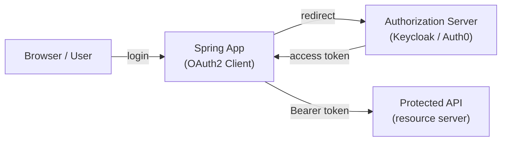

# Spring Security OAuth2 Client

[← Back to README](../README.md)

---

Spring Security's **OAuth2 Client** support lets a service act as an OAuth2 client: obtaining tokens from an authorization server and using them to call protected downstream APIs. This is distinct from the *resource server* role (validating incoming tokens) and the *authorization server* role (issuing tokens). Key use cases: token relay in a gateway, machine-to-machine (client credentials), and user-delegated API calls.



---

## Dependency

```xml
<dependency>
    <groupId>org.springframework.boot</groupId>
    <artifactId>spring-boot-starter-oauth2-client</artifactId>
</dependency>
<dependency>
    <groupId>org.springframework.boot</groupId>
    <artifactId>spring-boot-starter-webflux</artifactId>
</dependency>
```

---

## Client Credentials — Machine-to-Machine

Service-to-service calls with no user session:

```yaml
spring:
  security:
    oauth2:
      client:
        registration:
          inventory-service:
            provider: keycloak
            client-id: order-service
            client-secret: ${INVENTORY_CLIENT_SECRET}
            authorization-grant-type: client_credentials
            scope: inventory:read,inventory:write
        provider:
          keycloak:
            token-uri: https://auth.example.com/realms/app/protocol/openid-connect/token
```

```java
@Configuration
public class WebClientConfig {

    // WebClient that automatically fetches and caches client_credentials tokens
    @Bean
    public WebClient inventoryWebClient(OAuth2AuthorizedClientManager authorizedClientManager) {
        ServletOAuth2AuthorizedClientExchangeFilterFunction oauth2 =
            new ServletOAuth2AuthorizedClientExchangeFilterFunction(authorizedClientManager);
        oauth2.setDefaultClientRegistrationId("inventory-service");

        return WebClient.builder()
            .baseUrl("https://inventory.internal")
            .apply(oauth2.oauth2Configuration())
            .build();
    }

    @Bean
    public OAuth2AuthorizedClientManager authorizedClientManager(
            ClientRegistrationRepository clientRegistrationRepository,
            OAuth2AuthorizedClientRepository authorizedClientRepository) {

        OAuth2AuthorizedClientProvider provider =
            OAuth2AuthorizedClientProviderBuilder.builder()
                .clientCredentials()
                .refreshToken()
                .build();

        DefaultOAuth2AuthorizedClientManager manager =
            new DefaultOAuth2AuthorizedClientManager(
                clientRegistrationRepository, authorizedClientRepository);
        manager.setAuthorizedClientProvider(provider);
        return manager;
    }
}

@Service
@RequiredArgsConstructor
public class InventoryService {

    private final WebClient inventoryWebClient;

    public StockLevel checkStock(String productId) {
        return inventoryWebClient.get()
            .uri("/stock/{productId}", productId)
            .retrieve()
            .bodyToMono(StockLevel.class)
            .block();
    }
}
```

---

## Authorization Code Flow — User Login

```yaml
spring:
  security:
    oauth2:
      client:
        registration:
          keycloak:
            client-id: my-app
            client-secret: ${CLIENT_SECRET}
            authorization-grant-type: authorization_code
            redirect-uri: "{baseUrl}/login/oauth2/code/{registrationId}"
            scope: openid,profile,email,roles
        provider:
          keycloak:
            issuer-uri: https://auth.example.com/realms/app
```

```java
@Configuration
@EnableWebSecurity
public class OAuth2ClientSecurityConfig {

    @Bean
    public SecurityFilterChain filterChain(HttpSecurity http) throws Exception {
        return http
            .authorizeHttpRequests(auth -> auth
                .requestMatchers("/public/**").permitAll()
                .anyRequest().authenticated())
            .oauth2Login(login -> login
                .defaultSuccessUrl("/dashboard")
                .userInfoEndpoint(info -> info
                    .userService(customOAuth2UserService())))
            .oauth2Client(Customizer.withDefaults())
            .build();
    }
}
```

---

## Token Relay — Gateway Forwards User Token

In a Spring Cloud Gateway, forward the user's access token to downstream services:

```yaml
spring:
  cloud:
    gateway:
      routes:
        - id: order-service
          uri: http://order-service
          predicates:
            - Path=/api/orders/**
          filters:
            - TokenRelay=   # forwards Authorization header to downstream
```

```java
@Configuration
public class GatewaySecurityConfig {

    @Bean
    public SecurityWebFilterChain springSecurityFilterChain(ServerHttpSecurity http) {
        return http
            .oauth2Login(Customizer.withDefaults())
            .oauth2Client(Customizer.withDefaults())
            .build();
    }
}
```

---

## Accessing the Token Programmatically

```java
@RestController
@RequiredArgsConstructor
public class OrderController {

    private final OAuth2AuthorizedClientService authorizedClientService;

    @GetMapping("/token-info")
    public Map<String, Object> tokenInfo(
            @RegisteredOAuth2AuthorizedClient("keycloak")
            OAuth2AuthorizedClient authorizedClient) {

        OAuth2AccessToken token = authorizedClient.getAccessToken();
        return Map.of(
            "token",      token.getTokenValue().substring(0, 20) + "...",
            "expiresAt",  token.getExpiresAt(),
            "scopes",     token.getScopes());
    }

    @GetMapping("/user-info")
    public Map<String, Object> userInfo(
            @AuthenticationPrincipal OidcUser oidcUser) {
        return Map.of(
            "sub",   oidcUser.getSubject(),
            "email", oidcUser.getEmail(),
            "name",  oidcUser.getFullName(),
            "roles", oidcUser.getClaimAsStringList("roles"));
    }
}
```

---

## Reactive Client (WebFlux)

```java
@Configuration
public class ReactiveWebClientConfig {

    @Bean
    public WebClient inventoryWebClient(
            ReactiveOAuth2AuthorizedClientManager authorizedClientManager) {

        ServerOAuth2AuthorizedClientExchangeFilterFunction oauth2 =
            new ServerOAuth2AuthorizedClientExchangeFilterFunction(authorizedClientManager);
        oauth2.setDefaultClientRegistrationId("inventory-service");

        return WebClient.builder()
            .baseUrl("https://inventory.internal")
            .filter(oauth2)
            .build();
    }

    @Bean
    public ReactiveOAuth2AuthorizedClientManager reactiveAuthorizedClientManager(
            ReactiveClientRegistrationRepository clientRegistrationRepository,
            ServerOAuth2AuthorizedClientRepository authorizedClientRepository) {

        ReactiveOAuth2AuthorizedClientProvider provider =
            ReactiveOAuth2AuthorizedClientProviderBuilder.builder()
                .clientCredentials()
                .refreshToken()
                .build();

        DefaultReactiveOAuth2AuthorizedClientManager manager =
            new DefaultReactiveOAuth2AuthorizedClientManager(
                clientRegistrationRepository, authorizedClientRepository);
        manager.setAuthorizedClientProvider(provider);
        return manager;
    }
}
```

---

## Token Refresh and Persistence

```java
@Configuration
public class TokenPersistenceConfig {

    // Persist tokens in Redis (survives restart, shareable across instances)
    @Bean
    public OAuth2AuthorizedClientRepository authorizedClientRepository(
            RedisTemplate<String, Object> redisTemplate) {
        return new HttpSessionOAuth2AuthorizedClientRepository();
        // Replace with custom Redis-backed implementation for clustered deployments
    }

    // Or use JDBC for persistence
    @Bean
    public JdbcOAuth2AuthorizedClientService jdbcAuthorizedClientService(
            JdbcOperations jdbc,
            ClientRegistrationRepository clientRegistrationRepository) {
        return new JdbcOAuth2AuthorizedClientService(jdbc, clientRegistrationRepository);
    }
}
```

---

## Testing

```java
@SpringBootTest
@AutoConfigureMockMvc
class OAuth2ClientTest {

    @Autowired MockMvc mockMvc;

    @Test
    void authenticatedUser_canAccessDashboard() throws Exception {
        mockMvc.perform(get("/dashboard")
                .with(oidcLogin()
                    .idToken(token -> token.claim("email", "user@example.com"))
                    .authorities(new SimpleGrantedAuthority("ROLE_USER"))))
            .andExpect(status().isOk());
    }

    @Test
    void withMockOAuth2Client_callsDownstream() throws Exception {
        mockMvc.perform(get("/orders")
                .with(oauth2Client("inventory-service")
                    .accessToken(new OAuth2AccessToken(
                        BEARER, "test-token", null,
                        Instant.now().plusSeconds(300)))))
            .andExpect(status().isOk());
    }
}
```

---

## OAuth2 Client Summary

| Concept | Detail |
|---------|--------|
| `client_credentials` grant | Machine-to-machine; no user session; service fetches token automatically |
| `authorization_code` grant | User-facing login; redirects to AS, receives code, exchanges for tokens |
| `TokenRelay=` filter | Spring Cloud Gateway forwards the user's Bearer token to downstream |
| `OAuth2AuthorizedClientManager` | Orchestrates token fetching, caching, and refresh |
| `ServletOAuth2AuthorizedClientExchangeFilterFunction` | `WebClient` filter that injects `Authorization: Bearer` header |
| `@RegisteredOAuth2AuthorizedClient` | Inject the `OAuth2AuthorizedClient` for a named registration into a controller |
| `@AuthenticationPrincipal OidcUser` | Access the OIDC user claims (email, name, roles) |
| `JdbcOAuth2AuthorizedClientService` | Persist tokens to DB — survive restarts and work across cluster nodes |
| `oidcLogin()` / `oauth2Client()` | MockMvc request post-processors for testing OAuth2 flows |
| `issuer-uri` | Spring fetches OIDC discovery document automatically from `/.well-known/openid-configuration` |

---

[← Back to README](../README.md)
