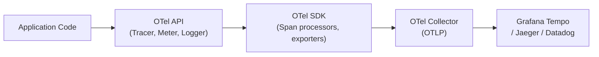

# OpenTelemetry Manual Instrumentation

[← Back to README](../README.md)

---

The OpenTelemetry Java agent auto-instruments popular frameworks, but custom business operations need **manual instrumentation**: creating spans, setting attributes, recording metrics, and propagating context across threads. The OTel API is the stable façade; the SDK provides the implementation wired by Spring Boot's `spring-boot-starter-opentelemetry`.



---

## Dependencies

```xml
<!-- Spring Boot Actuator + Micrometer OTel bridge -->
<dependency>
    <groupId>org.springframework.boot</groupId>
    <artifactId>spring-boot-starter-actuator</artifactId>
</dependency>
<dependency>
    <groupId>io.micrometer</groupId>
    <artifactId>micrometer-tracing-bridge-otel</artifactId>
</dependency>
<dependency>
    <groupId>io.opentelemetry</groupId>
    <artifactId>opentelemetry-exporter-otlp</artifactId>
</dependency>
<!-- Direct OTel API for manual instrumentation -->
<dependency>
    <groupId>io.opentelemetry</groupId>
    <artifactId>opentelemetry-api</artifactId>
</dependency>
```

```yaml
management:
  tracing:
    sampling:
      probability: 1.0
  otlp:
    tracing:
      endpoint: http://otel-collector:4318/v1/traces
```

---

## Creating Custom Spans

```java
@Service
@RequiredArgsConstructor
@Slf4j
public class OrderService {

    private final Tracer tracer;         // io.opentelemetry.api.trace.Tracer
    private final OrderRepository orderRepository;

    public Order place(PlaceOrderCommand cmd) {
        Span span = tracer.spanBuilder("order.place")
            .setAttribute("order.customer_id", cmd.customerId())
            .setAttribute("order.total",       cmd.total().doubleValue())
            .setAttribute("order.line_count",  cmd.lines().size())
            .startSpan();

        try (Scope scope = span.makeCurrent()) {
            Order order = Order.create(cmd);
            orderRepository.save(order);

            // Add event (a timestamped annotation within the span)
            span.addEvent("order.saved",
                Attributes.of(AttributeKey.stringKey("order.id"),
                    order.getId().toString()));

            span.setAttribute("order.id", order.getId().toString());
            span.setStatus(StatusCode.OK);
            return order;

        } catch (Exception e) {
            span.recordException(e);
            span.setStatus(StatusCode.ERROR, e.getMessage());
            throw e;
        } finally {
            span.end();
        }
    }
}
```

---

## Child Spans and Context Propagation

```java
@Service
@RequiredArgsConstructor
public class FraudCheckService {

    private final Tracer tracer;

    public FraudResult check(Order order) {
        // Child span — automatically parented to the current span
        Span child = tracer.spanBuilder("fraud.check")
            .setSpanKind(SpanKind.INTERNAL)
            .setAttribute("order.id", order.getId().toString())
            .startSpan();

        try (Scope scope = child.makeCurrent()) {
            return fraudEngine.evaluate(order);
        } catch (Exception e) {
            child.recordException(e);
            child.setStatus(StatusCode.ERROR, e.getMessage());
            throw e;
        } finally {
            child.end();
        }
    }
}
```

---

## Baggage — Cross-Service Context

Baggage propagates key-value pairs alongside trace context through every downstream call:

```java
@Component
@RequiredArgsConstructor
public class TenantFilter implements Filter {

    @Override
    public void doFilter(ServletRequest req, ServletResponse resp, FilterChain chain)
            throws IOException, ServletException {

        String tenantId = ((HttpServletRequest) req).getHeader("X-Tenant-ID");

        if (tenantId != null) {
            // Attach to baggage — propagated via W3C Baggage header to all downstream spans
            Baggage baggage = Baggage.current().toBuilder()
                .put("tenant.id", tenantId, BaggageEntryMetadata.create(""))
                .build();

            try (BaggageScope scope = baggage.makeCurrent()) {
                // Also add to the current span for visibility in the trace UI
                Span.current().setAttribute("tenant.id", tenantId);
                chain.doFilter(req, resp);
            }
        } else {
            chain.doFilter(req, resp);
        }
    }
}

// Read baggage anywhere downstream
String tenantId = Baggage.current().getEntryValue("tenant.id");
```

---

## Custom Metrics with OTel Metrics API

```java
@Component
public class OrderMetrics {

    private final LongCounter ordersPlaced;
    private final DoubleHistogram orderTotal;
    private final ObservableLongGauge pendingOrders;

    public OrderMetrics(OpenTelemetry openTelemetry,
                         OrderRepository orderRepository) {
        Meter meter = openTelemetry.getMeter("com.example.orders");

        this.ordersPlaced = meter.counterBuilder("orders.placed")
            .setDescription("Total number of orders placed")
            .setUnit("{order}")
            .build();

        this.orderTotal = meter.histogramBuilder("orders.total")
            .setDescription("Distribution of order totals")
            .setUnit("USD")
            .setExplicitBucketBoundariesAdvice(
                List.of(10.0, 50.0, 100.0, 500.0, 1000.0))
            .build();

        this.pendingOrders = meter.gaugeBuilder("orders.pending")
            .setDescription("Current number of pending orders")
            .ofLongs()
            .buildWithCallback(measurement ->
                measurement.record(
                    orderRepository.countByStatus("PENDING"),
                    Attributes.of(AttributeKey.stringKey("status"), "PENDING")));
    }

    public void recordOrderPlaced(Order order) {
        Attributes attrs = Attributes.of(
            AttributeKey.stringKey("customer.tier"), order.getCustomerTier(),
            AttributeKey.stringKey("payment.method"), order.getPaymentMethod());

        ordersPlaced.add(1, attrs);
        orderTotal.record(order.getTotal().doubleValue(), attrs);
    }
}
```

---

## Propagating Context Across Threads

OTel context is thread-local; it must be explicitly transferred to new threads:

```java
@Service
@RequiredArgsConstructor
public class AsyncOrderProcessor {

    private final Tracer tracer;
    private final ExecutorService executor = Executors.newVirtualThreadPerTaskExecutor();

    public CompletableFuture<Void> processAsync(Order order) {
        // Capture the current context before submitting
        Context parentContext = Context.current();

        return CompletableFuture.runAsync(() -> {
            // Re-attach the parent context in the new thread
            try (Scope scope = parentContext.makeCurrent()) {
                Span child = tracer.spanBuilder("order.process.async")
                    .setParent(parentContext)
                    .startSpan();
                try (Scope childScope = child.makeCurrent()) {
                    processOrder(order);
                } finally {
                    child.end();
                }
            }
        }, executor);
    }
}
```

---

## Annotating with @WithSpan (Micrometer Bridge)

When using the Micrometer-OTel bridge, the `@Observed` or `@WithSpan` annotation creates spans automatically:

```java
@Service
public class OrderService {

    // Creates a span named "OrderService#validate" automatically
    @WithSpan("order.validate")
    public ValidationResult validate(@SpanAttribute("order.id") UUID orderId) {
        return validator.validate(orderId);
    }

    // Via Micrometer Observation (preferred in Spring Boot 3)
    @Observed(name = "order.place",
              contextualName = "placing order",
              lowCardinalityKeyValues = {"component", "order-service"})
    public Order place(PlaceOrderCommand cmd) {
        return Order.create(cmd);
    }
}
```

---

## OpenTelemetry Manual Instrumentation Summary

| Concept | Detail |
|---------|--------|
| `Tracer.spanBuilder("name")` | Create a new span; chain `.setAttribute()` before `.startSpan()` |
| `span.makeCurrent()` | Set span as active on the current thread (returns `Scope` — must close) |
| `span.addEvent("name", attrs)` | Add a timestamped annotation to the span |
| `span.recordException(e)` | Attach exception details to the span |
| `span.setStatus(ERROR, msg)` | Mark span as failed in the trace backend |
| `SpanKind` | `SERVER`, `CLIENT`, `INTERNAL`, `PRODUCER`, `CONSUMER` — affects trace graph |
| `Baggage` | Cross-service key-value propagation via W3C Baggage header |
| `Context.current()` | Capture current context; restore in async threads with `makeCurrent()` |
| `Meter.counterBuilder` | Cumulative count metric — use for totals |
| `Meter.histogramBuilder` | Distribution metric — use for latency and value ranges |
| `buildWithCallback` | Asynchronous gauge — polled on each collection cycle |
| `@WithSpan` | Annotation shortcut (OTel instrumentation agent or Micrometer bridge) |

---

[← Back to README](../README.md)
