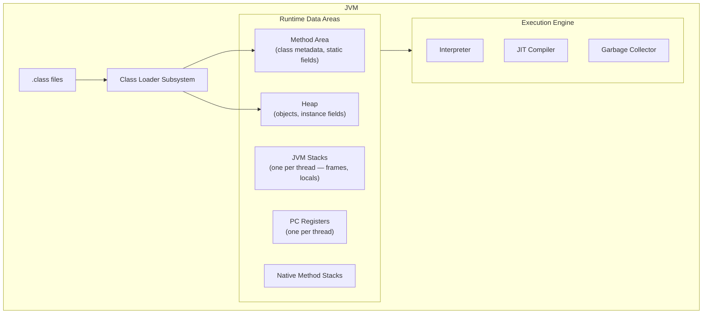
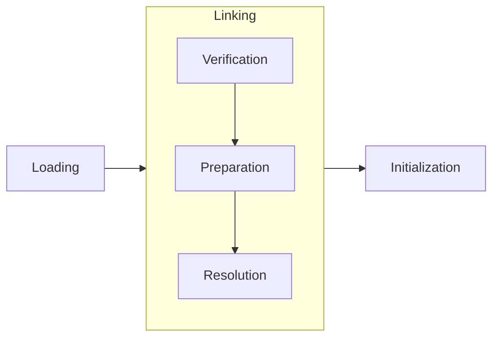
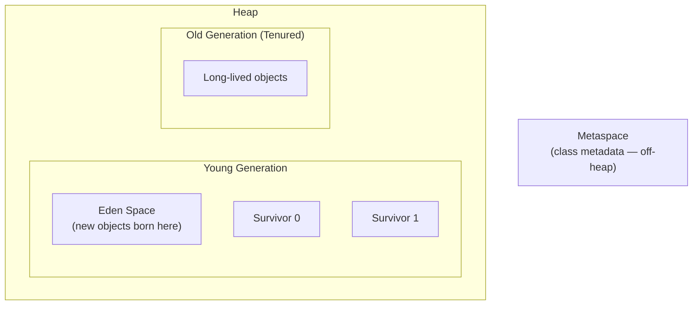
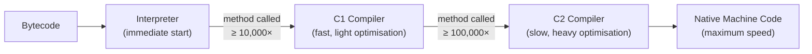

# JVM Internals

[← Back to README](../README.md)

---

Understanding how the JVM works under the hood helps you write faster, leaner code and diagnose hard-to-spot bugs like memory leaks, GC pauses, and thread contention.

---

## JVM Architecture



### Runtime Data Areas

| Area | Per | Contents |
|------|-----|----------|
| **Method Area** (Metaspace) | JVM | Class structures, method bytecode, static fields, constant pool |
| **Heap** | JVM | All objects and arrays — shared across threads |
| **JVM Stack** | Thread | Stack frames: local variables, operand stack, return addresses |
| **PC Register** | Thread | Address of the current instruction being executed |
| **Native Method Stack** | Thread | State for native (C/C++) method calls |

---

## Class Loading

Classes are loaded **lazily** — only when first used.



| Phase | What happens |
|-------|-------------|
| **Loading** | Reads `.class` bytecode into memory |
| **Verification** | Validates bytecode is safe and well-formed |
| **Preparation** | Allocates memory for static fields, sets defaults |
| **Resolution** | Resolves symbolic references to actual memory addresses |
| **Initialization** | Runs static initializers and assigns static field values |

### Class Loader Hierarchy

```
Bootstrap ClassLoader          (loads java.lang, java.util, etc.)
    └── Platform ClassLoader   (loads javax.*, java.sql, etc.)
            └── App ClassLoader (loads your application classes)
```

The **parent delegation model** means a class loader always asks its parent first before trying to load a class itself — preventing duplicate or malicious classes from shadowing standard library classes.

---

## The Heap

All objects live on the heap. The JVM divides it into **generations** to make garbage collection efficient.



| Region | Purpose |
|--------|---------|
| **Eden** | New objects are allocated here |
| **Survivor 0 / 1** | Objects that survived at least one GC cycle |
| **Old Generation** | Objects that have survived many GC cycles |
| **Metaspace** | Class metadata — not on the heap, grows dynamically |

### Object Lifecycle

1. Object created → allocated in **Eden**.
2. **Minor GC** (Young GC) triggered when Eden fills → live objects moved to a Survivor space, age incremented.
3. After surviving a configurable number of GCs (`-XX:MaxTenuringThreshold`, default 15), object promoted to **Old Generation**.
4. **Major GC** (Full GC) triggered when Old Generation fills → all generations collected (expensive, causes longer pauses).

---

## Garbage Collection

The GC automatically reclaims memory occupied by unreachable objects — objects with no live references.

### GC Roots

Objects reachable from GC roots are **alive**. Everything else is garbage.

- Local variables on thread stacks
- Static fields of loaded classes
- JNI (native) references
- Active threads themselves

### GC Algorithms

| Collector | Flag | Best for |
|-----------|------|----------|
| **Serial GC** | `-XX:+UseSerialGC` | Single-threaded, small heaps |
| **Parallel GC** | `-XX:+UseParallelGC` | Throughput-focused, multi-core (default before Java 9) |
| **G1 GC** | `-XX:+UseG1GC` | Balanced latency and throughput (default Java 9–20) |
| **ZGC** | `-XX:+UseZGC` | Ultra-low latency (<1ms pauses), large heaps (default Java 21+) |
| **Shenandoah** | `-XX:+UseShenandoahGC` | Low pause, concurrent compaction (GraalVM / OpenJDK) |

### G1 GC (Garbage First)

G1 divides the heap into equal-sized **regions** and collects the regions with the most garbage first — hence "Garbage First". It aims to meet a configurable pause-time goal.

```bash
-XX:+UseG1GC
-XX:MaxGCPauseMillis=200    # target max pause time
-XX:G1HeapRegionSize=16m    # region size (1-32 MB, power of 2)
```

### ZGC (Java 21+)

ZGC performs most work concurrently with the application — pauses are typically sub-millisecond regardless of heap size.

```bash
-XX:+UseZGC
-Xmx16g    # ZGC works well with large heaps
```

---

## JVM Memory Flags

```bash
# heap size
-Xms512m           # initial heap size
-Xmx4g             # maximum heap size (keep Xms == Xmx in production)

# metaspace
-XX:MetaspaceSize=256m
-XX:MaxMetaspaceSize=512m

# stack size per thread
-Xss512k

# GC logging (Java 11+)
-Xlog:gc*:file=gc.log:time,uptime,level,tags

# print final heap config
-XX:+PrintFlagsFinal | grep HeapSize
```

---

## JIT Compilation

The JVM starts by interpreting bytecode, then progressively compiles hot code to native machine code.



### Key JIT Optimisations

| Optimisation | What it does |
|-------------|-------------|
| **Inlining** | Replaces a method call with the method body — eliminates call overhead |
| **Escape analysis** | Detects objects that don't leave a method and allocates them on the stack (avoids GC) |
| **Dead code elimination** | Removes branches that can never be reached |
| **Loop unrolling** | Duplicates loop body to reduce loop overhead |
| **Intrinsics** | Replaces known methods (e.g. `String.equals`, `Math.sqrt`) with optimised native implementations |

---

## Memory Leaks in Java

Java can still leak memory — when objects are kept alive unintentionally.

### Common Causes

```java
// 1. Static collections that grow forever
public class Cache {
    private static final Map<String, Object> CACHE = new HashMap<>();
    public static void put(String key, Object value) {
        CACHE.put(key, value);  // never evicted — leak
    }
}

// 2. Listeners never removed
button.addActionListener(e -> doSomething());
// if button lives longer than the listener target, the target can't be GC'd

// 3. ThreadLocal not cleaned up
ThreadLocal<byte[]> buffer = ThreadLocal.withInitial(() -> new byte[1024 * 1024]);
// must call buffer.remove() when the thread is returned to a pool

// 4. Unclosed resources (streams, connections)
// Always use try-with-resources

// 5. Inner class holding outer class reference
class Outer {
    class Inner {
        // Inner implicitly holds a reference to Outer
        // If Inner escapes (e.g. passed to a thread), Outer can't be GC'd
    }
    static class StaticInner { }  // no implicit reference — safe
}
```

### Use WeakReference for Caches

```java
import java.lang.ref.*;

// WeakReference — GC can collect the referent when no strong refs exist
WeakReference<byte[]> weakRef = new WeakReference<>(new byte[1024]);
byte[] data = weakRef.get();  // null if GC has collected it

// WeakHashMap — entries removed automatically when keys are GC'd
Map<Object, String> cache = new java.util.WeakHashMap<>();
```

---

## Diagnosing JVM Issues

### Monitoring Tools

| Tool | Purpose |
|------|---------|
| `jps` | List running JVM processes |
| `jstat` | GC statistics, heap usage |
| `jmap` | Heap dump, histogram |
| `jstack` | Thread dump — diagnose deadlocks, high CPU |
| `jcmd` | Swiss-army knife — heap dump, GC, VM flags |
| JVisualVM | GUI profiler (included with JDK) |
| Java Mission Control (JMC) | Advanced profiling and flight recorder |

```bash
jps -l                          # list JVM processes with main class
jstat -gcutil <pid> 1000        # GC stats every 1 second
jmap -histo <pid>               # object histogram
jmap -dump:format=b,file=heap.hprof <pid>  # heap dump
jstack <pid>                    # thread dump
jcmd <pid> GC.run               # trigger GC
jcmd <pid> VM.flags             # print all JVM flags
jcmd <pid> Thread.print         # thread dump (alternative to jstack)
```

### Reading a Thread Dump

```
"main" #1 prio=5 os_prio=0 tid=0x... nid=0x... waiting on condition
   java.lang.Thread.State: TIMED_WAITING (sleeping)
        at java.lang.Thread.sleep(Native Method)
        at com.example.Main.main(Main.java:10)

"worker-1" #12 prio=5 os_prio=0 tid=0x... nid=0x... waiting for monitor entry
   java.lang.Thread.State: BLOCKED (on object monitor)
        at com.example.Service.process(Service.java:42)
        - waiting to lock <0x...> (a com.example.Service)
```

Key thread states to spot:
- `BLOCKED` — waiting to acquire a lock (potential contention)
- `WAITING` / `TIMED_WAITING` — parked, sleeping, or joining
- `RUNNABLE` — actively running or waiting for I/O

---

## Performance Tips

- **Set `-Xms` == `-Xmx`** — prevents heap resizing pauses in production.
- **Choose the right GC** — ZGC for latency-sensitive apps, Parallel GC for batch throughput.
- **Avoid premature object creation** — reuse objects in hot paths; avoid allocating inside tight loops.
- **Prefer primitives over boxed types** in performance-critical code — `int` vs `Integer` avoids autoboxing allocations.
- **Use `StringBuilder`** for string concatenation in loops — `+` inside a loop creates many temporary `String` objects.
- **Profile before optimising** — use JMC or async-profiler to find real hotspots, not guessed ones.
- **Trust the JIT** — the JIT is very good. Write clear code; the compiler will optimise it.

---

## JVM Internals Summary

| Concept | Key point |
|---------|-----------|
| Heap | Shared object store; divided into Young and Old generations |
| Metaspace | Class metadata; off-heap, grows dynamically |
| JVM Stack | Per-thread; holds frames with locals and operand stack |
| Class loading | Lazy, delegated upward through parent class loaders |
| Minor GC | Collects Young generation; fast, frequent |
| Major / Full GC | Collects Old generation (and sometimes all); slower |
| G1 GC | Default (Java 9–20); region-based, balanced pause target |
| ZGC | Default (Java 21+); concurrent, sub-millisecond pauses |
| JIT C1 | Fast compilation with light optimisation |
| JIT C2 | Slow compilation with aggressive optimisation for hot code |
| Memory leak | Objects kept alive unintentionally (static maps, listeners, ThreadLocal) |
| `jstack` | Thread dump — deadlocks, BLOCKED threads |
| `jmap` | Heap histogram and dump |

---

[← Back to README](../README.md)
