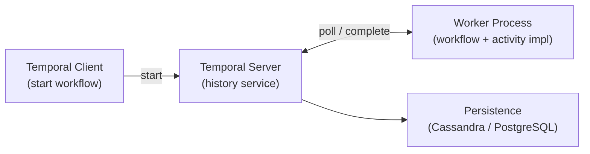

# Temporal Workflow Engine

[← Back to README](../README.md)

---

**Temporal** is a durable workflow orchestration platform. Workflows are plain Java code that survives server restarts, network failures, and process crashes — Temporal replays the event history to restore state. Unlike Saga (which is a pattern), Temporal is a full runtime with a server, workers, and a history service.



---

## Dependencies

```xml
<dependency>
    <groupId>io.temporal</groupId>
    <artifactId>temporal-spring-boot-starter-alpha</artifactId>
    <version>1.24.1</version>
</dependency>
```

```yaml
spring:
  temporal:
    connection:
      target: localhost:7233
    namespace: default
    workers:
      - task-queue: order-processing
        workflow-classes:
          - com.example.workflow.OrderWorkflowImpl
        activity-beans:
          - paymentActivity
          - inventoryActivity
          - notificationActivity
```

---

## Workflow Interface and Implementation

```java
// Workflow interface — defines the contract
@WorkflowInterface
public interface OrderWorkflow {

    @WorkflowMethod
    OrderResult processOrder(PlaceOrderCommand command);

    // Signal — external event sent to a running workflow
    @SignalMethod
    void cancelOrder(String reason);

    // Query — read workflow state without modifying it
    @QueryMethod
    String getStatus();
}

// Implementation — business logic as plain Java
@Slf4j
public class OrderWorkflowImpl implements OrderWorkflow {

    // Activity stubs — Temporal handles retry, timeout, and failure
    private final PaymentActivity paymentActivity = Workflow.newActivityStub(
        PaymentActivity.class,
        ActivityOptions.newBuilder()
            .setStartToCloseTimeout(Duration.ofSeconds(30))
            .setRetryOptions(RetryOptions.newBuilder()
                .setMaximumAttempts(3)
                .setInitialInterval(Duration.ofSeconds(1))
                .setBackoffCoefficient(2.0)
                .build())
            .build());

    private final InventoryActivity inventoryActivity = Workflow.newActivityStub(
        InventoryActivity.class,
        ActivityOptions.newBuilder()
            .setStartToCloseTimeout(Duration.ofSeconds(10))
            .build());

    private final NotificationActivity notificationActivity = Workflow.newActivityStub(
        NotificationActivity.class,
        ActivityOptions.newBuilder()
            .setStartToCloseTimeout(Duration.ofSeconds(5))
            .build());

    private String status = "STARTED";
    private boolean cancelRequested = false;

    @Override
    public OrderResult processOrder(PlaceOrderCommand command) {
        status = "VALIDATING";

        // Step 1 — Reserve inventory
        status = "RESERVING_INVENTORY";
        inventoryActivity.reserve(command.productId(), command.quantity());

        // Check for cancellation after each step
        if (cancelRequested) {
            inventoryActivity.release(command.productId(), command.quantity());
            status = "CANCELLED";
            return OrderResult.cancelled();
        }

        // Step 2 — Charge payment (with automatic retry)
        status = "CHARGING";
        PaymentResult payment = paymentActivity.charge(
            command.customerId(), command.total());

        if (!payment.isSuccessful()) {
            inventoryActivity.release(command.productId(), command.quantity());
            status = "PAYMENT_FAILED";
            return OrderResult.failed("Payment declined: " + payment.getReason());
        }

        // Step 3 — Notify customer
        status = "NOTIFYING";
        notificationActivity.sendConfirmation(command.customerId(), payment.getOrderId());

        status = "COMPLETED";
        return OrderResult.success(payment.getOrderId());
    }

    @Override
    public void cancelOrder(String reason) {
        log.info("Cancel requested: {}", reason);
        cancelRequested = true;
    }

    @Override
    public String getStatus() {
        return status;
    }
}
```

---

## Activity Interface and Implementation

```java
@ActivityInterface
public interface PaymentActivity {
    PaymentResult charge(String customerId, BigDecimal amount);
    void refund(String paymentId);
}

@Component("paymentActivity")
@RequiredArgsConstructor
public class PaymentActivityImpl implements PaymentActivity {

    private final PaymentGateway paymentGateway;

    @Override
    public PaymentResult charge(String customerId, BigDecimal amount) {
        // Real I/O here — network calls, DB writes
        // Temporal retries this on failure automatically
        return paymentGateway.charge(customerId, amount);
    }

    @Override
    public void refund(String paymentId) {
        paymentGateway.refund(paymentId);
    }
}
```

---

## Starting a Workflow

```java
@Service
@RequiredArgsConstructor
public class OrderService {

    private final WorkflowClient workflowClient;

    public String placeOrder(PlaceOrderCommand cmd) {
        String workflowId = "order-" + UUID.randomUUID();

        WorkflowOptions options = WorkflowOptions.newBuilder()
            .setWorkflowId(workflowId)
            .setTaskQueue("order-processing")
            .setWorkflowExecutionTimeout(Duration.ofHours(24))
            .build();

        OrderWorkflow workflow = workflowClient.newWorkflowStub(
            OrderWorkflow.class, options);

        // Start asynchronously — returns immediately
        WorkflowExecution execution = WorkflowClient.start(
            workflow::processOrder, cmd);

        log.info("Started workflow {} run {}", workflowId, execution.getRunId());
        return workflowId;
    }

    // Send a signal to a running workflow
    public void cancelOrder(String workflowId, String reason) {
        OrderWorkflow workflow = workflowClient.newWorkflowStub(
            OrderWorkflow.class, workflowId);
        workflow.cancelOrder(reason);
    }

    // Query workflow state
    public String getOrderStatus(String workflowId) {
        OrderWorkflow workflow = workflowClient.newWorkflowStub(
            OrderWorkflow.class, workflowId);
        return workflow.getStatus();
    }

    // Start and wait for result
    public OrderResult placeOrderSync(PlaceOrderCommand cmd) {
        OrderWorkflow workflow = workflowClient.newWorkflowStub(
            OrderWorkflow.class,
            WorkflowOptions.newBuilder()
                .setTaskQueue("order-processing")
                .build());
        return workflow.processOrder(cmd);   // blocks until workflow completes
    }
}
```

---

## Long-Running Workflows with Timers

```java
public class SubscriptionWorkflowImpl implements SubscriptionWorkflow {

    private final BillingActivity billing = Workflow.newActivityStub(
        BillingActivity.class,
        ActivityOptions.newBuilder()
            .setStartToCloseTimeout(Duration.ofMinutes(1))
            .build());

    @Override
    public void runSubscription(String customerId, Duration billingPeriod) {
        // Run until cancelled
        while (!Workflow.isEvicted()) {
            // Wait for the billing period — durable sleep, survives restarts
            Workflow.sleep(billingPeriod);

            billing.charge(customerId);
            billing.sendReceipt(customerId);
        }
    }
}
```

---

## Child Workflows

```java
public class OrderFulfillmentWorkflowImpl implements OrderFulfillmentWorkflow {

    @Override
    public FulfillmentResult fulfill(Order order) {
        // Spawn child workflows for parallel operations
        Promise<ShippingResult> shippingPromise = Async.function(
            Workflow.newChildWorkflowStub(ShippingWorkflow.class)::arrange, order);

        Promise<InvoiceResult> invoicePromise = Async.function(
            Workflow.newChildWorkflowStub(InvoiceWorkflow.class)::generate, order);

        // Wait for both
        ShippingResult shipping = shippingPromise.get();
        InvoiceResult   invoice = invoicePromise.get();

        return new FulfillmentResult(shipping, invoice);
    }
}
```

---

## Testing

```java
@ExtendWith(TestWorkflowExtension.class)
class OrderWorkflowTest {

    @Test
    void workflow_completesSuccessfully(
            TestWorkflowEnvironment testEnv,
            Worker worker) {

        worker.registerWorkflowImplementationTypes(OrderWorkflowImpl.class);

        // Register mock activities
        PaymentActivity mockPayment = mock(PaymentActivity.class);
        when(mockPayment.charge(any(), any()))
            .thenReturn(PaymentResult.success("pay-123"));

        worker.registerActivitiesImplementations(
            mockPayment,
            mock(InventoryActivity.class),
            mock(NotificationActivity.class));

        testEnv.start();

        OrderWorkflow workflow = testEnv.getWorkflowClient()
            .newWorkflowStub(OrderWorkflow.class,
                WorkflowOptions.newBuilder()
                    .setTaskQueue("order-processing").build());

        OrderResult result = workflow.processOrder(
            new PlaceOrderCommand("cust-1", "prod-1", 1, BigDecimal.TEN));

        assertThat(result.isSuccessful()).isTrue();
        assertThat(result.getOrderId()).isEqualTo("pay-123");
    }
}
```

---

## Temporal Summary

| Concept | Detail |
|---------|--------|
| `@WorkflowInterface` | Defines the workflow contract — methods are `@WorkflowMethod`, `@SignalMethod`, `@QueryMethod` |
| `@ActivityInterface` | Defines activity (side-effect) operations — I/O, DB writes, external API calls |
| Durable execution | Temporal replays the event history on restart — workflows survive crashes |
| `Workflow.newActivityStub` | Create an activity stub with retry, timeout, and backoff config |
| `ActivityOptions` | `setStartToCloseTimeout` and `RetryOptions` per activity type |
| Signal | External event pushed to a running workflow (`@SignalMethod`) |
| Query | Read workflow state without modifying it (`@QueryMethod`) |
| `Workflow.sleep(duration)` | Durable timer — backed by Temporal server, not `Thread.sleep` |
| Child workflow | Spawn a sub-workflow; coordinate with `Async.function` for parallelism |
| `WorkflowClient.start` | Start a workflow asynchronously; `workflow.method(args)` blocks until done |

---

[← Back to README](../README.md)
