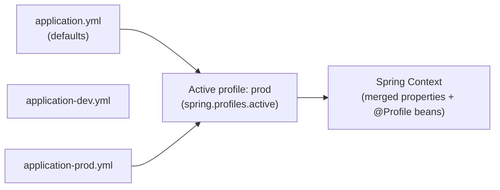

# Spring Boot Profiles Deep Dive

[← Back to README](../README.md)

---

Spring profiles let you conditionally activate beans, configuration, and property files based on the deployment environment. `@Profile`, profile groups, and layered YAML files make it straightforward to have different behaviour in `dev`, `test`, `staging`, and `prod` without if-statements in business logic.



---

## Profile-Specific Property Files

Spring merges properties in this order (later overrides earlier):

```
application.yml                 ← lowest priority defaults
application-{profile}.yml       ← profile-specific overrides
Environment variables           ← highest priority
```

```yaml
# application.yml
server:
  port: 8080
app:
  payment:
    provider: mock
    timeout: 5s
logging:
  level:
    root: INFO

---
# application-dev.yml
app:
  payment:
    provider: stripe-sandbox
logging:
  level:
    com.example: DEBUG

---
# application-prod.yml
app:
  payment:
    provider: stripe
    timeout: 10s
    api-key: ${STRIPE_API_KEY}
server:
  port: 443
```

```bash
# Activate via environment variable (preferred in containers)
SPRING_PROFILES_ACTIVE=prod java -jar app.jar

# Or command-line argument
java -jar app.jar --spring.profiles.active=prod

# Multiple active profiles
SPRING_PROFILES_ACTIVE=prod,metrics java -jar app.jar
```

---

## Multi-Document YAML (Single File)

```yaml
# application.yml — profiles separated by ---
spring:
  config:
    activate:
      on-profile: default
app:
  payment:
    provider: mock

---
spring:
  config:
    activate:
      on-profile: prod
app:
  payment:
    provider: stripe
    api-key: ${STRIPE_API_KEY}

---
spring:
  config:
    activate:
      on-profile: test
app:
  payment:
    provider: test-stub
```

---

## Profile Groups

A group activates multiple profiles with a single name:

```yaml
# application.yml
spring:
  profiles:
    group:
      production: prod,metrics,security
      development: dev,debug,h2
```

```bash
# Activates prod + metrics + security
SPRING_PROFILES_ACTIVE=production java -jar app.jar
```

---

## @Profile — Conditional Beans

```java
// Only registered when 'mock' profile is active
@Service
@Profile("mock")
public class MockPaymentService implements PaymentService {
    @Override
    public PaymentResult charge(String customerId, BigDecimal amount) {
        return PaymentResult.success("mock-" + UUID.randomUUID());
    }
}

// Only registered when 'mock' is NOT active
@Service
@Profile("!mock")
public class StripePaymentService implements PaymentService {
    // real implementation
}

// Active when either dev or staging is active
@Component
@Profile("dev | staging")
public class DevDataInitializer implements ApplicationRunner {
    @Override
    public void run(ApplicationArguments args) {
        seedTestData();
    }
}

// Active when both metrics AND prod are active
@Configuration
@Profile("prod & metrics")
public class ProductionMetricsConfig {
    @Bean
    public PrometheusRegistry prometheusRegistry() { ... }
}
```

---

## @ConditionalOnProperty — Fine-Grained Conditions

```java
// Active only when app.feature.payments=true
@Service
@ConditionalOnProperty(name = "app.feature.payments", havingValue = "true")
public class PaymentService { }

// Active when property is absent (default behaviour)
@Service
@ConditionalOnProperty(
    name = "app.cache.enabled",
    havingValue = "true",
    matchIfMissing = true)
public class CacheService { }

// Active only when a specific class is on the classpath
@Configuration
@ConditionalOnClass(name = "io.lettuce.core.RedisClient")
public class RedisConfig { }

// Active only when a bean of this type exists
@Configuration
@ConditionalOnBean(DataSource.class)
public class JdbcAuditConfig { }

// Active only when a bean is MISSING
@Service
@ConditionalOnMissingBean(PaymentService.class)
public class NoOpPaymentService implements PaymentService { }
```

---

## Testing with Profiles

```java
// Activate a profile for a test class
@SpringBootTest
@ActiveProfiles("test")
class OrderServiceTest {
    @Autowired PaymentService paymentService;  // gets MockPaymentService

    @Test
    void placeOrder_usesMockPayment() {
        assertThat(paymentService).isInstanceOf(MockPaymentService.class);
    }
}

// Use @TestPropertySource to override individual properties
@SpringBootTest
@TestPropertySource(properties = {
    "app.payment.timeout=1s",
    "app.payment.max-retries=0"
})
class FastFailPaymentTest { }

// Inline test config that only applies for this test
@SpringBootTest
class OrderServiceIntegrationTest {

    @TestConfiguration
    static class TestConfig {
        @Bean
        @Primary
        public PaymentService testPaymentService() {
            return new MockPaymentService();
        }
    }
}
```

---

## Default Profile

```yaml
# application.yml
spring:
  profiles:
    default: dev   # active when no profile is specified
```

```java
@Configuration
@Profile("default")
public class LocalDevelopmentConfig {
    @Bean
    public DataSource h2DataSource() { ... }
}
```

---

## Profile Resolution Order

Properties are resolved in this precedence (highest wins):

```
1. OS environment variables          (SPRING_PROFILES_ACTIVE)
2. JVM system properties             (-Dspring.profiles.active=prod)
3. Command-line arguments            (--spring.profiles.active=prod)
4. application-{profile}.yml        (from active profiles)
5. application.yml                   (base defaults)
6. @TestPropertySource               (in tests)
```

---

## Detecting the Active Profile at Runtime

```java
@Service
@RequiredArgsConstructor
public class EnvironmentService {

    private final Environment environment;

    public boolean isProduction() {
        return Arrays.asList(environment.getActiveProfiles()).contains("prod");
    }

    public String[] getActiveProfiles() {
        return environment.getActiveProfiles();
    }
}
```

---

## Spring Boot Profiles Summary

| Concept | Detail |
|---------|--------|
| `application-{profile}.yml` | Profile-specific overrides; merged on top of `application.yml` |
| `spring.profiles.active` | Activate profiles via env var, system property, or YAML |
| Multi-document YAML | Separate profiles within one file with `---` and `spring.config.activate.on-profile` |
| Profile groups | `spring.profiles.group.production: prod,metrics` — activate many with one name |
| `@Profile("name")` | Register bean only when the named profile is active |
| `@Profile("a & b")` | Both profiles must be active |
| `@Profile("a \| b")` | Either profile must be active |
| `@Profile("!name")` | Active when the profile is NOT active |
| `@ConditionalOnProperty` | Activate bean based on a property value; `matchIfMissing` for defaults |
| `@ActiveProfiles("test")` | Set active profiles for a test class |

---

[← Back to README](../README.md)
