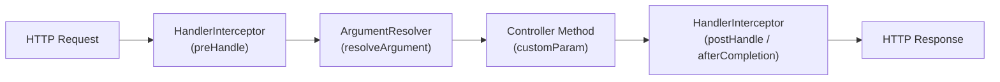

# Spring MVC Interceptors & Argument Resolvers

[← Back to README](../README.md)

---

**`HandlerInterceptor`** adds cross-cutting logic (auth, logging, tenant resolution) before and after controller methods — without touching the controllers themselves. **`HandlerMethodArgumentResolver`** binds custom objects to controller method parameters, so you can write `@CurrentUser User user` instead of extracting the user from `SecurityContextHolder` in every method.



---

## HandlerInterceptor

```java
@Component
@Slf4j
public class RequestLoggingInterceptor implements HandlerInterceptor {

    private static final String START_TIME = "requestStartTime";

    // Before the controller method — return false to abort
    @Override
    public boolean preHandle(HttpServletRequest request, HttpServletResponse response,
                              Object handler) {
        request.setAttribute(START_TIME, System.currentTimeMillis());
        log.info("→ {} {}", request.getMethod(), request.getRequestURI());
        return true;   // continue processing
    }

    // After the controller method, before the view renders
    @Override
    public void postHandle(HttpServletRequest request, HttpServletResponse response,
                            Object handler, ModelAndView modelAndView) {
        // Response is not yet committed here
    }

    // After the complete request, view rendered (or exception thrown)
    @Override
    public void afterCompletion(HttpServletRequest request, HttpServletResponse response,
                                 Object handler, Exception ex) {
        long start   = (Long) request.getAttribute(START_TIME);
        long elapsed = System.currentTimeMillis() - start;
        log.info("← {} {} {}ms {}",
            request.getMethod(), request.getRequestURI(),
            elapsed, response.getStatus());
    }
}
```

---

## Tenant Resolution Interceptor

```java
@Component
@RequiredArgsConstructor
public class TenantInterceptor implements HandlerInterceptor {

    private final TenantRepository tenantRepository;

    @Override
    public boolean preHandle(HttpServletRequest request, HttpServletResponse response,
                              Object handler) throws Exception {

        String tenantId = request.getHeader("X-Tenant-ID");
        if (tenantId == null) {
            response.sendError(HttpStatus.BAD_REQUEST.value(), "X-Tenant-ID header required");
            return false;
        }

        if (!tenantRepository.exists(tenantId)) {
            response.sendError(HttpStatus.NOT_FOUND.value(), "Tenant not found: " + tenantId);
            return false;
        }

        TenantContext.set(tenantId);
        return true;
    }

    @Override
    public void afterCompletion(HttpServletRequest req, HttpServletResponse res,
                                 Object handler, Exception ex) {
        TenantContext.clear();   // always clean up thread-local
    }
}
```

---

## Registering Interceptors

```java
@Configuration
@RequiredArgsConstructor
public class WebMvcConfig implements WebMvcConfigurer {

    private final RequestLoggingInterceptor loggingInterceptor;
    private final TenantInterceptor         tenantInterceptor;

    @Override
    public void addInterceptors(InterceptorRegistry registry) {
        registry.addInterceptor(loggingInterceptor)
            .addPathPatterns("/**")
            .excludePathPatterns("/actuator/**", "/swagger-ui/**");

        registry.addInterceptor(tenantInterceptor)
            .addPathPatterns("/api/**")
            .order(1);   // run before other interceptors
    }
}
```

---

## HandlerMethodArgumentResolver — @CurrentUser

```java
// 1. Custom annotation
@Target(ElementType.PARAMETER)
@Retention(RetentionPolicy.RUNTIME)
public @interface CurrentUser {}

// 2. Resolver
@Component
public class CurrentUserArgumentResolver implements HandlerMethodArgumentResolver {

    @Override
    public boolean supportsParameter(MethodParameter parameter) {
        return parameter.hasParameterAnnotation(CurrentUser.class)
            && parameter.getParameterType().equals(UserPrincipal.class);
    }

    @Override
    public UserPrincipal resolveArgument(MethodParameter parameter,
                                          ModelAndViewContainer mavContainer,
                                          NativeWebRequest webRequest,
                                          WebDataBinderFactory binderFactory) {

        Authentication auth = SecurityContextHolder.getContext().getAuthentication();
        if (auth == null || !auth.isAuthenticated()) {
            throw new AuthenticationCredentialsNotFoundException("Not authenticated");
        }
        return (UserPrincipal) auth.getPrincipal();
    }
}

// 3. Register
@Configuration
@RequiredArgsConstructor
public class WebMvcConfig implements WebMvcConfigurer {

    private final CurrentUserArgumentResolver currentUserResolver;

    @Override
    public void addArgumentResolvers(List<HandlerMethodArgumentResolver> resolvers) {
        resolvers.add(currentUserResolver);
    }
}

// 4. Use in controllers — clean and explicit
@RestController
@RequiredArgsConstructor
public class OrderController {

    @GetMapping("/orders")
    public List<Order> myOrders(@CurrentUser UserPrincipal user) {
        return orderService.findByCustomer(user.getId());
    }

    @PostMapping("/orders")
    public Order placeOrder(@CurrentUser UserPrincipal user,
                             @RequestBody @Valid PlaceOrderRequest request) {
        return orderService.place(user, request);
    }
}
```

---

## @RequestAttribute Resolver — Cross-Layer Data

Pass data from interceptors to controllers without polluting headers or session:

```java
@Component
public class TraceIdInterceptor implements HandlerInterceptor {

    @Override
    public boolean preHandle(HttpServletRequest request, HttpServletResponse response,
                              Object handler) {
        String traceId = UUID.randomUUID().toString();
        request.setAttribute("traceId", traceId);
        response.setHeader("X-Trace-ID", traceId);
        return true;
    }
}

@RestController
public class OrderController {

    @GetMapping("/orders")
    public List<Order> list(
            @RequestAttribute("traceId") String traceId) {
        log.info("Listing orders for trace {}", traceId);
        return orderService.findAll();
    }
}
```

---

## Custom Converter — String to Domain Type

Register a converter so Spring can bind URL path variables directly to domain types:

```java
@Component
public class UUIDToOrderConverter implements Converter<String, OrderId> {
    @Override
    public OrderId convert(String source) {
        try {
            return new OrderId(UUID.fromString(source));
        } catch (IllegalArgumentException e) {
            throw new InvalidOrderIdException(source);
        }
    }
}

@Configuration
@RequiredArgsConstructor
public class WebMvcConfig implements WebMvcConfigurer {

    private final UUIDToOrderConverter converter;

    @Override
    public void addFormatters(FormatterRegistry registry) {
        registry.addConverter(converter);
    }
}

// Now path variables bind to OrderId directly
@GetMapping("/orders/{orderId}")
public Order getOrder(@PathVariable OrderId orderId) {
    return orderService.findById(orderId);
}
```

---

## WebMvcConfigurer — Other Hooks

```java
@Configuration
public class WebMvcConfig implements WebMvcConfigurer {

    // CORS
    @Override
    public void addCorsMappings(CorsRegistry registry) {
        registry.addMapping("/api/**")
            .allowedOrigins("https://app.example.com")
            .allowedMethods("GET", "POST", "PUT", "DELETE")
            .allowCredentials(true);
    }

    // Static resources
    @Override
    public void addResourceHandlers(ResourceHandlerRegistry registry) {
        registry.addResourceHandler("/static/**")
            .addResourceLocations("classpath:/static/")
            .setCacheControl(CacheControl.maxAge(Duration.ofDays(365)));
    }

    // View controllers (redirect / forward without a controller class)
    @Override
    public void addViewControllers(ViewControllerRegistry registry) {
        registry.addRedirectViewController("/", "/dashboard");
        registry.addViewController("/login").setViewName("login");
    }

    // Custom message converters
    @Override
    public void extendMessageConverters(List<HttpMessageConverter<?>> converters) {
        converters.add(0, new CsvHttpMessageConverter());
    }
}
```

---

## Interceptors & Argument Resolvers Summary

| Concept | Detail |
|---------|--------|
| `HandlerInterceptor.preHandle` | Before controller; return `false` to abort with error |
| `HandlerInterceptor.afterCompletion` | Always called; ideal for cleanup (ThreadLocal, MDC) |
| `WebMvcConfigurer.addInterceptors` | Register interceptors; set path patterns and order |
| `HandlerMethodArgumentResolver` | Bind any object to a controller parameter via annotation |
| `supportsParameter(param)` | Return true if this resolver handles the parameter type/annotation |
| `resolveArgument(...)` | Return the value to inject; throw `AuthenticationException` to reject |
| `WebMvcConfigurer.addArgumentResolvers` | Register custom argument resolvers |
| `@RequestAttribute("key")` | Read a request attribute set by an interceptor |
| `Converter<S, T>` + `addFormatters` | Bind path/query parameters directly to domain types |
| `addCorsMappings` / `addResourceHandlers` | Other `WebMvcConfigurer` hooks for CORS, static files, view controllers |

---

[← Back to README](../README.md)
