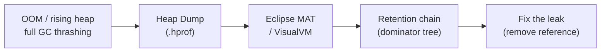

# Java Memory Leak Analysis

[← Back to README](../README.md)

---

A memory leak in Java occurs when objects are unintentionally kept reachable, preventing the GC from collecting them. Heap dumps and profilers reveal the retention chain. The most common culprits in Spring applications are static collections, unremoved listeners, unclosed `ThreadLocal` variables, and growing caches.



---

## Capturing a Heap Dump

```bash
# On OutOfMemoryError (always enable in production)
java -XX:+HeapDumpOnOutOfMemoryError \
     -XX:HeapDumpPath=/var/dumps/ \
     -jar myapp.jar

# On demand from CLI
jcmd <pid> GC.heap_dump /tmp/heapdump.hprof

# Programmatically
MBeanServer server = ManagementFactory.getPlatformMBeanServer();
HotSpotDiagnosticMXBean bean = ManagementFactory.newPlatformMXBeanProxy(
    server, "com.sun.management:type=HotSpotDiagnostic",
    HotSpotDiagnosticMXBean.class);
bean.dumpHeap("/tmp/heapdump.hprof", true);   // true = live objects only

# Via Actuator endpoint (Spring Boot)
curl -X POST http://localhost:8080/actuator/heapdump > dump.hprof
```

---

## Eclipse MAT — Analysis Workflow

```
1. Open File → Open Heap Dump → select .hprof
2. Run "Leak Suspects Report" → automatic anomaly detection
3. Open "Dominator Tree" → objects retaining the most memory
4. Open "Histogram" → count and size per class
5. Right-click a suspicious class → "List objects" → "with incoming references"
6. "Path to GC Roots" → shows the exact retention chain
```

### OQL Queries in MAT

```sql
-- Find all HashMap instances with > 10,000 entries
SELECT * FROM java.util.HashMap WHERE size > 10000

-- Find all byte arrays larger than 1 MB
SELECT * FROM byte[] WHERE @retained > 1048576

-- Find all String objects containing a pattern
SELECT * FROM java.lang.String s WHERE toString(s) LIKE ".*ORDER-.*"

-- Find objects of a specific class
SELECT * FROM com.example.OrderCache
```

---

## Common Leak Patterns

### 1. Static Collection Growing Without Bound

```java
// LEAK — static map never cleaned up
public class MetricsRegistry {
    private static final Map<String, List<Metric>> metrics = new HashMap<>();

    public static void record(String key, Metric metric) {
        metrics.computeIfAbsent(key, k -> new ArrayList<>()).add(metric);
        // metrics grows forever; old entries never removed
    }
}

// FIX — use a bounded cache
private static final Cache<String, List<Metric>> metrics = Caffeine.newBuilder()
    .maximumSize(10_000)
    .expireAfterWrite(Duration.ofMinutes(5))
    .build();
```

---

### 2. ThreadLocal Not Removed

```java
// LEAK in thread pools — ThreadLocal survives thread reuse
public class TenantContext {
    private static final ThreadLocal<String> TENANT = new ThreadLocal<>();

    public static void set(String tenantId) { TENANT.set(tenantId); }
    public static String get()              { return TENANT.get(); }

    // MUST call this after each request
    public static void clear()              { TENANT.remove(); }
}

// FIX — always clear in a finally block or filter
@Component
public class TenantFilter implements Filter {
    @Override
    public void doFilter(ServletRequest req, ServletResponse res, FilterChain chain)
            throws IOException, ServletException {
        TenantContext.set(extractTenantId(req));
        try {
            chain.doFilter(req, res);
        } finally {
            TenantContext.clear();   // critical: prevents leak in thread pools
        }
    }
}
```

---

### 3. Event Listeners / Callbacks Not Deregistered

```java
// LEAK — listener holds a reference to a short-lived object
@Component
public class OrderService {
    @Autowired private EventBus eventBus;

    public void processOrder(Order order) {
        OrderListener listener = new OrderListener(order);
        eventBus.register(listener);   // LEAK: listener never removed
        // ...
    }
}

// FIX — use a weak reference or explicit deregistration
@Component
public class OrderService {
    @Autowired private EventBus eventBus;

    public void processOrder(Order order) {
        OrderListener listener = new OrderListener(order);
        eventBus.register(listener);
        try {
            // do work
        } finally {
            eventBus.unregister(listener);   // always deregister
        }
    }
}
```

---

### 4. Classloader Leak (Metaspace)

Common in web apps that reload classes (or use runtime code generation):

```java
// LEAK — static reference to a class from a child classloader
public class DriverManager {
    // java.sql.DriverManager holds JDBC drivers registered by webapp classloaders
    // On redeploy, the old classloader can't be GC'd because DriverManager holds it
}

// FIX — deregister drivers on shutdown
@PreDestroy
public void deregisterDrivers() {
    Enumeration<java.sql.Driver> drivers = java.sql.DriverManager.getDrivers();
    while (drivers.hasMoreElements()) {
        java.sql.Driver driver = drivers.nextElement();
        try {
            java.sql.DriverManager.deregisterDriver(driver);
        } catch (SQLException e) {
            log.warn("Failed to deregister driver", e);
        }
    }
}
```

---

### 5. Session or Cache Not Bounded

```java
// LEAK — map used as a cache with no eviction
@Service
public class ProductService {
    private final Map<String, Product> cache = new HashMap<>();  // grows forever

    public Product getProduct(String id) {
        return cache.computeIfAbsent(id, productRepository::findById);
    }
}

// FIX — use Caffeine with size and TTL bounds
private final Cache<String, Product> cache = Caffeine.newBuilder()
    .maximumSize(50_000)
    .expireAfterAccess(Duration.ofMinutes(30))
    .recordStats()
    .build();
```

---

## Monitoring for Leaks in Production

```java
@Configuration
public class MemoryMonitorConfig {

    @Scheduled(fixedRate = 60_000)
    public void logHeapUsage() {
        MemoryMXBean memBean = ManagementFactory.getMemoryMXBean();
        MemoryUsage heap = memBean.getHeapMemoryUsage();

        double usedMb  = heap.getUsed()  / 1_048_576.0;
        double maxMb   = heap.getMax()   / 1_048_576.0;
        double percent = (heap.getUsed() * 100.0) / heap.getMax();

        log.info("Heap: {}/{} MB ({:.1f}%)", usedMb, maxMb, percent);

        if (percent > 85) {
            log.warn("Heap usage critical — possible leak");
        }
    }
}
```

```yaml
# Expose heap metrics via Micrometer / Prometheus
management:
  metrics:
    enable:
      jvm: true
# Key metrics to alert on:
# jvm_memory_used_bytes{area="heap"}
# jvm_gc_pause_seconds_sum
# jvm_classes_loaded_classes
```

---

## Leak Detection Tools Comparison

| Tool | Strength | Use when |
|------|----------|----------|
| Eclipse MAT | Deep static analysis, OQL, leak suspects report | Post-mortem with a heap dump |
| VisualVM | Live monitoring, heap dump capture | Local debugging |
| async-profiler `-e alloc` | Allocation flamegraph — find hot allocation sites | JVM still running |
| JFR + JMC | Low-overhead, allocation/GC timeline | Continuous production profiling |
| `jmap -histo` | Quick class histogram without full dump | Fast initial triage |
| `-XX:+HeapDumpOnOutOfMemoryError` | Automatic dump on OOM | Always enable in production |

---

## Memory Leak Analysis Summary

| Concept | Detail |
|---------|--------|
| Heap dump | `.hprof` file; capture with `jcmd GC.heap_dump`, Actuator, or on OOM |
| Dominator tree | Shows which objects retain the most heap — start your investigation here |
| Retention chain | "Path to GC Roots" in MAT — shows why an object can't be collected |
| Static collection | Unbounded static `Map`/`List` — replace with `Caffeine` cache |
| `ThreadLocal` not cleared | Leaks in thread pools — always call `.remove()` in a `finally` block |
| Listener not deregistered | Observer pattern — unregister in `@PreDestroy` or explicit cleanup |
| Classloader leak | Static JVM class (e.g., JDBC `DriverManager`) holds child classloader reference |
| `WeakHashMap` | Entries automatically removed when key is GC'd — useful for caches keyed by objects |
| `jvm_memory_used_bytes` | Micrometer gauge to track heap over time; alert on > 85% |
| OQL in MAT | Query heap like SQL: `SELECT * FROM java.util.HashMap WHERE size > 10000` |

---

[← Back to README](../README.md)
