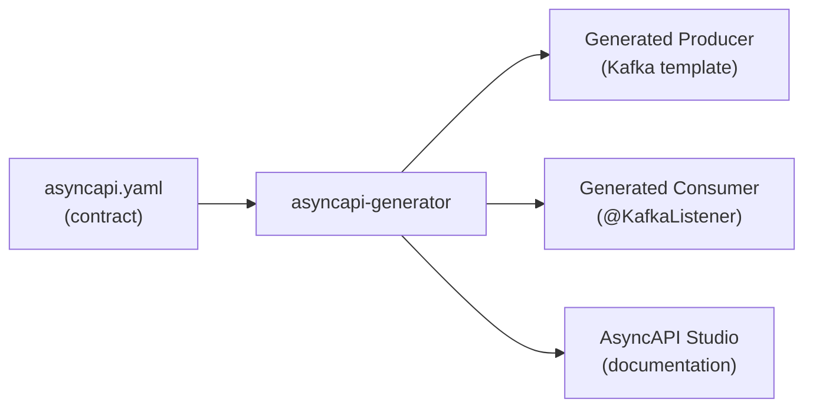

# AsyncAPI Specification

[← Back to README](../README.md)

---

**AsyncAPI** is to event-driven APIs what OpenAPI is to REST APIs. It describes the channels (topics/queues), message schemas, bindings (Kafka, RabbitMQ, AMQP), and operations of an asynchronous system. A single YAML file becomes the contract between producers and consumers, enabling code generation, documentation, and schema validation.



---

## AsyncAPI 3 Document Structure

```yaml
asyncapi: "3.0.0"
info:
  title: Orders Event API
  version: "1.2.0"
  description: |
    Events published by the Order Service.
    All events use CloudEvents envelope via Avro serialization.

defaultContentType: application/json

servers:
  production:
    host: kafka.example.com:9092
    protocol: kafka
    description: Production Kafka cluster
    security:
      - saslScram: []

  development:
    host: localhost:9092
    protocol: kafka

channels:
  order/placed:
    address: orders.placed
    description: Fired when a new order is successfully placed
    messages:
      orderPlaced:
        $ref: '#/components/messages/OrderPlaced'
    bindings:
      kafka:
        topic: orders.placed
        partitions: 12
        replicas: 3
        topicConfiguration:
          retention.ms: 604800000   # 7 days

  order/cancelled:
    address: orders.cancelled
    messages:
      orderCancelled:
        $ref: '#/components/messages/OrderCancelled'

  order/status/updated:
    address: orders.status
    messages:
      orderStatusUpdated:
        $ref: '#/components/messages/OrderStatusUpdated'

operations:
  placeOrder:
    action: send
    channel:
      $ref: '#/channels/order~1placed'
    summary: Publish an event when an order is placed
    bindings:
      kafka:
        clientId: order-service
        groupId: order-producers

  consumeOrderPlaced:
    action: receive
    channel:
      $ref: '#/channels/order~1placed'
    summary: Consumed by Invoice Service and Inventory Service

components:
  messages:
    OrderPlaced:
      name: OrderPlaced
      title: Order Placed Event
      summary: An order was placed by a customer
      contentType: application/json
      headers:
        type: object
        properties:
          ce-id:
            type: string
            description: CloudEvents ID (UUID)
          ce-source:
            type: string
            example: /services/order-service
          ce-type:
            type: string
            enum: [com.example.order.placed]
          ce-specversion:
            type: string
            enum: ["1.0"]
      payload:
        $ref: '#/components/schemas/OrderPlacedPayload'

    OrderCancelled:
      payload:
        $ref: '#/components/schemas/OrderCancelledPayload'

    OrderStatusUpdated:
      payload:
        $ref: '#/components/schemas/OrderStatusUpdatedPayload'

  schemas:
    OrderPlacedPayload:
      type: object
      required: [orderId, customerId, total, lines, placedAt]
      properties:
        orderId:
          type: string
          format: uuid
        customerId:
          type: string
        total:
          type: number
          format: double
          minimum: 0
        lines:
          type: array
          items:
            $ref: '#/components/schemas/OrderLine'
        placedAt:
          type: string
          format: date-time

    OrderCancelledPayload:
      type: object
      required: [orderId, reason, cancelledAt]
      properties:
        orderId:  { type: string, format: uuid }
        reason:   { type: string }
        cancelledAt: { type: string, format: date-time }

    OrderStatusUpdatedPayload:
      type: object
      required: [orderId, previousStatus, newStatus, updatedAt]
      properties:
        orderId:        { type: string, format: uuid }
        previousStatus: { type: string }
        newStatus:      { type: string }
        updatedAt:      { type: string, format: date-time }

    OrderLine:
      type: object
      required: [productId, quantity, unitPrice]
      properties:
        productId:  { type: string }
        quantity:   { type: integer, minimum: 1 }
        unitPrice:  { type: number }

  securitySchemes:
    saslScram:
      type: scramSha256
      description: SASL/SCRAM authentication for production Kafka
```

---

## Code Generation with asyncapi-generator

```bash
# Install the generator
npm install -g @asyncapi/generator

# Generate Spring Cloud Stream bindings
ag asyncapi.yaml @asyncapi/java-spring-cloud-stream-template \
   -o generated/ \
   -p javaPackage=com.example.events \
   -p springBoot3=true

# Generate documentation site
ag asyncapi.yaml @asyncapi/html-template -o docs/

# Generate Markdown docs
ag asyncapi.yaml @asyncapi/markdown-template -o docs/
```

---

## Using the Generated Code

```java
// Generated channel bean (do not edit — regenerated from spec)
// com.example.events.OrderPlacedChannel

// Your implementation
@Service
@RequiredArgsConstructor
public class OrderEventPublisher {

    private final StreamBridge streamBridge;
    private final ObjectMapper objectMapper;

    public void publishOrderPlaced(Order order) {
        OrderPlacedPayload payload = new OrderPlacedPayload()
            .orderId(order.getId())
            .customerId(order.getCustomerId())
            .total(order.getTotal().doubleValue())
            .lines(mapLines(order.getLines()))
            .placedAt(OffsetDateTime.now());

        Message<OrderPlacedPayload> message = MessageBuilder.withPayload(payload)
            .setHeader("ce-id",          UUID.randomUUID().toString())
            .setHeader("ce-source",      "/services/order-service")
            .setHeader("ce-type",        "com.example.order.placed")
            .setHeader("ce-specversion", "1.0")
            .build();

        streamBridge.send("orders.placed", message);
    }
}
```

---

## Schema Validation Against AsyncAPI

```java
// Validate a message payload against the AsyncAPI schema at runtime
@Component
@RequiredArgsConstructor
public class AsyncApiSchemaValidator {

    private final AsyncApiSchemaLoader schemaLoader;

    public void validate(String channelName, Object payload) throws ValidationException {
        JsonSchema schema = schemaLoader.getPayloadSchema(channelName);
        Set<ValidationMessage> errors = schema.validate(
            objectMapper.valueToTree(payload));

        if (!errors.isEmpty()) {
            throw new ValidationException(
                "Payload violates AsyncAPI schema for channel " + channelName,
                errors);
        }
    }
}
```

---

## CI Validation and Linting

```yaml
# .github/workflows/asyncapi.yml
name: AsyncAPI validation

on: [push, pull_request]

jobs:
  validate:
    runs-on: ubuntu-latest
    steps:
      - uses: actions/checkout@v4

      - name: Validate AsyncAPI spec
        uses: asyncapi/github-action-for-cli@v3
        with:
          command: validate
          filepath: src/main/resources/asyncapi.yaml

      - name: Check spec diff for breaking changes
        uses: asyncapi/github-action-for-cli@v3
        with:
          command: diff
          filepath: src/main/resources/asyncapi.yaml
          # Fails on incompatible changes (removed channels, changed payload types)
```

---

## AsyncAPI Studio (Visual Editor)

AsyncAPI Studio at `studio.asyncapi.com` provides a split view: YAML editor on the left, visual diagram and documentation on the right. You can paste your spec, edit live, and export.

---

## AsyncAPI vs OpenAPI

| Feature | OpenAPI | AsyncAPI |
|---------|---------|----------|
| Protocol | HTTP/REST | Kafka, AMQP, MQTT, WebSocket, and more |
| Operation types | request/response | publish/subscribe |
| Message binding | HTTP verbs + status codes | Kafka topic metadata, AMQP exchange bindings |
| Schema format | JSON Schema | JSON Schema / Avro / Protobuf |
| Tooling maturity | Very mature | Growing rapidly |

---

## AsyncAPI Summary

| Concept | Detail |
|---------|--------|
| `channels` | Named message routes — maps to a Kafka topic, RabbitMQ exchange, etc. |
| `operations` | `send` (producer) or `receive` (consumer) bound to a channel |
| `messages` | Message name, headers, and payload schema reference |
| `components/schemas` | Reusable JSON Schema definitions |
| `bindings` | Protocol-specific metadata (partitions, retention, consumer group) |
| `asyncapi-generator` | CLI tool — generates code stubs and HTML docs from the spec |
| `@asyncapi/java-spring-cloud-stream-template` | Generates Spring Cloud Stream producer/consumer stubs |
| `asyncapi validate` | Lint the spec in CI; catch schema errors before they reach production |
| `asyncapi diff` | Detect breaking changes between two spec versions |
| CloudEvents headers | `ce-id`, `ce-source`, `ce-type` — standard envelope for event metadata |

---

[← Back to README](../README.md)
