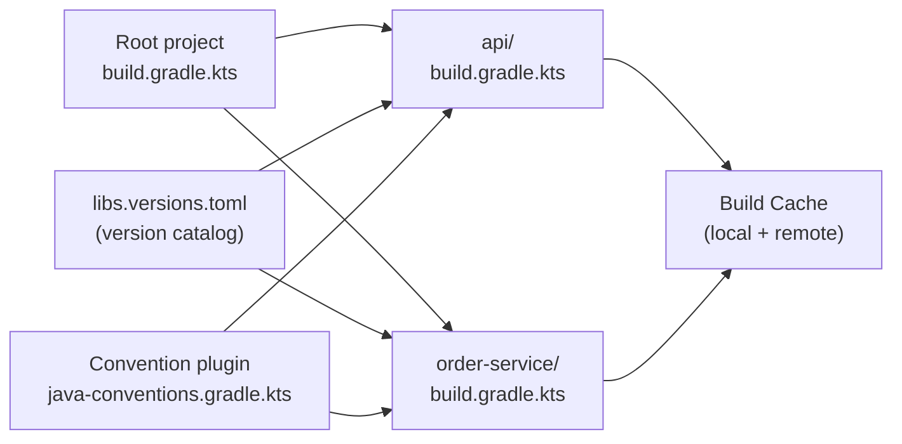

# Gradle Advanced

[← Back to README](../README.md)

---

Beyond `./gradlew build`, Gradle offers multi-module projects, version catalogs, convention plugins, build caching, and incremental task execution. A well-structured Gradle build reduces developer friction and CI build times significantly.



---

## Multi-Module Project Structure

```
root/
├── settings.gradle.kts
├── build.gradle.kts          # root build script
├── gradle/
│   └── libs.versions.toml    # version catalog
├── buildSrc/
│   ├── build.gradle.kts
│   └── src/main/kotlin/
│       └── java-conventions.gradle.kts   # convention plugin
├── api/                      # shared API module
│   └── build.gradle.kts
├── order-service/
│   └── build.gradle.kts
└── inventory-service/
    └── build.gradle.kts
```

```kotlin
// settings.gradle.kts
rootProject.name = "my-platform"

include(
    "api",
    "order-service",
    "inventory-service"
)

// Enable version catalog
dependencyResolutionManagement {
    versionCatalogs {
        create("libs") {
            from(files("gradle/libs.versions.toml"))
        }
    }
}
```

---

## Version Catalog — libs.versions.toml

```toml
# gradle/libs.versions.toml
[versions]
spring-boot    = "3.3.0"
spring-cloud   = "2023.0.3"
jackson        = "2.17.1"
testcontainers = "1.19.8"
kotlin         = "1.9.24"

[libraries]
spring-boot-web       = { module = "org.springframework.boot:spring-boot-starter-web",          version.ref = "spring-boot" }
spring-boot-data-jpa  = { module = "org.springframework.boot:spring-boot-starter-data-jpa",     version.ref = "spring-boot" }
spring-boot-security  = { module = "org.springframework.boot:spring-boot-starter-security",     version.ref = "spring-boot" }
spring-boot-test      = { module = "org.springframework.boot:spring-boot-starter-test",         version.ref = "spring-boot" }
jackson-databind      = { module = "com.fasterxml.jackson.core:jackson-databind",               version.ref = "jackson" }
testcontainers-pg     = { module = "org.testcontainers:postgresql",                             version.ref = "testcontainers" }
testcontainers-junit  = { module = "org.testcontainers:junit-jupiter",                          version.ref = "testcontainers" }

[bundles]
testing = ["spring-boot-test", "testcontainers-pg", "testcontainers-junit"]

[plugins]
spring-boot       = { id = "org.springframework.boot",          version.ref = "spring-boot" }
spring-dependency = { id = "io.spring.dependency-management",   version = "1.1.5" }
```

```kotlin
// order-service/build.gradle.kts
dependencies {
    implementation(libs.spring.boot.web)
    implementation(libs.spring.boot.data.jpa)
    testImplementation(libs.bundles.testing)
}
```

---

## Convention Plugin — Shared Build Logic

```kotlin
// buildSrc/src/main/kotlin/java-conventions.gradle.kts
plugins {
    `java-library`
    id("org.springframework.boot")
    id("io.spring.dependency-management")
    jacoco
    checkstyle
}

group = "com.example"

java {
    toolchain {
        languageVersion = JavaLanguageVersion.of(21)
    }
}

repositories {
    mavenCentral()
}

testing {
    suites {
        val test by getting(JvmTestSuite::class) {
            useJUnitJupiter()
        }
    }
}

tasks.withType<Test> {
    maxHeapSize = "512m"
    testLogging {
        events("passed", "skipped", "failed")
    }
}

jacoco {
    toolVersion = "0.8.12"
}

tasks.jacocoTestReport {
    reports {
        xml.required = true
        html.required = true
    }
}

tasks.check {
    dependsOn(tasks.jacocoTestReport)
}
```

```kotlin
// order-service/build.gradle.kts — inherits all conventions
plugins {
    id("java-conventions")
}

dependencies {
    implementation(project(":api"))
    implementation(libs.spring.boot.web)
    implementation(libs.spring.boot.data.jpa)
    runtimeOnly(libs.postgresql)
    testImplementation(libs.bundles.testing)
}
```

---

## Custom Tasks

```kotlin
// Create a custom task
abstract class GenerateClientTask : DefaultTask() {

    @get:InputFile
    abstract val specFile: RegularFileProperty

    @get:OutputDirectory
    abstract val outputDir: DirectoryProperty

    @TaskAction
    fun generate() {
        val spec    = specFile.get().asFile
        val outDir  = outputDir.get().asFile
        outDir.mkdirs()

        logger.lifecycle("Generating client from ${spec.name}")
        // Call openapi-generator CLI or API
        exec {
            commandLine("npx", "@openapitools/openapi-generator-cli", "generate",
                "-i", spec.absolutePath,
                "-g", "java",
                "-o", outDir.absolutePath)
        }
    }
}

// Register and wire the task
val generateClient by tasks.registering(GenerateClientTask::class) {
    specFile.set(layout.projectDirectory.file("src/main/resources/api.yaml"))
    outputDir.set(layout.buildDirectory.dir("generated/client"))
}

tasks.compileJava {
    dependsOn(generateClient)
}

sourceSets.main {
    java.srcDir(generateClient.map { it.outputDir })
}
```

---

## Build Caching

```kotlin
// settings.gradle.kts
buildCache {
    local {
        isEnabled = true
        directory = File(rootDir, ".gradle/build-cache")
    }
    remote<HttpBuildCache> {
        url = uri("https://build-cache.example.com/cache/")
        credentials {
            username = System.getenv("CACHE_USER")
            password = System.getenv("CACHE_PASSWORD")
        }
        isPush = System.getenv("CI") == "true"
    }
}
```

```bash
# Enable caching for a build
./gradlew build --build-cache

# Show build scan (performance report)
./gradlew build --scan
```

Making a custom task cacheable:

```kotlin
@CacheableTask
abstract class CompileProtoTask : DefaultTask() {

    @get:PathSensitive(PathSensitivity.RELATIVE)
    @get:InputDirectory
    abstract val protoSrcDir: DirectoryProperty

    @get:OutputDirectory
    abstract val outputDir: DirectoryProperty

    @TaskAction
    fun compile() { /* ... */ }
}
```

---

## Dependency Management

```kotlin
// Force a specific version across all configurations
configurations.all {
    resolutionStrategy {
        force("com.fasterxml.jackson.core:jackson-databind:2.17.1")
        failOnVersionConflict()
    }
}

// Exclude a transitive dependency
dependencies {
    implementation("org.springframework.boot:spring-boot-starter-web") {
        exclude(group = "org.springframework.boot", module = "spring-boot-starter-tomcat")
    }
    implementation("org.springframework.boot:spring-boot-starter-undertow")
}

// BOM import
dependencies {
    implementation(platform("org.springframework.cloud:spring-cloud-dependencies:2023.0.3"))
    implementation("org.springframework.cloud:spring-cloud-starter-openfeign")
}
```

---

## Useful Gradle Commands

```bash
# Show dependency tree for a configuration
./gradlew :order-service:dependencies --configuration runtimeClasspath

# Show which module provides a dependency
./gradlew :order-service:dependencyInsight \
  --dependency jackson-databind \
  --configuration runtimeClasspath

# List all tasks
./gradlew tasks --all

# Run tests in a specific module
./gradlew :order-service:test

# Run a specific test
./gradlew :order-service:test --tests "com.example.OrderServiceTest"

# Parallel execution
./gradlew build --parallel --max-workers=4

# Configuration cache (Gradle 8+)
./gradlew build --configuration-cache
```

---

## Gradle Advanced Summary

| Concept | Detail |
|---------|--------|
| `settings.gradle.kts` | Declares modules with `include(":sub-module")` |
| `libs.versions.toml` | Central version catalog — `libs.spring.boot.web` in build scripts |
| `[bundles]` | Group libraries into a single dependency alias |
| `buildSrc` | Convention plugins applied to all subprojects; changes here rebuild everything |
| Convention plugin | Shared build logic (`java-conventions.gradle.kts`) applied with `id("java-conventions")` |
| `@CacheableTask` | Mark custom tasks so Gradle caches their outputs |
| Build cache | Reuse outputs across builds and CI agents; `--build-cache` flag |
| `resolutionStrategy.force` | Override transitive dependency versions across the graph |
| `platform(bom)` | Import a BOM for version alignment without inheriting its dependencies |
| `--configuration-cache` | Cache the configuration phase (Gradle 8+) for faster incremental builds |

---

[← Back to README](../README.md)
