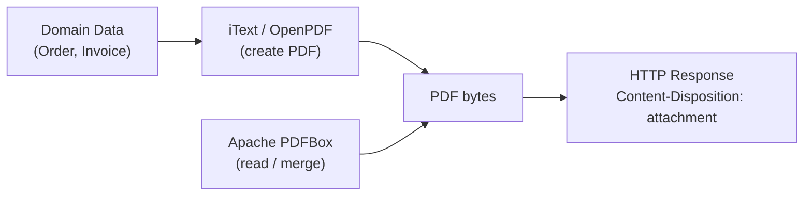

# PDF Generation — Apache PDFBox & iText

[← Back to README](../README.md)

---

PDF is the standard for generated reports, invoices, and certificates. **Apache PDFBox** is ideal for reading, extracting text, and merging existing PDFs. **iText** (AGPL or commercial) is the go-to for creating structured documents programmatically. Both integrate cleanly with Spring Boot.



---

## Dependencies

```xml
<!-- iText / OpenPDF (LGPL fork of old iText 2) -->
<dependency>
    <groupId>com.github.librepdf</groupId>
    <artifactId>openpdf</artifactId>
    <version>2.0.3</version>
</dependency>

<!-- Apache PDFBox (Apache 2.0) -->
<dependency>
    <groupId>org.apache.pdfbox</groupId>
    <artifactId>pdfbox</artifactId>
    <version>3.0.3</version>
</dependency>
```

---

## Creating a PDF with OpenPDF

```java
@Service
public class InvoicePdfService {

    public byte[] generate(Invoice invoice) throws DocumentException, IOException {
        ByteArrayOutputStream out = new ByteArrayOutputStream();
        Document doc = new Document(PageSize.A4, 50, 50, 60, 60);
        PdfWriter.getInstance(doc, out);
        doc.open();

        // Title
        Font titleFont = FontFactory.getFont(FontFactory.HELVETICA_BOLD, 18);
        doc.add(new Paragraph("Invoice #" + invoice.getNumber(), titleFont));
        doc.add(new Paragraph("Date: " + invoice.getDate(), FontFactory.getFont(FontFactory.HELVETICA, 11)));
        doc.add(Chunk.NEWLINE);

        // Line items table — 4 columns
        PdfPTable table = new PdfPTable(new float[]{4, 1, 1.5f, 1.5f});
        table.setWidthPercentage(100);
        addTableHeader(table, "Description", "Qty", "Unit Price", "Total");

        for (InvoiceLine line : invoice.getLines()) {
            table.addCell(line.getDescription());
            table.addCell(String.valueOf(line.getQuantity()));
            table.addCell(formatMoney(line.getUnitPrice()));
            table.addCell(formatMoney(line.getTotal()));
        }
        doc.add(table);

        // Total
        doc.add(Chunk.NEWLINE);
        Font boldFont = FontFactory.getFont(FontFactory.HELVETICA_BOLD, 12);
        doc.add(new Paragraph("Total: " + formatMoney(invoice.getTotal()), boldFont));

        doc.close();
        return out.toByteArray();
    }

    private void addTableHeader(PdfPTable table, String... headers) {
        Font hf = FontFactory.getFont(FontFactory.HELVETICA_BOLD, 10, BaseColor.WHITE);
        for (String header : headers) {
            PdfPCell cell = new PdfPCell(new Phrase(header, hf));
            cell.setBackgroundColor(new BaseColor(63, 81, 181));
            cell.setPadding(6);
            table.addCell(cell);
        }
    }

    private String formatMoney(BigDecimal amount) {
        return "R " + amount.setScale(2, RoundingMode.HALF_UP);
    }
}
```

---

## Merging PDFs with Apache PDFBox

```java
@Service
public class PdfMergeService {

    public byte[] merge(List<byte[]> pdfs) throws IOException {
        PDFMergerUtility merger = new PDFMergerUtility();
        ByteArrayOutputStream out = new ByteArrayOutputStream();
        merger.setDestinationStream(out);

        for (byte[] pdf : pdfs) {
            merger.addSource(new ByteArrayInputStream(pdf));
        }
        merger.mergeDocuments(MemoryUsageSetting.setupMainMemoryOnly());
        return out.toByteArray();
    }
}
```

---

## Extracting Text with PDFBox

```java
@Service
public class PdfTextExtractor {

    public String extract(byte[] pdfBytes) throws IOException {
        try (PDDocument doc = Loader.loadPDF(pdfBytes)) {
            PDFTextStripper stripper = new PDFTextStripper();
            stripper.setSortByPosition(true);
            return stripper.getText(doc);
        }
    }

    public String extractPage(byte[] pdfBytes, int pageNumber) throws IOException {
        try (PDDocument doc = Loader.loadPDF(pdfBytes)) {
            PDFTextStripper stripper = new PDFTextStripper();
            stripper.setStartPage(pageNumber);
            stripper.setEndPage(pageNumber);
            return stripper.getText(doc);
        }
    }
}
```

---

## Filling a PDF Form

```java
@Service
public class PdfFormFiller {

    public byte[] fillForm(byte[] templateBytes, Map<String, String> fieldValues)
            throws IOException {
        try (PDDocument doc = Loader.loadPDF(templateBytes);
             ByteArrayOutputStream out = new ByteArrayOutputStream()) {

            PDAcroForm form = doc.getDocumentCatalog().getAcroForm();
            if (form == null) throw new IllegalArgumentException("PDF has no form fields");

            for (Map.Entry<String, String> entry : fieldValues.entrySet()) {
                PDField field = form.getField(entry.getKey());
                if (field != null) {
                    field.setValue(entry.getValue());
                }
            }

            form.flatten();   // lock form so it prints cleanly
            doc.save(out);
            return out.toByteArray();
        }
    }
}
```

---

## Serving PDF from a Controller

```java
@RestController
@RequiredArgsConstructor
@RequestMapping("/api/invoices")
public class InvoiceController {

    private final InvoicePdfService pdfService;
    private final InvoiceRepository invoiceRepo;

    @GetMapping("/{id}/pdf")
    public ResponseEntity<byte[]> downloadPdf(@PathVariable Long id)
            throws DocumentException, IOException {

        Invoice invoice = invoiceRepo.findById(id)
            .orElseThrow(() -> new ResponseStatusException(HttpStatus.NOT_FOUND));

        byte[] pdf = pdfService.generate(invoice);

        return ResponseEntity.ok()
            .header(HttpHeaders.CONTENT_DISPOSITION,
                "attachment; filename=\"invoice-" + invoice.getNumber() + ".pdf\"")
            .contentType(MediaType.APPLICATION_PDF)
            .contentLength(pdf.length)
            .body(pdf);
    }
}
```

---

## Adding Metadata and PDF/A Compliance

```java
// Set document metadata
doc.addTitle("Invoice #INV-2024-001");
doc.addAuthor("Acme Corp");
doc.addCreator("InvoiceService v1.0");
doc.addSubject("Customer Invoice");
doc.addCreationDate();

// For PDF/A-1b (archival format) via PDFBox
// Use pdfbox-tools or third-party libraries for full PDF/A conformance validation
```

---

## Adding a Watermark

```java
public byte[] addWatermark(byte[] pdfBytes, String text) throws IOException {
    try (PDDocument doc = Loader.loadPDF(pdfBytes);
         ByteArrayOutputStream out = new ByteArrayOutputStream()) {

        PDFont font = new PDType1Font(Standard14Fonts.FontName.HELVETICA_BOLD);

        for (PDPage page : doc.getPages()) {
            PDPageContentStream cs = new PDPageContentStream(
                doc, page, PDPageContentStream.AppendMode.APPEND, true, true);

            cs.setGraphicsStateParameters(buildTransparency(doc, 0.3f));
            cs.setNonStrokingColor(Color.LIGHT_GRAY);
            cs.beginText();
            cs.setFont(font, 60);
            cs.setTextMatrix(Matrix.getRotateInstance(
                Math.toRadians(45),
                page.getMediaBox().getWidth() / 4,
                page.getMediaBox().getHeight() / 4));
            cs.showText(text);
            cs.endText();
            cs.close();
        }

        doc.save(out);
        return out.toByteArray();
    }
}

private PDExtendedGraphicsState buildTransparency(PDDocument doc, float opacity) {
    PDExtendedGraphicsState gs = new PDExtendedGraphicsState();
    gs.setNonStrokingAlphaConstant(opacity);
    gs.setAlphaSourceFlag(true);
    return gs;
}
```

---

## PDF Generation Summary

| Concept | Detail |
|---------|--------|
| OpenPDF | LGPL fork of iText 2; `Document`, `PdfWriter`, `PdfPTable`, `Paragraph` |
| `PdfPTable` | Multi-column table; `setWidthPercentage(100)` for full-width |
| `PDFMergerUtility` | PDFBox utility to merge multiple PDFs into one stream |
| `PDFTextStripper` | PDFBox text extractor; `setSortByPosition(true)` for reading order |
| `PDAcroForm.flatten()` | Bakes form field values into the page content |
| `Content-Disposition: attachment` | Forces browser to download rather than display inline |
| `MediaType.APPLICATION_PDF` | Correct MIME type — `application/pdf` |
| Watermark | Append a semi-transparent text layer to each page via `PDPageContentStream` |
| PDF/A | Archival PDF format; requires embedded fonts and no encryption |
| iText 7 | Commercial/AGPL; more powerful than OpenPDF for complex layouts |

---

[← Back to README](../README.md)
