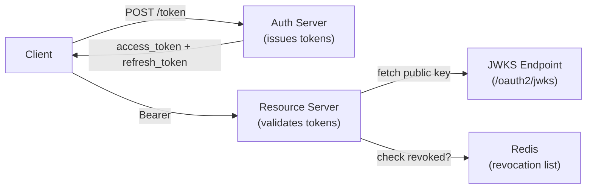

# JWT Deep Dive

[← Back to README](../README.md)

---

A **JSON Web Token** is a compact, URL-safe representation of claims between two parties. The standard (RFC 7519) defines three Base64URL-encoded sections: a **header** (algorithm), a **payload** (claims), and a **signature**. Understanding the full lifecycle — issuance, validation, refresh, rotation, and revocation — is essential for secure API authentication.



---

## JWT Structure

```
eyJhbGciOiJSUzI1NiIsInR5cCI6IkpXVCJ9   <- Header (Base64URL)
.
eyJzdWIiOiJ1c2VyLTEyMyIsInJvbGVzIjpbIlJPTEVfVVNFUiJdfQ==  <- Payload (Base64URL)
.
<RSA signature bytes>                    <- Signature (Base64URL)
```

```json
// Header
{ "alg": "RS256", "typ": "JWT", "kid": "key-2024-01" }

// Payload (standard + custom claims)
{
  "iss": "https://auth.example.com",
  "sub": "user-123",
  "aud": ["api.example.com"],
  "iat": 1719532800,
  "exp": 1719536400,
  "jti": "a1b2c3d4-...",
  "roles": ["ROLE_USER", "ROLE_ADMIN"],
  "tenantId": "tenant-abc"
}
```

**Algorithm choices:**
- `RS256` — RSA with SHA-256 (asymmetric; preferred for public APIs — resource servers need only the public key)
- `ES256` — ECDSA with P-256 (smaller keys/signatures than RSA; same asymmetric benefits)
- `HS256` — HMAC with SHA-256 (symmetric; only suitable when issuer == verifier)

---

## Issuing Tokens with Spring Authorization Server

```java
@Configuration
public class TokenCustomizerConfig {

    @Bean
    public OAuth2TokenCustomizer<JwtEncodingContext> tokenCustomizer() {
        return context -> {
            if (OidcParameterNames.ID_TOKEN.equals(context.getTokenType().getValue())
                || OAuth2TokenType.ACCESS_TOKEN.equals(context.getTokenType())) {

                Authentication principal = context.getPrincipal();
                Set<String> roles = principal.getAuthorities().stream()
                    .map(GrantedAuthority::getAuthority)
                    .collect(Collectors.toSet());

                context.getClaims()
                    .claim("roles", roles)
                    .claim("tenantId", extractTenantId(principal))
                    .claim("jti", UUID.randomUUID().toString());   // unique ID for revocation
            }
        };
    }
}
```

---

## Validating JWTs in a Resource Server

```yaml
# application.yml
spring:
  security:
    oauth2:
      resourceserver:
        jwt:
          jwk-set-uri: https://auth.example.com/oauth2/jwks
          # OR for symmetric:
          # secret: ${JWT_SECRET}
```

```java
@Configuration
@EnableWebSecurity
public class ResourceServerConfig {

    @Bean
    public SecurityFilterChain securityFilterChain(HttpSecurity http) throws Exception {
        http
            .oauth2ResourceServer(oauth2 -> oauth2
                .jwt(jwt -> jwt.jwtAuthenticationConverter(jwtAuthenticationConverter()))
            )
            .authorizeHttpRequests(auth -> auth
                .requestMatchers("/actuator/health").permitAll()
                .anyRequest().authenticated()
            );
        return http.build();
    }

    @Bean
    public JwtAuthenticationConverter jwtAuthenticationConverter() {
        JwtGrantedAuthoritiesConverter conv = new JwtGrantedAuthoritiesConverter();
        conv.setAuthoritiesClaimName("roles");
        conv.setAuthorityPrefix("");   // roles already contain "ROLE_" prefix

        JwtAuthenticationConverter jwtConv = new JwtAuthenticationConverter();
        jwtConv.setJwtGrantedAuthoritiesConverter(conv);
        return jwtConv;
    }
}
```

---

## Custom JWT Claims Extraction

```java
@Component
public class JwtClaimsExtractor {

    public String getTenantId(Authentication auth) {
        Jwt jwt = (Jwt) auth.getPrincipal();
        return jwt.getClaimAsString("tenantId");
    }

    public List<String> getRoles(Authentication auth) {
        Jwt jwt = (Jwt) auth.getPrincipal();
        return jwt.getClaimAsStringList("roles");
    }

    public String getJti(Authentication auth) {
        Jwt jwt = (Jwt) auth.getPrincipal();
        return jwt.getId();   // "jti" claim
    }
}
```

---

## Refresh Token Pattern

```java
@RestController
@RequiredArgsConstructor
@RequestMapping("/auth")
public class TokenController {

    private final JwtTokenService tokenService;
    private final RefreshTokenRepository refreshTokenRepo;

    @PostMapping("/refresh")
    public ResponseEntity<TokenResponse> refresh(
            @RequestBody @Valid RefreshRequest request) {

        RefreshToken stored = refreshTokenRepo.findByToken(request.getRefreshToken())
            .filter(t -> !t.isExpired())
            .orElseThrow(() -> new ResponseStatusException(
                HttpStatus.UNAUTHORIZED, "Invalid or expired refresh token"));

        // Rotate: issue new refresh token, invalidate old one
        refreshTokenRepo.delete(stored);
        String newRefresh = tokenService.issueRefreshToken(stored.getUserId());
        String newAccess  = tokenService.issueAccessToken(stored.getUserId());

        return ResponseEntity.ok(new TokenResponse(newAccess, newRefresh));
    }

    @PostMapping("/logout")
    public ResponseEntity<Void> logout(@AuthenticationPrincipal Jwt jwt,
                                        @RequestBody @Valid RefreshRequest request) {
        // Revoke access token via JTI blocklist
        tokenService.revokeAccessToken(jwt.getId(), jwt.getExpiresAt());
        // Revoke refresh token
        refreshTokenRepo.deleteByToken(request.getRefreshToken());
        return ResponseEntity.noContent().build();
    }
}
```

---

## Token Revocation with Redis Blocklist

```java
@Service
@RequiredArgsConstructor
public class JwtTokenService {

    private static final String REVOKED_PREFIX = "revoked:jti:";

    private final RedisTemplate<String, String> redis;

    public void revokeAccessToken(String jti, Instant expiresAt) {
        Duration ttl = Duration.between(Instant.now(), expiresAt);
        if (!ttl.isNegative()) {
            redis.opsForValue().set(REVOKED_PREFIX + jti, "1", ttl);
        }
    }

    public boolean isRevoked(String jti) {
        return Boolean.TRUE.equals(redis.hasKey(REVOKED_PREFIX + jti));
    }
}

// Wire into Spring Security JWT validation
@Component
@RequiredArgsConstructor
public class RevocationCheckingJwtDecoder implements JwtDecoder {

    private final NimbusJwtDecoder delegate;
    private final JwtTokenService tokenService;

    @Override
    public Jwt decode(String token) throws JwtException {
        Jwt jwt = delegate.decode(token);
        if (tokenService.isRevoked(jwt.getId())) {
            throw new JwtException("Token has been revoked");
        }
        return jwt;
    }
}

@Configuration
public class JwtDecoderConfig {

    @Bean
    public JwtDecoder jwtDecoder(
            @Value("${spring.security.oauth2.resourceserver.jwt.jwk-set-uri}") String jwksUri,
            JwtTokenService tokenService) {
        NimbusJwtDecoder decoder = NimbusJwtDecoder.withJwkSetUri(jwksUri).build();
        return new RevocationCheckingJwtDecoder(decoder, tokenService);
    }
}
```

---

## JWKS Key Rotation

```java
@Configuration
public class JwkConfig {

    @Bean
    public JWKSource<SecurityContext> jwkSource() throws NoSuchAlgorithmException {
        // Generate a key pair (in production: load from Vault or KMS)
        KeyPairGenerator gen = KeyPairGenerator.getInstance("RSA");
        gen.initialize(2048);
        KeyPair keyPair = gen.generateKeyPair();

        RSAKey rsaKey = new RSAKey.Builder((RSAPublicKey) keyPair.getPublic())
            .privateKey(keyPair.getPrivate())
            .keyID("key-" + LocalDate.now())   // rotate the kid with date
            .keyUse(KeyUse.SIGNATURE)
            .algorithm(JWSAlgorithm.RS256)
            .build();

        return new ImmutableJWKSet<>(new JWKSet(rsaKey));
    }
}
```

---

## Testing JWT-secured Endpoints

```java
@WebMvcTest(OrderController.class)
class OrderControllerTest {

    @Autowired MockMvc mvc;

    @Test
    void requiresAuthentication() throws Exception {
        mvc.perform(get("/api/orders"))
           .andExpect(status().isUnauthorized());
    }

    @Test
    void allowsWithValidJwt() throws Exception {
        mvc.perform(get("/api/orders")
               .with(jwt()
                   .jwt(j -> j.claim("roles", List.of("ROLE_USER"))
                              .claim("tenantId", "tenant-abc"))
                   .authorities(new SimpleGrantedAuthority("ROLE_USER"))))
           .andExpect(status().isOk());
    }
}
```

---

## JWT Deep Dive Summary

| Concept | Detail |
|---------|--------|
| `RS256` / `ES256` | Asymmetric algorithms; resource servers only need the public key via JWKS |
| `HS256` | Symmetric — avoid for public-facing APIs; secret must be shared |
| `jti` claim | Unique token ID; required for revocation blacklisting |
| `kid` header | Key ID in JWKS; enables rolling key rotation without downtime |
| `JwtAuthenticationConverter` | Maps JWT claims (e.g., `roles`) to Spring `GrantedAuthority` |
| JWKS endpoint | `/.well-known/jwks.json` — serves public keys for token verification |
| Refresh token | Long-lived opaque token; stored in DB; exchanged for new access token |
| Token rotation | Issue new refresh token on each use; invalidate the old one immediately |
| Redis blocklist | Store revoked JTIs with TTL = remaining access token lifetime |
| `jwt()` MockMvc | `SecurityMockMvcRequestPostProcessors.jwt()` for slice tests without a running server |

---

[← Back to README](../README.md)
