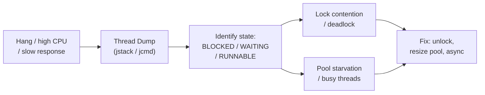

# JVM Thread Dump Analysis

[← Back to README](../README.md)

---

A **thread dump** is a snapshot of every thread's state and stack trace at a moment in time. It is the primary tool for diagnosing CPU spikes, application hangs, deadlocks, and thread pool exhaustion. Unlike heap dumps (which show memory), thread dumps show what the JVM is *doing*.



---

## Capturing a Thread Dump

```bash
# jstack — simplest, works with any JDK
jstack <pid> > thread-dump.txt
jstack -l <pid> > thread-dump.txt   # -l includes lock info

# jcmd — preferred in modern JDKs
jcmd <pid> Thread.print             # to stdout
jcmd <pid> Thread.print -l > thread-dump.txt   # with lock info

# Via kill signal (Unix only)
kill -3 <pid>    # sends SIGQUIT; JVM prints dump to stdout

# Spring Boot Actuator endpoint
curl -X POST http://localhost:8080/actuator/threaddump
```

---

## Thread States

| State | Meaning |
|-------|---------|
| `RUNNABLE` | Executing or ready to execute on CPU (includes waiting for I/O at OS level) |
| `BLOCKED` | Waiting to acquire a **monitor lock** (`synchronized`) held by another thread |
| `WAITING` | Parked indefinitely — `Object.wait()`, `LockSupport.park()`, `Thread.join()` |
| `TIMED_WAITING` | Parked with a timeout — `Thread.sleep()`, `Object.wait(n)`, `LockSupport.parkNanos()` |
| `NEW` | Created but not yet started |
| `TERMINATED` | Finished |

---

## Reading a Thread Dump

```
"http-nio-8080-exec-5" #42 daemon prio=5 os_prio=0 tid=0x00007f4c nid=0x1a runnable
   java.lang.Thread.State: RUNNABLE
        at java.net.SocketInputStream.socketRead0(Native Method)
        at java.net.SocketInputStream.read(SocketInputStream.java:150)
        at com.example.OrderService.fetchExternalData(OrderService.java:87)
        ...

"http-nio-8080-exec-6" #43 daemon prio=5 tid=0x00007f4d nid=0x1b
   java.lang.Thread.State: BLOCKED (on object monitor)
        at com.example.CacheService.get(CacheService.java:44)
        - waiting to lock <0x000000076b2a1234> (a com.example.CacheService)
        - locked by "http-nio-8080-exec-3" (tid=0x00007f4a)
```

Key fields:
- Thread name + daemon flag
- `nid` — native thread ID (matches OS `ps` output)
- `java.lang.Thread.State` — the state enum value
- Stack frames — topmost frame is where the thread currently is
- Lock ownership `- locked by` and waiting `- waiting to lock`

---

## Deadlock Detection

Deadlocks are reported automatically at the bottom of a `jstack -l` output:

```
Found one Java-level deadlock:
=============================
"Thread-A":
  waiting to lock monitor 0x00007f...(a java.lang.Object),
  which is held by "Thread-B"
"Thread-B":
  waiting to lock monitor 0x00007f...(a java.lang.Object),
  which is held by "Thread-A"

Java stack information for the threads listed above:
===================================================
"Thread-A":
        at com.example.TransferService.debit(TransferService.java:32)
        - waiting to lock <0x0000000785a2> (Account B)
        - locked <0x0000000785a1> (Account A)
"Thread-B":
        at com.example.TransferService.debit(TransferService.java:32)
        - waiting to lock <0x0000000785a1> (Account A)
        - locked <0x0000000785a2> (Account B)
```

```java
// Common fix: always acquire locks in a canonical order
public void transfer(Account from, Account to, BigDecimal amount) {
    Account first  = from.getId() < to.getId() ? from : to;
    Account second = from.getId() < to.getId() ? to : from;

    synchronized (first) {
        synchronized (second) {
            from.debit(amount);
            to.credit(amount);
        }
    }
}
```

---

## Programmatic Thread Dump with ThreadMXBean

```java
@Component
public class ThreadDumpService {

    private final ThreadMXBean threadBean = ManagementFactory.getThreadMXBean();

    public String captureThreadDump() {
        StringBuilder sb = new StringBuilder();
        ThreadInfo[] threads = threadBean.dumpAllThreads(true, true);

        for (ThreadInfo info : threads) {
            sb.append(info);   // includes stack trace and lock info
        }
        return sb.toString();
    }

    public List<Long> detectDeadlocks() {
        long[] deadlockedIds = threadBean.findDeadlockedThreads();
        return deadlockedIds == null ? List.of()
            : Arrays.stream(deadlockedIds).boxed().collect(Collectors.toList());
    }

    @Scheduled(fixedRate = 60_000)
    public void alertOnDeadlock() {
        List<Long> deadlocked = detectDeadlocks();
        if (!deadlocked.isEmpty()) {
            log.error("DEADLOCK detected in thread IDs: {}", deadlocked);
            log.error(captureThreadDump());
        }
    }
}
```

---

## Common Patterns and Diagnoses

### Thread Pool Exhaustion

```
"http-nio-8080-exec-1"  WAITING (on condition)
"http-nio-8080-exec-2"  WAITING (on condition)
"http-nio-8080-exec-3"  WAITING (on condition)
...all 200 threads waiting...
"http-nio-8080-exec-200" RUNNABLE at com.example.SlowExternalCall.post(...)
```

Diagnosis: all executor threads waiting; one slow call is holding a thread. Fix: async client, timeouts, bulkhead.

---

### Lock Contention

```
Thread-A  RUNNABLE  — holds lock on SharedService
Thread-B  BLOCKED   — waiting to lock SharedService
Thread-C  BLOCKED   — waiting to lock SharedService
```

Fix: reduce `synchronized` scope, use `ReentrantLock` with `tryLock(timeout)`, or replace with concurrent data structure.

---

### CPU Spike from RUNNABLE Threads

Multiple `RUNNABLE` threads all in the same stack frame often indicate a hot loop or tight busy-wait:

```bash
# Correlate JVM thread ID (nid) with OS thread CPU usage
top -H -p <pid>          # shows per-thread CPU (Linux)
jcmd <pid> Thread.print  # match nid (hex) to OS thread ID (decimal)
```

---

## Analyzing Thread Dumps with Tools

```
fastThread.io        — paste a dump, get visual flame chart and categorisation (online)
IBM Thread Analyzer  — free desktop tool for analysing multiple dumps over time
VisualVM             — live thread view; can capture dumps from running process
IntelliJ Profiler    — integrated thread timeline
JFR + JMC            — continuous thread state recording with low overhead
```

---

## JVM Thread Dump Summary

| Concept | Detail |
|---------|--------|
| `jstack -l <pid>` | Includes lock info; auto-detects deadlocks at the end of output |
| `jcmd Thread.print` | Preferred modern alternative to jstack |
| `BLOCKED` state | Thread waiting on a `synchronized` monitor — look for lock holder in dump |
| `WAITING` state | Parked indefinitely; typical for thread pool idle threads |
| `RUNNABLE` state | Executing; high count → CPU spike; all in same frame → hot loop |
| Deadlock report | Printed automatically at the bottom of `jstack -l` output |
| `ThreadMXBean.findDeadlockedThreads()` | Programmatic deadlock detection; schedule for production alerting |
| Pool exhaustion | All executor threads waiting/blocked; add timeouts or increase pool size |
| Canonical lock order | Always acquire locks in same order to prevent deadlock |
| `nid` hex field | Maps to OS thread ID — use `top -H -p <pid>` to correlate with CPU usage |

---

[← Back to README](../README.md)
