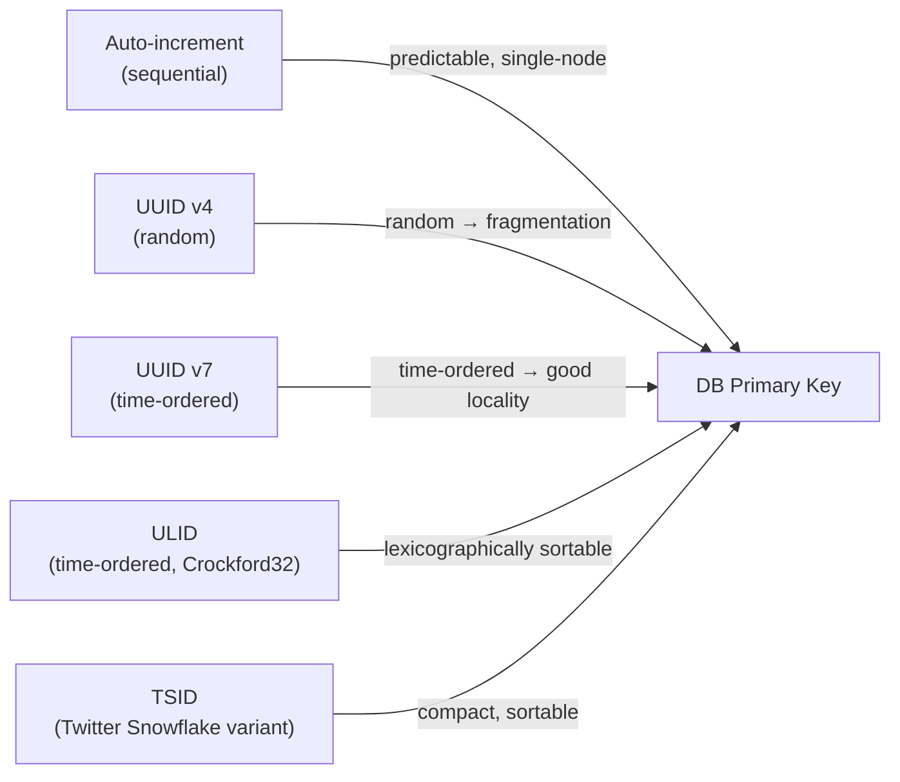

# UUID Strategies & Distributed IDs

[← Back to README](../README.md)

---

Choosing an identifier format has significant performance implications. Random UUIDs (v4) cause B-tree index fragmentation and poor cache locality. Time-ordered IDs (UUIDv7, ULID, TSID) maintain insertion order, dramatically improving write throughput. The right choice depends on your database, sortability requirements, and whether IDs must be unguessable.



---

## UUID v4 — Random

```java
// Built into Java — but causes index fragmentation
UUID id = UUID.randomUUID();
// 550e8400-e29b-41d4-a716-446655440000

// Problem: random bytes → every INSERT lands at a random B-tree leaf
// Result: page splits, high write amplification, poor read locality
```

---

## UUID v7 — Time-Ordered (Java 24+)

UUID v7 embeds a Unix timestamp in the high bits, making values monotonically increasing within a millisecond.

```java
// Java 24+ (JEP 474)
UUID id = UUID.randomUUID7();   // or Generators from com.fasterxml.uuid

// With jackson-databind-uuid or java-uuid-generator library (Java < 24)
import com.fasterxml.uuid.Generators;

UUIDGenerator gen = Generators.timeBasedEpochGenerator();
UUID id = gen.generate();
// 018f5e1a-3b2c-7000-a1b2-c3d4e5f60718
//  ^-- 48-bit timestamp (ms since epoch) embedded here
```

```java
// JPA Entity with UUID v7
@Entity
public class Order {

    @Id
    @Column(columnDefinition = "uuid")
    private UUID id;

    @PrePersist
    private void generateId() {
        if (id == null) {
            id = Generators.timeBasedEpochGenerator().generate();
        }
    }
}
```

---

## ULID — Universally Unique Lexicographically Sortable ID

ULID encodes a 48-bit timestamp + 80 random bits as a 26-character Crockford Base32 string. Lexicographic sort = chronological sort.

```xml
<dependency>
    <groupId>com.github.f4b6a3</groupId>
    <artifactId>ulid-creator</artifactId>
    <version>5.2.3</version>
</dependency>
```

```java
import com.github.f4b6a3.ulid.UlidCreator;

String ulid = UlidCreator.getUlid().toString();
// 01HZ8XQZG7FKNP3JBWMVSRY4K2
// ^^^^^^^^^^-- timestamp prefix (sortable)

// Monotonic ULID — guarantees order even within the same millisecond
String monotonic = UlidCreator.getMonotonicUlid().toString();

// Store as UUID in PostgreSQL (ULID converts to UUID)
UUID asUuid = UlidCreator.getMonotonicUlid().toUuid();
```

---

## TSID — Time-Sorted ID (Snowflake Variant)

TSID is a 64-bit long — compact, human-friendly, sortable. Inspired by Twitter Snowflake.

```xml
<dependency>
    <groupId>com.github.f4b6a3</groupId>
    <artifactId>tsid-creator</artifactId>
    <version>5.2.6</version>
</dependency>
```

```java
import com.github.f4b6a3.tsid.TsidCreator;

long id = TsidCreator.getTsid256().toLong();
// 411592793402

String idStr = TsidCreator.getTsid256().toString();
// 0AXSXKR5EZS  (13-char Crockford Base32)

// In JPA
@Entity
public class Product {
    @Id
    private Long id;

    @PrePersist
    private void generateId() {
        if (id == null) id = TsidCreator.getTsid256().toLong();
    }
}
```

---

## NanoID — Short, URL-Safe

```xml
<dependency>
    <groupId>com.aventrix.jnanoid</groupId>
    <artifactId>jnanoid</artifactId>
    <version>2.0.0</version>
</dependency>
```

```java
import com.aventrix.jnanoid.jnanoid.NanoIdUtils;

String id = NanoIdUtils.randomNanoId();            // 21 chars, default alphabet
// V1StGXR8_Z5jdHi6B-myT

String shortId = NanoIdUtils.randomNanoId(
    new SecureRandom(),
    NanoIdUtils.DEFAULT_ALPHABET,
    10);  // 10 chars — useful for invite codes, short URLs
```

---

## Database Impact — B-Tree Fragmentation

```sql
-- PostgreSQL: measure fragmentation
CREATE EXTENSION IF NOT EXISTS pgstattuple;
SELECT * FROM pgstattuple('orders');
-- dead_tuple_percent high → index rebuild needed

-- Rebuilding a fragmented index
REINDEX INDEX CONCURRENTLY idx_orders_id;

-- UUIDv7 / ULID keep dead_tuple_percent low because inserts are sequential
```

```java
// PostgreSQL: use uuid column type for UUID v7
@Column(columnDefinition = "uuid DEFAULT gen_random_uuid()")
private UUID id;

// For TSID: plain BIGINT column — smallest overhead, best index performance
@Column(name = "id")
@Id
private Long id;
```

---

## Choosing the Right Strategy

| Strategy | Size | Sortable | Unguessable | Best for |
|----------|------|----------|-------------|----------|
| Auto-increment (`BIGSERIAL`) | 8 B | Yes | No | Single-node, non-exposed IDs |
| UUID v4 | 16 B | No | Yes | Legacy/simple; avoid for high-write tables |
| UUID v7 | 16 B | Yes | Yes (random suffix) | Modern default — drop-in UUID replacement |
| ULID | 16 B / 26 chars | Yes | Yes | When lexicographic string sort matters |
| TSID | 8 B | Yes | Partially | Compact; high-throughput writes |
| NanoID | ~10–21 chars | No | Yes | Short URLs, invite codes, public-facing IDs |

---

## Spring Boot Configuration

```java
@Configuration
public class IdGeneratorConfig {

    @Bean
    public UUIDGenerator uuidV7Generator() {
        return Generators.timeBasedEpochGenerator();
    }

    @Bean
    public TsidFactory tsidFactory() {
        // 256 nodes, each generating up to 16 384 IDs/ms
        return TsidFactory.newInstance256();
    }
}

// Use as a Spring component
@Component
@RequiredArgsConstructor
public class OrderIdGenerator {
    private final TsidFactory tsidFactory;

    public long next() {
        return tsidFactory.create().toLong();
    }
}
```

---

## UUID Strategies Summary

| Concept | Detail |
|---------|--------|
| UUID v4 | Fully random — causes B-tree page splits on high-write tables |
| UUID v7 | Time-ordered UUID — drop-in replacement for v4 with sequential inserts |
| ULID | 26-char Crockford Base32; lexicographic sort = chronological sort |
| TSID | 64-bit long (Snowflake-style); most compact, best DB performance |
| NanoID | Short, URL-safe, customizable alphabet; not sortable |
| B-tree fragmentation | Random IDs scatter inserts across leaf pages → page splits and bloat |
| `pgstattuple` | PostgreSQL extension to measure index/table bloat |
| `@PrePersist` | Hook to generate IDs before JPA `INSERT` |
| `gen_random_uuid()` | PostgreSQL function for server-side UUID v4 generation |
| ID exposure | Avoid exposing auto-increment IDs publicly; use ULID/NanoID for URLs |

---

[← Back to README](../README.md)
