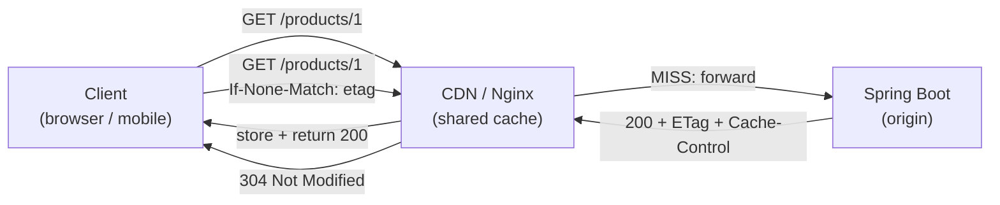

# HTTP Caching — ETag, Cache-Control & Conditional Requests

[← Back to README](../README.md)

---

HTTP caching lets clients and intermediaries (CDN, reverse proxy) reuse responses without hitting the origin server. Done correctly, it reduces server load, cuts bandwidth, and dramatically improves perceived latency. The two key mechanisms are **Cache-Control** directives (telling caches how long to store a response) and **conditional requests** (letting clients check whether their cached copy is still valid before downloading again).



---

## Cache-Control Directives

```
Cache-Control: max-age=3600, public
Cache-Control: no-cache                     # must revalidate with server every time
Cache-Control: no-store                     # never cache (sensitive data)
Cache-Control: private, max-age=300         # only browser cache, not CDN
Cache-Control: must-revalidate, max-age=60  # stale responses forbidden
Cache-Control: immutable, max-age=31536000  # never revalidate (content-addressed assets)
Cache-Control: stale-while-revalidate=30    # serve stale while fetching fresh
```

---

## Spring MVC — CacheControl Builder

```java
@RestController
@RequestMapping("/api/products")
@RequiredArgsConstructor
public class ProductController {

    private final ProductService productService;

    @GetMapping("/{id}")
    public ResponseEntity<Product> getProduct(@PathVariable Long id) {
        Product product = productService.findById(id);

        return ResponseEntity.ok()
            .cacheControl(CacheControl.maxAge(1, TimeUnit.HOURS).cachePublic())
            .body(product);
    }

    @GetMapping("/me/wishlist")
    public ResponseEntity<List<Product>> wishlist(@AuthenticationPrincipal User user) {
        List<Product> wishlist = productService.wishlist(user.getId());

        return ResponseEntity.ok()
            .cacheControl(CacheControl.maxAge(5, TimeUnit.MINUTES).cachePrivate())
            .body(wishlist);
    }

    @GetMapping("/static-assets/{slug}")
    public ResponseEntity<byte[]> staticAsset(@PathVariable String slug) {
        byte[] asset = productService.getAsset(slug);

        return ResponseEntity.ok()
            .cacheControl(CacheControl.maxAge(365, TimeUnit.DAYS).immutable())
            .body(asset);
    }
}
```

---

## ETag — Entity Tags

An ETag is a fingerprint of the response body. Clients send it back in `If-None-Match`; if the resource hasn't changed, the server returns `304 Not Modified` with no body — saving bandwidth.

### Shallow ETags (Automatic — Response Body Hash)

```java
// Register the filter — Spring computes ETag from response body MD5
@Configuration
public class WebConfig {

    @Bean
    public ShallowEtagHeaderFilter shallowEtagHeaderFilter() {
        return new ShallowEtagHeaderFilter();
    }
}

// Spring automatically:
// 1. Buffers response body
// 2. Computes MD5 hash → ETag: "d41d8cd98f00b204e9800998ecf8427e"
// 3. Returns 304 if If-None-Match matches
```

### Deep ETags (Business-Logic Based — More Efficient)

```java
@GetMapping("/{id}")
public ResponseEntity<Product> getProduct(@PathVariable Long id,
                                           WebRequest request) {
    Product product = productService.findById(id);

    // Use version/updatedAt as ETag — no body buffering needed
    String etag = "\"" + product.getVersion() + "\"";

    if (request.checkNotModified(etag)) {
        return null;   // Spring sends 304 automatically
    }

    return ResponseEntity.ok()
        .eTag(etag)
        .cacheControl(CacheControl.maxAge(30, TimeUnit.MINUTES))
        .body(product);
}
```

---

## Last-Modified — Time-Based Conditional Requests

```java
@GetMapping("/{id}")
public ResponseEntity<Product> getProduct(@PathVariable Long id,
                                           WebRequest request) {
    Product product = productService.findById(id);
    long lastModifiedMs = product.getUpdatedAt().toEpochMilli();

    if (request.checkNotModified(lastModifiedMs)) {
        return null;   // 304 Not Modified
    }

    return ResponseEntity.ok()
        .lastModified(product.getUpdatedAt())
        .cacheControl(CacheControl.maxAge(1, TimeUnit.HOURS))
        .body(product);
}
```

---

## Combining ETag and Last-Modified

```java
@GetMapping("/{id}")
public ResponseEntity<Product> getProduct(@PathVariable Long id,
                                           WebRequest request) {
    Product product = productService.findById(id);

    String etag        = "\"" + product.getVersion() + "\"";
    long lastModifiedMs = product.getUpdatedAt().toEpochMilli();

    // checkNotModified checks BOTH If-None-Match and If-Modified-Since
    if (request.checkNotModified(etag, lastModifiedMs)) {
        return null;
    }

    return ResponseEntity.ok()
        .eTag(etag)
        .lastModified(product.getUpdatedAt())
        .cacheControl(CacheControl.maxAge(30, TimeUnit.MINUTES).mustRevalidate())
        .body(product);
}
```

---

## Conditional PUT — Optimistic Concurrency

ETags aren't just for GET. Use `If-Match` on PUT to prevent lost updates:

```java
@PutMapping("/{id}")
public ResponseEntity<Product> updateProduct(
        @PathVariable Long id,
        @RequestBody @Valid UpdateProductRequest request,
        @RequestHeader(value = HttpHeaders.IF_MATCH, required = false) String ifMatch) {

    Product product = productService.findById(id);
    String currentEtag = "\"" + product.getVersion() + "\"";

    if (ifMatch != null && !ifMatch.equals(currentEtag)) {
        return ResponseEntity.status(HttpStatus.PRECONDITION_FAILED).build();
        // Client must GET fresh copy before retrying
    }

    Product updated = productService.update(id, request);
    return ResponseEntity.ok()
        .eTag("\"" + updated.getVersion() + "\"")
        .body(updated);
}
```

---

## Spring WebFlux Caching

```java
@GetMapping("/{id}")
public Mono<ResponseEntity<Product>> getProduct(@PathVariable Long id,
                                                  ServerWebExchange exchange) {
    return productService.findById(id).map(product -> {
        String etag         = "\"" + product.getVersion() + "\"";
        Instant lastModified = product.getUpdatedAt();

        if (exchange.checkNotModified(etag, lastModified)) {
            return ResponseEntity.status(HttpStatus.NOT_MODIFIED).<Product>build();
        }

        return ResponseEntity.ok()
            .eTag(etag)
            .lastModified(lastModified)
            .cacheControl(CacheControl.maxAge(30, TimeUnit.MINUTES))
            .body(product);
    });
}
```

---

## Static Resource Caching

```java
@Configuration
public class WebMvcConfig implements WebMvcConfigurer {

    @Override
    public void addResourceHandlers(ResourceHandlerRegistry registry) {
        registry.addResourceHandler("/assets/**")
            .addResourceLocations("classpath:/static/assets/")
            // content-based fingerprinting: app-abc123.js
            .resourceChain(true)
            .addResolver(new VersionResourceResolver().addContentVersionStrategy("/**"))
            .addTransformer(new CssLinkResourceTransformer());

        // long-lived cache for fingerprinted assets
        registry.addResourceHandler("/assets/**")
            .addResourceLocations("classpath:/static/assets/")
            .setCacheControl(CacheControl.maxAge(365, TimeUnit.DAYS).immutable());
    }
}
```

---

## HTTP Caching Summary

| Concept | Detail |
|---------|--------|
| `Cache-Control: max-age=N` | Response can be reused for N seconds without contacting origin |
| `Cache-Control: no-cache` | Must revalidate every time (but can still return 304) |
| `Cache-Control: no-store` | Never cache — use for sensitive data |
| `Cache-Control: private` | Browser only; CDN/reverse proxy must not cache |
| `Cache-Control: immutable` | Content will never change; skip revalidation entirely |
| ETag | Response fingerprint; `If-None-Match` request header for revalidation |
| `Last-Modified` | Timestamp; `If-Modified-Since` request header for revalidation |
| `304 Not Modified` | Response with no body; client uses its cached copy |
| `ShallowEtagHeaderFilter` | Spring filter that auto-computes ETags from MD5 of response body |
| `request.checkNotModified(etag, lastModifiedMs)` | Spring helper; returns `true` and sets 304 if unchanged |
| `If-Match` on PUT | Conditional update — rejects stale writes with `412 Precondition Failed` |
| `CacheControl` builder | Fluent API: `.maxAge()`, `.cachePublic()`, `.cachePrivate()`, `.mustRevalidate()` |

---

[← Back to README](../README.md)
