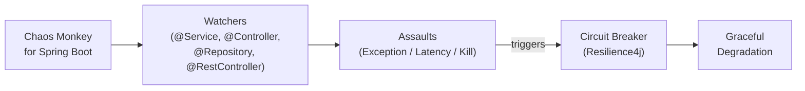

# Chaos Engineering with Spring

[← Back to README](../README.md)

---

**Chaos Engineering** is the practice of deliberately injecting failures into a system to verify that it recovers gracefully. **Chaos Monkey for Spring Boot** is a library that randomly injects latency, exceptions, or kills application threads during runtime — exposing weaknesses in timeout configuration, fallback logic, and circuit breakers before real outages do.



---

## Dependency

```xml
<dependency>
    <groupId>de.codecentric</groupId>
    <artifactId>chaos-monkey-spring-boot</artifactId>
    <version>3.1.0</version>
</dependency>
```

---

## Enabling Chaos Monkey

```yaml
# application-chaos.yml  (activate only with the "chaos" profile)
spring:
  profiles:
    active: chaos

chaos:
  monkey:
    enabled: true
    watcher:
      service: true         # intercept @Service beans
      rest-controller: true # intercept @RestController beans
      repository: true      # intercept @Repository beans
      component: false
    assaults:
      level: 5              # 1–10; how often to trigger (every Nth call)
      latency-active: true
      latency-range-start: 1000   # ms
      latency-range-end:   3000
      exceptions-active: false
      kill-application-active: false
```

```java
// Activate chaos profile in tests or locally
@SpringBootApplication
public class Application {
    public static void main(String[] args) {
        SpringApplication.run(Application.class, args);
    }
}
```

```bash
# Run with chaos profile
java -jar app.jar --spring.profiles.active=chaos
```

---

## Runtime Control via Actuator

```bash
# Enable/disable chaos monkey without restart
curl -X POST http://localhost:8080/actuator/chaosmonkey/enable
curl -X POST http://localhost:8080/actuator/chaosmonkey/disable

# Check current status
curl http://localhost:8080/actuator/chaosmonkey

# Change assault configuration at runtime
curl -X POST http://localhost:8080/actuator/chaosmonkey/assaults \
     -H "Content-Type: application/json" \
     -d '{
           "level": 3,
           "latencyActive": true,
           "latencyRangeStart": 500,
           "latencyRangeEnd": 2000,
           "exceptionsActive": true,
           "exception": {
             "type": "java.lang.RuntimeException",
             "arguments": [{"className": "java.lang.String", "value": "chaos exception"}]
           }
         }'

# Enable only for specific service
curl -X POST http://localhost:8080/actuator/chaosmonkey/watchers \
     -H "Content-Type: application/json" \
     -d '{"service": true, "restController": false, "repository": false}'
```

---

## Custom Assault — Target a Specific Service

```java
@Component
public class InventoryServiceAssault implements ChaosMonkeyRequestAssault {

    @Override
    public void attack() {
        if (shouldAttack()) {
            throw new InventoryUnavailableException("Chaos: inventory service simulated outage");
        }
    }

    private boolean shouldAttack() {
        return ThreadLocalRandom.current().nextInt(10) < 3;   // 30% chance
    }
}
```

---

## Verifying Resilience — Resilience4j + Chaos Monkey

```java
// The circuit breaker should open when Chaos Monkey fires repeated exceptions
@Service
@RequiredArgsConstructor
public class OrderService {

    private final InventoryClient inventoryClient;

    @CircuitBreaker(name = "inventory", fallbackMethod = "inventoryFallback")
    @TimeLimiter(name = "inventory")
    public CompletableFuture<Boolean> checkStock(String productId) {
        return CompletableFuture.supplyAsync(
            () -> inventoryClient.isAvailable(productId));
    }

    private CompletableFuture<Boolean> inventoryFallback(String productId, Throwable t) {
        log.warn("Inventory check failed for {}, using fallback: {}", productId, t.getMessage());
        return CompletableFuture.completedFuture(true);   // optimistic fallback
    }
}
```

```yaml
resilience4j:
  circuitbreaker:
    instances:
      inventory:
        sliding-window-size: 10
        failure-rate-threshold: 50
        wait-duration-in-open-state: 30s
  timelimiter:
    instances:
      inventory:
        timeout-duration: 2s
```

---

## Chaos Monkey in Integration Tests

```java
@SpringBootTest
@ActiveProfiles("chaos")
class OrderServiceChaosTest {

    @Autowired private ChaosMonkeySettings chaosMonkeySettings;
    @Autowired private OrderService orderService;

    @BeforeEach
    void enableLatencyAssault() {
        AssaultProperties assaults = new AssaultProperties();
        assaults.setLevel(1);   // attack every call
        assaults.setLatencyActive(true);
        assaults.setLatencyRangeStart(1500);
        assaults.setLatencyRangeEnd(1500);
        chaosMonkeySettings.getAssaultProperties().setLatencyActive(true);
        chaosMonkeySettings.getAssaultProperties().setLevel(1);
        chaosMonkeySettings.getAssaultProperties().setLatencyRangeStart(1500);
        chaosMonkeySettings.getAssaultProperties().setLatencyRangeEnd(1500);
    }

    @Test
    void circuitBreakerOpensUnderChaos() {
        // Fire enough requests to open the circuit
        for (int i = 0; i < 10; i++) {
            try { orderService.checkStock("SKU-001").get(3, TimeUnit.SECONDS); }
            catch (Exception ignored) {}
        }

        // Circuit should be open now — fallback returns true
        Boolean result = orderService.checkStock("SKU-001")
            .get(1, TimeUnit.SECONDS);
        assertThat(result).isTrue();   // fallback value
    }
}
```

---

## Chaos in CI/CD Pipeline

```yaml
# .github/workflows/chaos.yml
name: Chaos Engineering

on:
  schedule:
    - cron: '0 3 * * 1'   # weekly Monday at 3am
  workflow_dispatch:

jobs:
  chaos:
    runs-on: ubuntu-latest
    steps:
      - uses: actions/checkout@v4

      - name: Start application with chaos profile
        run: |
          ./mvnw spring-boot:run \
            -Dspring-boot.run.profiles=chaos \
            -Dchaos.monkey.enabled=true &
          sleep 30   # wait for startup

      - name: Run load test against chaos-enabled app
        run: |
          k6 run k6/scenarios/chaos-smoke.js \
            --env BASE_URL=http://localhost:8080 \
            --out json=results.json

      - name: Assert no 5xx responses exceeded threshold
        run: |
          ERROR_RATE=$(jq '.metrics.http_req_failed.values.rate' results.json)
          echo "Error rate: $ERROR_RATE"
          # Fail if more than 5% of requests errored (circuit breaker should catch the rest)
          python3 -c "import sys; sys.exit(0 if float('$ERROR_RATE') < 0.05 else 1)"
```

---

## Chaos Engineering Summary

| Concept | Detail |
|---------|--------|
| Chaos Monkey for Spring Boot | Intercepts beans via AOP and applies configured assaults |
| `chaos.monkey.enabled=true` | Master switch; safe to ship in code, controlled by profile/env |
| `watcher.service: true` | Intercept all `@Service` beans |
| Assault level | 1–10 integer; attack every Nth call (level 1 = every call) |
| Latency assault | Sleeps for a random duration before the method executes |
| Exception assault | Throws a configured exception instead of executing the method |
| Kill assault | Calls `System.exit(1)` — use with extreme caution in test environments only |
| `/actuator/chaosmonkey` | Runtime enable/disable and assault reconfiguration without restart |
| Goal | Prove that circuit breakers, timeouts, and fallbacks work under real failure conditions |
| CI integration | Run weekly chaos + load test; assert error rate stays below SLO threshold |

---

[← Back to README](../README.md)
