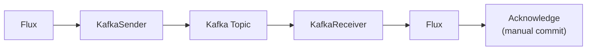

# Reactor Kafka — Reactive Kafka Client

[← Back to README](../README.md)

---

**Reactor Kafka** (`reactor-kafka`) is a reactive Kafka client built on Project Reactor. Unlike Spring Cloud Stream (which abstracts the broker behind `Function`/`Consumer` beans) or Kafka Streams (which is a stateful stream-processing DSL), Reactor Kafka gives you direct, low-level reactive control over producers and consumers using `KafkaSender` and `KafkaReceiver` with full backpressure support.



---

## Dependency

```xml
<dependency>
    <groupId>io.projectreactor.kafka</groupId>
    <artifactId>reactor-kafka</artifactId>
    <version>1.3.23</version>
</dependency>
```

---

## KafkaSender — Reactive Producer

```java
@Configuration
public class KafkaSenderConfig {

    @Bean
    public SenderOptions<String, String> senderOptions(
            @Value("${spring.kafka.bootstrap-servers}") String bootstrapServers) {

        return SenderOptions.<String, String>create(Map.of(
            ProducerConfig.BOOTSTRAP_SERVERS_CONFIG,  bootstrapServers,
            ProducerConfig.KEY_SERIALIZER_CLASS_CONFIG,   StringSerializer.class,
            ProducerConfig.VALUE_SERIALIZER_CLASS_CONFIG, StringSerializer.class,
            ProducerConfig.ACKS_CONFIG, "all",
            ProducerConfig.ENABLE_IDEMPOTENCE_CONFIG, "true"
        )).maxInFlight(512);
    }

    @Bean
    public KafkaSender<String, String> kafkaSender(
            SenderOptions<String, String> options) {
        return KafkaSender.create(options);
    }
}
```

```java
@Service
@RequiredArgsConstructor
public class OrderEventPublisher {

    private final KafkaSender<String, String> sender;
    private final ObjectMapper objectMapper;

    public Mono<Void> publishOrderPlaced(Order order) throws JsonProcessingException {
        String payload = objectMapper.writeValueAsString(order);

        SenderRecord<String, String, String> record = SenderRecord.create(
            new ProducerRecord<>("orders.placed", order.getId(), payload),
            order.getId()   // correlation metadata
        );

        return sender.send(Mono.just(record))
            .doOnNext(result -> log.info("Sent order {} to partition {} offset {}",
                result.correlationMetadata(),
                result.recordMetadata().partition(),
                result.recordMetadata().offset()))
            .doOnError(e -> log.error("Failed to send order {}", order.getId(), e))
            .then();
    }

    public Flux<SenderResult<String>> publishBatch(List<Order> orders) {
        Flux<SenderRecord<String, String, String>> records = Flux.fromIterable(orders)
            .map(order -> {
                try {
                    String payload = objectMapper.writeValueAsString(order);
                    return SenderRecord.create(
                        new ProducerRecord<>("orders.placed", order.getId(), payload),
                        order.getId());
                } catch (JsonProcessingException e) {
                    throw new RuntimeException(e);
                }
            });

        return sender.send(records);
    }
}
```

---

## KafkaReceiver — Reactive Consumer

```java
@Configuration
public class KafkaReceiverConfig {

    @Bean
    public ReceiverOptions<String, String> receiverOptions(
            @Value("${spring.kafka.bootstrap-servers}") String bootstrapServers) {

        return ReceiverOptions.<String, String>create(Map.of(
            ConsumerConfig.BOOTSTRAP_SERVERS_CONFIG,       bootstrapServers,
            ConsumerConfig.GROUP_ID_CONFIG,                "order-processor",
            ConsumerConfig.KEY_DESERIALIZER_CLASS_CONFIG,   StringDeserializer.class,
            ConsumerConfig.VALUE_DESERIALIZER_CLASS_CONFIG, StringDeserializer.class,
            ConsumerConfig.AUTO_OFFSET_RESET_CONFIG,        "earliest",
            ConsumerConfig.ENABLE_AUTO_COMMIT_CONFIG,       "false"   // manual commit
        )).subscription(Set.of("orders.placed"));
    }
}
```

```java
@Service
@RequiredArgsConstructor
@Slf4j
public class OrderEventConsumer implements ApplicationRunner {

    private final ReceiverOptions<String, String> receiverOptions;
    private final OrderProcessingService processingService;
    private final ObjectMapper objectMapper;

    @Override
    public void run(ApplicationArguments args) {
        KafkaReceiver.create(receiverOptions)
            .receive()
            .flatMap(this::processRecord, 8)   // 8 concurrent in-flight
            .doOnError(e -> log.error("Consumer pipeline error", e))
            .retry(Long.MAX_VALUE)              // restart on error
            .subscribe();
    }

    private Mono<Void> processRecord(ReceiverRecord<String, String> record) {
        return Mono.fromCallable(() -> objectMapper.readValue(record.value(), Order.class))
            .flatMap(processingService::process)
            .doOnSuccess(v -> {
                record.receiverOffset().acknowledge();   // commit after success
                log.info("Processed order {} from partition {} offset {}",
                    record.key(),
                    record.partition(),
                    record.offset());
            })
            .doOnError(e -> log.error("Failed to process record {}", record.key(), e))
            .onErrorResume(e -> {
                // Dead-letter: do not acknowledge → topic will be re-consumed on restart
                // Or send to DLQ manually:
                return sendToDlq(record).then();
            });
    }

    private Mono<Void> sendToDlq(ReceiverRecord<String, String> record) {
        // Route to orders.placed.DLT
        return Mono.empty();
    }
}
```

---

## Exactly-Once with Transactions

```java
@Bean
public SenderOptions<String, String> transactionalSenderOptions(
        @Value("${spring.kafka.bootstrap-servers}") String bootstrapServers) {

    return SenderOptions.<String, String>create(Map.of(
        ProducerConfig.BOOTSTRAP_SERVERS_CONFIG,          bootstrapServers,
        ProducerConfig.KEY_SERIALIZER_CLASS_CONFIG,       StringSerializer.class,
        ProducerConfig.VALUE_SERIALIZER_CLASS_CONFIG,     StringSerializer.class,
        ProducerConfig.TRANSACTIONAL_ID_CONFIG,           "order-tx-",
        ProducerConfig.ENABLE_IDEMPOTENCE_CONFIG,         "true",
        ProducerConfig.ACKS_CONFIG,                       "all"
    ));
}

// Exactly-once: read → process → write in a transaction
public Flux<SenderResult<Void>> processExactlyOnce(
        KafkaSender<String, String> txSender,
        KafkaReceiver<String, String> receiver) {

    return txSender.sendTransactionally(
        receiver.receiveExactlyOnce(txSender.transactionManager())
            .map(flux -> flux.map(record -> {
                SenderRecord<String, String, Void> out = SenderRecord.create(
                    new ProducerRecord<>("orders.processed", record.key(),
                        transform(record.value())),
                    null);
                return out;
            }))
    ).flatMap(flux -> flux);
}
```

---

## Backpressure and Concurrency Control

```java
KafkaReceiver.create(receiverOptions)
    .receive()
    // Process at most 4 records concurrently
    .flatMap(record -> processRecord(record), 4)
    // OR: process sequentially (no concurrency)
    .concatMap(record -> processRecord(record))
    // OR: process in parallel across partitions
    .groupBy(record -> record.partition())
    .flatMap(partitionFlux ->
        partitionFlux.concatMap(record -> processRecord(record)))
    .subscribe();
```

---

## Comparison: Reactor Kafka vs Spring Cloud Stream vs Kafka Streams

| Feature | Reactor Kafka | Spring Cloud Stream | Kafka Streams |
|---------|--------------|--------------------|-|
| Abstraction | Low (direct API) | High (Function beans) | Medium (DSL) |
| Backpressure | Full reactive | Partial | None (pull-based) |
| Offset control | Manual `acknowledge()` | Auto or ack-mode | Auto |
| Stateful ops | No | No | Yes (KTable, joins, windows) |
| Exactly-once | Yes (manual) | Configurable | Yes (built-in) |
| Best for | Full reactive pipelines | Quick integrations | Stream analytics |

---

## Reactor Kafka Summary

| Concept | Detail |
|---------|--------|
| `KafkaSender.create(options)` | Reactive producer; reuse a single instance (thread-safe) |
| `SenderRecord.create(record, correlationMeta)` | Wraps a `ProducerRecord` with metadata returned in `SenderResult` |
| `sender.send(flux)` → `Flux<SenderResult>` | Non-blocking send; contains offset/partition in result |
| `KafkaReceiver.create(options).receive()` | Returns `Flux<ReceiverRecord>` with backpressure |
| `record.receiverOffset().acknowledge()` | Manual commit after successful processing |
| `ENABLE_AUTO_COMMIT_CONFIG = false` | Required for manual offset control |
| `flatMap(..., concurrency)` | Limit concurrent in-flight record processing |
| `receiveExactlyOnce` | Exactly-once: ties consumer commits to producer transaction |
| `.retry(Long.MAX_VALUE)` | Re-subscribe consumer flux on error — prevents consumer death |
| `groupBy(partition)` + `concatMap` | Per-partition sequential processing — same as Kafka's ordering guarantee |

---

[← Back to README](../README.md)
