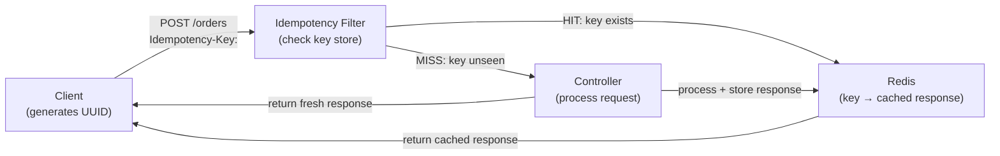

# API Idempotency Patterns

[← Back to README](../README.md)

---

An operation is **idempotent** if applying it multiple times produces the same result as applying it once. HTTP GET, PUT, and DELETE are inherently idempotent by definition. POST is not — submitting an order twice creates two orders. The solution is an **idempotency key**: a client-generated UUID attached to a request that the server uses to detect and replay duplicates without re-executing the operation.



---

## The Idempotency-Key Header

```http
POST /api/orders
Content-Type: application/json
Idempotency-Key: 7f9c2c3a-1234-4b6d-9a00-abcdef012345

{
  "productId": "SKU-001",
  "quantity": 2
}
```

The server stores `Idempotency-Key → response` and returns the same response on retries without re-processing the request.

---

## Redis-Backed Idempotency Filter

```java
@Component
@RequiredArgsConstructor
@Slf4j
public class IdempotencyFilter extends OncePerRequestFilter {

    private static final String HEADER        = "Idempotency-Key";
    private static final String KEY_PREFIX    = "idempotency:";
    private static final Duration TTL         = Duration.ofHours(24);
    private static final Duration LOCK_TTL    = Duration.ofSeconds(30);

    private final RedisTemplate<String, String> redis;
    private final ObjectMapper objectMapper;

    @Override
    protected void doFilterInternal(HttpServletRequest request,
                                     HttpServletResponse response,
                                     FilterChain chain)
            throws ServletException, IOException {

        String key = request.getHeader(HEADER);

        // Only POST requests need idempotency protection
        if (key == null || !request.getMethod().equals("POST")) {
            chain.doFilter(request, response);
            return;
        }

        validateKey(key);

        String redisKey  = KEY_PREFIX + key;
        String lockKey   = redisKey + ":lock";

        // Try to acquire a lock to prevent concurrent duplicates
        Boolean acquired = redis.opsForValue()
            .setIfAbsent(lockKey, "1", LOCK_TTL);

        if (Boolean.FALSE.equals(acquired)) {
            // Another thread is processing the same key right now
            response.setStatus(HttpStatus.CONFLICT.value());
            response.getWriter().write("{\"error\":\"Request in progress\"}");
            return;
        }

        try {
            String cached = redis.opsForValue().get(redisKey);
            if (cached != null) {
                // Replay cached response
                CachedResponse saved = objectMapper.readValue(cached, CachedResponse.class);
                response.setStatus(saved.status());
                response.setContentType(MediaType.APPLICATION_JSON_VALUE);
                response.getWriter().write(saved.body());
                log.debug("Idempotency cache hit for key {}", key);
                return;
            }

            // Capture response
            ContentCachingResponseWrapper wrapper =
                new ContentCachingResponseWrapper(response);
            chain.doFilter(request, wrapper);
            wrapper.copyBodyToResponse();

            // Only cache successful responses
            if (response.getStatus() < 500) {
                String body = new String(wrapper.getContentAsByteArray(),
                    StandardCharsets.UTF_8);
                CachedResponse toSave = new CachedResponse(response.getStatus(), body);
                redis.opsForValue().set(redisKey,
                    objectMapper.writeValueAsString(toSave), TTL);
            }
        } finally {
            redis.delete(lockKey);
        }
    }

    private void validateKey(String key) {
        try {
            UUID.fromString(key);
        } catch (IllegalArgumentException e) {
            throw new ResponseStatusException(HttpStatus.BAD_REQUEST,
                "Idempotency-Key must be a valid UUID");
        }
    }

    record CachedResponse(int status, String body) {}
}
```

---

## Registering the Filter

```java
@Configuration
public class FilterConfig {

    @Bean
    public FilterRegistrationBean<IdempotencyFilter> idempotencyFilter(
            IdempotencyFilter filter) {
        FilterRegistrationBean<IdempotencyFilter> bean = new FilterRegistrationBean<>(filter);
        bean.addUrlPatterns("/api/*");
        bean.setOrder(Ordered.HIGHEST_PRECEDENCE + 10);
        return bean;
    }
}
```

---

## Database-Backed Idempotency (Durable Across Restarts)

```sql
CREATE TABLE idempotency_keys (
    key          VARCHAR(36) PRIMARY KEY,
    status       INT         NOT NULL,
    response_body TEXT       NOT NULL,
    created_at   TIMESTAMPTZ NOT NULL DEFAULT NOW()
);

CREATE INDEX ON idempotency_keys (created_at);  -- for cleanup job
```

```java
@Entity
@Table(name = "idempotency_keys")
public class IdempotencyRecord {

    @Id
    private String key;
    private int status;

    @Column(columnDefinition = "TEXT")
    private String responseBody;

    private OffsetDateTime createdAt;

    @PrePersist
    void onCreate() { createdAt = OffsetDateTime.now(); }
}
```

---

## Conditional PUT with ETag — Natural Idempotency

PUT is supposed to be idempotent, but concurrent updates can cause lost writes. Combine PUT with `If-Match` to make it safe:

```java
@PutMapping("/orders/{id}/status")
public ResponseEntity<Order> updateStatus(
        @PathVariable Long id,
        @RequestBody UpdateStatusRequest request,
        @RequestHeader(HttpHeaders.IF_MATCH) String ifMatch) {

    Order order = orderRepo.findById(id)
        .orElseThrow(() -> new ResponseStatusException(HttpStatus.NOT_FOUND));

    String currentEtag = "\"" + order.getVersion() + "\"";
    if (!ifMatch.equals(currentEtag)) {
        // Client has a stale version — must GET the latest first
        return ResponseEntity.status(HttpStatus.PRECONDITION_FAILED).build();
    }

    order.setStatus(request.getStatus());
    Order saved = orderRepo.save(order);

    return ResponseEntity.ok()
        .eTag("\"" + saved.getVersion() + "\"")
        .body(saved);
}
```

---

## Client-Side: Retrying with the Same Key

```java
// Java HTTP client retrying safely
public Order placeOrder(PlaceOrderRequest request) {
    String idempotencyKey = UUID.randomUUID().toString();   // generate once, reuse on retry

    RetryPolicy<HttpResponse<String>> policy = RetryPolicy.<HttpResponse<String>>builder()
        .handleResultIf(r -> r.statusCode() >= 500)
        .withDelay(Duration.ofSeconds(1))
        .withMaxRetries(3)
        .build();

    return Failsafe.with(policy).get(() ->
        httpClient.send(
            HttpRequest.newBuilder()
                .uri(URI.create(baseUrl + "/api/orders"))
                .header("Content-Type", "application/json")
                .header("Idempotency-Key", idempotencyKey)   // same key every retry
                .POST(HttpRequest.BodyPublishers.ofString(toJson(request)))
                .build(),
            HttpResponse.BodyHandlers.ofString()
        ));
}
```

---

## Cleanup Job

```java
@Component
@RequiredArgsConstructor
public class IdempotencyKeyCleanup {

    private final IdempotencyKeyRepository repo;

    @Scheduled(cron = "0 0 3 * * *")   // 3am daily
    @Transactional
    public void deleteExpiredKeys() {
        OffsetDateTime cutoff = OffsetDateTime.now().minusHours(25);
        int deleted = repo.deleteByCreatedAtBefore(cutoff);
        log.info("Deleted {} expired idempotency keys", deleted);
    }
}
```

---

## API Idempotency Summary

| Concept | Detail |
|---------|--------|
| Idempotency-Key header | Client-generated UUID sent with every unsafe POST request |
| Cache hit | Server returns stored response without re-executing the handler |
| Lock on key | Prevent two concurrent requests with the same key from racing |
| `409 Conflict` | Return when the same key is in-flight on another thread |
| Redis TTL | 24 hours is a common window — balance between safety and storage |
| Database-backed | More durable than Redis (survives restarts); needed for financial operations |
| `If-Match` on PUT | Natural idempotency for updates; returns `412` if version mismatch |
| Client responsibility | Client MUST reuse the same key when retrying, not generate a new one |
| `ContentCachingResponseWrapper` | Spring class for capturing response body after the filter chain runs |
| Cleanup job | Purge expired keys to prevent unbounded table/Redis growth |

---

[← Back to README](../README.md)
