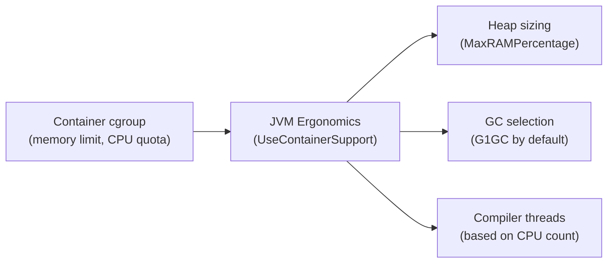

# JVM Ergonomics & Container Awareness

[← Back to README](../README.md)

---

**JVM Ergonomics** is the JVM's ability to auto-tune itself based on the host system. In containers, the JVM historically read the host machine's total RAM and CPU count rather than the container limits — causing severe overcommit and OOM kills. Since JDK 10, **`UseContainerSupport`** (enabled by default) makes the JVM respect `cgroup` limits. Understanding these flags is essential for stable, right-sized Kubernetes deployments.



---

## Container Support Flags

```bash
# UseContainerSupport is ON by default since JDK 10
# Disable only for debugging (never in production)
-XX:-UseContainerSupport

# Verify what the JVM sees
java -XX:+PrintFlagsFinal -version | grep -E "MaxRAM|UseContainerSupport|ActiveProcessor"
```

---

## Heap Sizing

```bash
# Default: JVM uses 25% of available RAM for max heap
# In a 512Mi container → ~128Mi heap — usually too small

# MaxRAMPercentage: preferred modern flag (replaces -Xmx for containers)
-XX:MaxRAMPercentage=75.0     # use 75% of container memory for heap
-XX:InitialRAMPercentage=50.0 # starting heap size
-XX:MinRAMPercentage=25.0     # minimum heap (used when total RAM < 200MB)

# Still valid — explicit absolute size overrides percentage
-Xmx512m -Xms256m
```

```yaml
# Kubernetes: set resource limits so JVM reads them from cgroups
resources:
  requests:
    memory: "512Mi"
    cpu: "500m"
  limits:
    memory: "512Mi"   # JVM reads this as total available RAM
    cpu: "1"
```

```dockerfile
# Dockerfile: pass JVM flags via JAVA_TOOL_OPTIONS (auto-picked up by JVM)
ENV JAVA_TOOL_OPTIONS="-XX:MaxRAMPercentage=75.0 -XX:+UseG1GC"
# OR via _JAVA_OPTIONS / JDK_JAVA_OPTIONS
```

---

## CPU Count and Thread Tuning

```bash
# JVM uses available processors to size thread pools:
# - ForkJoinPool.commonPool() size
# - JIT compiler thread count
# - G1GC concurrent worker threads

# CPU quota awareness (cgroups v2 / v1 with JDK 11+)
# Container with 0.5 CPU quota → JVM sees 1 processor (rounds up)

# Override JVM's processor count
-XX:ActiveProcessorCount=2    # force 2 cores visible to JVM

# Verify
java -XshowSettings:all -version 2>&1 | grep "cpu count"
```

```java
// Virtual thread executor ignores processor count — safe for I/O-heavy workloads
ExecutorService exec = Executors.newVirtualThreadPerTaskExecutor();

// Platform thread pool — scales with available processors
ExecutorService exec = Executors.newFixedThreadPool(
    Runtime.getRuntime().availableProcessors() * 2);
```

---

## GC Selection Heuristics

| Condition | Default GC |
|-----------|-----------|
| Single-core or heap < 1792 MB | Serial GC |
| Multi-core, any heap size | G1GC (default since JDK 9) |
| Explicitly configured | Whichever flag you pass |

```bash
# G1GC — good general-purpose default for containers
-XX:+UseG1GC
-XX:MaxGCPauseMillis=200       # target pause goal
-XX:G1HeapRegionSize=4m        # tune for heap size

# ZGC — ultra-low latency (sub-millisecond pauses), JDK 15+
-XX:+UseZGC
-XX:SoftMaxHeapSize=400m       # ZGC specific: soft limit before OOM

# Shenandoah — concurrent GC, JDK 12+ (Red Hat / OpenJDK builds)
-XX:+UseShenandoahGC

# Print GC decision
-XX:+PrintCommandLineFlags -version
```

---

## Diagnosing JVM's View of the Container

```bash
# Print all ergonomics decisions
java -XshowSettings:vm -version

# Sample output in a 512Mi / 2 CPU container:
# VM settings:
#   Max. Heap Size (Estimated): 123.75M   ← 25% of 512Mi (default)
#   Ergonomics Machine Class: server
#   Using VM: OpenJDK 64-Bit Server VM

# With -XX:MaxRAMPercentage=75.0:
# Max. Heap Size (Estimated): 371.25M   ← 75% of 512Mi
```

```java
// Programmatic check
Runtime rt = Runtime.getRuntime();
long maxHeap = rt.maxMemory();
int cpus     = rt.availableProcessors();

log.info("JVM max heap: {} MB, visible CPUs: {}",
    maxHeap / 1024 / 1024, cpus);
```

---

## Recommended Container Flags

```bash
# Spring Boot on Kubernetes — production baseline
JAVA_TOOL_OPTIONS="\
  -XX:MaxRAMPercentage=75.0 \
  -XX:InitialRAMPercentage=50.0 \
  -XX:+UseG1GC \
  -XX:MaxGCPauseMillis=200 \
  -XX:+HeapDumpOnOutOfMemoryError \
  -XX:HeapDumpPath=/tmp/heapdump.hprof \
  -Djava.security.egd=file:/dev/./urandom"

# For low-latency (ZGC, JDK 17+)
JAVA_TOOL_OPTIONS="\
  -XX:MaxRAMPercentage=75.0 \
  -XX:+UseZGC \
  -XX:+ZGenerational"

# For small containers (< 256Mi) where Serial GC is appropriate
JAVA_TOOL_OPTIONS="\
  -XX:MaxRAMPercentage=60.0 \
  -XX:+UseSerialGC"
```

---

## Common Pitfalls

```bash
# PITFALL 1: Setting -Xmx larger than container memory limit
# → Container OOM kill (not JVM OOM), no heap dump
# FIX: use MaxRAMPercentage=75 to leave room for metaspace + off-heap

# PITFALL 2: JDK < 10 in containers
# → JVM reads host RAM, allocates huge heap, gets OOM-killed
# FIX: upgrade to JDK 17+ or add -XX:MaxRAM=$(cat /sys/fs/cgroup/memory/memory.limit_in_bytes)

# PITFALL 3: CPU limits too low (e.g., 100m = 0.1 CPU)
# → JVM sees 1 CPU but JIT compilation starves the app
# FIX: request at least 500m CPU for JIT-compiled services

# PITFALL 4: Startup RAM spike exceeds limit
# → Container killed during class loading before heap settles
# FIX: set -XX:InitialRAMPercentage lower than MaxRAMPercentage
```

---

## JVM Ergonomics Summary

| Concept | Detail |
|---------|--------|
| `UseContainerSupport` | On by default (JDK 10+); reads cgroup limits instead of host RAM/CPU |
| `MaxRAMPercentage` | Percentage of container RAM for max heap — preferred over `-Xmx` in containers |
| `InitialRAMPercentage` | Starting heap percentage — set lower than max to reduce startup footprint |
| `ActiveProcessorCount` | Override CPU count visible to JVM thread-pool sizing |
| Default GC | G1GC for multi-core; Serial GC for single-core or very small heaps |
| `JAVA_TOOL_OPTIONS` | Environment variable read by every JVM process — safest way to pass flags in containers |
| `-XshowSettings:vm` | Print JVM's auto-selected settings at startup |
| Memory headroom | Leave 20–25% of container limit for metaspace, off-heap (Netty, mapped files, JVM internals) |
| CPU underprovisioning | `100m` CPU limit → JIT starved → throughput degraded; minimum `500m` for server workloads |
| OOM kill vs JVM OOM | Container OOM kill leaves no heap dump; always leave headroom and use `MaxRAMPercentage` |

---

[← Back to README](../README.md)
