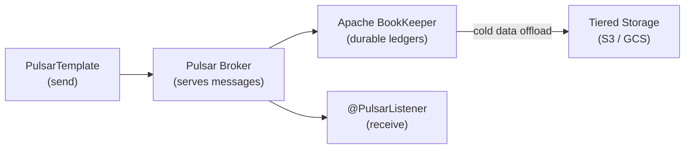

# Apache Pulsar with Spring Pulsar

[← Back to README](../README.md)

---

**Apache Pulsar** is a cloud-native, distributed messaging platform that separates the **serving layer** (brokers) from the **storage layer** (BookKeeper). This architecture enables instant scaling, topic offloading to tiered storage (S3), and geo-replication without the tight coupling of Kafka's partition-to-broker assignment. **Spring Pulsar** (part of Spring Boot since 3.2) provides `PulsarTemplate`, `@PulsarListener`, and reactive support via `ReactivePulsarTemplate`.



---

## Dependency

```xml
<dependency>
    <groupId>org.springframework.pulsar</groupId>
    <artifactId>spring-pulsar-spring-boot-starter</artifactId>
</dependency>
<!-- Version managed by Spring Boot BOM (3.2+) -->
```

---

## Configuration

```yaml
spring:
  pulsar:
    client:
      service-url: pulsar://localhost:6650
      # TLS:
      # service-url: pulsar+ssl://pulsar.example.com:6651
      # authentication:
      #   plugin-class-name: org.apache.pulsar.client.impl.auth.AuthenticationToken
      #   param: token:${PULSAR_JWT}
    producer:
      topic-name: persistent://public/default/orders
      batching-enabled: true
    consumer:
      subscription-name: order-processor
      subscription-type: Shared   # Shared | Exclusive | Key_Shared | Failover
```

---

## Sending Messages — PulsarTemplate

```java
@Service
@RequiredArgsConstructor
public class OrderEventPublisher {

    private final PulsarTemplate<Order> pulsarTemplate;

    public void publishOrderPlaced(Order order) {
        pulsarTemplate.send("persistent://public/default/orders.placed", order);
    }

    // With message properties
    public void publishWithMetadata(Order order) {
        pulsarTemplate.newMessage(order)
            .withTopic("persistent://public/default/orders.placed")
            .withMessageCustomizer(builder ->
                builder.key(order.getId())            // for Key_Shared routing
                       .property("ce-type", "com.example.order.placed")
                       .property("ce-id", UUID.randomUUID().toString())
                       .deliverAfter(0, TimeUnit.SECONDS))
            .send();
    }

    // Async send
    public CompletableFuture<MessageId> publishAsync(Order order) {
        return pulsarTemplate.sendAsync("persistent://public/default/orders.placed", order);
    }
}
```

---

## Receiving Messages — @PulsarListener

```java
@Component
@Slf4j
public class OrderEventConsumer {

    @PulsarListener(
        topics = "persistent://public/default/orders.placed",
        subscriptionName = "invoice-service-sub",
        subscriptionType = SubscriptionType.Shared,
        schemaType = SchemaType.JSON
    )
    public void onOrderPlaced(Order order, Message<Order> message) {
        log.info("Received order {} from topic {} (msgId: {})",
            order.getId(),
            message.getTopicName(),
            message.getMessageId());

        try {
            processOrder(order);
            // Message is acked automatically on method return (default)
        } catch (TransientException e) {
            // Negative ack → redelivery after redeliveryDelay
            throw e;
        }
    }

    @PulsarListener(
        topics = "persistent://public/default/orders.placed",
        subscriptionName = "inventory-service-sub",
        subscriptionType = SubscriptionType.Key_Shared,
        batch = true,                      // batch consumer
        schemaType = SchemaType.JSON,
        properties = {"receiverQueueSize=500"}
    )
    public void onOrderPlacedBatch(List<Order> orders) {
        log.info("Processing batch of {} orders", orders.size());
        orders.forEach(this::processOrder);
    }

    private void processOrder(Order order) { /* business logic */ }
}
```

---

## Schema Support

```java
// JSON schema (auto-inferred from type)
@PulsarListener(topics = "...", schemaType = SchemaType.JSON)
public void consume(Order order) { ... }

// Avro schema
@PulsarListener(topics = "...", schemaType = SchemaType.AVRO)
public void consume(Order order) { ... }

// String (default)
@PulsarListener(topics = "...", schemaType = SchemaType.STRING)
public void consume(String rawJson) { ... }

// Producing with explicit schema
pulsarTemplate.newMessage(order)
    .withSchema(Schema.JSON(Order.class))
    .withTopic("persistent://public/default/orders.placed")
    .send();
```

---

## Dead Letter Policy

```yaml
spring:
  pulsar:
    consumer:
      dead-letter-policy:
        max-redeliver-count: 3
        dead-letter-topic: persistent://public/default/orders.placed-DLQ
        initial-subscription-name: dlq-sub
```

```java
@PulsarListener(
    topics = "persistent://public/default/orders.placed-DLQ",
    subscriptionName = "dlq-processor-sub",
    schemaType = SchemaType.JSON
)
public void onDeadLetter(Order order, Message<Order> message) {
    log.error("Dead letter: order {} failed after {} redeliveries",
        order.getId(),
        message.getRedeliveryCount());
    // Alert, store for manual review, etc.
}
```

---

## Reactive Support

```java
@Service
@RequiredArgsConstructor
public class ReactiveOrderPublisher {

    private final ReactivePulsarTemplate<Order> reactivePulsarTemplate;

    public Mono<MessageId> publish(Order order) {
        return reactivePulsarTemplate.send(
            "persistent://public/default/orders.placed", order);
    }
}

@Component
public class ReactiveOrderConsumer {

    @ReactivePulsarListener(
        topics = "persistent://public/default/orders.placed",
        subscriptionName = "reactive-sub",
        schemaType = SchemaType.JSON
    )
    public Mono<Void> consume(Order order) {
        return Mono.fromRunnable(() -> processOrder(order));
    }
}
```

---

## Pulsar vs Kafka — Key Differences

| Feature | Apache Pulsar | Apache Kafka |
|---------|--------------|-------------|
| Storage layer | Apache BookKeeper (separate) | Broker-local (coupled) |
| Scaling | Brokers scale independently of storage | Partition reassignment required |
| Subscription types | Exclusive, Shared, Key_Shared, Failover | Consumer groups only |
| Message retention | Configurable TTL + size; tiered S3 offload | Retention by time or size per topic |
| Geo-replication | Built-in multi-cluster replication | Requires MirrorMaker 2 |
| Delayed delivery | Native `deliverAfter()` | Not native (use Kafka Streams) |
| Schema registry | Built-in (Pulsar Schema) | Confluent Schema Registry (external) |
| Spring integration | Spring Pulsar (Boot 3.2+) | Spring Kafka / Spring Cloud Stream |

---

## Spring Pulsar Summary

| Concept | Detail |
|---------|--------|
| `PulsarTemplate` | Synchronous and async message sending |
| `@PulsarListener` | Annotation-driven consumer; auto-acks on normal return |
| `SubscriptionType.Shared` | Multiple consumers share a subscription (competing consumers) |
| `SubscriptionType.Key_Shared` | All messages with the same key go to the same consumer |
| `SubscriptionType.Exclusive` | Only one consumer per subscription at a time |
| `SchemaType.JSON` | Auto-serializes/deserializes POJOs; no separate schema registry needed |
| Dead letter policy | `maxRedeliverCount` before routing to DLQ topic |
| `ReactivePulsarTemplate` | Reactor-based `Mono<MessageId>` send |
| `@ReactivePulsarListener` | Reactive consumer returning `Mono<Void>` |
| Tiered storage | Offload cold ledgers to S3/GCS transparently; no consumer changes required |

---

[← Back to README](../README.md)
