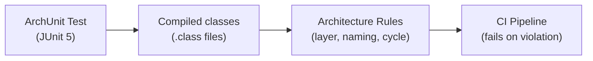

# ArchUnit — Architecture Testing

[← Back to README](../README.md)

---

**ArchUnit** is a Java library for writing automated tests that enforce architectural rules. Instead of relying on documentation or code reviews to catch layer violations, you encode rules as JUnit tests: "services must not depend on controllers," "repositories must only be called from services," "classes annotated with `@Entity` must live in the `domain` package." ArchUnit inspects bytecode at test time — no runtime agent required.



---

## Dependency

```xml
<dependency>
    <groupId>com.tngtech.archunit</groupId>
    <artifactId>archunit-junit5</artifactId>
    <version>1.3.0</version>
    <scope>test</scope>
</dependency>
```

---

## Basic Setup

```java
@AnalyzeClasses(packages = "com.example")
class ArchitectureTest {

    // Import all classes in the package once — reused across all @ArchTest fields
}
```

---

## Layer Dependency Rules

```java
@AnalyzeClasses(packages = "com.example")
class LayeredArchitectureTest {

    @ArchTest
    static final ArchRule layeredArchitecture = layeredArchitecture()
        .consideringOnlyDependenciesInLayers()
        .layer("Controller").definedBy("..controller..")
        .layer("Service")   .definedBy("..service..")
        .layer("Repository").definedBy("..repository..")
        .layer("Domain")    .definedBy("..domain..")

        .whereLayer("Controller").mayNotBeAccessedByAnyLayer()
        .whereLayer("Service")   .mayOnlyBeAccessedByLayers("Controller")
        .whereLayer("Repository").mayOnlyBeAccessedByLayers("Service")
        .whereLayer("Domain")    .mayOnlyBeAccessedByLayers("Controller", "Service", "Repository");

    @ArchTest
    static final ArchRule noControllerToRepository = noClasses()
        .that().resideInAPackage("..controller..")
        .should().accessClassesThat().resideInAPackage("..repository..");
}
```

---

## Hexagonal Architecture Rules

```java
@AnalyzeClasses(packages = "com.example")
class HexagonalArchitectureTest {

    @ArchTest
    static final ArchRule domainHasNoFrameworkDependencies = noClasses()
        .that().resideInAPackage("..domain..")
        .should().dependOnClassesThat()
            .resideInAnyPackage(
                "org.springframework..",
                "javax.persistence..",
                "jakarta.persistence.."
            );

    @ArchTest
    static final ArchRule portsOnlyInDomain = classes()
        .that().haveNameMatching(".*Port")
        .should().resideInAPackage("..domain.port..");

    @ArchTest
    static final ArchRule adaptersDoNotDependOnEachOther = noClasses()
        .that().resideInAPackage("..adapter..")
        .should().dependOnClassesThat()
            .resideInAPackage("..adapter..")
        .because("Adapters must communicate through domain ports, not directly");
}
```

---

## Naming Convention Rules

```java
@AnalyzeClasses(packages = "com.example")
class NamingConventionTest {

    @ArchTest
    static final ArchRule servicesShouldBeSuffixed = classes()
        .that().areAnnotatedWith(Service.class)
        .should().haveSimpleNameEndingWith("Service");

    @ArchTest
    static final ArchRule repositoriesShouldExtendJpaRepository = classes()
        .that().haveSimpleNameEndingWith("Repository")
        .and().areInterfaces()
        .should().beAssignableTo(JpaRepository.class);

    @ArchTest
    static final ArchRule controllersShouldBeAnnotated = classes()
        .that().haveSimpleNameEndingWith("Controller")
        .should().beAnnotatedWith(RestController.class);

    @ArchTest
    static final ArchRule dtosShouldNotHaveBusinessLogic = noMethods()
        .that().areDeclaredInClassesThat().haveSimpleNameEndingWith("Dto")
        .should().haveRawReturnType(matching(".*Service.*"));
}
```

---

## Cycle Detection

```java
@AnalyzeClasses(packages = "com.example")
class CycleTest {

    @ArchTest
    static final ArchRule noCyclesBetweenPackages =
        slices().matching("com.example.(*)..").should().beFreeOfCycles();

    // More fine-grained: specific modules
    @ArchTest
    static final ArchRule orderModuleNoCycles =
        slices().matching("com.example.order.(*)..").should().beFreeOfCycles();
}
```

---

## Annotation and Inheritance Rules

```java
@AnalyzeClasses(packages = "com.example")
class AnnotationRuleTest {

    @ArchTest
    static final ArchRule entitiesMustHaveNoArgConstructor = classes()
        .that().areAnnotatedWith(Entity.class)
        .should().haveADeclaredConstructor()
        .because("JPA requires a no-arg constructor for proxying");

    @ArchTest
    static final ArchRule noPublicFieldsInEntities = noFields()
        .that().areDeclaredInClassesThat().areAnnotatedWith(Entity.class)
        .should().bePublic();

    @ArchTest
    static final ArchRule exceptionsShouldExtendRuntimeException = classes()
        .that().haveSimpleNameEndingWith("Exception")
        .should().beAssignableTo(RuntimeException.class);
}
```

---

## Custom Conditions and Predicates

```java
@AnalyzeClasses(packages = "com.example")
class CustomRuleTest {

    static ArchCondition<JavaClass> haveALoggerField =
        new ArchCondition<>("have a Logger field") {
            @Override
            public void check(JavaClass clazz, ConditionEvents events) {
                boolean hasLogger = clazz.getFields().stream()
                    .anyMatch(f -> f.getRawType().isAssignableTo(Logger.class)
                               || f.getRawType().isAssignableTo(org.slf4j.Logger.class));
                if (!hasLogger) {
                    events.add(SimpleConditionEvent.violated(clazz,
                        clazz.getName() + " does not have a Logger field"));
                }
            }
        };

    @ArchTest
    static final ArchRule servicesMustHaveLogger = classes()
        .that().areAnnotatedWith(Service.class)
        .should(haveALoggerField);
}
```

---

## Running Specific Rules Programmatically

```java
@Test
void enforceLayering() {
    JavaClasses classes = new ClassFileImporter()
        .withImportOption(ImportOption.Predefined.DO_NOT_INCLUDE_TESTS)
        .importPackages("com.example");

    ArchRule rule = noClasses()
        .that().resideInAPackage("..service..")
        .should().accessClassesThat().resideInAPackage("..controller..");

    rule.check(classes);
}
```

---

## ArchUnit Summary

| Concept | Detail |
|---------|--------|
| `@AnalyzeClasses` | Declares the package to scan; shared across all `@ArchTest` fields in the class |
| `@ArchTest` | Static field holding an `ArchRule`; auto-run by JUnit 5 |
| `layeredArchitecture()` | DSL for declaring layers and which may access which |
| `noClasses().that()...should()` | Negative rule: assert no class matching condition violates the constraint |
| `classes().that()...should()` | Positive rule: assert all matching classes satisfy the constraint |
| `slices().matching(...).beFreeOfCycles()` | Detect circular package dependencies |
| `ClassFileImporter` | Programmatic import with fine-grained control (exclude tests, specific paths) |
| `ArchCondition` | Custom condition for rules that can't be expressed with the built-in DSL |
| `DO_NOT_INCLUDE_TESTS` | Exclude test classes from the analysed set |
| Domain isolation | Enforce that domain classes have zero framework imports — key for hexagonal architecture |

---

[← Back to README](../README.md)
