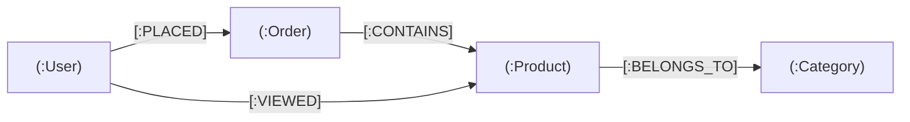

# Spring Data Neo4j

[← Back to README](../README.md)

---

**Neo4j** is a native graph database. Instead of foreign keys and join tables, data is stored as **nodes** (entities) connected by **relationships** (edges) with **properties** on both. This makes it natural for social networks, recommendation engines, fraud detection, knowledge graphs, and any domain where connections between things are as important as the things themselves. **Spring Data Neo4j** (SDN) provides `@Node`, `@Relationship`, repositories, and a Cypher-backed `Neo4jTemplate`.



---

## Dependency

```xml
<dependency>
    <groupId>org.springframework.boot</groupId>
    <artifactId>spring-boot-starter-data-neo4j</artifactId>
</dependency>
```

```yaml
spring:
  neo4j:
    uri: bolt://localhost:7687
    authentication:
      username: neo4j
      password: ${NEO4J_PASSWORD}
```

---

## Node Entities

```java
@Node("User")
public class UserNode {

    @Id @GeneratedValue
    private Long id;

    @Property("name")
    private String name;

    @Property("email")
    private String email;

    // Outgoing relationships
    @Relationship(type = "PLACED", direction = Relationship.Direction.OUTGOING)
    private List<OrderNode> orders = new ArrayList<>();

    @Relationship(type = "FOLLOWS", direction = Relationship.Direction.OUTGOING)
    private Set<UserNode> following = new HashSet<>();
}

@Node("Product")
public class ProductNode {

    @Id @GeneratedValue
    private Long id;

    private String sku;
    private String name;
    private BigDecimal price;

    @Relationship(type = "BELONGS_TO")
    private CategoryNode category;
}

@Node("Order")
public class OrderNode {

    @Id @GeneratedValue
    private Long id;

    private String orderNumber;
    private OffsetDateTime placedAt;

    @Relationship(type = "CONTAINS")
    private List<OrderLine> lines = new ArrayList<>();
}
```

---

## Relationship with Properties

```java
// Relationship entity — for when the edge itself carries data
@RelationshipProperties
public class OrderLine {

    @RelationshipId
    private Long id;

    private int quantity;
    private BigDecimal unitPrice;

    @TargetNode
    private ProductNode product;
}
```

---

## Repository

```java
public interface UserNodeRepository extends Neo4jRepository<UserNode, Long> {

    // Derived query (translates to Cypher MATCH)
    Optional<UserNode> findByEmail(String email);

    List<UserNode> findByNameContaining(String namePart);

    // Custom Cypher query
    @Query("MATCH (u:User)-[:FOLLOWS*1..3]->(suggested:User) " +
           "WHERE u.email = $email " +
           "AND NOT (u)-[:FOLLOWS]->(suggested) " +
           "RETURN suggested LIMIT 10")
    List<UserNode> findSuggestedConnections(@Param("email") String email);

    // Traversal: find products ordered by friends
    @Query("MATCH (u:User {email: $email})-[:FOLLOWS]->(friend:User)-[:PLACED]->(o:Order)-[:CONTAINS]->(p:Product) " +
           "RETURN DISTINCT p ORDER BY p.name")
    List<ProductNode> findProductsOrderedByFriends(@Param("email") String email);
}
```

---

## Neo4jTemplate — Programmatic Queries

```java
@Service
@RequiredArgsConstructor
public class RecommendationService {

    private final Neo4jTemplate neo4jTemplate;
    private final Neo4jClient neo4jClient;

    // Cypher with result mapping
    public List<ProductNode> recommendForUser(String email) {
        return neo4jTemplate.findAll(
            "MATCH (u:User {email: $email})-[:PLACED]->(:Order)-[:CONTAINS]->(p:Product) " +
            "MATCH (other:User)-[:PLACED]->(:Order)-[:CONTAINS]->(p) " +
            "MATCH (other)-[:PLACED]->(:Order)-[:CONTAINS]->(rec:Product) " +
            "WHERE NOT (u)-[:PLACED]->(:Order)-[:CONTAINS]->(rec) " +
            "RETURN rec, count(*) AS score ORDER BY score DESC LIMIT 5",
            Map.of("email", email),
            ProductNode.class);
    }

    // Raw Cypher returning scalar values
    public long countFriendsOfFriends(Long userId) {
        return neo4jClient.query(
            "MATCH (u:User)-[:FOLLOWS*2]->(fof:User) WHERE id(u) = $id RETURN count(DISTINCT fof)")
            .bind(userId).to("id")
            .fetchAs(Long.class)
            .one()
            .orElse(0L);
    }

    // Shortest path between two users
    public Optional<List<String>> shortestPath(String fromEmail, String toEmail) {
        return neo4jClient.query(
            "MATCH p = shortestPath((a:User {email: $from})-[:FOLLOWS*]-(b:User {email: $to})) " +
            "RETURN [node IN nodes(p) | node.name] AS names")
            .bind(fromEmail).to("from")
            .bind(toEmail).to("to")
            .fetchAs(List.class)
            .one()
            .map(o -> (List<String>) o);
    }
}
```

---

## Transactions

```java
@Service
@RequiredArgsConstructor
public class OrderGraphService {

    private final UserNodeRepository userRepo;
    private final ProductNodeRepository productRepo;
    private final OrderNodeRepository orderRepo;

    @Transactional
    public OrderNode placeOrder(String userEmail, List<String> skus) {
        UserNode user = userRepo.findByEmail(userEmail)
            .orElseThrow(() -> new UserNotFoundException(userEmail));

        OrderNode order = new OrderNode();
        order.setOrderNumber(UUID.randomUUID().toString());
        order.setPlacedAt(OffsetDateTime.now());

        for (String sku : skus) {
            ProductNode product = productRepo.findBySku(sku)
                .orElseThrow(() -> new ProductNotFoundException(sku));
            OrderLine line = new OrderLine(1, product.getPrice(), product);
            order.getLines().add(line);
        }

        OrderNode saved = orderRepo.save(order);
        user.getOrders().add(saved);
        userRepo.save(user);   // persists the PLACED relationship
        return saved;
    }
}
```

---

## Testcontainers Integration

```java
@SpringBootTest
@Testcontainers
class Neo4jIntegrationTest {

    @Container
    static Neo4jContainer<?> neo4j = new Neo4jContainer<>("neo4j:5")
        .withoutAuthentication();

    @DynamicPropertySource
    static void neo4jProperties(DynamicPropertyRegistry registry) {
        registry.add("spring.neo4j.uri", neo4j::getBoltUrl);
        registry.add("spring.neo4j.authentication.username", () -> "neo4j");
        registry.add("spring.neo4j.authentication.password", () -> "");
    }

    @Autowired UserNodeRepository userRepo;

    @Test
    void shouldFindFollowers() {
        UserNode alice = userRepo.save(new UserNode("Alice", "alice@example.com"));
        UserNode bob   = userRepo.save(new UserNode("Bob",   "bob@example.com"));
        alice.getFollowing().add(bob);
        userRepo.save(alice);

        List<UserNode> suggestions = userRepo.findSuggestedConnections("alice@example.com");
        // further assertions
    }
}
```

---

## Cypher Cheat Sheet

```cypher
-- Create nodes and relationship
CREATE (u:User {name: 'Alice', email: 'alice@example.com'})
CREATE (p:Product {sku: 'SKU-001', name: 'Widget'})
CREATE (u)-[:VIEWED {at: datetime()}]->(p)

-- Match with traversal
MATCH (u:User)-[:PLACED]->(:Order)-[:CONTAINS]->(p:Product)
WHERE u.email = 'alice@example.com'
RETURN p.name, count(*) AS timesPurchased

-- Variable-length path
MATCH path = (a:User)-[:FOLLOWS*1..3]->(b:User)
WHERE a.email = 'alice@example.com'
RETURN b.name

-- Shortest path
MATCH p = shortestPath((a:User)-[*]-(b:User))
WHERE a.email = 'alice@example.com' AND b.email = 'bob@example.com'
RETURN p
```

---

## Spring Data Neo4j Summary

| Concept | Detail |
|---------|--------|
| `@Node` | Marks a class as a Neo4j node entity |
| `@Relationship` | Declares an edge; `direction = OUTGOING/INCOMING` |
| `@RelationshipProperties` | Edge entity with its own fields; `@TargetNode` points to the other end |
| `Neo4jRepository<T, ID>` | CRUD repository with Cypher-backed derived queries |
| `@Query("MATCH ...")` | Custom Cypher query on a repository method |
| `Neo4jTemplate.findAll(cypher, params, type)` | Execute Cypher and map results to a node class |
| `Neo4jClient` | Raw Cypher with fluent binding; returns scalars, maps, or domain objects |
| `shortestPath((a)-[*]-(b))` | Cypher function for graph traversal — no SQL equivalent |
| `@Transactional` | Standard Spring transaction — Neo4j supports ACID transactions |
| `Neo4jContainer` | Testcontainers module for spinning up Neo4j in integration tests |

---

[← Back to README](../README.md)
