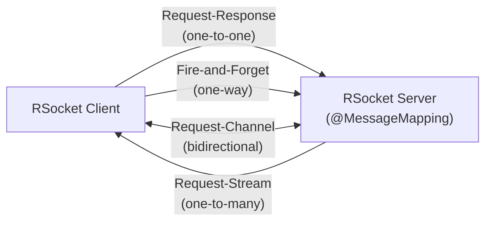

# RSocket — Reactive Streaming Protocol

[← Back to README](../README.md)

---

**RSocket** is a binary, multiplexed, reactive application protocol that runs over TCP, WebSocket, or Aeron. Unlike HTTP/1.1 (one request/response per connection) or even HTTP/2 (multiplexed but request-driven), RSocket supports **four interaction models** — including server-to-client push and bidirectional channels — all with backpressure at the protocol level. Spring Boot integrates RSocket via `spring-boot-starter-rsocket`.



---

## Dependency

```xml
<dependency>
    <groupId>org.springframework.boot</groupId>
    <artifactId>spring-boot-starter-rsocket</artifactId>
</dependency>
```

```yaml
spring:
  rsocket:
    server:
      port: 7000
      transport: tcp   # or websocket
```

---

## Server — @MessageMapping

```java
@Controller
@Slf4j
public class OrderRSocketController {

    private final OrderService orderService;
    private final Sinks.Many<OrderEvent> eventSink =
        Sinks.many().multicast().onBackpressureBuffer();

    public OrderRSocketController(OrderService orderService) {
        this.orderService = orderService;
    }

    // 1. Request-Response — one Mono in, one Mono out
    @MessageMapping("orders.find")
    public Mono<Order> findOrder(String orderId) {
        return orderService.findById(orderId);
    }

    // 2. Fire-and-Forget — returns Mono<Void>
    @MessageMapping("orders.cancel")
    public Mono<Void> cancelOrder(String orderId) {
        return orderService.cancel(orderId)
            .doOnSuccess(v -> log.info("Cancelled order {}", orderId));
    }

    // 3. Request-Stream — returns Flux (server pushes to client)
    @MessageMapping("orders.stream")
    public Flux<Order> streamOrders(String customerId) {
        return orderService.streamByCustomer(customerId)
            .doOnSubscribe(s -> log.info("Client subscribed to orders for {}", customerId));
    }

    // 4. Request-Channel — bidirectional Flux in, Flux out
    @MessageMapping("orders.process")
    public Flux<OrderResult> processOrders(Flux<PlaceOrderRequest> requests) {
        return requests.flatMap(orderService::place);
    }

    // Publish event to all subscribers (server-push pattern)
    @MessageMapping("orders.subscribe")
    public Flux<OrderEvent> subscribeToEvents() {
        return eventSink.asFlux();
    }

    public void publishEvent(OrderEvent event) {
        eventSink.tryEmitNext(event);
    }
}
```

---

## Client — RSocketRequester

```java
@Configuration
public class RSocketClientConfig {

    @Bean
    public RSocketRequester rSocketRequester(
            RSocketRequester.Builder builder,
            @Value("${rsocket.server.host:localhost}") String host,
            @Value("${rsocket.server.port:7000}") int port) {

        return builder
            .dataMimeType(MediaType.APPLICATION_JSON)
            .tcp(host, port);
    }
}
```

```java
@Service
@RequiredArgsConstructor
public class OrderRSocketClient {

    private final RSocketRequester requester;

    // Request-Response
    public Mono<Order> findOrder(String orderId) {
        return requester
            .route("orders.find")
            .data(orderId)
            .retrieveMono(Order.class);
    }

    // Fire-and-Forget
    public Mono<Void> cancelOrder(String orderId) {
        return requester
            .route("orders.cancel")
            .data(orderId)
            .send();
    }

    // Request-Stream
    public Flux<Order> streamOrders(String customerId) {
        return requester
            .route("orders.stream")
            .data(customerId)
            .retrieveFlux(Order.class);
    }

    // Request-Channel
    public Flux<OrderResult> processOrders(Flux<PlaceOrderRequest> requests) {
        return requester
            .route("orders.process")
            .data(requests, PlaceOrderRequest.class)
            .retrieveFlux(OrderResult.class);
    }

    // Subscribe to server-push events
    public Flux<OrderEvent> subscribeToEvents() {
        return requester
            .route("orders.subscribe")
            .retrieveFlux(OrderEvent.class)
            .doOnNext(e -> log.info("Received event: {}", e));
    }
}
```

---

## Security

```java
@Configuration
@EnableRSocketSecurity
public class RSocketSecurityConfig {

    @Bean
    public RSocketMessageHandler messageHandler(
            RSocketStrategies strategies) {
        RSocketMessageHandler handler = new RSocketMessageHandler();
        handler.getArgumentResolverConfigurer().addCustomResolver(
            new AuthenticationPrincipalArgumentResolver());
        handler.setRSocketStrategies(strategies);
        return handler;
    }

    @Bean
    public PayloadSocketAcceptorInterceptor rsocketInterceptor(
            RSocketSecurity security) {
        return security
            .authorizePayload(authorize -> authorize
                .route("orders.find").authenticated()
                .route("orders.stream").hasRole("USER")
                .route("orders.cancel").hasRole("ADMIN")
                .anyExchange().permitAll()
            )
            .jwt(Customizer.withDefaults())
            .build();
    }
}

// Controller with authenticated principal
@MessageMapping("orders.stream")
public Flux<Order> streamOrders(String customerId,
                                 @AuthenticationPrincipal Jwt jwt) {
    log.info("Stream requested by {}", jwt.getSubject());
    return orderService.streamByCustomer(customerId);
}
```

---

## Error Handling

```java
@MessageMapping("orders.find")
public Mono<Order> findOrder(String orderId) {
    return orderService.findById(orderId)
        .switchIfEmpty(Mono.error(
            new RSocketException(RSocketErrorCode.APPLICATION_ERROR,
                "Order not found: " + orderId)));
}

// Client-side error handling
public Mono<Order> findOrderSafe(String orderId) {
    return requester
        .route("orders.find")
        .data(orderId)
        .retrieveMono(Order.class)
        .onErrorMap(RSocketException.class,
            e -> new OrderNotFoundException(orderId));
}
```

---

## Testing RSocket Endpoints

```java
@SpringBootTest
@TestMethodOrder(MethodOrderer.OrderAnnotation.class)
class OrderRSocketControllerTest {

    @Autowired
    private RSocketRequester.Builder requesterBuilder;

    @LocalRSocketServerPort
    private int port;

    private RSocketRequester requester;

    @BeforeEach
    void setup() {
        requester = requesterBuilder.tcp("localhost", port);
    }

    @AfterEach
    void tearDown() {
        requester.rsocketClient().dispose();
    }

    @Test
    void requestResponse() {
        StepVerifier.create(
            requester.route("orders.find")
                     .data("ORD-001")
                     .retrieveMono(Order.class))
            .expectNextMatches(o -> "ORD-001".equals(o.getId()))
            .verifyComplete();
    }

    @Test
    void requestStream() {
        StepVerifier.create(
            requester.route("orders.stream")
                     .data("customer-123")
                     .retrieveFlux(Order.class)
                     .take(3))
            .expectNextCount(3)
            .verifyComplete();
    }
}
```

---

## RSocket vs WebSocket vs HTTP/2

| Feature | HTTP/2 | WebSocket | RSocket |
|---------|--------|-----------|---------|
| Multiplexing | Yes | No (per connection) | Yes |
| Backpressure | No | No | Yes (protocol-level) |
| Interaction models | Request-Response | Bidirectional only | 4 models |
| Server push | Limited | Yes | Yes |
| Binary protocol | Yes (HPACK) | Optional | Yes (always) |
| Spring integration | RestClient / WebClient | `@MessageMapping` (Stomp) | `@MessageMapping` (RSocket) |

---

## RSocket Summary

| Concept | Detail |
|---------|--------|
| Request-Response | `retrieveMono(Type.class)` — one payload in, one payload out |
| Fire-and-Forget | `.send()` — no response; fire events without waiting |
| Request-Stream | `retrieveFlux(Type.class)` — server pushes a stream after one request |
| Request-Channel | `data(Flux, Type)` + `retrieveFlux` — bidirectional streaming |
| `@MessageMapping("route")` | Server method mapped to an RSocket route string |
| `RSocketRequester` | Client fluent API: `.route()`, `.data()`, `.retrieveMono/Flux()` |
| `Sinks.many().multicast()` | Hot publisher for broadcasting events to multiple subscribers |
| `@EnableRSocketSecurity` | Enables JWT or Simple authentication on RSocket connections |
| `@LocalRSocketServerPort` | Injects the random port bound in tests |
| `StepVerifier` + RSocket | Standard Project Reactor testing tool for asserting stream contents |

---

[← Back to README](../README.md)
