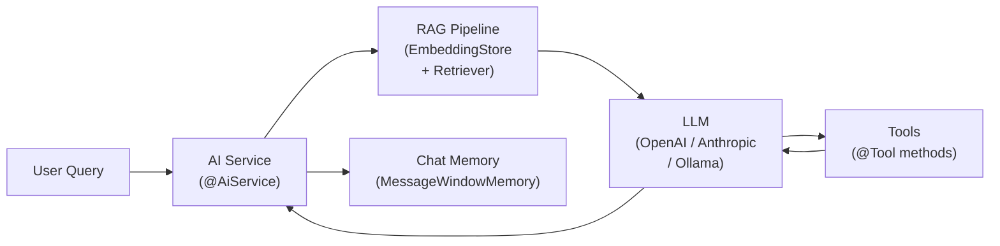

# LangChain4j — LLM Integration for Java

[← Back to README](../README.md)

---

**LangChain4j** is a Java framework for building LLM-powered applications. It provides a unified API over multiple AI providers (OpenAI, Anthropic, Google Gemini, Ollama, and more), plus higher-level abstractions: prompt templates, conversation memory, RAG (Retrieval-Augmented Generation), AI Services, and tool calling. It complements Spring AI with a different design philosophy — interface-driven AI Services and a rich RAG pipeline.



---

## Dependencies

```xml
<!-- Core + OpenAI -->
<dependency>
    <groupId>dev.langchain4j</groupId>
    <artifactId>langchain4j-spring-boot-starter</artifactId>
    <version>0.32.0</version>
</dependency>
<dependency>
    <groupId>dev.langchain4j</groupId>
    <artifactId>langchain4j-open-ai-spring-boot-starter</artifactId>
    <version>0.32.0</version>
</dependency>

<!-- For RAG with embeddings -->
<dependency>
    <groupId>dev.langchain4j</groupId>
    <artifactId>langchain4j-embeddings-all-minilm-l6-v2-q</artifactId>
    <version>0.32.0</version>
</dependency>
```

```yaml
langchain4j:
  open-ai:
    chat-model:
      api-key: ${OPENAI_API_KEY}
      model-name: gpt-4o-mini
      temperature: 0.7
      max-tokens: 1000
    embedding-model:
      api-key: ${OPENAI_API_KEY}
      model-name: text-embedding-3-small
```

---

## AI Service — Interface-Driven

```java
// 1. Define the AI service interface
@AiService
public interface OrderAssistant {

    @SystemMessage("You are a helpful order support assistant for Acme Corp. " +
                   "Be concise and professional.")
    String chat(@MemoryId String userId, @UserMessage String userMessage);

    @SystemMessage("Classify the following customer message as: COMPLAINT, INQUIRY, COMPLIMENT, or OTHER. " +
                   "Respond with only the category name.")
    String classify(@UserMessage String message);

    @SystemMessage("Extract order details from the user message.")
    @UserMessage("Extract from: {{message}}")
    OrderDetails extractOrderDetails(@V("message") String message);
}

// 2. Register memory and use the service
@Configuration
public class AiConfig {

    @Bean
    public ChatMemoryProvider chatMemoryProvider() {
        return memoryId -> MessageWindowChatMemory.withMaxMessages(20);
    }
}

// 3. Inject and use
@RestController
@RequiredArgsConstructor
@RequestMapping("/api/chat")
public class ChatController {

    private final OrderAssistant assistant;

    @PostMapping
    public String chat(@RequestParam String userId,
                       @RequestBody String message) {
        return assistant.chat(userId, message);
    }

    @PostMapping("/classify")
    public String classify(@RequestBody String message) {
        return assistant.classify(message);
    }
}
```

---

## Prompt Templates

```java
@Service
public class ProductDescriptionService {

    private final ChatLanguageModel chatModel;

    public ProductDescriptionService(ChatLanguageModel chatModel) {
        this.chatModel = chatModel;
    }

    public String generateDescription(Product product) {
        PromptTemplate template = PromptTemplate.from(
            "Write a compelling product description for {{name}}. " +
            "Key features: {{features}}. " +
            "Target audience: {{audience}}. " +
            "Length: 2-3 sentences. Tone: {{tone}}.");

        Prompt prompt = template.apply(Map.of(
            "name",     product.getName(),
            "features", String.join(", ", product.getFeatures()),
            "audience", product.getTargetAudience(),
            "tone",     "professional yet friendly"
        ));

        return chatModel.generate(prompt.toUserMessage()).content().text();
    }
}
```

---

## Tool Calling (Function Calling)

```java
// Define tools as regular methods annotated with @Tool
@Component
public class OrderTools {

    private final OrderRepository orderRepo;
    private final InventoryService inventoryService;

    @Tool("Get order status by order ID")
    public String getOrderStatus(@P("The order ID") String orderId) {
        return orderRepo.findById(orderId)
            .map(o -> "Order " + orderId + " is " + o.getStatus())
            .orElse("Order not found: " + orderId);
    }

    @Tool("Check if a product is in stock")
    public boolean checkInventory(
            @P("Product SKU") String sku,
            @P("Requested quantity") int quantity) {
        return inventoryService.isAvailable(sku, quantity);
    }

    @Tool("Cancel an order")
    public String cancelOrder(@P("Order ID to cancel") String orderId) {
        orderRepo.findById(orderId).ifPresent(o -> {
            o.setStatus(OrderStatus.CANCELLED);
            orderRepo.save(o);
        });
        return "Order " + orderId + " has been cancelled";
    }
}

// Wire tools into the AI service
@AiService(tools = OrderTools.class)
public interface OrderAssistant {
    @SystemMessage("You are an order support agent. Use the available tools to help customers.")
    String chat(@MemoryId String sessionId, @UserMessage String message);
}
```

---

## RAG — Retrieval-Augmented Generation

```java
@Configuration
public class RagConfig {

    @Bean
    public EmbeddingStore<TextSegment> embeddingStore() {
        return new InMemoryEmbeddingStore<>();
        // Production: use PgVectorEmbeddingStore, ChromaEmbeddingStore, WeaviateEmbeddingStore, etc.
    }

    @Bean
    public EmbeddingModel embeddingModel() {
        return new AllMiniLmL6V2QuantizedEmbeddingModel();  // local, no API key
    }

    @Bean
    public ContentRetriever contentRetriever(EmbeddingStore<TextSegment> store,
                                              EmbeddingModel model) {
        return EmbeddingStoreContentRetriever.builder()
            .embeddingStore(store)
            .embeddingModel(model)
            .maxResults(3)
            .minScore(0.7)
            .build();
    }
}

// Index documents
@Service
@RequiredArgsConstructor
public class KnowledgeBaseService {

    private final EmbeddingModel embeddingModel;
    private final EmbeddingStore<TextSegment> embeddingStore;

    public void ingestDocument(String text, Map<String, String> metadata) {
        List<TextSegment> segments = new DocumentSplitter()
            .split(Document.from(text, Metadata.from(metadata)));

        List<Embedding> embeddings = embeddingModel.embedAll(segments).content();
        embeddingStore.addAll(embeddings, segments);
        log.info("Indexed {} segments", segments.size());
    }
}

// RAG-powered AI service
@AiService(contentRetriever = ContentRetriever.class)
public interface SupportAssistant {
    @SystemMessage("You are a support agent. Use only the provided context to answer. " +
                   "If you don't know, say so.")
    String answer(@UserMessage String question);
}
```

---

## Structured Output Extraction

```java
public record OrderDetails(
    String orderId,
    String customerName,
    List<String> products,
    BigDecimal total
) {}

@AiService
public interface DataExtractor {

    @UserMessage("Extract order details from the following text:\n{{text}}")
    OrderDetails extractOrder(@V("text") String text);

    @UserMessage("Analyse the sentiment of: {{text}}. Return: POSITIVE, NEGATIVE, or NEUTRAL")
    Sentiment analyseSentiment(@V("text") String text);
}

enum Sentiment { POSITIVE, NEGATIVE, NEUTRAL }
```

---

## Streaming Responses

```java
@AiService
public interface StreamingAssistant {
    TokenStream chat(@MemoryId String sessionId, @UserMessage String message);
}

// In a controller — stream tokens to client via SSE
@GetMapping(value = "/chat/stream", produces = MediaType.TEXT_EVENT_STREAM_VALUE)
public Flux<String> streamChat(@RequestParam String sessionId,
                                @RequestParam String message) {
    return Flux.create(sink ->
        streamingAssistant.chat(sessionId, message)
            .onNext(sink::next)
            .onComplete(response -> sink.complete())
            .onError(sink::error)
            .start());
}
```

---

## LangChain4j Summary

| Concept | Detail |
|---------|--------|
| `@AiService` | Marks an interface as an AI service; LangChain4j generates an implementation |
| `@SystemMessage` | Sets the system prompt on a service method |
| `@UserMessage` | Template for the user turn; use `{{variable}}` placeholders |
| `@MemoryId` | Parameter that scopes conversation memory (e.g., session ID, user ID) |
| `@V("name")` | Binds a method parameter to a `{{name}}` placeholder in the template |
| `@Tool` | Marks a method as a tool the LLM can call (function calling) |
| `@P` | Describes a tool parameter to the LLM |
| `ContentRetriever` | Retrieves relevant chunks from `EmbeddingStore` to inject into the prompt (RAG) |
| `EmbeddingStore` | Vector store (in-memory, pgvector, Chroma, Weaviate, etc.) |
| `TokenStream` | Streaming interface; attach `.onNext()`, `.onComplete()`, `.onError()` callbacks |
| Structured output | Return a Java record from an `@AiService` method; LangChain4j parses JSON from the LLM |

---

[← Back to README](../README.md)
