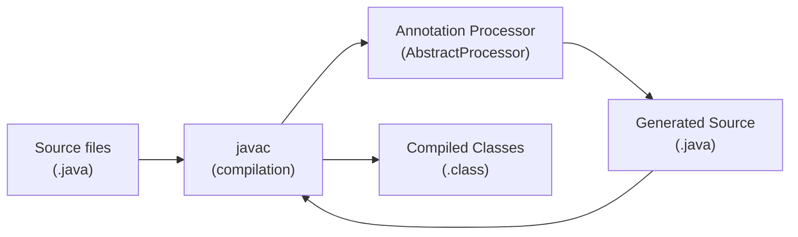

# Java Annotation Processing (APT)

[← Back to README](../README.md)

---

**Annotation Processing** (APT — Annotation Processing Tool) runs during `javac` compilation. Processors inspect annotated source elements and can generate new source files or class files — without modifying the originals. This is how Lombok generates getters/setters, MapStruct generates mappers, and Dagger generates dependency injection code. Writing your own processor lets you enforce compile-time contracts, generate boilerplate, and produce configuration metadata.



---

## How Processors Are Discovered

```
src/main/resources/
└── META-INF/services/
    └── javax.annotation.processing.Processor
        # one processor class per line:
        com.example.apt.BuilderProcessor
```

Or with the `@AutoService` annotation (from Google Auto):

```xml
<dependency>
    <groupId>com.google.auto.service</groupId>
    <artifactId>auto-service</artifactId>
    <version>1.1.1</version>
</dependency>
```

---

## Writing a Custom Annotation

```java
// The annotation that developers will use
@Target(ElementType.TYPE)
@Retention(RetentionPolicy.SOURCE)   // only needed at compile time
public @interface GenerateBuilder {
    // no elements needed — processor derives everything from the class
}
```

---

## Writing the Processor

```java
@AutoService(Processor.class)
@SupportedAnnotationTypes("com.example.apt.GenerateBuilder")
@SupportedSourceVersion(SourceVersion.RELEASE_21)
public class BuilderProcessor extends AbstractProcessor {

    @Override
    public boolean process(Set<? extends TypeElement> annotations,
                           RoundEnvironment roundEnv) {

        for (TypeElement annotation : annotations) {
            for (Element element : roundEnv.getElementsAnnotatedWith(annotation)) {

                if (element.getKind() != ElementKind.CLASS) {
                    processingEnv.getMessager().printMessage(
                        Diagnostic.Kind.ERROR,
                        "@GenerateBuilder can only be applied to classes",
                        element);
                    continue;
                }

                TypeElement classElement = (TypeElement) element;
                generateBuilder(classElement);
            }
        }

        return true;   // claim these annotations — don't pass to other processors
    }

    private void generateBuilder(TypeElement classElement) {
        String className    = classElement.getSimpleName().toString();
        String packageName  = processingEnv.getElementUtils()
            .getPackageOf(classElement).getQualifiedName().toString();

        List<VariableElement> fields = ElementFilter.fieldsIn(classElement.getEnclosedElements());

        StringBuilder sb = new StringBuilder();
        sb.append("package ").append(packageName).append(";\n\n");
        sb.append("public class ").append(className).append("Builder {\n\n");

        // Fields
        for (VariableElement field : fields) {
            sb.append("    private ").append(field.asType()).append(" ")
              .append(field.getSimpleName()).append(";\n");
        }
        sb.append("\n");

        // Setter methods
        for (VariableElement field : fields) {
            String name = field.getSimpleName().toString();
            sb.append("    public ").append(className).append("Builder ")
              .append(name).append("(").append(field.asType()).append(" ").append(name).append(") {\n");
            sb.append("        this.").append(name).append(" = ").append(name).append(";\n");
            sb.append("        return this;\n");
            sb.append("    }\n\n");
        }

        // build() method
        sb.append("    public ").append(className).append(" build() {\n");
        sb.append("        ").append(className).append(" obj = new ").append(className).append("();\n");
        for (VariableElement field : fields) {
            String name = field.getSimpleName().toString();
            sb.append("        obj.set").append(Character.toUpperCase(name.charAt(0)))
              .append(name.substring(1)).append("(this.").append(name).append(");\n");
        }
        sb.append("        return obj;\n");
        sb.append("    }\n}\n");

        // Write the generated file
        try {
            JavaFileObject file = processingEnv.getFiler()
                .createSourceFile(packageName + "." + className + "Builder");
            try (Writer writer = file.openWriter()) {
                writer.write(sb.toString());
            }
        } catch (IOException e) {
            processingEnv.getMessager().printMessage(
                Diagnostic.Kind.ERROR, "Failed to generate builder: " + e.getMessage());
        }
    }
}
```

---

## Using the Generated Builder

```java
// User code
@GenerateBuilder
public class Order {
    private String id;
    private String customerId;
    private BigDecimal total;
    // getters and setters...
}

// Usage — the builder class is generated at compile time
Order order = new OrderBuilder()
    .id(UUID.randomUUID().toString())
    .customerId("customer-123")
    .total(BigDecimal.valueOf(99.99))
    .build();
```

---

## Compile-Time Validation with Messager

```java
@AutoService(Processor.class)
@SupportedAnnotationTypes("com.example.apt.Validated")
@SupportedSourceVersion(SourceVersion.RELEASE_21)
public class ValidationProcessor extends AbstractProcessor {

    @Override
    public boolean process(Set<? extends TypeElement> annotations, RoundEnvironment roundEnv) {
        for (Element element : roundEnv.getElementsAnnotatedWith(Validated.class)) {

            // Error: stops compilation
            if (element.getKind() != ElementKind.INTERFACE) {
                processingEnv.getMessager().printMessage(
                    Diagnostic.Kind.ERROR,
                    "@Validated may only be applied to interfaces",
                    element);
            }

            // Warning: compiles but warns
            if (!element.getSimpleName().toString().endsWith("Service")) {
                processingEnv.getMessager().printMessage(
                    Diagnostic.Kind.WARNING,
                    "Service interfaces should end with 'Service'",
                    element);
            }

            // Note: informational
            processingEnv.getMessager().printMessage(
                Diagnostic.Kind.NOTE,
                "Processing @Validated on " + element.getSimpleName());
        }
        return true;
    }
}
```

---

## Generating Spring Configuration Metadata

```java
// Processors can generate META-INF/spring/autoconfigure-metadata.properties
// and META-INF/spring-configuration-metadata.json for IDE completion
// This is exactly how spring-boot-configuration-processor works

@AutoService(Processor.class)
@SupportedAnnotationTypes("org.springframework.boot.context.properties.ConfigurationProperties")
public class ConfigMetadataProcessor extends AbstractProcessor {

    @Override
    public boolean process(Set<? extends TypeElement> annotations, RoundEnvironment roundEnv) {
        // Generate IDE metadata for @ConfigurationProperties classes
        // Spring Boot's own processor does this automatically when you add:
        // spring-boot-configuration-processor to annotationProcessorPaths
        return false;
    }
}
```

---

## Maven Configuration

```xml
<build>
    <plugins>
        <plugin>
            <groupId>org.apache.maven.plugins</groupId>
            <artifactId>maven-compiler-plugin</artifactId>
            <configuration>
                <annotationProcessorPaths>
                    <!-- Your custom processor -->
                    <path>
                        <groupId>com.example</groupId>
                        <artifactId>my-annotation-processor</artifactId>
                        <version>1.0.0</version>
                    </path>
                    <!-- Standard processors -->
                    <path>
                        <groupId>org.projectlombok</groupId>
                        <artifactId>lombok</artifactId>
                    </path>
                    <path>
                        <groupId>org.mapstruct</groupId>
                        <artifactId>mapstruct-processor</artifactId>
                    </path>
                </annotationProcessorPaths>
            </configuration>
        </plugin>
    </plugins>
</build>
```

---

## Testing a Processor with Compile Testing

```xml
<dependency>
    <groupId>com.google.testing.compile</groupId>
    <artifactId>compile-testing</artifactId>
    <version>0.21.0</version>
    <scope>test</scope>
</dependency>
```

```java
@Test
void generatesBuilderForAnnotatedClass() {
    JavaFileObject source = JavaFileObjects.forSourceString("com.example.Order", """
        package com.example;
        import com.example.apt.GenerateBuilder;

        @GenerateBuilder
        public class Order {
            private String id;
            private String customerId;
        }
        """);

    Compilation compilation = Compiler.javac()
        .withProcessors(new BuilderProcessor())
        .compile(source);

    assertThat(compilation).succeeded();
    assertThat(compilation).generatedSourceFile("com.example.OrderBuilder");
}

@Test
void failsWhenAppliedToInterface() {
    JavaFileObject source = JavaFileObjects.forSourceString("com.example.IOrder", """
        package com.example;
        import com.example.apt.GenerateBuilder;

        @GenerateBuilder
        public interface IOrder {}
        """);

    Compilation compilation = Compiler.javac()
        .withProcessors(new BuilderProcessor())
        .compile(source);

    assertThat(compilation).failed();
    assertThat(compilation).hadErrorContaining("can only be applied to classes");
}
```

---

## Annotation Processing Summary

| Concept | Detail |
|---------|--------|
| `AbstractProcessor` | Base class; override `process(annotations, roundEnv)` |
| `@SupportedAnnotationTypes` | Declares which annotation FQNs this processor handles; supports `*` wildcard |
| `@SupportedSourceVersion` | Declares Java language version compatibility |
| `RoundEnvironment` | Provides elements annotated with your annotation in this round |
| `Filer.createSourceFile(name)` | Writes a new `.java` source file into the generated sources directory |
| `Messager.printMessage(Kind, msg, element)` | ERROR stops compilation; WARNING, NOTE are informational |
| `@AutoService` | Generates `META-INF/services/javax.annotation.processing.Processor` automatically |
| `@Retention(SOURCE)` | Annotation only needed at compile time — stripped from bytecode |
| Multi-round processing | Processor runs multiple rounds; generated files may trigger further rounds |
| `compile-testing` | Google library for unit-testing processors against source strings |

---

[← Back to README](../README.md)
