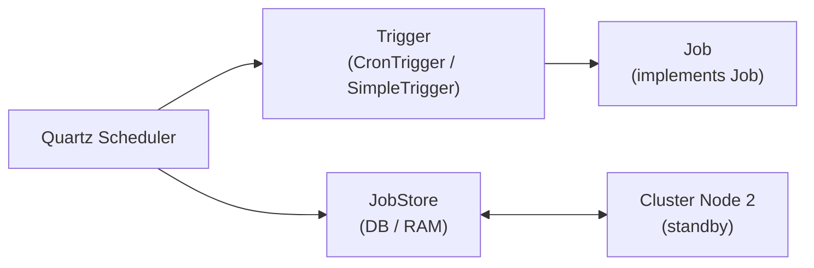

# Quartz Scheduler Deep Dive

[← Back to README](../README.md)

---

**Quartz** is a full-featured job scheduling library that goes far beyond Spring's `@Scheduled`. It persists job state to a database (JDBC JobStore), supports clustered execution across multiple nodes, provides rich trigger types (cron, simple, calendar), and fires job listeners and trigger listeners. Use Quartz when you need durable jobs that survive restarts, clustered scheduling with leader election, or dynamic runtime scheduling of new jobs.



---

## Dependency

```xml
<dependency>
    <groupId>org.springframework.boot</groupId>
    <artifactId>spring-boot-starter-quartz</artifactId>
</dependency>
```

---

## Configuration — JDBC JobStore (Clustered)

```yaml
spring:
  quartz:
    job-store-type: jdbc           # persists to database
    jdbc:
      initialize-schema: always    # creates Quartz tables on startup
    properties:
      org.quartz:
        scheduler:
          instanceId: AUTO         # unique ID per node
          instanceName: MyCluster
        jobStore:
          class: org.quartz.impl.jdbcjobstore.JobStoreTX
          driverDelegateClass: org.quartz.impl.jdbcjobstore.PostgreSQLDelegate
          isClustered: true
          clusterCheckinInterval: 10000   # ms between cluster heartbeats
          tablePrefix: QRTZ_
        threadPool:
          threadCount: 10
```

---

## Defining a Job

```java
@Component
@PersistJobDataAfterExecution   // save JobDataMap changes back to store
@DisallowConcurrentExecution    // only one instance runs at a time per job key
@Slf4j
public class ReportGenerationJob implements Job {

    // Spring beans can be injected via AutowiringSpringBeanJobFactory
    @Autowired
    private ReportService reportService;

    @Override
    public void execute(JobExecutionContext context) throws JobExecutionException {
        JobDataMap data = context.getMergedJobDataMap();
        String reportType = data.getString("reportType");
        String tenantId   = data.getString("tenantId");

        log.info("Generating {} report for tenant {}", reportType, tenantId);

        try {
            reportService.generate(reportType, tenantId);

            // Store result in JobDataMap (persisted because of @PersistJobDataAfterExecution)
            context.getJobDetail().getJobDataMap().put("lastRun", Instant.now().toString());

        } catch (ReportGenerationException e) {
            // Wrap in JobExecutionException to control retry behaviour
            throw new JobExecutionException(e, true);   // true = re-fire immediately
        }
    }
}
```

---

## Scheduling Jobs Programmatically

```java
@Service
@RequiredArgsConstructor
public class JobSchedulingService {

    private final Scheduler scheduler;

    public void scheduleReport(String tenantId, String cronExpression) throws SchedulerException {
        JobKey jobKey     = JobKey.jobKey("report-" + tenantId, "reports");
        TriggerKey trigKey = TriggerKey.triggerKey("trigger-" + tenantId, "reports");

        // Remove existing if rescheduling
        if (scheduler.checkExists(jobKey)) {
            scheduler.deleteJob(jobKey);
        }

        JobDetail job = JobBuilder.newJob(ReportGenerationJob.class)
            .withIdentity(jobKey)
            .withDescription("Daily report for tenant " + tenantId)
            .usingJobData("reportType", "DAILY_SUMMARY")
            .usingJobData("tenantId", tenantId)
            .storeDurably()
            .build();

        CronTrigger trigger = TriggerBuilder.newTrigger()
            .withIdentity(trigKey)
            .forJob(job)
            .withSchedule(CronScheduleBuilder
                .cronSchedule(cronExpression)           // e.g. "0 0 6 * * ?"
                .withMisfireHandlingInstructionFireAndProceed())
            .startNow()
            .build();

        scheduler.scheduleJob(job, trigger);
        log.info("Scheduled report job for tenant {} with cron '{}'", tenantId, cronExpression);
    }

    public void scheduleOneTime(String tenantId, Instant runAt) throws SchedulerException {
        JobDetail job = JobBuilder.newJob(ReportGenerationJob.class)
            .withIdentity("one-time-" + UUID.randomUUID(), "reports")
            .usingJobData("tenantId", tenantId)
            .build();

        SimpleTrigger trigger = TriggerBuilder.newTrigger()
            .startAt(Date.from(runAt))
            .withSchedule(SimpleScheduleBuilder.simpleSchedule())
            .build();

        scheduler.scheduleJob(job, trigger);
    }

    public void pauseJob(String tenantId) throws SchedulerException {
        scheduler.pauseJob(JobKey.jobKey("report-" + tenantId, "reports"));
    }

    public void resumeJob(String tenantId) throws SchedulerException {
        scheduler.resumeJob(JobKey.jobKey("report-" + tenantId, "reports"));
    }

    public void deleteJob(String tenantId) throws SchedulerException {
        scheduler.deleteJob(JobKey.jobKey("report-" + tenantId, "reports"));
    }
}
```

---

## Declaring Jobs via Spring Boot Auto-configuration

```java
@Configuration
public class QuartzConfig {

    @Bean
    public JobDetail dailyReportJobDetail() {
        return JobBuilder.newJob(ReportGenerationJob.class)
            .withIdentity("dailyReport", "reports")
            .usingJobData("reportType", "DAILY")
            .storeDurably()
            .build();
    }

    @Bean
    public Trigger dailyReportTrigger(JobDetail dailyReportJobDetail) {
        return TriggerBuilder.newTrigger()
            .forJob(dailyReportJobDetail)
            .withIdentity("dailyReportTrigger", "reports")
            .withSchedule(CronScheduleBuilder.dailyAtHourAndMinute(6, 0))
            .build();
    }
}
```

---

## Job and Trigger Listeners

```java
@Component
public class JobAuditListener implements JobListener {

    @Override
    public String getName() { return "jobAuditListener"; }

    @Override
    public void jobToBeExecuted(JobExecutionContext context) {
        log.info("Job starting: {}", context.getJobDetail().getKey());
    }

    @Override
    public void jobWasExecuted(JobExecutionContext context,
                                JobExecutionException ex) {
        if (ex != null) {
            log.error("Job failed: {} — {}", context.getJobDetail().getKey(), ex.getMessage());
            // Alert, store failure, etc.
        } else {
            log.info("Job completed: {} in {}ms",
                context.getJobDetail().getKey(),
                context.getJobRunTime());
        }
    }

    @Override
    public void jobExecutionVetoed(JobExecutionContext context) {
        log.warn("Job vetoed by trigger listener: {}", context.getJobDetail().getKey());
    }
}

// Register the listener
@Configuration
@RequiredArgsConstructor
public class QuartzListenerConfig implements SchedulerFactoryBeanCustomizer {

    private final JobAuditListener auditListener;

    @Override
    public void customize(SchedulerFactoryBean factory) {
        factory.setGlobalJobListeners(auditListener);
    }
}
```

---

## Misfire Handling

```java
// Misfire = trigger fires while scheduler is down or job thread pool is full

// CronTrigger: fire once and carry on
CronScheduleBuilder.cronSchedule("0 0 6 * * ?")
    .withMisfireHandlingInstructionFireAndProceed();

// CronTrigger: skip misfired executions, wait for next
CronScheduleBuilder.cronSchedule("0 0 6 * * ?")
    .withMisfireHandlingInstructionDoNothing();

// SimpleTrigger: fire once now, then resume normal schedule
SimpleScheduleBuilder.simpleSchedule()
    .withIntervalInSeconds(30)
    .withMisfireHandlingInstructionFireNow();
```

---

## Quartz vs @Scheduled

| Feature | `@Scheduled` | Quartz |
|---------|-------------|--------|
| Persistence | No — lost on restart | Yes — JDBC store |
| Clustering | No (each node fires) | Yes — only one node fires |
| Dynamic scheduling | No (recompile to change) | Yes — runtime API |
| Job data | Not supported | `JobDataMap` |
| Listeners | No | JobListener, TriggerListener, SchedulerListener |
| Misfire handling | None | Configurable per trigger |
| Complexity | Low | Medium-High |

---

## Quartz Scheduler Summary

| Concept | Detail |
|---------|--------|
| `Job` interface | Single `execute(context)` method; re-implement for each job type |
| `@DisallowConcurrentExecution` | Prevents simultaneous execution of the same job key across cluster nodes |
| `@PersistJobDataAfterExecution` | Saves `JobDataMap` changes after each run — useful for storing state |
| `JobDetail` | Holds job class, identity, and data; created with `JobBuilder` |
| `CronTrigger` | Fires on a cron expression; `CronScheduleBuilder.cronSchedule("0 0 6 * * ?")` |
| `SimpleTrigger` | Fires at a fixed interval or once; `SimpleScheduleBuilder.repeatSecondlyForever(30)` |
| `JobStoreTX` | JDBC-backed persistent store; creates `QRTZ_*` tables in your database |
| `isClustered: true` | Enables cluster-safe locking so only one node executes per trigger firing |
| `Scheduler.scheduleJob` | Dynamically add/update jobs and triggers at runtime |
| Misfire | A trigger fire that was missed while the scheduler was down; handle explicitly |

---

[← Back to README](../README.md)
