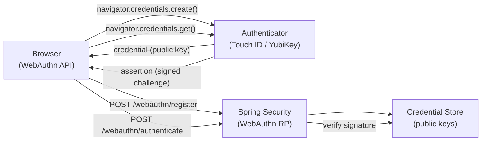

# WebAuthn & Passkeys

[← Back to README](../README.md)

---

**WebAuthn** (Web Authentication API, part of FIDO2) allows users to authenticate with biometrics, hardware security keys, or platform authenticators (Face ID, Windows Hello) instead of passwords. A **passkey** is a synced WebAuthn credential stored in a password manager (iCloud Keychain, Google Password Manager). Spring Security 6.3 added native WebAuthn support, eliminating the need for third-party libraries.



---

## Dependency

```xml
<!-- Spring Security WebAuthn requires Spring Boot 3.3+ / Spring Security 6.3+ -->
<dependency>
    <groupId>org.springframework.boot</groupId>
    <artifactId>spring-boot-starter-security</artifactId>
</dependency>
<!-- WebAuthn support is included in spring-security-web 6.3+ -->
```

---

## Security Configuration

```java
@Configuration
@EnableWebSecurity
public class WebAuthnSecurityConfig {

    @Bean
    public SecurityFilterChain securityFilterChain(HttpSecurity http) throws Exception {
        http
            .authorizeHttpRequests(auth -> auth
                .requestMatchers("/login", "/register", "/webauthn/**").permitAll()
                .anyRequest().authenticated()
            )
            .formLogin(Customizer.withDefaults())   // fallback password login
            .webAuthn(webAuthn -> webAuthn
                .rpName("Acme Corp")
                .rpId("acme.example.com")           // must match the domain
                .allowedOrigins("https://acme.example.com")
            );
        return http.build();
    }

    @Bean
    public UserDetailsService userDetailsService() {
        // Your existing user store
        return new JdbcUserDetailsManager(dataSource());
    }

    // Spring Security stores WebAuthn credentials here
    @Bean
    public UserCredentialRepository userCredentialRepository(JdbcTemplate jdbcTemplate) {
        return new JdbcUserCredentialRepository(jdbcTemplate);
    }
}
```

---

## Database Schema for Credentials

```sql
-- Spring Security creates this table for WebAuthn public keys
CREATE TABLE user_credentials (
    id                  BYTEA        PRIMARY KEY,
    user_entity_user_id BYTEA        NOT NULL,
    public_key          BYTEA        NOT NULL,
    signature_count     BIGINT       NOT NULL DEFAULT 0,
    uvInitialized       BOOLEAN      NOT NULL DEFAULT FALSE,
    backup_eligible     BOOLEAN      NOT NULL DEFAULT FALSE,
    backup_state        BOOLEAN      NOT NULL DEFAULT FALSE,
    attestation_object  BYTEA,
    attestation_client_data_json BYTEA,
    label               TEXT         NOT NULL,
    last_used           TIMESTAMPTZ,
    created             TIMESTAMPTZ  NOT NULL DEFAULT NOW()
);

CREATE INDEX idx_credentials_user_id ON user_credentials (user_entity_user_id);
```

---

## Registration Flow — Frontend

```javascript
// 1. Request registration options from server
const optionsResponse = await fetch('/webauthn/register/options', {
    method: 'POST',
    headers: {'Content-Type': 'application/json', 'X-CSRF-TOKEN': csrfToken}
});
const options = await optionsResponse.json();

// 2. Create credential on authenticator (prompts biometric / security key)
const credential = await navigator.credentials.create({publicKey: options});

// 3. Send credential to server for verification and storage
await fetch('/webauthn/register', {
    method: 'POST',
    headers: {'Content-Type': 'application/json', 'X-CSRF-TOKEN': csrfToken},
    body: JSON.stringify({
        id:       credential.id,
        rawId:    bufferToBase64Url(credential.rawId),
        type:     credential.type,
        response: {
            clientDataJSON:    bufferToBase64Url(credential.response.clientDataJSON),
            attestationObject: bufferToBase64Url(credential.response.attestationObject)
        }
    })
});
```

---

## Authentication Flow — Frontend

```javascript
// 1. Request authentication options (server sends a challenge)
const optionsResponse = await fetch('/webauthn/authenticate/options', {
    method: 'POST',
    headers: {'Content-Type': 'application/json', 'X-CSRF-TOKEN': csrfToken},
    body: JSON.stringify({username: document.getElementById('username').value})
});
const options = await optionsResponse.json();

// 2. Get assertion from authenticator (biometric prompt)
const assertion = await navigator.credentials.get({publicKey: options});

// 3. Send assertion to server for verification
await fetch('/webauthn/authenticate', {
    method: 'POST',
    headers: {'Content-Type': 'application/json', 'X-CSRF-TOKEN': csrfToken},
    body: JSON.stringify({
        id:       assertion.id,
        rawId:    bufferToBase64Url(assertion.rawId),
        type:     assertion.type,
        response: {
            clientDataJSON:    bufferToBase64Url(assertion.response.clientDataJSON),
            authenticatorData: bufferToBase64Url(assertion.response.authenticatorData),
            signature:         bufferToBase64Url(assertion.response.signature)
        }
    })
});
```

---

## Custom Credential Label Management

```java
@RestController
@RequiredArgsConstructor
@RequestMapping("/api/credentials")
public class CredentialController {

    private final UserCredentialRepository credentialRepository;

    @GetMapping
    public List<CredentialInfo> listCredentials(@AuthenticationPrincipal UserDetails user) {
        return credentialRepository.findByUserId(user.getUsername()).stream()
            .map(c -> new CredentialInfo(c.getCredentialId(), c.getLabel(), c.getLastUsed()))
            .collect(Collectors.toList());
    }

    @DeleteMapping("/{credentialId}")
    public ResponseEntity<Void> removeCredential(
            @PathVariable String credentialId,
            @AuthenticationPrincipal UserDetails user) {
        credentialRepository.delete(credentialId, user.getUsername());
        return ResponseEntity.noContent().build();
    }

    @PatchMapping("/{credentialId}/label")
    public ResponseEntity<Void> renameCredential(
            @PathVariable String credentialId,
            @RequestBody @Valid RenameCredentialRequest request,
            @AuthenticationPrincipal UserDetails user) {
        credentialRepository.updateLabel(credentialId, user.getUsername(), request.label());
        return ResponseEntity.ok().build();
    }

    record CredentialInfo(String id, String label, Instant lastUsed) {}
    record RenameCredentialRequest(@NotBlank String label) {}
}
```

---

## Testing WebAuthn

```java
@SpringBootTest
@AutoConfigureMockMvc
class WebAuthnRegistrationTest {

    @Autowired MockMvc mvc;

    @Test
    @WithMockUser(username = "alice")
    void registrationOptionsReturnChallenge() throws Exception {
        mvc.perform(post("/webauthn/register/options")
               .with(csrf()))
           .andExpect(status().isOk())
           .andExpect(jsonPath("$.challenge").exists())
           .andExpect(jsonPath("$.rp.name").value("Acme Corp"))
           .andExpect(jsonPath("$.rp.id").value("acme.example.com"));
    }
}
```

---

## WebAuthn vs Traditional Auth

| Feature | Password | WebAuthn / Passkey |
|---------|----------|--------------------|
| Phishing resistant | No | Yes — bound to origin |
| Brute-forceable | Yes | No — asymmetric crypto |
| Credential stuffing | Vulnerable | Not applicable |
| Server breach exposure | Password hashes exposed | Only public keys (useless without device) |
| UX | Type password | Tap / biometric |
| Multi-device | Yes | Yes (synced passkeys) |
| Offline authenticator | No | Yes (device-local) |

---

## WebAuthn & Passkeys Summary

| Concept | Detail |
|---------|--------|
| FIDO2 / WebAuthn | W3C + FIDO Alliance standard; passwordless authentication via public-key cryptography |
| Passkey | Synced WebAuthn credential (iCloud / Google / Windows); discoverable cross-device |
| RP (Relying Party) | Your server; identified by `rpId` (must match the page's eTLD+1) |
| `navigator.credentials.create()` | Browser API to create a new credential (registration) |
| `navigator.credentials.get()` | Browser API to assert a credential (authentication) |
| Challenge | Server-generated random nonce; prevents replay attacks |
| Public key storage | Server stores only the public key — private key never leaves the device |
| `webAuthn(rpName, rpId)` | Spring Security 6.3+ DSL for configuring the relying party |
| `UserCredentialRepository` | Spring Security SPI for storing/retrieving WebAuthn public keys |
| Attestation | Optional: verify the authenticator's origin (device manufacturer certificate) |

---

[← Back to README](../README.md)
