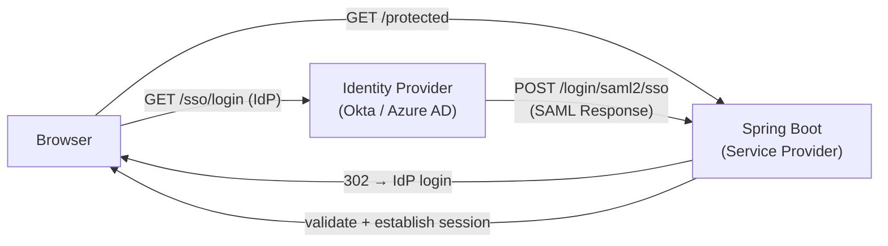

# Spring Security SAML2

[← Back to README](../README.md)

---

**SAML 2.0** (Security Assertion Markup Language) is the enterprise SSO standard used by Okta, Azure AD, Google Workspace, Ping Identity, and ADFS. Your application acts as the **Service Provider (SP)** and delegates authentication to an **Identity Provider (IdP)**. Spring Security's SAML2 support handles the SP metadata, AuthnRequest generation, Response validation, and principal extraction — requiring only configuration to integrate with most enterprise IdPs.



---

## Dependency

```xml
<dependency>
    <groupId>org.springframework.boot</groupId>
    <artifactId>spring-boot-starter-security</artifactId>
</dependency>
<dependency>
    <groupId>org.springframework.security</groupId>
    <artifactId>spring-security-saml2-service-provider</artifactId>
</dependency>
```

---

## Configuration — application.yml

```yaml
spring:
  security:
    saml2:
      relyingparty:
        registration:
          okta:                              # arbitrary registration ID
            entity-id: https://acme.example.com/saml2/service-provider-metadata/okta
            acs:
              location: https://acme.example.com/login/saml2/sso/okta  # Assertion Consumer Service
            signing:
              credentials:
                - private-key-location: classpath:saml/private.key
                  certificate-location: classpath:saml/public.crt
            assertingparty:
              metadata-uri: https://acme.okta.com/app/abc123/sso/saml/metadata
              # OR inline:
              # entity-id: https://acme.okta.com
              # single-sign-on:
              #   url: https://acme.okta.com/app/abc123/sso/saml
              #   sign-request: true
```

---

## Security Configuration

```java
@Configuration
@EnableWebSecurity
public class Saml2SecurityConfig {

    @Bean
    public SecurityFilterChain securityFilterChain(HttpSecurity http) throws Exception {
        http
            .authorizeHttpRequests(auth -> auth
                .requestMatchers("/public/**", "/actuator/health").permitAll()
                .anyRequest().authenticated()
            )
            .saml2Login(saml2 -> saml2
                .loginPage("/login")
                .defaultSuccessUrl("/dashboard", true)
                .failureUrl("/login?error=saml")
                .userDetailsService(saml2UserDetailsService())
            )
            .saml2Logout(Customizer.withDefaults());   // enables SLO (single logout)

        return http.build();
    }

    @Bean
    public Saml2UserDetailsService saml2UserDetailsService() {
        return response -> {
            // response contains the SAML assertion attributes
            Saml2AuthenticatedPrincipal principal =
                (Saml2AuthenticatedPrincipal) response.getPrincipal();
            return principal;
        };
    }
}
```

---

## Extracting SAML Attributes

```java
@RestController
public class ProfileController {

    @GetMapping("/api/me")
    public UserProfile currentUser(@AuthenticationPrincipal Saml2AuthenticatedPrincipal principal) {
        // NameID — usually the user's email or employee ID
        String nameId = principal.getName();

        // SAML attribute statements mapped to Java lists
        String email      = principal.getFirstAttribute("email");
        String firstName  = principal.getFirstAttribute("firstName");
        String lastName   = principal.getFirstAttribute("lastName");
        List<String> groups = principal.getAttribute("groups");   // multi-value attribute

        return new UserProfile(nameId, email, firstName, lastName, groups);
    }
}
```

---

## Custom Principal with GrantedAuthorities from Groups

```java
@Configuration
public class Saml2Config {

    @Bean
    public Saml2AuthenticationRequestFactory authenticationRequestFactory(
            RelyingPartyRegistrationRepository registrations) {
        return new OpenSaml4AuthenticationRequestFactory();
    }

    // Map SAML group attributes to Spring Security roles
    @Bean
    public OpenSaml4AuthenticationProvider authenticationProvider() {
        OpenSaml4AuthenticationProvider provider = new OpenSaml4AuthenticationProvider();

        provider.setResponseAuthenticationConverter(responseToken -> {
            Saml2Authentication auth = OpenSaml4AuthenticationProvider
                .createDefaultResponseAuthenticationConverter()
                .convert(responseToken);

            if (auth == null) return null;

            Saml2AuthenticatedPrincipal principal =
                (Saml2AuthenticatedPrincipal) auth.getPrincipal();

            // Map IdP groups to Spring authorities
            List<GrantedAuthority> authorities = new ArrayList<>();
            List<String> groups = principal.getAttribute("groups");
            if (groups != null) {
                groups.stream()
                    .map(g -> new SimpleGrantedAuthority("ROLE_" + g.toUpperCase()))
                    .forEach(authorities::add);
            }

            return new Saml2Authentication(principal, auth.getSaml2Response(), authorities);
        });

        return provider;
    }
}
```

---

## Exposing SP Metadata

```java
// Spring Security auto-exposes SP metadata at:
// GET /saml2/service-provider-metadata/{registrationId}
// e.g. GET /saml2/service-provider-metadata/okta

// Provide this URL to the IdP admin to configure the Service Provider
// It returns an XML document with:
//   - Entity ID
//   - ACS URL
//   - SP public signing certificate
//   - NameID format
```

---

## Programmatic Registration (Multi-Tenant SAML)

```java
@Configuration
@RequiredArgsConstructor
public class DynamicSaml2Config {

    private final TenantSamlConfigRepository tenantConfigRepo;

    @Bean
    public RelyingPartyRegistrationRepository relyingPartyRegistrationRepository() {
        // Load all tenant SAML configs from DB
        List<RelyingPartyRegistration> registrations = tenantConfigRepo.findAll()
            .stream()
            .map(this::toRegistration)
            .collect(Collectors.toList());

        return new InMemoryRelyingPartyRegistrationRepository(registrations);
    }

    private RelyingPartyRegistration toRegistration(TenantSamlConfig config) {
        return RelyingPartyRegistration
            .withRegistrationId(config.getTenantId())
            .entityId("https://acme.example.com/saml2/sp/" + config.getTenantId())
            .assertionConsumerServiceLocation(
                "https://acme.example.com/login/saml2/sso/" + config.getTenantId())
            .assertingPartyDetails(party -> party
                .entityId(config.getIdpEntityId())
                .singleSignOnServiceLocation(config.getSsoUrl())
                .verificationX509Credentials(c ->
                    c.add(config.getIdpCertificate())))
            .build();
    }
}
```

---

## Testing SAML2 Authentication

```java
@SpringBootTest
@AutoConfigureMockMvc
class Saml2SecurityTest {

    @Autowired MockMvc mvc;

    @Test
    void unauthenticatedRedirectsToLogin() throws Exception {
        mvc.perform(get("/dashboard"))
           .andExpect(status().is3xxRedirection())
           .andExpect(header().string("Location", containsString("/login")));
    }

    @Test
    @WithMockUser(roles = "USER")
    void authenticatedCanAccessDashboard() throws Exception {
        mvc.perform(get("/dashboard"))
           .andExpect(status().isOk());
    }

    // For SAML-specific principal:
    @Test
    void withSamlPrincipal() throws Exception {
        DefaultSaml2AuthenticatedPrincipal principal =
            new DefaultSaml2AuthenticatedPrincipal("alice@acme.com",
                Map.of("email", List.of("alice@acme.com"),
                       "groups", List.of("ENGINEERING", "ADMIN")));

        mvc.perform(get("/api/me")
               .with(saml2Login().attributes(attrs -> attrs
                   .attribute("email", "alice@acme.com")
                   .attribute("groups", List.of("ENGINEERING")))))
           .andExpect(status().isOk())
           .andExpect(jsonPath("$.email").value("alice@acme.com"));
    }
}
```

---

## Spring Security SAML2 Summary

| Concept | Detail |
|---------|--------|
| Service Provider (SP) | Your application; Spring Security auto-generates SP metadata |
| Identity Provider (IdP) | Okta, Azure AD, Google Workspace, ADFS; hosts the login page |
| ACS URL | Assertion Consumer Service — where IdP POSTs the SAML Response after login |
| SP Metadata | XML document at `/saml2/service-provider-metadata/{id}`; give this URL to IdP admin |
| `assertingparty.metadata-uri` | Auto-fetch and parse IdP metadata (recommended; no manual config) |
| `Saml2AuthenticatedPrincipal` | Injected via `@AuthenticationPrincipal`; exposes `getName()` and attributes |
| `principal.getAttribute("groups")` | Multi-value SAML attribute; returns `List<String>` |
| `saml2Logout` | Enables Single Log Out (SLO) — logout from IdP and all SPs simultaneously |
| `OpenSaml4AuthenticationProvider` | Customize response conversion; map groups to `GrantedAuthority` |
| `saml2Login()` MockMvc | Test helper for simulating SAML2-authenticated requests |

---

[← Back to README](../README.md)
