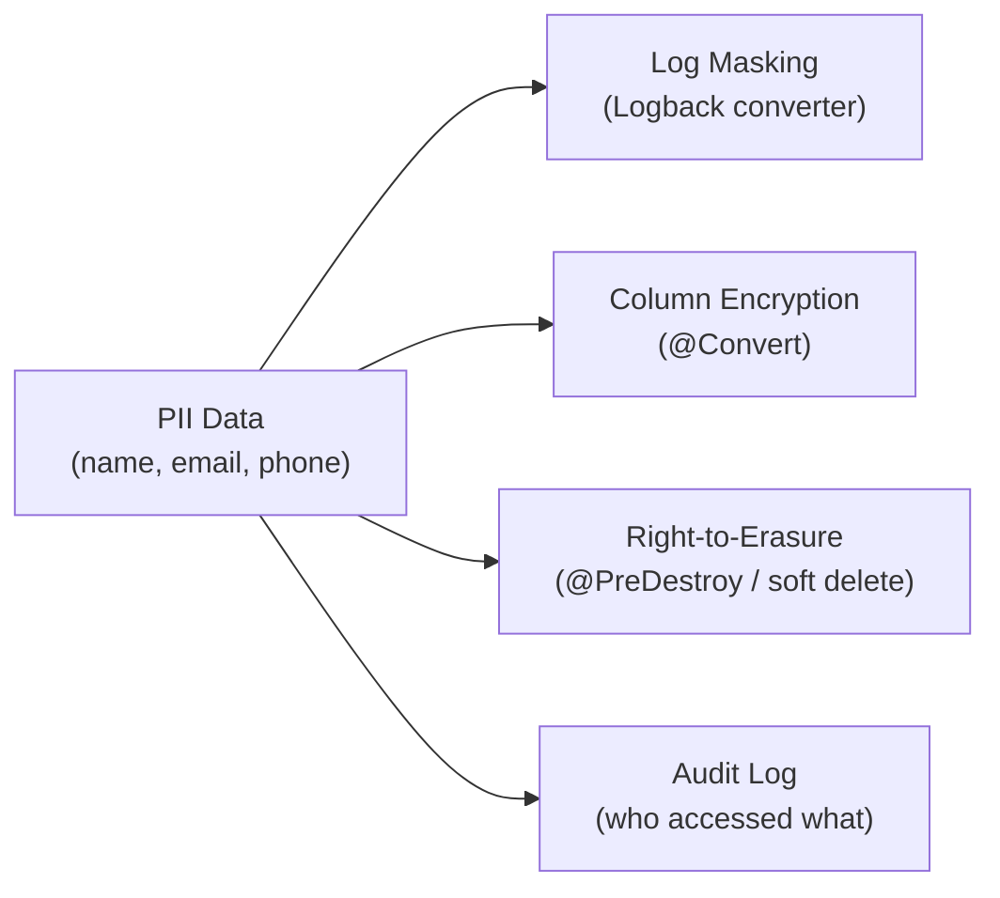

# Data Masking & GDPR Compliance

[← Back to README](../README.md)

---

GDPR (and similar regulations like CCPA, POPIA) require that personal data is protected at rest and in transit, retained only as long as necessary, and erasable on request. In a Java backend this means: masking PII in logs, encrypting sensitive database columns, supporting right-to-erasure, and maintaining an audit trail of who accessed what.



---

## Masking PII in Logs

```java
// Custom Logback converter — replaces email addresses in log output
public class PiiMaskingConverter extends MessageConverter {

    private static final Pattern EMAIL_PATTERN =
        Pattern.compile("[a-zA-Z0-9._%+\\-]+@[a-zA-Z0-9.\\-]+\\.[a-zA-Z]{2,}");
    private static final Pattern PHONE_PATTERN =
        Pattern.compile("\\b(\\+?27|0)[6-8][0-9]{8}\\b");
    private static final Pattern CARD_PATTERN =
        Pattern.compile("\\b(?:\\d{4}[\\s\\-]?){3}\\d{4}\\b");

    @Override
    public String convert(ILoggingEvent event) {
        String msg = event.getFormattedMessage();
        msg = EMAIL_PATTERN.matcher(msg).replaceAll(m -> maskEmail(m.group()));
        msg = PHONE_PATTERN.matcher(msg).replaceAll("***PHONE***");
        msg = CARD_PATTERN.matcher(msg).replaceAll(m -> maskCard(m.group()));
        return msg;
    }

    private String maskEmail(String email) {
        int at = email.indexOf('@');
        if (at <= 2) return "***@" + email.substring(at + 1);
        return email.charAt(0) + "***" + email.charAt(at - 1) + email.substring(at);
    }

    private String maskCard(String card) {
        String digits = card.replaceAll("[\\s\\-]", "");
        return "****-****-****-" + digits.substring(digits.length() - 4);
    }
}
```

```xml
<!-- logback-spring.xml -->
<configuration>
    <conversionRule conversionWord="piiMask"
                    converterClass="com.example.logging.PiiMaskingConverter"/>

    <appender name="CONSOLE" class="ch.qos.logback.core.ConsoleAppender">
        <encoder>
            <pattern>%d{ISO8601} %-5level %logger{36} - %piiMask%n</pattern>
        </encoder>
    </appender>
</configuration>
```

---

## Masking with Jackson — @JsonMask Custom Annotation

```java
@Target(ElementType.FIELD)
@Retention(RetentionPolicy.RUNTIME)
@JacksonAnnotationsInside
@JsonSerialize(using = MaskedSerializer.class)
public @interface JsonMask {
    MaskType value() default MaskType.PARTIAL;
}

enum MaskType { FULL, PARTIAL, EMAIL, CARD }

public class MaskedSerializer extends JsonSerializer<String>
        implements ContextualSerializer {

    private MaskType maskType = MaskType.PARTIAL;

    @Override
    public JsonSerializer<?> createContextual(SerializerProvider prov, BeanProperty prop) {
        JsonMask annotation = prop.getAnnotation(JsonMask.class);
        if (annotation != null) {
            MaskedSerializer serializer = new MaskedSerializer();
            serializer.maskType = annotation.value();
            return serializer;
        }
        return this;
    }

    @Override
    public void serialize(String value, JsonGenerator gen, SerializerProvider provider)
            throws IOException {
        if (value == null) { gen.writeNull(); return; }
        gen.writeString(switch (maskType) {
            case FULL    -> "***";
            case PARTIAL -> value.length() > 4
                ? "*".repeat(value.length() - 4) + value.substring(value.length() - 4)
                : "***";
            case EMAIL   -> maskEmail(value);
            case CARD    -> "****-****-****-" + value.replaceAll("[\\s\\-]", "").substring(
                Math.max(0, value.length() - 4));
        });
    }

    private String maskEmail(String email) {
        int at = email.indexOf('@');
        if (at < 0) return "***";
        return email.charAt(0) + "***" + email.substring(at);
    }
}

// Usage in DTO
public class CustomerDto {
    public String name;

    @JsonMask(MaskType.EMAIL)
    public String email;

    @JsonMask(MaskType.CARD)
    public String cardNumber;

    @JsonMask(MaskType.PARTIAL)
    public String phoneNumber;
}
```

---

## Encrypting Sensitive Database Columns

```java
// JPA AttributeConverter for transparent encryption/decryption
@Converter
@Component
public class AesFieldConverter implements AttributeConverter<String, String> {

    @Value("${app.encryption.key}")   // 256-bit base64-encoded key
    private String base64Key;

    private SecretKey secretKey;

    @PostConstruct
    void init() throws Exception {
        byte[] keyBytes = Base64.getDecoder().decode(base64Key);
        secretKey = new SecretKeySpec(keyBytes, "AES");
    }

    @Override
    public String convertToDatabaseColumn(String attribute) {
        if (attribute == null) return null;
        try {
            Cipher cipher = Cipher.getInstance("AES/GCM/NoPadding");
            byte[] iv = new byte[12];
            new SecureRandom().nextBytes(iv);
            cipher.init(Cipher.ENCRYPT_MODE, secretKey, new GCMParameterSpec(128, iv));
            byte[] encrypted = cipher.doFinal(attribute.getBytes(StandardCharsets.UTF_8));
            // Prepend IV for storage: iv + ciphertext
            byte[] combined = new byte[iv.length + encrypted.length];
            System.arraycopy(iv, 0, combined, 0, iv.length);
            System.arraycopy(encrypted, 0, combined, iv.length, encrypted.length);
            return Base64.getEncoder().encodeToString(combined);
        } catch (Exception e) {
            throw new RuntimeException("Encryption failed", e);
        }
    }

    @Override
    public String convertToEntityAttribute(String dbData) {
        if (dbData == null) return null;
        try {
            byte[] combined = Base64.getDecoder().decode(dbData);
            byte[] iv         = Arrays.copyOfRange(combined, 0, 12);
            byte[] ciphertext = Arrays.copyOfRange(combined, 12, combined.length);
            Cipher cipher = Cipher.getInstance("AES/GCM/NoPadding");
            cipher.init(Cipher.DECRYPT_MODE, secretKey, new GCMParameterSpec(128, iv));
            return new String(cipher.doFinal(ciphertext), StandardCharsets.UTF_8);
        } catch (Exception e) {
            throw new RuntimeException("Decryption failed", e);
        }
    }
}

@Entity
public class Customer {

    @Id @GeneratedValue
    private Long id;

    @Convert(converter = AesFieldConverter.class)
    @Column(name = "national_id")
    private String nationalId;          // stored encrypted

    @Convert(converter = AesFieldConverter.class)
    @Column(name = "bank_account")
    private String bankAccountNumber;   // stored encrypted

    private String email;               // hashed separately for lookups
    private String emailHash;           // SHA-256 for indexed search
}
```

---

## Right-to-Erasure

```java
@Service
@RequiredArgsConstructor
@Transactional
public class ErasureService {

    private final CustomerRepository customerRepo;
    private final OrderRepository orderRepo;
    private final AuditLogRepository auditLogRepo;

    public void eraseCustomer(Long customerId) {
        Customer customer = customerRepo.findById(customerId)
            .orElseThrow(() -> new CustomerNotFoundException(customerId));

        // Pseudonymize — preserve orders for accounting, remove PII
        customer.setName("ERASED_" + UUID.randomUUID());
        customer.setEmail(null);
        customer.setEmailHash(null);
        customer.setNationalId(null);
        customer.setBankAccountNumber(null);
        customer.setPhone(null);
        customer.setErasedAt(OffsetDateTime.now());
        customerRepo.save(customer);

        // Anonymise orders (keep for financial/legal retention)
        orderRepo.anonymiseByCustomerId(customerId);

        // Record erasure in audit log (itself must be retained)
        auditLogRepo.save(new AuditLog(
            "ERASURE", "Customer " + customerId + " erased per GDPR Art. 17",
            OffsetDateTime.now()));

        log.info("Customer {} erased", customerId);
    }
}
```

---

## Data Retention Policy

```java
@Component
@RequiredArgsConstructor
@Slf4j
public class DataRetentionJob {

    private final CustomerRepository customerRepo;
    private final LogEntryRepository logEntryRepo;

    @Scheduled(cron = "0 0 2 * * *")   // 2am daily
    @Transactional
    public void purgeExpiredData() {
        // Purge customers who consented to 2-year retention
        OffsetDateTime customerCutoff = OffsetDateTime.now().minusYears(2);
        int purged = customerRepo.deleteInactiveCustomers(customerCutoff);
        log.info("Purged {} inactive customers", purged);

        // Purge access logs older than 90 days (GDPR minimum logging)
        OffsetDateTime logCutoff = OffsetDateTime.now().minusDays(90);
        int logsPurged = logEntryRepository.deleteByCreatedAtBefore(logCutoff);
        log.info("Purged {} expired log entries", logsPurged);
    }
}
```

---

## Access Audit Trail

```java
@Aspect
@Component
@RequiredArgsConstructor
@Slf4j
public class DataAccessAuditAspect {

    private final AuditLogRepository auditLogRepo;

    @AfterReturning(
        pointcut = "@annotation(com.example.audit.AuditAccess)",
        returning = "result")
    public void auditDataAccess(JoinPoint jp, Object result) {
        Authentication auth = SecurityContextHolder.getContext().getAuthentication();
        String actor = auth != null ? auth.getName() : "ANONYMOUS";

        AuditLog entry = AuditLog.builder()
            .actor(actor)
            .action(jp.getSignature().getName())
            .resource(jp.getTarget().getClass().getSimpleName())
            .timestamp(OffsetDateTime.now())
            .ipAddress(RequestContextHolder.currentRequestAttributes()
                .getAttribute("REMOTE_ADDR", 0).toString())
            .build();

        auditLogRepo.save(entry);
    }
}

// Apply to sensitive methods
@AuditAccess
public Customer findById(Long id) { ... }
```

---

## Data Masking & GDPR Summary

| Concept | Detail |
|---------|--------|
| Log masking | Custom Logback `MessageConverter` strips/replaces PII before it reaches log storage |
| `@JsonMask` | Custom Jackson annotation serializes masked values in API responses |
| `AttributeConverter` | JPA converter for transparent AES-GCM encrypt/decrypt of sensitive columns |
| Pseudonymisation | Replace identifying fields with opaque tokens — preserves referential integrity |
| Right-to-erasure | Nullify PII fields; keep anonymised records for legal retention; record the erasure |
| Data retention job | `@Scheduled` job purges data older than the consented retention period |
| Audit trail | AOP aspect logs every access to PII-bearing methods — who, what, when |
| Email hash | Store `SHA-256(email)` for indexed lookup; never store plaintext searchable PII |
| AES-GCM | Authenticated encryption; preferred over AES-CBC for database column encryption |
| GDPR Art. 17 | Right to erasure — must be completed within 30 days of request |

---

[← Back to README](../README.md)
