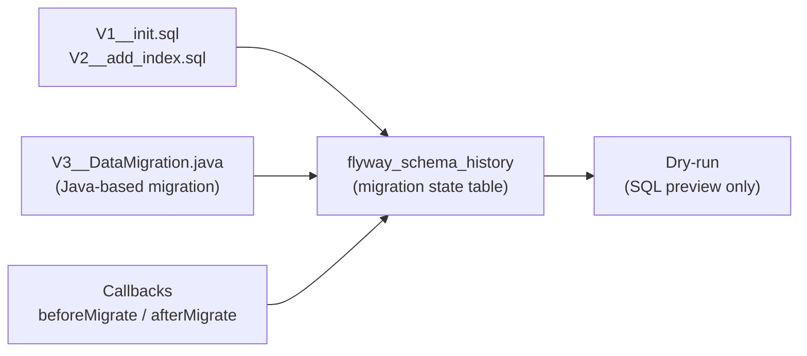

# Flyway Advanced

[← Back to README](../README.md)

---

Beyond numbered migration scripts, Flyway supports **Java-based migrations**, **callbacks** (pre/post-migrate hooks), **undo migrations** (Teams), **dry-run** mode, **repair**, and **baseline** for brownfield databases. These features are essential for zero-downtime deployments, CI pipelines, and managing complex schema changes across environments.



---

## Dependency and Basic Config

```xml
<dependency>
    <groupId>org.flywaydb</groupId>
    <artifactId>flyway-core</artifactId>
</dependency>
<!-- PostgreSQL-specific support -->
<dependency>
    <groupId>org.flywaydb</groupId>
    <artifactId>flyway-database-postgresql</artifactId>
</dependency>
```

```yaml
spring:
  flyway:
    enabled: true
    locations:
      - classpath:db/migration          # SQL migrations
      - classpath:db/migration/java     # Java migrations
    baseline-on-migrate: false          # true for brownfield DBs with existing schema
    baseline-version: "1"
    out-of-order: false                 # disallow out-of-sequence migration files
    validate-on-migrate: true           # fail if checksums change
    table: flyway_schema_history        # default migration tracking table
    placeholders:
      schema: public
      app_user: app_role
```

---

## Java-Based Migration

Use when SQL is insufficient — e.g., data transformations, calling external services, or complex logic.

```java
// src/main/resources/db/migration/java/V3__MigrateOrderStatuses.java
// OR as a Spring bean (loaded automatically if it implements JavaMigration)

@Component
public class V3__MigrateOrderStatuses implements JavaMigration {

    // Can inject Spring beans when registered as @Component
    // (requires FlywayAutoConfiguration to pick up Spring-managed migrations)

    @Override
    public MigrationVersion getVersion() {
        return MigrationVersion.fromVersion("3");
    }

    @Override
    public String getDescription() {
        return "Migrate order statuses from legacy codes to enum values";
    }

    @Override
    public Integer getChecksum() {
        return 12345678;   // change this when migration logic changes
    }

    @Override
    public boolean isUndo() { return false; }

    @Override
    public boolean canExecuteInTransaction() { return true; }

    @Override
    public void migrate(Context context) throws Exception {
        try (Statement stmt = context.getConnection().createStatement()) {
            // Complex data migration in Java
            stmt.execute("""
                UPDATE orders
                SET status = CASE old_status
                    WHEN 'P'  THEN 'PENDING'
                    WHEN 'PR' THEN 'PROCESSING'
                    WHEN 'C'  THEN 'COMPLETED'
                    WHEN 'X'  THEN 'CANCELLED'
                    ELSE 'UNKNOWN'
                END
                WHERE status IS NULL
                """);

            log.info("Migrated {} rows", stmt.getUpdateCount());
        }
    }
}
```

---

## Callbacks

Callbacks run before/after Flyway lifecycle events — useful for disabling triggers, toggling FK checks, or sending notifications.

```java
@Component
@Slf4j
public class FlywayCallbackConfig implements Callback {

    @Override
    public boolean supports(Event event, Context context) {
        return event == Event.BEFORE_MIGRATE
            || event == Event.AFTER_MIGRATE
            || event == Event.AFTER_MIGRATE_ERROR;
    }

    @Override
    public boolean canHandleInTransaction(Event event, Context context) {
        return true;
    }

    @Override
    public void handle(Event event, Context context) {
        switch (event) {
            case BEFORE_MIGRATE -> {
                log.info("Starting Flyway migration — disabling triggers");
                executeQuietly(context, "SET session_replication_role = replica");
            }
            case AFTER_MIGRATE -> {
                log.info("Flyway migration complete — re-enabling triggers");
                executeQuietly(context, "SET session_replication_role = DEFAULT");
            }
            case AFTER_MIGRATE_ERROR ->
                log.error("Flyway migration FAILED — manual intervention required");
        }
    }

    private void executeQuietly(Context ctx, String sql) {
        try (Statement stmt = ctx.getConnection().createStatement()) {
            stmt.execute(sql);
        } catch (SQLException e) {
            log.warn("Callback SQL failed: {}", e.getMessage());
        }
    }

    @Override
    public String getCallbackName() { return "FlywayCallbackConfig"; }
}
```

SQL callbacks also work — Flyway picks them up by filename convention:

```
db/migration/
├── V1__init.sql
├── beforeMigrate.sql          # runs before every migrate call
├── afterMigrate.sql           # runs after every successful migrate
├── beforeEachMigrate.sql      # runs before each individual migration script
└── afterEachMigrate.sql       # runs after each individual migration script
```

---

## Repair

```bash
# When a migration fails mid-way, Flyway marks it as FAILED in flyway_schema_history
# Fix the underlying problem, then:

./mvnw flyway:repair

# repair removes FAILED entries and recalculates checksums for modified scripts
# Required before re-running the failed migration
```

```java
// Programmatic repair
@Component
@RequiredArgsConstructor
public class FlywayRepairOnStartup implements ApplicationRunner {

    private final Flyway flyway;

    @Override
    public void run(ApplicationArguments args) {
        // Repair before migrate to handle failed previous run
        MigrationInfoService info = flyway.info();
        boolean hasFailed = Arrays.stream(info.all())
            .anyMatch(m -> m.getState() == MigrationState.FAILED);

        if (hasFailed) {
            log.warn("Detected failed migration — running repair");
            flyway.repair();
        }

        flyway.migrate();
    }
}
```

---

## Baseline — Brownfield Databases

```java
@Bean
public Flyway flyway(DataSource dataSource) {
    return Flyway.configure()
        .dataSource(dataSource)
        .baselineOnMigrate(true)     // create baseline entry if schema exists but no history
        .baselineVersion("5")        // treat existing schema as V5
        .locations("classpath:db/migration")
        .load();
}
```

```bash
# CLI baseline (if schema exists but flyway_schema_history doesn't)
./mvnw flyway:baseline -Dflyway.baselineVersion=5
```

---

## Dry-Run (Flyway Teams)

```java
// Flyway Teams: preview the SQL that would be executed without applying it
@Bean
public Flyway flyway(DataSource dataSource) {
    return Flyway.configure()
        .dataSource(dataSource)
        .dryRunOutput("/tmp/migration-preview.sql")   // Teams feature
        .load();
}
```

```bash
# In CI: generate preview for review, fail if it differs from expected
./mvnw flyway:migrate -Dflyway.dryRunOutput=target/migration-preview.sql
diff expected-migrations.sql target/migration-preview.sql
```

---

## Placeholders

```yaml
spring:
  flyway:
    placeholders:
      schema: public
      admin_role: app_admin
```

```sql
-- V4__grant_permissions.sql
GRANT SELECT ON ALL TABLES IN SCHEMA ${schema} TO ${admin_role};
```

---

## CI Pipeline Integration

```yaml
# .github/workflows/db-migration.yml
name: Database Migration Check

on: [pull_request]

jobs:
  validate:
    runs-on: ubuntu-latest
    services:
      postgres:
        image: postgres:16
        env:
          POSTGRES_PASSWORD: test
        options: >-
          --health-cmd pg_isready --health-interval 5s
          --health-timeout 5s --health-retries 5
        ports: ["5432:5432"]

    steps:
      - uses: actions/checkout@v4

      - name: Run Flyway validate (checksums + order)
        run: ./mvnw flyway:validate
        env:
          SPRING_DATASOURCE_URL: jdbc:postgresql://localhost:5432/postgres
          SPRING_DATASOURCE_USERNAME: postgres
          SPRING_DATASOURCE_PASSWORD: test

      - name: Run full migration against clean DB
        run: ./mvnw flyway:migrate
        env:
          SPRING_DATASOURCE_URL: jdbc:postgresql://localhost:5432/postgres
          SPRING_DATASOURCE_USERNAME: postgres
          SPRING_DATASOURCE_PASSWORD: test
```

---

## Flyway Advanced Summary

| Concept | Detail |
|---------|--------|
| Java migration | Implements `JavaMigration`; use when SQL isn't enough (data transforms, API calls) |
| `getChecksum()` | Must change if migration logic changes — Flyway detects tampering via checksums |
| `Callback` | Runs before/after migration lifecycle events; SQL callbacks use filename convention |
| `flyway:repair` | Removes FAILED entries from history table so migration can be retried |
| `baseline-on-migrate` | Creates a baseline entry for existing schemas without migration history |
| `baselineVersion` | Treats existing schema as this version; migrations below it are skipped |
| `out-of-order: false` | Reject migration scripts with version numbers lower than already-applied ones |
| `validate-on-migrate: true` | Fail startup if migration file checksums have changed since they were applied |
| Placeholders `${key}` | Substitute environment-specific values in SQL scripts |
| Dry-run output | Flyway Teams: preview SQL without applying; useful for change-review workflows |

---

[← Back to README](../README.md)
